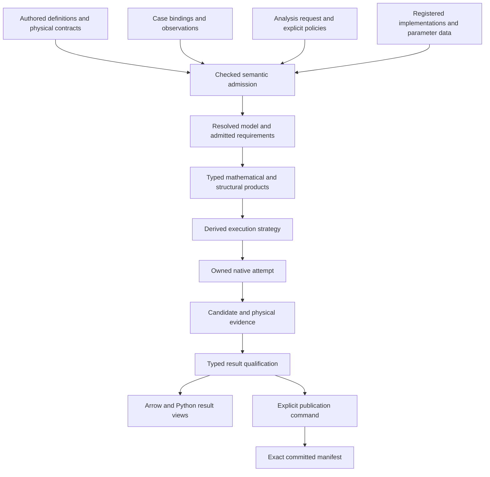

# Data-model architecture follow-up

## 1. Scope, purpose and coverage

| Field | Scope |
|---|---|
| Subject | [Comprehensive codebase review](design_review_comprehensive-codebase_2026-09-24.md), its proposed remedies, and the current authoring → compilation → native execution → result → publication boundaries |
| Standard | [Data Model–Based Design Charter](../design_principles/DATA_MODEL_DESIGN_CHARTER.md), interpreted through its successor: core 2.0, process-simulator profile 1.0 and the pse-arrow binding |
| Tier · purpose | Design · **target** |
| Reviewer · date | Codex · 2026-09-24; independent follow-up analysis by the same agent that implemented parts of M22, **not independent certification of that implementation** |
| Baseline | HEAD `8e9c3ce8` plus the existing dirty working tree; input review SHA-256 `391e3b1d58a2f72158952c4ae66642264572c82206f3952cd0666b9e8fcb8c21` |
| Decision | **Revise the remediation design.** Retain the concrete correctness findings; make shared semantic contracts the organizing change, and amend several proposed remedies before implementation |

**Main conclusion.** The existing review identifies substantial defects. Fixing them is
necessary, but “delete surplus, then wire libraries together” is not a sufficient target
architecture. The missing organizing principle is **complete, enforced interpretation of
authored meaning across a small number of explicit domain contracts**. Otherwise the fixes
will leave component interpretation, numerical policy, eligibility, identity and outcome
qualification independently maintained in different adapters.

The target should let an engineer declare a unit/property model once, bind a case, choose an
analysis and inspect both the resolved execution and its physical evidence. The system should
derive representations for that work, reject unsupported requested meaning before execution,
and preserve the distinctions through Python and durable results.

This follows the charter's governing objective and DM-01–DM-04, DM-13, DM-21–DM-25 and DM-56.
It does **not** require a universal table, a new generic compiler framework, a replacement
expression engine, or moving native numerical loops into DataFusion. The existing library
ownership is a sound foundation. Generated code volume is a maintenance observation, not a
measure of semantic quality.

**Coverage.** I read the input review, the layered standard and relevant charter sections;
traced document selection, model freezing, provider construction, public preparation,
capability routing, structural initialization, quality/result encoding, profile identity,
contract fingerprints, publication preparation and evidence continuation. Citations below
identify current code I read. The architecture covers steady simulation, optimization,
dynamics, fitting, studies, recycles and model extension.

I did not repeat the nine sub-reviews or audit every numerical adapter, cache implementation,
library internal or deletion candidate. In particular, I did not reproduce the original
Symbolica probes, entropy-offset calculation, memory-growth examples or hybrid-sensitivity
API claim. Those remain leads at their original evidence strength. No build, solver test,
benchmark, environment repair or product edit was performed. Proposed corrections below are
**Proposed**, even where their integration boundary is **Interface-checked**.

**Status correction.** ADR-0082–0087 are now accepted and the M22 packet is marked done; its
23-case measurement table exists. The input review's “ADRs proposed,” “Q18 pending” and
“offered as input to M22.5” statements describe an earlier concurrent snapshot. This changes
neither the source defects below nor the scope of the passing tests. The prior M22 closure
does not establish correctness of unexercised paths. This follow-up records the new target
gaps without rewriting historical observations as failures or claiming fresh qualification.

**Authority conflicts.** Follow current Plan 14/ADR-0082–0084 over displaced blueprint
catalogs (binding K1); retain surviving generated contracts while reassessing their mechanism
(K2); map charter IDs through core §I (K3). The binding's policy against dedicated alignment
tooling governs the proposed future review workflow. Changes to accepted authority require
the routes in slot 11, not an edit made as part of this review.

## 2. Authority and identity map

The following is the **proposed logical model**. These names describe responsibilities, not
a requirement to create new Rust structs or crates for every row. Extend and clarify existing
`ModelRevision`, `Inputs`, `CasePlan`, profiles, reports and descriptors. Each record has one
owner; Arrow views, Rust values and Python objects are representations of that record.

| Fact | Authority and update path | Identity/revision boundary | Derived representations |
|---|---|---|---|
| Model definition | Authored unit/property/reaction definitions, physical types, contributions, topology and declared formulation choices | Definition/entity IDs plus immutable semantic revision; instance IDs remain distinct from reusable body content | Resolved model, equation assembly, physical connection graph, incidence, library programs |
| Case specification | Bindings to one model revision: fixed/free/design roles, values, bounds, parameter values and explicit initial guesses | Case revision; a value edit need not change reusable structural identity | Numerical arrays and coefficient snapshots |
| Analysis request | Mode, requested outputs, strategy, accuracy/acceptance requirements, start policy and operational limits | Request identity distinct from model and case | Required capabilities, derivative demands, execution strategy |
| Resolved numerical contract | Checked derivation from model attributes, request and explicitly selected defaults; callers do not independently author its copies | Model/case dependencies plus policy version; effective native options link back to it | Scaling, normalized tolerances, solver options, quality thresholds |
| Provider and backend binding | Registered implementation contract plus versioned material/parameter binding and captured environment capabilities | Implementation identity separate from parameter-data identity and physical component mapping | Provider workers, capability decisions and library-specific options |
| Prepared analysis | Compiler-owned product, valid only for its declared inputs and assumptions | Structure/specialization key, value-dependent facts and layout compatibility kept separate | Symbolica programs, sparse layouts, graph projections, native preparation |
| Attempt and result | Identified execution owns mutable solver state; result records observations and qualification | Attempt ID; immutable result ID; used initial state and source attempts are linked | Typed outcome views, physical values, diagnostics, result tables |
| Publication | Explicit command over immutable results, exact dependencies and an expected parent | Logical publication ID, retry/attempt identity and physical storage versions are distinct | Member objects/tables and one committed manifest |

**Existing foundations to preserve.** `workflow/model.rs:146` validates before freezing an
immutable revision. `pse-compiler/src/workspace.rs:820` validates before publishing inputs.
`workflow/run.rs:164` separates immutable requests from joined reports; `workflow/results.rs:21`
encodes a report once. These should become stronger boundaries, not be replaced by another
parallel model layer. Code paths in this paragraph are relative to `crates/pse-runtime/src`
unless a crate is named explicitly.

### Physical semantics

| Meaning | Required declaration | Resolved binding and enforcement | Current evidence/gap |
|---|---|---|---|
| Property state and output | Quantity kind, dimension, unit, basis, reference convention, phase/formulation and component coordinate | Match semantic roles before building native argument order | `pse-kernels/src/feos.rs:103` checks dimensions and selected basis/reference rules; it does not check the complete output kind |
| Material system | Species identities, elemental composition where relevant, phase membership, parameter-set identity and explicit ordering | Species-to-parameter-record mapping; reject missing, duplicate or incompatible bindings | `workflow/sources.rs:233` checks component count; `feos.rs:182` copies IDs next to separately bundled data |
| Enthalpy and entropy | Separate, complete reference conventions; a declared conversion when conventions differ | Provider evaluates or converts under that contract; reference is not merely a label | `feos.rs:95` prohibits a pressure datum and shares the caloric reference; the original numerical entropy-offset claim is not independently confirmed here |
| Numerical accuracy | Per-variable, per-row and per-observable absolute/relative tolerances with units or explicit normalization; KKT/gap criteria have their own roles | Resolve scaling and apply the corresponding coordinate transforms; record achieved physical errors | `pse-backend-native/src/presolve.rs:297` takes a maximum over row and variable tolerances without a common physical normalization |
| Time | Time origin, coordinate versus elapsed duration, unit, sampling/event convention | One checked conversion from observation coordinates into integration coordinates | `workflow/fitting.rs:320` calls observations elapsed seconds but assigns them directly to integration samples |
| Material/energy exchange | Connection roles, direction, component basis, heat/work distinction and conserved quantity | Generate balance contributions and independent closure observations | `workflow/vessel.rs:400` labels heat as `WorkIn`; the existing balance mechanism is reusable |

### What ordinary model extension should declare

The architectural test is stronger than loading model-shaped tables. An ordinary new model
assembled from supported physics should be expressible through these existing kinds of
meaning, with their missing composition contracts completed:

| Authoritative declaration | Derived work | When new implementation is justified |
|---|---|---|
| A reusable unit template with typed parameters, valid index domains and instance bindings | Instantiated variables, equations and source-to-instance mappings | A genuinely new domain operation, not another instance count or species set |
| Typed ports and connections with direction, multiplicity, component correspondence and exchange roles | Connection equations, conservation contributions and distinct topology/incidence projections | A new physical connection law that cannot be composed from existing operations |
| Equation and balance templates over declared domains, including formulation guards and optional modes | Typed library expressions, sparse structure, derivatives and mode-specific formulations | A new mathematical primitive or external physical method with a complete contract |
| Property requirements and a selected material/parameter binding | Checked provider calls and native coordinate layouts | A new property implementation or data adapter; selecting another qualified data set should remain a binding |
| Case roles, values, bounds and observations; an analysis request with explicit policy | Prepared analysis, execution strategy and qualified result views | A new analysis algorithm, not another study point or initial condition |

For example, a heater's port roles, energy contributions, pressure relation and chosen property
requirements should survive as inspectable declarations. A Rust or Python convenience builder
can construct them, but should not be the only place their meaning exists. Its executable
definition should remain usable by each admitted analysis without another handwritten copy of
the physics. Steady and dynamic formulations may differ; their relationship and applicable
modes must be declared, not inferred from a shared name.

Keep templates compact until specialization is needed, and retain instance/source mappings
through expansion. Do not require arbitrary physics to become configuration: a new FeOS or
native numerical method belongs behind its explicit typed boundary. This is a **Proposed**
extension contract, not a claim that every current builder violates it or that a new template
language is required.

### Identity is a family of contracts

Use distinct projections for entity identity, semantic revision, schema compatibility,
compiled-artifact reuse, native-layout reuse, executed-result provenance and storage identity.
One serialization of an entire object cannot answer all these questions correctly.

- A documentation edit should change documentation provenance, not mathematical meaning.
- A component permutation must preserve species binding or invalidate it; arity is insufficient.
- A new initial guess can change the selected nonlinear root without changing the program.
- A value change can preserve symbolic structure while invalidating convexity, coefficients,
  presolve reductions or a numerical factorization.
- A layout-only cache key cannot justify retaining mutable convergence settings.
- Equality and hashing must share the same numeric contract. The existing
  `pse-ids/src/float.rs:12` deliberately preserves signed zero; “canonical float” must not be
  implemented as indiscriminate `-0.0 → 0.0` normalization.

## 3. Contracts and invariants

| Required contract | Enforcement point | Observable refusal/outcome | Evidence and proposed change |
|---|---|---|---|
| Every requested semantic declaration is consumed, explicitly retained as non-executing data, or refused | Common semantic admission used by document loading and typed builders | Unsupported feature names source entity/field and requested analysis | Model loading currently selects a small set of families (`workflow/model.rs:581`); physical loading has no final `else` refusal (`:617`) |
| A checked declaration is not automatically an executable model | Between field/relational checks and prepared analysis construction | No native plan without model/provider/capability admission | Preserve `FieldCheckedBatch`; add the missing semantic admission distinction to existing preparation products |
| One provider binding determines component data and port semantics | Provider registration, before native factory construction | Component/kind/reference mismatch, with involved IDs | Strengthen existing `Registration`/`ProviderSpec`; do not introduce a second material registry in runtime |
| Requested, available, admitted and selected capability are different states | Preparation and route resolution | Structured eligible/rejected alternatives with reasons | `ProblemFacts::from_plan` uses requested `plan.order()` (`pse-math/src/facts.rs:52`); public adapter listing and workflow routes have different scopes |
| Numerical transformations preserve declared acceptance meaning | Normalization, presolve and postsolve boundaries | Invalid transform or explicitly approximate result with conditions | Per-row/variable transforms and original-space checking must use the resolved contract |
| Temporary strategy changes cannot become a new specification accidentally | Initialization stage boundary and result construction | Failed stage retains original case plus separately identified overlay/partial result | `math/initialization.rs:315,398` mutates local values with stage updates and returns that merged map |
| A candidate is not automatically a solution or an identifiable estimate | Result qualification before publishing typed views | Best iterate, feasible point, stationary point, gap-qualified optimum, incomplete trajectory and unavailable evidence remain distinct | `quality.rs:147` computes KKT observations, while `:159` only downgrades assurance on primal infeasibility |
| Publication completeness and numerical success are independent | Publication manifest and result schema | A complete artifact may deliberately contain a failed attempt; it must say so | Preserve control-last publication and add the missing durable result distinctions |
| Reuse of observations is distinguished from execution on the current source | Evidence report composition | Executed / unchanged-input reuse / reviewed transfer / not run | `validation_receipts.py:231` requires a reason and rerun selection but does not prove the applicability of every retained test |

Do not implement “consumed or refused” as “reject every unrelated table in a package.” It is
scoped to the requested model, dependencies and analysis. A stored future case or documentation
relation can be retained without execution, but that disposition must be explicit. Conversely,
a reaction, scaling rule or tear preference that affects the requested analysis cannot silently
become inert metadata. Start with a small exhaustive match at the existing boundary; do not
build a universal feature ontology to solve this problem.

**Well-posedness.** Keep variable roles explicit and run the existing structural admission
before native execution. Topology, equation incidence and strategy graphs remain different
projections. Pass structural witnesses through to diagnostics in model terms. Do not discard
source mappings in favor of row ordinals or hexadecimal IDs. A numerical rank assessment and
structural matching answer different questions; neither alone proves convergence or parameter
identifiability.

**Absence and equivalence.** Unknown, unsupported, not requested, not computed and failed need
distinct typed states where selection or interpretation depends on them. Exact structural
equivalence, numerical agreement within stated tolerances and storage-byte equality remain
separate. Proposed normalization and policy resolution must state which equivalence they
preserve; they do not obtain semantic authority merely by being serialized or hashed.

## 4. Derivation and execution

### Proposed flow and ownership

This is a dependency description, not a new workflow framework. Reuse Salsa for stable
derivations, the existing native job owner for attempts, and the catalog's publication
mechanism for storage. Runtime functions may implement stages directly. What must be data is
the engineer's intent, the material decisions made to resolve it, and the observations that
explain the outcome.

| Stage | Semantic output · equality | Mechanism and dependencies | Structure versus values · reuse | Effects, termination and expected cost |
|---|---|---|---|---|
| Admit | Resolved references and enforced model requirements | Existing schema/quantity admission plus a complete interpretation of selected source families | Definitions, material data, family membership and absence are dependencies | File/environment capture occurs outside tracked derivation; bounded input validation |
| Prepare | Typed guarded mathematics, coefficient facts, incidence and source maps | Existing compiler + Symbolica, pounce-presolve and graph libraries | Preserve compact definitions; specialize only structural choices; re-evaluate value-dependent facts | No hidden provider selection; expansion and build limits are explicit; costs currently hypotheses |
| Resolve strategy | Selected operations, scopes, dependencies, start policy and effective numerical contract | Existing structural/initialization owners plus a finite typed strategy representation | Derive from admitted facts and request, not a second editable topology | Material alternatives and refusals are inspectable; native algorithms own iteration |
| Bind and execute | Attempt-local state and library outputs | Existing jobs, native adapters, provider workers; fully resolved policy | Reuse immutable programs/layouts; reset or explicitly reuse native state | Cancellation, limits and library failure remain typed; retain resources until join |
| Qualify | Physical checks, validity conditions and candidate classification | One domain-owned qualification contract over original-model observations | Per attempt; do not cache an executed result merely because a program key matches | Partial/unavailable evidence is reported; no status string implies scientific success |
| Expose/publish | Typed views and a complete manifest | Arrow/DataFusion for data work; native catalog/Delta publication | Result and contract versions are explicit; publication has its own identity | Writes are explicit; readers choose exact committed versions; retry/settlement is a protocol |

### Numerical stage obligations

| Stage | Formulation and derivatives | Scaling / class / selection | Outcome and original-space checks |
|---|---|---|---|
| Property/equation evaluation | Original guards retained; provider kind/reference/data binding; admitted derivative order and declared phase/domain policy | Physical coordinates transformed through named mappings | Domain/envelope refusal distinguishes recoverable trial from terminal invalid model where the backend can support that distinction |
| Presolve and solve | Existing exact/library derivative chain; approximation only under selected policy | Normalize compatible quantities first; derive class and eligibility from admitted facts; retain evidence for convexity and bounds | Native stop reason plus residual/bound/KKT/gap evidence; no universal scalar “success” threshold |
| Recycle/initialization | Explicit temporary overlays and coordinate maps; each block has its admitted numerical problem | Derive order from the correct dependency projection; choose fixed-point, root, simultaneous or continuation strategy by policy and capability | Stage/iteration history, original specification and used seed survive failure; a topology SCC does not choose its own solver |
| Dynamics/fitting | Time coordinate, event/reset and discontinuity contracts; sensitivity validity declared separately | Reuse the same definitions, physical bindings and parameter meanings across modes | Completed prefix, balance integrals, fit candidate status, local sensitivity conditions and identifiability evidence remain distinct |

**Important changes to the original remedies:**

1. **Numerical policy is resolved domain data.** Do not fix F07/F09 solely by adding native
   option defaults. The raw minimum of differently dimensioned tolerances is no more meaningful
   than their maximum. Transform rows/variables and their tolerances into a declared normalized
   system; transform derivatives and duals consistently. Physical closure and numerical
   feasibility may legitimately use different criteria, but their relationship and final
   acceptance policy must be explicit.
2. **A strategy is not a graph algorithm.** F01's per-SCC KINSOL path is one useful supported
   strategy, not the meaning of every recycle. Connectivity can include physical and information
   links with different roles. Some blocks need simultaneous constrained solving or continuation.
   Expose those decisions without implementing a new nonlinear iteration engine.
3. **State validity is not synonymous with successful derivative evaluation.** Retain F08/F20's
   physical concern, but do not install unconditional stability rejection or a particular valve
   smoothing as a hidden adapter rule. Declare the phase/formulation domain, selected stability
   requirement and extrapolation/recovery policy. A mechanically stable homogeneous state is
   not itself evidence of global phase stability. A smoothing parameter changes the model and
   belongs in its identity and reported assumptions.
4. **Diagnostic derivatives remain useful.** F06's blanket withholding of sensitivities unless
   a fit succeeds at full rank is too coarse. A response Jacobian can be valid at a specified
   point while parameters are locally non-identifiable. Publish it as a derivative at that
   candidate with validity conditions; do not label it a qualified estimator sensitivity or
   covariance. Rank, conditioning, solve convergence and uncertainty are separate facts.
5. **An approximate certificate is not an exact one.** F01's numerical PSD route can be useful,
   but needs an explicit evidence kind, coefficient snapshot, tolerance and uncertainty policy.
   Preserve the existing exact `GramCertificate` path
   (`crates/pse-backend-native/src/convexity.rs:6`). Do not silently replace
   an indefinite matrix by a nearby PSD matrix and call the problem unchanged.

## 5. Journeys and the extension-locality test

| Journey | Target behavior | What changes relative to the original review |
|---|---|---|
| Add a pump/heater/unit variant | Declare typed ports, indexed equations, contributions and optional modes; bind existing properties; inherit common admission/closure checks | Promote the reusable meaning now embedded in specialized constructors into authored templates where it is an ordinary domain choice. Keep a Rust convenience builder as a producer of those declarations, with retained template origin, not the only definition of physics |
| Add or permute species | Bind declared species to actual parameter records and composition coordinates; propagate that mapping to results | F02 needs a material binding contract, not merely a new factory string/enum or a count check |
| Edit a value and re-solve | Preserve structural programs; refresh assumptions affected by values; choose starts explicitly | Separate reuse of allocations from reuse of a numerical seed; record the state that actually influenced the new attempt |
| Run a study or fit | Reuse one definition and admitted program across case bindings; observations retain units, uncertainty and time origin | Case/analysis identity and outcome qualification must be shared across ordinary solves, dynamics and fitting, not separately reconstructed by each encoder |
| Recycle fails during a staged start | Report the failed block/stage, original case, active override, tried start and physical diagnostics | An immutable case plus scoped overlays prevents F15 by construction; patching a final `restore` branch alone does not |
| Prepare an unsupported model | Return structured requirements and rejected alternatives before acquiring a solver worker | Replace an adapter catalog masquerading as usable workflow support with separate adapter inventory and per-request eligibility |
| Publish twice or recover an uncertain attempt | Exact prior result remains readable; a new publication has explicit parent/precondition; settlement identifies the attempt | Implement a coherent publication protocol, not just a `build` → `load` substitution |
| Open an older result | Interpret under its recorded semantic/storage contract or refuse with a typed incompatibility | Documentation/build changes are provenance differences; semantic changes require explicit compatibility or migration decisions |

The target extension cost is **one new semantic declaration, genuinely new implementation
only when physics/algorithms require it, and focused conformance cases**. No update should
require restating the same meaning in a Python parser, Rust capability list, registry enum,
result formatter and validation function. A change touching multiple derived files is not a
failure. Removing generated files while making those decisions handwritten would be one.

## 6. Gates

Verdicts concern the inspected current architecture against the target. They are not a
re-execution of M22 or wholesale adoption of the original review's eleven fail verdicts.

| Gate | Verdict | Independent evidence / limit | Required action |
|---|---|---|---|
| G1 Authority | **Unresolved at target scope** | Existing immutable revision owners are clear. Numerical-policy and identity ownership across consumers remain incompletely specified; different fingerprint scopes alone do not prove two mutable authorities for one fact (N03/N05) | Explicit owners and reconciliation/derivation rules; the confirmed identity defects independently fail G6 |
| G2 Semantic fidelity | **Fail** | Component identities and complete port kinds are not bound to provider data; durable outcomes use debug strings (N02/N06) | Complete physical binding and typed result contracts |
| G3 Validity | **Fail** | Requested source meaning can be omitted after field admission; structured diagnostics lose classifications (N01/N07) | Semantic admission and attributable failures |
| G4 Hidden behavior | **Unresolved** | Environment-dependent Symbolica initialization and read-side storage mutation are visible; full purity/determinism and library-abort paths were not independently re-established | Explicit environment/effect contract and targeted verification, not an inferred pass |
| G5 Consistency and recovery | **Fail** | Initialization returns merged overrides; fixed-path publication preparation does not establish reusable destination/attempt semantics (N04/N08) | Typed overlay and publication lifecycles |
| G6 Transformation and reuse | **Fail** | Dynamic output tolerances omitted from identity; numeric float equality versus identity that preserves signed zero; starts coupled to reuse (N05) | Complete dependency projection and separate start policy |
| G7 Truthful capability claims | **Fail** | Python exposes adapter classes beyond the inspected public preparation route; received declarations can be inert (N01/N03) | Derive usable capability from actual admitted routes |
| G8 Library leverage | **Unresolved at full-codebase scope** | Examined numerical ownership is appropriate; the full deletion/cache/library substitution ledger was not independently audited | Keep numerical owners; assess each removal/substitution by surviving contract, not counts |
| PS-G1 Physical consistency | **Fail** | Species/parameter and kind binding gaps; tolerances combined across physical meanings (N02/N03) | Resolved physical/numerical contracts |
| PS-G2 Well-posedness | **Fail for diagnostics; analysis not disproved** | `ProblemError::Structural` has semantic IDs but collapses into `CompileMath` without related model diagnostics (`pse-backend-native/src/lib.rs:65`) | Preserve witnesses through model-element mappings (N07) |
| PS-G3 Numerical integrity | **Fail** | KKT evidence does not gate stationarity assurance; time mapping and stage overlays can change the intended calculation (N03/N04/N06) | Contract-driven qualification and analysis coordinates |

## 7. Findings and disposition of the existing proposals

`Nxx` identifies a follow-up finding or architectural correction. `Fxx` refers to the input
review. Code references below are repository-relative and refer to inspected expressions.
N01–N08 and N10 concern correctness, authority or evidence claims; N09 concerns risks in the
proposed simplification. No new measured-cost finding is claimed.

| ID | Finding | Principles · gate | Evidence or gap | Consequence | Correction | Focused settling check |
|---|---|---|---|---|---|---|
| N01 | Structural admission and semantic consumption are conflated | DP-01/03/15; G3/G7 | `crates/pse-runtime/src/workflow/model.rs:581` loads selected families; `:617` discards batches outside physical/support selections; `:526` supplies empty flows; schema documents still declare material/property families | A valid document can request meaning that never enters the executable model | Complete selected-scope admission in the existing workflow; consume, explicitly retain or refuse each requested feature; expose that distinction to builders and document loaders | A reaction, scaling rule or tear preference cannot be silently ignored in a requested solve |
| N02 | A provider descriptor does not bind the complete physical model | DP-02/03/15; PS-01/02; G2/G3/PS-G1 | `crates/pse-runtime/src/workflow/sources.rs:187,233`; `crates/pse-kernels/src/feos.rs:103,173,182` | Swapping component IDs can relabel fixed parameter data; compatible dimensions can mask the wrong property kind | One species/parameter/port/reference binding; immutable data provenance; explicit formulation domain; factory selection refers to this checked contract | Permutation preserves values under the corresponding mapping or is rejected; wrong output kind is rejected |
| N03 | Numerical requirements and backend eligibility are fragmented across mechanisms | DP-01/08/15; PS-07/09; G7/PS-G1/PS-G3 | `crates/pse-math/src/facts.rs:52`; `crates/pse-backend-native/src/routing.rs:34,60`; `presolve.rs:297`; `crates/pse-runtime/src/workflow/run.rs:33` exposes a coefficient-selection boolean | Requested derivative order is treated as availability; differently dimensioned tolerances become one scalar; callers choose a representation before complete model classification | Resolve an analysis request into checked requirements, numerical policy and eligible routes; keep capabilities as one owner with distinct static and contextual views | Unit-rescaled equivalent model preserves acceptance; unsupported boxed/nonsmooth route is refused at preparation |
| N04 | The proposed recycle wiring lacks a complete analysis-strategy contract | DP-05/07/12/19; PS-05/08/11; G5 | `crates/pse-runtime/src/math/initialization.rs:315,398`; `workflow/fitting.rs:320,330`; original F01 proposes KINSOL per topology SCC | A continuation result can change the specification; an elapsed-time observation can target the wrong instant; topology alone may select an unsuitable execution strategy | Shared case bindings and analysis coordinates; typed stage overlays; derived block strategies; original case and start provenance retained | Failed initialization leaves original case intact; offset-time experiment gives equivalent predictions |
| N05 | Identity fixes need semantic projections, not blanket serialization | DP-04/09/11/24; G1/G6 | `crates/pse-runtime/src/workflow/dynamics.rs:652` omits output tolerances; backend `dynamics.rs:425,430` separates settings/report fields; compiler `workspace.rs:61,823`; schema `fingerprint.rs:49` versus `resolved_contract.rs:349` | Meaningful changes can share keys, harmless prose changes can block reopen, and incremental equality can disagree with preparation identity | Versioned identity projections; one equality/hash contract per scope; shared framing mechanics; explicit compatibility separate from hash equality | Output-tolerance changes invalidate the right product; signed-zero edit matches clean preparation; prose-only edit does not change semantic compatibility |
| N06 | Result qualification is a domain model, not an enum-formatting task | DP-02/19/21/24; PS-10/12; G2/PS-G3 | `crates/pse-backend-native/src/quality.rs:147,159`; `crates/pse-runtime/src/workflow/fitting/results.rs:46,124,175`; schema `native_math.rs:394` | A candidate and diagnostic derivative lack sufficient durable qualification; stationarity assurance can exceed independently checked evidence | Separate termination, candidate kind, feasibility, stationarity, optimality/gap, completeness and derivative validity; derive user-facing acceptance from explicit policy | Limit/acceptable/rank-deficient cases retain useful data without presenting unsupported solution or uncertainty claims |
| N07 | Diagnostic identities are not carried through to actionable model evidence | DP-03/21; PS-04/10; G3/PS-G2 | `crates/pse-backend-native/src/lib.rs:48,65` collapses contract/unavailable/structural classes and provides no related diagnostics | Clients must parse prose and cannot reliably distinguish invalid model, missing capability, numerical difficulty or infrastructure failure | Domain error variants, model-element references, violated contract and typed observations; render Rust/Python text from that structure | A deficient equation identifies its unit/port/source occurrence and remains classifiable through Python and storage |
| N08 | Publication and contract evolution need one explicit protocol | DP-18/19/24; G5 | `crates/pse-runtime/src/workflow/publication.rs:169,177`; catalog `artifact.rs:447`, `delta/publication_plan.rs:204`, `delta/write.rs:276`, `delta/publication.rs:315`, `delta/lease.rs:28` | Repeated publication/uncertain attempts lack a fully usable route; reopen depends on current exact fingerprints and read-side write permission | Define logical publication/attempt/member identities, parent precondition, settlement and retention first; prefer isolated immutable members for run artifacts unless shared-table overwrite has a demonstrated need | Two publications, same logical base; parent race; uncertain write then settle; read-only exact reopen |
| N09 | Blanket deletion and universal cache consolidation can remove required semantics | DP-13/16/19/20; G8 proposal risk | Original F21–F23 use broad deletion lists and suggest removing fences for content-complete keys; `crates/pse-runtime/src/math/artifacts.rs:121,142` fences retention after invalidation | Removing a late-insertion fence can defeat eviction/resource policy even if the cached value is mathematically correct; removing inspection or authoring operations may remove an extension path | Distinguish computational validity, admission, retention and publication lifetimes; delete obsolete contracts and duplicate implementations, preserve required behavior through existing library owners | A clear during an in-flight build obeys its retention policy; deletion leaves selected authoring/result/recovery journeys intact |
| N10 | The proposed evidence replacement still risks confusing applicability with source identity | DP-09/22/23; G7 | `scripts/validation_receipts.py:231,274` authenticates retained observations but not all changed dependencies; original F25 proposes a Git tree and fresh runs; F26 proposes a line-count target | Authentic historical results can be read as current guarantees; hashing more files cannot itself prove applicability; documentation can trigger pointless requalification | Simple factual execution records with explicit applicability labels; standard test runners; review documents as judgment; no bespoke impact-inference or alignment framework | An executable change cannot be labeled an unchanged-input pass; a new review document does not require solver reruns |

### What I would retain, change or add to F01–F28

“Carry” means retain the original concern, not assert a new test result. “Traced” means the
relevant current source path was read for this follow-up; remaining instances stay at the
input review's evidence strength.

| Input | Disposition | Follow-up change |
|---|---|---|
| F01 | Retain gap; revise architecture; traced public flow/routing paths | N01/N03/N04. Distinguish low-level adapter support from usable workflow support. Derive strategy from appropriate dependencies and requirements, not one KINSOL rule for every SCC |
| F02 | Retain and broaden; traced | N01/N02. Selected-scope consumption and species-to-parameter binding, not just a global refusal table and closed provider enum |
| F03 | Retain urgent local fix; comparison traced, library probe not repeated | Correct exact-literal semantics at admission; exercise authored powers through the public compiler. This does not require an architectural framework |
| F04 | Retain urgent boundary concern; library failure/determinism probes not repeated | Capture effective runtime capabilities before symbolic work, never the license secret. Fixed registration order is one control, not sufficient proof of whole-program bitwise determinism |
| F05 | Retain; quality path traced | N03/N06. Treat achieved KKT tolerances and MIP gaps explicitly. A gap-qualified optimum is a scoped claim, not automatically a defect because it is not exact |
| F06 | Retain; revise qualification; traced | N06. Stable semantic tags and validity fields. Keep legitimate derivative-at-candidate evidence even when fit rank/convergence prevents stronger interpretation |
| F07 | Retain; revise fallback | N03. Resolve model scaling and algorithmic scaling as distinct choices with units and precedence; a native default alone does not make scaling model-owned |
| F08 | Retain binding concern; traced ports/data, not entropy arithmetic | N02. Declare entropy convention, property kind and phase policy. Do not equate positive compressibility with global phase stability or impose a hidden trial-domain change |
| F09 | Retain unit defect; reject raw minimum as remedy; traced | N03. Normalize physical quantities and all transformed tolerances. Preserve distinct feasibility/closure observations under one explicit acceptance policy |
| F10 | Retain; traced | N02/N04. General time-coordinate and energy-contribution contracts, not a permanent `start == 0` limitation |
| F11 | Retain; amend serialization prescription; traced representative keys/equality | N05. Serialize deliberate semantic projections. A derive macro cannot decide which fields are provenance, semantics, native compatibility or resource policy |
| F12 | Retain and broaden; traced | N05/N08. Separate semantic compatibility from build/encoding identity; define old-version admission or explicit migration/refusal |
| F13 | Retain; sequence/report traced | N05/N06. Record the start actually used, not only the next seed produced. Separate allocator/model reuse from initial-state reuse |
| F14 | Retain; preparation/rejection/read paths traced, not executed | N08. Prefer a complete immutable-member protocol for result artifacts; simply loading existing tables does not settle concurrency, retry or retention |
| F15 | Retain; traced | N04. Return explicit original case, override and solved values; prevent merging them into an apparently authoritative specification |
| F16 | Retain and unify; representative error path traced | N07. Stable diagnostic data through all views; miette/Python exceptions present it rather than creating additional taxonomies |
| F17 | Carry technical correction; not re-derived here | Consume a single admitted coefficient/obligation product where contracts coincide; verify library atom matching through the original focused case |
| F18 | Retain; facts/routing/API paths traced | N03. One capability owner, several explicit scopes, with contextual rejection reasons. Do not turn a static list into a universal feature promise |
| F19 | Carry resource defects; selected reservation policy read, probes not repeated | N09. Keep generous workstation policy; distinguish retained storage, active scratch, foreign allowance and observed RSS. Derive tighter estimates only where evidence supports them |
| F20 | Retain target need; revise promotion conditions | N02/N04. Same-layout reset APIs alone do not establish all hybrid-sensitivity semantics. Qualify state-triggered event timing, reset derivatives and declared nonsmooth cases before broad support |
| F21 | Reassess each deletion, not blanket approval | N01/N09. Distinguish obsolete mechanism, genuinely duplicate meaning, required-but-unwired contract and useful library capability. Authoring edits, inspection and data retention need a supported replacement if still in the target |
| F22 | Retain consolidation goal; reject line count as acceptance | N05/N09. Keep generated typed access where it supplies compile-time contracts. A digest must cover the complete contract closure and be independently tied to the compiled consumer; it is not row validation or migration |
| F23 | Retain distinct-scope cache cleanup; amend fence removal | N09. Share mechanics where lifecycles match; preserve computational invalidation versus memory eviction/clear semantics. Move ownership only if dependency direction improves |
| F24 | Retain owner-consumer principle; representative paths traced | N03/N07. A second valid topological order is not inherently a correctness defect; positional interpretation without identity mapping is. Consume stable block identities and declared ordering requirements |
| F25 | Retain evidence-applicability concern; traced | N10. Keep historical and reviewed-transfer evidence honest. A Git snapshot is input identity, not a dependency proof; do not demand a fresh suite for each documentation change |
| F26 | Retain removal of alignment ceremony; amend replacement scope | N10. Preserve useful execution facts and ordinary tool reports. No arbitrary “200 lines,” receipt-count or generated-line-count target; no new assessment framework |
| F27 | Retain authority cleanup; correct stale snapshot | ADRs are accepted and M22 closed locally. Remaining stale blueprint/consumer descriptions need forward correction through authority routes, not re-running old acceptance machinery |
| F28 | Retain as hypotheses; strengthen reuse conditions | N05/N09. A JVP cache needs all varying model/mode/parameter/provider dependencies, not just `(t, bits(x))`. Skip structural checks only on an immutable admitted product with a valid identity. Measure case rebuilding with Rust caches intact |

### Principle verdicts

| Principle | Verdict for inspected scope | Basis |
|---|---|---|
| DP-01 | Unresolved at target scope | N03/N05: make shared policy and identity ownership explicit; incomplete consumption alone does not establish competing authority |
| DP-02 | Violated | N02/N06: missing distinctions at provider and durable outcome boundaries |
| DP-03 | Violated | N01/N02: valid representation can bypass required semantic admission |
| DP-04 | Violated | N05: current identity projections omit or conflate meaningful distinctions |
| DP-05 | Violated in initialization result | N04; immutable model revision ownership itself is a strength |
| DP-06 | Unresolved at target scope | Reusable definitions and balance contributions exist; ordinary unit extension still needs a coherent selected template route |
| DP-07 | Unresolved at target scope | Distinct topology/incidence projections exist; completed strategy wiring and all connection-role semantics were not established |
| DP-08 | Violated | N03: numerical transformation contract combines incomparable tolerances |
| DP-09 | Violated | N05: key/equality/start dependencies |
| DP-10 | Unresolved | F28 remains a performance hypothesis; no new measurement performed |
| DP-11 | Violated for tolerance contract; determinism unresolved | N03; F04's complete determinism argument was not reproduced |
| DP-12 | Unresolved at target scope | Current library loops do not establish the missing recycle strategy contract |
| DP-13 | Satisfied for examined numerical ownership | Generic numerics remain library-owned; tooling/cache breadth not fully audited |
| DP-14 | Unresolved | Proposed mechanical substitutions require their own fit checks |
| DP-15 | Violated | N01–N03: capability and physical boundary admission |
| DP-16 | Unresolved | Deletion/abstraction decisions need surviving-contract analysis, not line counts |
| DP-17 | Unresolved | This review does not certify the complete package dependency graph |
| DP-18 | Unresolved | Ambient library and read-side effects need the explicit contract identified under G4 |
| DP-19 | Violated | N04/N08: overlay and publication lifecycle |
| DP-20 | Unresolved | Finite admission exists; original resource-growth claims were not re-measured |
| DP-21 | Violated | N05–N07: used-start provenance, qualification and structured diagnostics |
| DP-22 | Violated for current capability scope | N01/N03; historical measured observations are not disproved |
| DP-23 | Unresolved beyond inspected cases | Existing tests do not settle the cited unexercised paths; no new campaign claimed |
| DP-24 | Violated | N05/N06/N08: durable semantic vocabulary and compatibility |
| PS-01 | Violated | N02/N03/N04: kinds, tolerances and time conventions |
| PS-02 | Violated | N02: material/data binding |
| PS-03 | Unresolved in full target | Contribution-based closure exists; executable reactions and full material admission are not established |
| PS-04 | Violated at diagnostic boundary | N07; structural matching itself is not found incorrect |
| PS-05 | Unresolved at full strategy scope | Preserve separate graphs; complete execution routing still needed |
| PS-06 | Unresolved beyond current guards | Original-domain guarding exists; phase/discontinuity policies need explicit target decisions |
| PS-07 | Violated for scaling/tolerances | N03; this does not reject the existing derivative implementation |
| PS-08 | Violated | N04: strategy reachability and overlay result semantics |
| PS-09 | Violated | N03: advertised versus admitted route |
| PS-10 | Violated | N06: assurance versus checked evidence |
| PS-11 | Violated for start/reuse dependencies | N05; shared definitions remain the right foundation |
| PS-12 | Violated | N06/N07: result interpretation and diagnostic conditions |
| PS-13 | Unresolved for broadened target | Shared reference checks exist; this review does not independently qualify all unit/property modes |

**Strengths worth retaining:** library-owned mathematics and solver iteration; physical type
identities; guarded typed compilation; immutable revisions; preparation/attempt separation;
original-space observations; retained Arrow ownership; exact control-last publication. These
are usable components of the target, not reasons to overlook the boundary defects.

## 8. Library-leverage ledger

This ledger chooses placement and existing owners. It does not endorse unverified API
substitutions from the original review or introduce another library selection project.

| Capability | Existing owner / candidate | Fit and remaining domain responsibility | Recommendation |
|---|---|---|---|
| Algebra and derivatives | Symbolica/Numerica, existing guarded compiler | Mathematical mechanism; the application still owns physical meaning, guards, effective environment and admitted derivative demands | Retain; repair boundary contracts |
| Properties and material data | FeOS through `Registration`/`ProviderSpec` | Native property evaluation; explicit species/parameter mapping, references, phase policy and validity remain domain facts | Extend the existing binding, do not duplicate the equation of state |
| Structural and numerical algorithms | pounce-presolve, petgraph/rustworkx, native solvers, Diffsol and faer | Matching, decomposition, iteration, integration and factorization; the model determines valid inputs, strategy selection and evidence interpretation | Retain; no bespoke solver or graph executor |
| Model/result data processing | Existing Arrow/DataFusion/schema machinery | Typed/batched interchange, relational validation and inspection; does not itself establish model consumption or physical validity | Use for set-oriented data work and queryable projections |
| Contract representation and formatting | Existing schema registry and owned Rust semantic types; serde and enum derives where qualified | Serialization/formatting follows a declared semantic owner; runtime reflection cannot replace every compile-time accessor contract | Consolidate duplicated meanings; preserve useful generated interfaces |
| Reuse | Salsa for compiler dependencies; existing artifact store for compiled programs; native state within attempts/sequences | Different scopes and lifetimes. A common cache primitive cannot unify their validity arguments | Share proven mechanical pieces; keep scopes explicit |
| Publication | Existing catalog and Delta transaction/manifest mechanisms | Storage atomicity is useful; application-level parent/attempt/result completeness remains explicit | Repair the protocol within this owner, avoid another commit layer |
| Diagnostics | Existing diagnostics crate plus miette and Python exception presentation | Libraries present errors; the domain must supply codes, source mappings, observations and stage | One structured error meaning, several views |
| Validation evidence | Cargo/nextest, pytest and benchmark output; source/native artifact identity | Tools report what executed. Applicability after changes and design acceptance require judgment | Small factual orchestration; remove plan-specific alignment machinery through an authorized implementation change |

“One contract” does not mean “one mega-registry for all libraries.” Provider, backend,
relation and operation contracts have different owners. Compose them through typed references
and admitted products. Avoid string-driven dispatch that merely moves hidden branches into
configuration, and avoid rebuilding the historical general rule engine to connect them.

## 9. Alternatives

| Alternative | Meaning / extension locality | Bespoke machinery | Risk and cost evidence | Decision |
|---|---|---|---|---|
| Current baseline | Useful authoritative declarations, but incomplete consumption and duplicated boundary interpretation | Existing mechanisms plus stale paths | Concrete defects above; selected M22 measurements remain historical observations | Revise |
| Apply F01–F28 as independent patches, delete first | Fixes many local defects; can leave policy/identity/outcome semantics scattered and remove useful extension contracts | Less code, but possible new wrappers and duplicated decisions | No demonstrated architectural closure; raw line reduction is not evidence | Retain urgent fixes, reject as the overall organizing design |
| **Contract-centered, library-owned architecture** | One owner each for definitions, case bindings, admitted requirements, policy resolution, attempt evidence and compatibility; views derive from them | Strengthens existing boundaries; finite domain strategy/data types, no new generic engine | Best semantic fit to the charter; speed and code-size benefits remain hypotheses | **Selected** |
| Universal relational execution language / universal workflow engine | One physical representation appears uniform, but embeds solver and lifecycle decisions in a new interpreter | Large new language/compiler/framework | Would duplicate current library capabilities and blur domain versus mechanism | Reject |
| Simplest viable implementation of the selected design | Extend existing types/functions for one representative end-to-end unit/property/strategy path; refuse unsupported requested meaning | Small exhaustive admission, typed policies/results, existing compiler/jobs/catalog | Incremental scope with explicit unsupported states; no parallel implementation | **Selected starting point** |

The library-owned and simplest alternatives coincide in ownership, not in feature breadth.
Broader material, recycle and hybrid behavior can be added through the same contracts after
the first complete path is sound. Nothing requires developing the whole target before fixing
the local literal-power, status or time-coordinate defects.

## 10. Verification plan

This is a prospective behavioral plan, not a request to rerun the workspace now. Existing
M22 tests/measurements remain evidence for their exercised cases; this review claims no new
**Tested** or **Measured** implementation outcome.

| Claim / risk | Evidence label now | Settling check | Conditions and expected result |
|---|---|---|---|
| Complete interpretation of authored meaning | Interface-checked gap; Proposed correction | Selected model with reaction/scaling/tear declarations through document and typed-builder entrypoints | Each affects a prepared contract or yields a source-attributed unsupported refusal; no silent drop |
| Physical provider binding | Interface-checked gap | Permuted species/parameter order, missing species, wrong quantity kind and changed reference | Correct checked conversion/mapping or early refusal; independently expected physical outputs |
| One model across analyses | Proposed | Same unit definition used for steady solve, dynamics and fitting | Only case/analysis bindings change; units, references and source provenance agree |
| Numerical contract preservation | Interface-checked gap | Equivalent model in different units; mixed-magnitude rows; acceptable/limit/MIP-gap exits | Acceptance uses declared physical/normalized criteria; no infeasibility or optimality inferred from an unrelated scalar threshold |
| Identity and reuse | Interface-checked gap | Output-tolerance, signed-zero, parameter, provider-data and start-policy edits; compare fresh and reused preparation | Meaningful dependencies invalidate exactly their applicable products; program reuse never implies result reuse |
| Strategy semantics | Interface-checked gap | Recycle success and failure, temporary continuation override, constrained block and nonzero time origin | Original case unchanged; stage/start/history and time mapping are inspectable |
| Durable result interpretation | Interface-checked gap | Best iterate, deficient-rank fit and partial trajectory round-trip through Arrow/Python/publication | Typed status and validity conditions survive; diagnostic derivatives remain labeled as such |
| Publication and evolution | Interface-checked gap | Two publications at one base; parent race; interruption/settlement; read-only reopen; doc-only versus semantic contract changes | Old exact result remains accessible, outcomes are unambiguous, compatibility policy is applied rather than inferred |
| Extension locality | Proposed | Add one ordinary unit variant and one property binding | No second handwritten vocabulary, routing list, identity field list or result interpretation for the same meaning |
| Performance/resource value | Proposed hypothesis | Representative case preparation/rebuilding, value sweeps and retained results before/after | Rust build/cache paths unchanged; compilation excluded; report real time, reservation and RSS separately; preserve generous workstation limits |
| Evidence applicability | Interface-checked gap | Consume old results after a documentation edit versus a solver/input change | Historical execution remains visible; only unchanged applicable inputs justify automatic reuse; reviewed transfer is labeled distinctly |

**Model conformance status.** The inspected vessel path already declares balances and uses
the existing native workflow; it needs heat/time/formulation coverage described above. The
FeOS path has declared envelopes and selected reference tests from M22; species mapping,
quantity-kind and complete entropy-convention checks are additional obligations. A completed
recycle strategy and executable reaction model require their own public journey and physical
closure evidence. The original review's missing probes are not upgraded to measurements here.

## 11. Authority changes and exceptions

| Authority / issue | Required target change | Route |
|---|---|---|
| Charter is superseded, but is the requested architectural objective | Keep its meaning-first, multi-representation and extension-locality intent; apply current DP/PS requirements and cite DM lineage where useful | This review; no charter rewrite |
| Blueprint §0.5 overlay versus stale active-looking catalogs and D12 heading | Present a coherent current architecture with clear links to historical rationale; do not delete history merely to satisfy a grep | `design:` change with revision row, through repository process |
| ADR-0082–0084 hashing, provider, native execution and dynamic contracts | Amend through new/superseding decisions where the selected target changes accepted semantics, including identity, numerical and publication contracts | ADR plus target review where required; accepted bodies stay immutable |
| ADR-0086 and foundation consumer statements | Correct actual surviving roles; distinguish product inspection, authoring/tooling and obsolete execution | Superseding decision if accepted argument changes; update living guidance |
| Binding policy versus plan-specific review verdict collection | Use review documents as judgment and tool output as facts; remove mandatory digest reissue for unrelated review/doc changes | Explicit governance/plan change; no new alignment framework |
| M22 closure versus newly identified defects | Preserve dated executed observations and scoped closure; record forward corrections and unsupported paths without claiming the old cases cover them | Follow-up implementation scope, when requested; no retroactive receipt fabrication |

No MUST gap is waived. Generous finite memory allowances can remain an explicit deployment
policy while estimates improve. An exception may justify a conservative bound, not silent
truncation or misleading accounting. A handwritten domain adapter may remain when it adds
meaning the library cannot own; generated output may remain when it supplies a useful typed
contract. Document those choices where their owners live, not in a new audit database.

## 12. Decision

**Decision: Revise.** The strongest findings are silent loss of requested model meaning,
incomplete physical binding, fragmented numerical/eligibility policy and incomplete result/
identity contracts. The original review is valuable corrective input. Its remedies should be
organized around the contract-centered target above, with the specific amendments in slot 7.

| Priority | Change | Findings | Completion evidence |
|---|---|---|---|
| Immediate correctness | Repair literal admission, unsafe library entry, incorrect status/time behavior and direct identity omissions; explicitly refuse unsupported requested semantics | Original F02–F06/F10–F11; N01–N06 | Focused adversarial cases at the actual public boundary; no new architecture prerequisite for obvious fixes |
| First architectural dependency | Establish selected-model admission, complete physical/material binding and one resolved numerical/capability contract | N01–N03 | One model's declared meaning reaches all admitted consumers or is refused before execution |
| Analysis and result coherence | Wire strategies through case overlays, explicit starts and time coordinates; qualify results and preserve diagnostics | N04/N06/N07 | Recycle/fitting failure remains interpretable and cannot alter or misrepresent the original case |
| Reuse and durability | Separate identity scopes; bind prepared assumptions; complete publication/settlement and compatibility contracts | N05/N08 | Fresh/reused equivalence and repeated-publication/old-result journeys |
| Simplification | Remove displaced paths after owners and required behavior are established; consolidate matching mechanics; simplify review/evidence tooling | N09/N10; F21–F27 | Fewer independently maintained meanings, with supported journeys preserved |
| Measured improvement | Optimize preparation, sparse fits, resource estimation and repeated numerical work where measurements justify it | F19/F28 | End-to-end case costs, Rust caching retained; no universal speedup claim |

The architectural objective is reached when a new ordinary model changes **declarations and
bindings**, a genuinely new physical method adds **one implementation behind a complete
contract**, and every executed result explains **which model, case, policy, start, numerical
conditions and physical checks produced it**. That is a stronger target than fewer files or
more wiring, and it builds directly on the useful components already present.
