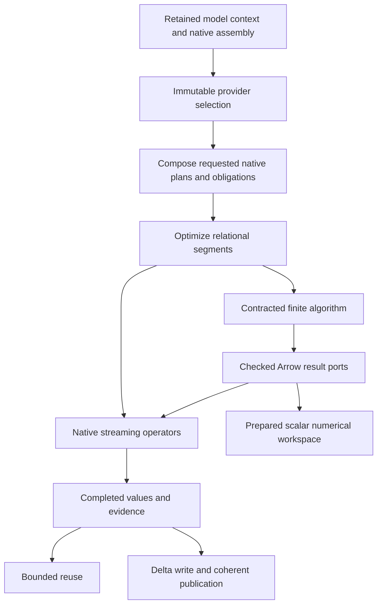

# Design review: integrated work reuse and native execution performance

## 1. Decision and scope

**Decision: Revise the current implementation toward one retained execution
environment, reusable evidence, demand-driven native plans, and specialized finite
algorithms with explicit contracts.** Combine the opportunities in both input
reviews; replace recommendations that would lose correctness or merely move
unnecessary work to another layer.

The target is a DataFusion/Arrow/Delta architecture in which each fact, prepared
structure, and completed computation has an explicit useful lifetime. Relational
work is composed before execution so DataFusion can optimize it. Finite graph
algorithms exchange checked Arrow results without packing entire relations into
one-row tuples. Repeated scalar solver work uses a prepared numerical program.
All three participate in the same provider, dependency, effect, resource, and
publication contracts.

**Inputs:**

- [Work reuse and native execution](design_review_work-reuse-and-native-execution_2026-09-19.md),
  referred to as **W**, findings F01–F13.
- [Performance-optimal native execution](design_review_performance-optimal-native-execution_2026-09-19.md),
  referred to as **P**, findings P01–P12 and its additional leads.

This document is the **combined recommendation for subsequent planning**. It
preserves both reviews as evidence and resolves their differences explicitly.
The maintainer has approved the necessary rule and policy changes in principle.
No existing implementation rule limits the selected target; §10 identifies the
document changes that follow from it. This review does not amend the blueprint,
change accepted ADRs, implement the design, or add simulator functionality.

**Observable outcomes:** unchanged values do not undergo the same semantic
admission again; independent consumers share eligible completed producers;
preparation scales with distinct structure and relevant bindings; queries compute
the requested outputs and required obligations; numerical callbacks reuse their
workspace; pinned Delta reads reuse their snapshots; a successful write does not
trigger avoidable read-back. Correctness, cancellation, source traceability, and
coherent publication remain part of those outcomes.

**Evidence calibration:** recommendations are **Proposed**. Exact APIs inspected
are **Interface-checked**. Statements about existing call paths are
**Implemented**, not measurements of their cost. No speedup from the combined
design has been measured, and “best” is an architectural recommendation under the
stated contracts, not a claim of a benchmark-established universal optimum.

### Method and coverage

This is a static and conceptual review. Both reviews were read and reconciled
against the charter, their current source paths, the local DataFusion, Delta Lake,
and datafusion-tracing skills, and selected exact dependency source. No new test
campaign, timing probe, or profiling session was run. `just doctor` reported the
environment ready. Existing assessment evidence was retained without alteration.

First-hand source inspection for this consolidation covered session construction,
reuse witnesses, native graph traversal, cache construction/read ownership,
compiler composition and algorithm execution, configuration/output accumulation,
physical inventories, invariant and rule-round plans, numerical stages and Ipopt
callbacks, buffer ownership, Delta snapshot/resident caches and publication,
canonical framing and MathIR loading, quantity lookup, and Python stream/schema
boundaries. W supplies the previously inspected failure and assessment details.
Some source line numbers in P no longer identify the stated expressions; the
citations below identify the current files and operations instead.

The consumer uses DataFusion **55.1.0**, Arrow/Parquet **59.3.0**, object_store
**0.13.2**, datafusion-tracing **55.0.0**, and the unpublished Delta capture
**58f07cd62bfbce3649a7e1c87c696288068ae184**, kernel
**8ba063f8f84fec222000f66d40d70911d7c79675** (`Cargo.toml`, `Cargo.lock`).
DataFusion/Arrow/Delta claims use the local skills and those sources, not Context7.
For the Python attachment question, Context7's official PyO3 guidance was checked
against local **PyO3 0.29.2** and **pyo3-arrow 0.19.0** source.

Not newly inspected: physical correlation correctness, every compiler pass,
generated contract contents, alternative solver backends, cloud behavior, Windows,
wheel builds, or a complete execution of the changed design. Concurrency,
last-reader ownership, provider mutation, negative dependencies, guarded numerical
evaluation, and ambiguous commits were attacked conceptually with the cases in
§3 and §5; those attacks do not substitute for the implementation controls in §9.

### What the existing observations establish

The stopped assessment is `build/assessment/2026-09-19-local-full/`, command
`just assessment build/assessment/2026-09-19-local-full`, native gate `just test`.
Baseline: **zero failures**. Mode: dev build, nextest `ci`, explicit
`pse-relations/force-validate`, no fail-fast, no retries, interrupted by the user.
Of 1,085 selected native tests: **1,020 passed, 24 assertion failures, 5 timeouts,
3 interruptions, 33 not started**. Compilation was 8.05 seconds; the partial
native run was 1,463.734 seconds. P's “27 failed” groups the three interruptions
with assertions; they are distinct outcomes, not 27 product assertion failures.

P also records a source/P3 composition observation of 10.08 seconds and a
54.5-second failing test. That is evidence of substantial preparation latency in
that run, **not an attribution** of the time to state rebuilding, traversal, or
requirements individually. W §9 remains the detailed inventory of the partial
campaign, other check failures, and unrun gates. Neither review supplies complete
acceptance evidence, and their overlapping failures must not be added together.

The design does not require further attribution before deleting redundant work.
Measurements characterize the result after implementation; they are not the
first implementation slice or a prerequisite for these recommendations.

## 2. Authority and lifecycle map

Use existing registry, session, binding, completion, and storage abstractions.
The names below describe ownership responsibilities, not a proposal for another
framework or a new crate.

| Concept | Authority and identity | Lifetime and update boundary | Derived representations |
|---|---|---|---|
| Domain definitions and contracts | Registry and its exact implementation owner | Immutable registry revision | Arrow schemas, predicates, quantity indexes, Delta checks, generated adapters |
| Native capability assembly | Actual functions, planner extensions, rules, semantic settings, provider policies | Compatible assembly generation | Shared immutable preparation inputs and lookup inventories |
| Model execution environment | Retained model/workspace `SessionContext` using that assembly | Across compatible source revisions; replace for incompatible capabilities or isolation requirements | Selected query states and provider views |
| Input selection | Immutable catalog/schema/table bindings, exact Delta versions or checked Arrow owners, explicit absence | One coherent revision/role selection | Logical scans, source witnesses, selected physical inventory |
| Prepared structure | Actual native producer/expression owners and relevant semantic dependencies | Until those dependencies change | Intrinsic plan facts, requirement templates, eligible physical preparation, numerical program |
| Completed result | Immutable produced chunks plus exact contract, dependencies, and completion | Bounded model reuse when pure; round/attempt lifetime otherwise | Checked consumers, cached readers, completed invariant evidence |
| Live execution | Attempt-local cancellation, query properties, authorization, quota, operator/worktable state | One attempt or explicitly identified rule epoch | Metrics, temporary buffers, provisional output |
| Durable revision | Delta table versions and the publication control record selecting them | Native transaction and publication settlement | Reopened providers and admitted durable artifacts |
| Observation | Derived plan facts, typed diagnostics, metrics, trace events | Requested inspection scope | Reports and assurance assertions, never model authority |

**Provider hierarchy:** root/runtime owns deployment resource and store policy;
catalog selection identifies a coherent model revision; schema scope contributes
family contracts and policy; table providers expose exact source identity, schema,
eligible constraints/statistics, and supported operations. Expression, operation,
and sink contracts complete that hierarchy. Compose policy once for an immutable
selection, then evaluate its live requirements at the appropriate operation
boundary. Do not create separate per-stage interpretations of the hierarchy.

Ownership, dependency, scheduling, provenance, and graph connectivity remain
different meanings. A specialized graph representation is allowed when useful;
it is derived from the selected typed relations and is not another editable model.

**Identity:** retained owner identity is a cheap in-process witness only while the
actual immutable owner survives. A mutable provider's address, a context UUID,
table name, matching schema, or plan text is not content identity. Persistent
identity and hashing retain their declared framing and equivalence rules.

## 3. Semantic contracts and invariants

### Establish a fact once within its actual scope

| Contract | Enforcement boundary and retained evidence | Required refusal or invalidation |
|---|---|---|
| Local Arrow/field/value validity | Untrusted ingress, changed-value production, or an existing producer contract that already establishes it; carry `FieldCheckedBatch` | Foreign declaration, changed values/interpretation, or unsupported preservation mapping |
| Relational validity | Completed invariant over the complete selected dependencies | Changed referenced relation, absent/empty input, predicate implementation, or relevant policy |
| Rewrite preservation | Native binding followed by checked derivation; recheck changed nodes and actual factory outputs | Lost field meaning, wrong lexical scope, skipped required effect, or unqualified provider promise |
| Reuse | Actual producer plus complete semantic input selection and successful completion | Mutable/ambient dependency, incompatible numerical policy, worktable epoch, incomplete result, or invalid ownership |
| Live admission | Current authorization, resources, cancellation, and effect/commit checks | A cached computation never grants permission or budget for a new attempt |
| Memory ownership | Reservation/lease outlives every escaping array and slice; fallible admission before owned allocation where applicable | Underestimated hidden backing extent, early release, or output escaping without its owner |
| Publication | Exact member versions, complete applicable obligations, native commit result, and explicit uncertain-outcome recovery | Partial member set, conflicting parent, ambiguous receipt, or replay without reconciliation |
| Numerical evaluation | Declared opcode/kernel, branch, derivative, ordering, and failure contracts | Unsupported binding, inactive-branch execution, changed rounding policy, non-finite required intermediate, or stale workspace state |

`FieldCheckedBatch` establishes local validity, not primary keys, foreign keys,
completeness, canonical identity, authorization, or committed publication
(`crates/pse-relations/src/columnar.rs:40`). Conversely, a native output is not
automatically value-checked merely because it has a declared schema. Retain the
evidence actually established by its producer; evaluate only the missing checks.

Concrete preservation rules suffice: cloning preserves evidence; slicing and
filtering preserve local per-value validity but not completeness; exact projection
preserves retained fields but not obligations involving removed fields; concatenating
checked chunks preserves local predicates but does not establish cross-chunk
uniqueness. Casts, joins, and new expressions require their own preservation or
new-value admission. No generic theorem prover is proposed.

**Completion is typed:** not started, running, completed-valid, completed-invalid,
cancelled, resource-refused, and uncertain-commit are different states. A truncated
diagnostic sample is not complete validation. A transient failure is not reusable
evidence of semantic invalidity. An early violation witness can prove rejection;
absence of a violation requires completion of the relevant query.

**Equivalence:** preserve row multiplicities, null behavior, field metadata, source
witnesses, required error behavior, and declared ordering. Numerical scalar and
batch implementations follow the same ordered/guarded contract; bitwise comparison
is required where that contract promises it, with explicit tolerances only where
already permitted. Do not infer bitwise reproducibility from mathematical equality.

### Corrections needed when combining the reviews

| Recommendation or claim in an input | Resolution in this review |
|---|---|
| P: correctness holds wherever inspected; G2/G3/G6 pass broadly | Preserve its scoped observations, but include W's lambda, witness, extent, and diagnostic counterexamples. Combined acceptance is not established. Gate verdicts are independent (§6). |
| P: `SessionStateBuilder::new_from_existing` preserves all fields | Its `build()` initializes `prepared_plans: HashMap::new()` at DataFusion 55.1.0 `execution/session_state.rs:1639`. Rebuilding can discard SQL prepared registrations. Avoid rebuilding stable capabilities; distinguish query state from assembly state. |
| P: `Witness` becomes assembly-pointer equality | Equality of a retained immutable assembly is a fast path, not the entire reuse proof. Actual provider revisions, input selection, relevant policies, volatility, and lexical/worktable dependencies still matter. |
| P: stages should all exchange materialized bundles, with DataFusion only inside stages | Remove tuple transport, but also remove unnecessary stage boundaries. Compose relational segments across stages; use checked bundles only at genuine finite-algorithm or completion boundaries (§4.4). |
| P: every listed output admission is redundant | Output validity must first be established. Some listed sites are real new-value boundaries. Transport evidence and remove demonstrated repetition rather than deleting admission by call-site category. |
| P: a result-level reservation can replace every buffer owner | A caller can clone one `ArrayRef`, drop the result, and retain the bytes. Preserve a last-reader lease through escaping buffers; simplify and attach it once, rather than releasing at result drop (§4.9). |
| P: a native hash anti-join makes rule rounds proportional to the delta | A fresh join can rebuild/scan the accumulated side. New assertions can also change a representative payload or provenance. Use affected-key updates and explicitly reusable state only where supported (§4.7). |
| P: snapshot cache key is just `(store, version)` | Include table/root and store generation, load capability/options, and maintenance identity. Separate exact-version reuse from resolving current head; neither a store address nor a version number identifies a table by itself. |
| P: turn on CRC/checksum replay by default | Use the eligible pinned library acceleration under explicit feature, checkpoint, integrity, retention, and resource contracts. It is an acceleration option, not a substitute for authoritative log state. |
| P: validate stored canonical rows by hash; discard unused traversal | A self-consistent hash does not prove canonical semantics. The discarded `postorder_with_bindings(...)?` result still rejects invalid graphs. Reuse the established validity witness; do not remove the check merely because its returned order is unused. |
| P: no `detach` in the stream closure proves it holds the GIL | The C stream callback is called by the consumer after capsule export; its attachment state is not established by that observation. Qualify the actual caller path and detach known Python-attached blocking work (§4.12). |
| P: numerical tape must yield ≥100× and instrumentation must come first | Select the tape for removal of per-node reconstruction, with guarded semantics and bounded cancellation. No arbitrary speedup is an acceptance promise. Implement structural corrections with unit assurance, then run the consolidated functional/performance assessment (§9). |

The local DataFusion brief describes `DataFrame::cache` as materialization in its
compact table. The exact 55.1.0 implementation first delegates to a registered
`CacheFactory`; only its fallback collects into a `MemTable`
(`datafusion-55.1.0/src/dataframe/mod.rs:2412`). The existing PSE seam therefore
remains the integration point, rather than adding a second cache abstraction.

## 4. Derivation and execution design

### 4.1 T01 — Retain schemas, checked values, and completed evidence

Cache derived Arrow schemas, resolved field contracts, prepared predicates, and
constant reflection batches with their registry owner. `relation_schema` currently
rebuilds fields and serialized metadata (`crates/pse-schema/src/arrow.rs:62`). The
local validator already has a prepared-contract cache; improve its key/ownership
path instead of adding another cache (`validate/prepared.rs:80`). Interned exact
contract/schema handles provide the fast path; arbitrary external schemas still
receive exact checks, including metadata.

Carry checked chunks through selection, projection, bindings, caches, and finite
algorithm ports. Admit genuinely new values once. Extend existing field/output
contracts to record supported preservation, rather than wrapping every output in
another full scan. Raw/checked entry points must remain distinct in the type/API
surface. The existing checked workspace APIs are already used; replacing raw
workspace admission everywhere is not a discovered production task.

Reduce validation work that remains: prepare nested traversal once, reuse native
predicates/masks on the correct row domain, keep compact row/path coordinates,
and render path strings only for actual findings. Current `Location` creation
formats paths for successful rows as well
(`crates/pse-relations/src/validate/occurrences.rs:105`, `:244`, `:266`). Preserve
parent-null, dictionary, list-offset, and union semantics when using Arrow kernels.
Scalar literals can use the same prepared predicate's scalar contract without
constructing a one-row relation, where its actual interface supports that route.

### 4.2 T02 — Retain the model SessionContext; freeze selections, not queries

Use a shared runtime/resource owner and a retained model context per compatible
capability assembly. Keep registry/functions/planners, immutable policy composition,
and semantic settings in shared owners. Retain immutable provider views for exact
input selections; bind nested roles through those views rather than reconstructing
the function registry and a new factory.

Existing repeated work is concrete: `EngineSession::bound_state` resolves policy,
rebuilds catalogs/state, and binds inspection; `Witness::capture/matches` calls it;
`candidate_roles` reconstructs a factory during an algorithm
(`session/engine_session.rs:540`, `session/reuse.rs:25`, `:99`,
`session/execution.rs:222`). Hoist these stable computations and compare retained
facts. Changing an unrelated table must not automatically invalidate a computation
whose complete dependency selection excludes it.

Pinned native semantics determine the boundary:

- `SessionContext::clone` shares its `Arc<RwLock<SessionState>>`; `state()` makes a
  query-state clone and marks a fresh query start time. This is an intended query
  boundary, not proof of inefficient design by itself.
- `SessionState` clones still share `Arc` catalogs/providers. They do not freeze
  mutable tables. Select immutable providers or revision-qualified views before
  planning; never replace a shared same-name table underneath an active workflow.
- Use `state_ref()` for short synchronous registry lookups where appropriate;
  never hold its lock across planning/execution awaits. Native APIs that need an
  owned query state may still clone it once at that boundary.
- Keep `TaskContext`, cancellation, execution properties, metrics, effect settlement,
  and mutable operator state within their query/attempt. A single shared task
  context for the model would mix these lifetimes.
- Register functions and SQL prepared definitions once where useful, but do not
  mistake SQL preparation for physical-plan or result caching.

For Delta, retain the composed PSE/Delta planner and use the concrete selected
`SessionState` with `RequireSessionState`. `DeltaOperationContext` already follows
this route. A default Delta context or trait fallback must not silently discard
PSE functions, catalogs, resources, or extension planners.

Retain necessary store-generation and quota facades without rebuilding their
stable capabilities. For example, `cache_service::bind_state` installs a root-aware
cache manager (`crates/pse-engine/src/cache_service/mod.rs:268`); collapsing all
such views into one mutable global cache namespace would lose source isolation.
Sharing the actual stores, pool, disk manager, and cache owners is the objective.
Arrow's reference-counted buffers provide payload sharing even across contexts.
SessionContext supplies shared execution services; it does not automatically fuse
separately submitted queries, cache all their results, or certify immutable inputs.

### 4.3 T03 — Prepare distinct structure once, preserving phase order

Split intrinsic facts from context-dependent admission. Derive fields, required
inputs, effects, volatility, and implementation dependencies once for each actual
immutable producer. Check only its relevant free bindings, required effects,
outer references, and worktable epoch at a use site. Do not use the complete
ancestor effect path to repeatedly rediscover facts about the same producer
(`crates/pse-engine/src/session/traversal.rs:24`, `:118`).

Prepare related roots together so shared producers and requirement templates are
visited once. Fuse compatible inspections, memoize expression field derivation by
actual expression and schema/binding context, and update facts for changed nodes.
Native analysis/optimization and post-rewrite preservation remain distinct phases;
“at most three traversals” is not a universal correctness contract.

Fix binding order before optimizing it: resolve native names/lambdas and coercions
before a field reconstruction that requires them, preserve declared semantic
metadata across rewrites, and project witness scopes before reusing short aliases.
W F01's failures are correctness work, not merely performance work.

Admit the **actual** plan returned by a custom factory: `cache_plan` deliberately
checks both the input and the factory result (`session/cache.rs:52`). Remove
repeated work when unchanged ownership is established, not that defensive boundary.
Capture stable/volatile and ambient dependencies before constant folding erases
their syntax. A fresh task context cannot unfreeze a previously folded `now()`.
Reuse pre-evaluation structure or treat captured time as an explicit input.

### 4.4 T04 — Compose relational segments; remove tuple transport

The selected design improves on both “carry evidence through tuples” and “move all
stages outside DataFusion.” The normal path is:

**Relational operations** lower to native plans during composition: scans,
projection, filters, joins, membership, grouping, source-support construction,
and declarative checks. Queries created only inside an executing algorithm are
invisible to the outer optimizer. Move those queries out of runtime callbacks
where their inputs and structure are already known. A stage label is a provenance
boundary, not an instruction to collect and register its whole result.

**Finite algorithms** retain ordinary code for graph traversal, exact domain
reasoning, parsing, and specialized numerical work. Their input plans, complete
dependencies, declared effects, output relations, and demand are inspectable.
Materialize only what the algorithm actually requires. Return existing checked
Arrow chunks/bundles directly, with allocation ownership and completion evidence.

Delete the generic `LargeList<Struct>` packing/unpacking path in
`crates/pse-compiler/src/native/layout.rs` and its tuple-only callers. Current
`native/execution.rs:113` captures children, `:187` builds a nested session, and
`:193` reloads physical inventory before the body creates more queries. Removing
only the re-validation would leave all those structural boundaries.

**Multiple outputs need an explicit adapter.** DataFusion's `ExecutionPlan` returns
one schema; it does not supply a native heterogeneous result bundle. For the
remaining genuinely multi-output finite algorithms, use one existing contracted
producer/completion owner and typed per-relation output ports. Each port's native
adapter exposes the actual input dependencies and streams its selected checked
chunks. Concurrent ports join one admitted producer completion; they do not run
the algorithm independently or trigger hidden work in `schema()`/`scan()`.
If a rewrite changes an input, demand, or relevant binding, it changes that
completion identity. Do not share by an algorithm name or an old pointer alone.

This is a bounded extension of current operation/cache machinery, not a second
stage scheduler, graph authority, or universal tuple schema. Native plans schedule
relational dependencies; specialized execution is an explicit plan boundary.
Where a finite algorithm itself needs several native queries, it uses the same
selection and attempt services without rebuilding capabilities. Genuine mutable
fixpoint state remains epoch-scoped.

### 4.5 T05 — Compute demand and obligations together

Prepare the transitive closure of requested results **and all required validation,
effects, and provenance**. Do not accumulate and execute every intermediate stage
output simply because it exists (`native/model.rs:131`; artifact output execution
in `crates/pse-catalog/src/artifact.rs:365`). A complete published artifact still
requires every member and obligation in its declared profile. Partial inspection
or a source-to-P3 request has a smaller explicit demand.

Compile invariant templates once per registry/implementation and compatible source
shape; bind once per actual selection. Cache a completed outcome separately from
its template. Reuse a postcondition as a later precondition only if the invariant
and **complete** inputs match, including empty/absent relations and reference
targets. An unchanged left input of an anti-join is insufficient.

Share actual producers among values, findings, support, and provenance. Use native
union-all over a flat branch list for existence checks; avoid the left-deep union,
`DISTINCT`, and full sort in `invariants/program.rs:161` when the consumer only
needs non-emptiness. Preserve deduplication and deterministic ordering for reports
that promise them. A view, cloned plan, or union does not itself guarantee one
execution of a shared producer.

Provide separate terminal contracts: existence, exact count, bounded diagnostic
sample, complete findings, stream, and retained result. Replace full collection in
`native_construction.rs:257` and `strata/rounds.rs:437` where existence is sufficient.
An early violation can short-circuit only if it does not bypass required effects
or promised diagnostics; no-violation success still completes the relevant input.
This does not change the comprehensive assessment's no-fail-fast requirement.

Completed obligations can release unnecessary projection/predicate barriers.
Pending obligations and effects remain protected. Advertise native constraints,
functional dependencies, ordering, and partitioning only after their actual
contracts establish them. Reset or isolate dynamic filters for reusable execution;
do not enable the current disabled family by changing flags alone.

### 4.6 T06 — Batch compiler work and retain derived inventories

Replace per-instance/per-binding DataFusion round trips with one relational
join/grouping plan per configuration relation or expansion layer. If a finite
algorithm requires repeated random access, derive a typed index once from those
checked inputs. Do not replace broadly relational work with ad hoc Rust loops.
`p3/config.rs:139` performs one prepared query per selection; `:210` unions and
re-executes accumulated configuration for each generated addition.

Use append-only checked chunks or builders, then concatenate only for a consumer
that requires contiguous data. `native_outputs.rs:261` currently concatenates prior
and new batches repeatedly. Where later generation depends on earlier rows, retain
an indexed/chunked view between expansion rounds; a final-only batch cannot satisfy
that dependency. Reuse prepared paths and reverse node indexes rather than rebuilding
them per expression (`passes/p7/paths.rs:27`, `p4/predicates/scalar.rs:115`).

Retain `PhysicalInventory` by its complete actual input selection, not merely once
per stage or even once per compile. Its input selector already includes explicitly
absent families (`crates/pse-compiler/src/quantity_relations/inventory.rs:21`). A
compatible source edit can reuse the same quantity/material inventory across
algorithms and attempts; a changed physical declaration invalidates it. Apply the
same owner-scoped derivation to parsed immutable documents and reflection constants.
Keep resource ownership for these indexes and avoid a second editable registry.

### 4.7 T07 — Incremental rule work without invented join reuse

Retain the useful reusable round plans already present. Separate immutable rule
templates from mutable round inputs and compute changed assertions, facts, and
support together. Use candidate deltas, membership probes, and affected semantic
keys rather than re-windowing/re-aggregating all accumulated assertions whenever
only a small set of keys changes (`strata/rounds.rs:200`, `relational.rs:180`, `:261`).

The semantics are more than set union. `union_assertions` preserves original
payloads, and `facts` selects a deterministic actual assertion before joining back
to its payload. A new lower-ranked assertion may change the representative and
its derivation. Preserve signed-zero handling, nested metadata, truth/conflict
rules, support, and negative dependencies. Recompute the affected groups and their
derived evidence; append-only facts are valid only for contracts that prove it.

Prefer native semi/anti joins, aggregates, and existing accumulators. A repeated
DataFusion hash join does **not** promise a retained build-side hash table across
executions. If repeated membership requires persistent state, make its ownership,
key semantics, epoch, memory bound, and invalidation explicit in the existing rule
worktable/provider boundary. Introduce such an index only for the demonstrated
lookup need, not a generic incremental database.

Batch head results and support through one completion scope, preserve checked
chunks, derive cardinality from the actual result, and reuse declared empty owners.
Native set/null semantics must match the rule contract; do not assume a set operator
also implements the required bag semantics. Complexity claims must account for
building indexes and changed representatives, not just the delta probe size.

### 4.8 T08 — Prepare scalar numerical execution for repeated callbacks

The current code does prepare physical expressions, but its evaluator constructs a
`RecordBatch` per stage, evaluates all stages, materializes scalar values as arrays,
and performs per-stage cancellation checks (`pse-numerics/src/stages.rs:133`). The
finite UDF also checks cancellation and converts to an array (`finite.rs:59`).
`EvaluationProgram::evaluate` creates a reservation and retained-buffer export per
call (`expressions.rs:230`); the Ipopt workspace builds arrays for new variable
values and evaluates residuals and all derivatives even for an objective request
(`pse-backend-native/src/driver/workspace.rs:122`).

Lower the already admitted numerical representation to a compact typed instruction
program with slot references, operation payloads, source/equation mappings, guarded
regions, and output dependency sets. Reserve a mutable contiguous workspace once
per solve; keep variable values, bound parameters, intermediates, and derivative
outputs separately addressable. Update inputs in place and evaluate only the
requested output closure. At a repeated point, reuse completed slots and fill
additional requested outputs rather than recomputing all outputs eagerly.

**This is a derived execution layout**, not an independent mathematical authority.
Opcode/kernel/derivative meaning comes from existing admitted contracts. Retain
DataFusion physical expressions and Arrow kernels for batch/scenario evaluation;
both routes use the same operation and branch semantics. Do not maintain two
independent function semantics or silently approximate an unsupported UDF in the
scalar route. Use an explicit contracted implementation or report unsupported
capability during preparation.

Separate immutable program preparation from attempt cancellation and workspace
state. The current prepared program contains a cancellation token; that token
cannot become the cancellation authority for future solves sharing the program.
Reuse constant/parameter-only subgraphs only while their values and semantic
settings are unchanged. Track variable-point validity and computed output sets
separately so a cache hit for the objective does not falsely certify the Jacobian.

Inline finite checks at the required intermediate/operation boundary and record
the precise failed node. Execute only the selected scalar branch; batch masks must
not evaluate an inactive branch just to fill derivative slots. Preserve operation
order, explicit contraction policy, kernel failure behavior, and current derivative
capabilities. Improving the evaluator does not claim a new Hessian implementation.

Reduce cancellation overhead with a callback-entry check plus checks between bounded
instruction blocks or expensive kernel calls. “Once per callback” alone does not
bound latency for a very large expression or long kernel. Keep Ipopt's intermediate
callback, typed failure retention, and no-unwind boundary. The target removes
avoidable allocation/dispatch; a 100× speedup is not an established requirement.

### 4.9 T09 — Simplify memory accounting while preserving last-reader lifetime

Remove repeated global inventory sweeps, buffer rebuilding on every cache read,
and re-summing the entire allocation map per batch. Existing sites are
`pse-ids/src/owned_buffer.rs:147`, `:283`, `:320` and
`pse-engine/src/session/cache.rs:759`. These costs are independent of copying the
payload: `RecordBatch` clones share Arrow arrays, but wrapper construction and
deep equality still cost work.

Use producer/chunk ownership as the normal internal boundary. Establish a bounded
reservation and retained extent once, attach its lease to the produced immutable
chunks, and carry that owner through checked values, caches, and result ports.
Maintain incremental byte totals rather than re-summing all prior allocations.
Track operator scratch, completed cache entries, and escaping results separately;
reserve before custom allocation and use native operator memory/spill facilities
for participating DataFusion operators.

**Do not simply delete the last-reader mechanism.** An `Arc<Vec<RecordBatch>>`
reservation is insufficient once an `ArrayRef`, projection, slice, or C-stream batch
escapes it. Attach safe allocation owners once at a real escape boundary, or retain
an already attached owner; derived buffer views must keep it alive. Preserve Arrow
nested, validity, offset, and dictionary buffers. Internal certified handoffs and
cache hits should not rewrap the same storage repeatedly.

Replace the process-global pointer ledger with explicit producer/retention owners
where that ownership is available. Unknown foreign buffers still require an honest
extent contract or a checked owned copy. `get_array_memory_size` on an arbitrary
foreign/custom view is not proof of hidden backing capacity. W's 2,624-versus-408
failure must be fixed at the ownership/extent contract, not by weakening equality.

Conservative double charging is permitted only as an explicit bounded accounting
choice; do not call it exact unique allocation accounting or compare pool totals
as if they were an RSS bound. Avoid attaching an entire huge bundle's reservation
to every tiny output slice when chunk-level ownership is available. A deliberate
copy can be cheaper than retaining a large parent allocation for a tiny long-lived
result. Cache eviction releases only unpinned ownership; exports retain charges.

The removal criterion for the global ledger is proof that every surviving escape
route retains an adequate lease and that needed extents remain available. This is
a replacement of its responsibility, not retention of a legacy parallel path.

### 4.10 T10 — Separate exact Delta snapshots, freshness, writes, and recovery

**Exact-version reads:** `open_snapshot` currently observes latest before the cache
lookup and includes that head in the key (`cache_service/snapshot.rs:235`). Resident
reads similarly list latest and rebuild semantic settings
(`cache_service/resident.rs:338`). A later unrelated commit should not invalidate
an immutable selected historical version.

Key exact snapshots by the actual store/table generation and root, selected version,
required load capability, and relevant interpretation/options. Keep separate
current-head resolution with its declared freshness contract. A pinned cache miss
can load that version directly and let the native loader report its absence.
Preserve replacement/maintenance invalidation, read leases, and access admission;
do not equate a cached log snapshot with guaranteed availability of vacuumed files.
Retain successful commit-returned snapshots using the existing cache service.

**Native cache families:** provision finite metadata, statistics, eligible file
listing, Parquet predicate, snapshot, resident, and in-flight budgets from one
resource policy. Current `for_memory` leaves several families disabled and one
concurrent load (`pse-engine/src/cache_service/policy.rs:55`). Enable a family when
its source identity and freshness are defined; avoid caching a changing Delta
directory listing as if it were a pinned snapshot. Use native checkpoint/log replay
and CRC/checksum acceleration where supported and qualified by the actual feature
profile. Metadata-only loads remain distinct from scans that require file state.

**Publication:** open independent members with bounded concurrency and one retained
assembly/selected state, assembling the catalog deterministically afterward.
Carry the exact validating-write outcome and durable mapping into publication.
Eliminate local checks already proved for those exact selected rows and contract,
but retain cross-relation obligations and unresolved checks for externally written
or reopened data. Merely finding a Delta CHECK property does not prove that every
old file or lossy Arrow conversion satisfies the required contract.

Keep native `WriteBuilder`/update/delete/merge and the existing physical-input bridge;
the latter already avoids unnecessary `Vec<RecordBatch>` collection. Use returned
native state/metrics and known operation metadata on unequivocal success. The
current `settle_publication` still invokes `reconcile` on success
(`delta/publish.rs:308`); preserve its verified receipt semantics through a direct
completion record, then remove redundant control-row scans. Known committed member
versions can address their receipts directly rather than searching the entire log.

On unknown/ambiguous outcomes, retain the existing read-set, conflict, receipt, and
reconciliation protocol. A hook can fail after the Delta commit becomes visible;
transaction markers do not automatically suppress sequential append at this pin.
Concurrent multi-table member writes are not an atomic publication: the coherent
control record remains the visibility boundary.

**Counts and layout:** prefer native mutation metrics and already established exact
counts. The two counts in statistics-less DELETE (`delta/dml/execution.rs:159`)
currently recover an exact affected-row answer; they cannot simply disappear when
the API promises that answer. Improve the receipt/statistics path or reuse known
counts, retaining a correct fallback. Likewise the inverse casts in
`delta/layout.rs:294` detect value loss. Skip them only for a proven lossless mapping
or reusable exact conversion evidence, not because two casts look redundant.

**Incremental storage:** CDF can provide changed rows/keys for supported tables and
operations; retain version bounds, update pre/post images, deletes, schema changes,
and absence dependencies. At this Delta pin, feature recognition is not universal
CDF support, and an ending version can be clamped. Never advance an incremental
checkpoint beyond the actually observed range. CDF is an eligible input to reuse,
not a replacement for its semantic dependency proof.

### 4.11 T11 — Reuse semantic indexes and canonical work without weakening identity

Derive immutable indexes for quantity keys, opcode candidates, conversions, and
binder identity; cache inference only against complete operand, index, policy,
and invariant-checker context. Current examples are
`pse-quantity/src/registry.rs:225`, `:239`, `index.rs:116`, and
`pse-mathir/src/canonicalize/literal_context.rs:31`. This removes registry scans
without making a new semantic authority. Share graph validation/order where its
contract matches; do not discard cycle/binding validation because its result was
not used (`pse-mathir/src/canonicalize.rs:121`).

Canonicalization has real work: key validation, ordering, normalization, metadata,
IPC encoding, and versioned framing. Reuse already established properties and
canonical owners instead of reconstructing them within one trusted workflow.
Stream the existing exact frame into the existing `FrameSink`/hasher when the caller
does not request preimage bytes (`pse-ids/src/frame.rs:58`);
`canon/stages.rs:188` currently builds a full preimage unconditionally. Length
prefixes and fixed-width fields must remain byte-identical. IPC component lengths
still have to be known: avoiding the final combined buffer does not magically
eliminate every component buffer or permit a changed hash format.

Untrusted reopening needs content integrity **and** canonical/semantic admission.
`pse-mathir/src/relations/load.rs:312` reconstructs to establish that contract.
Replace repeated reconstruction only with trusted, versioned evidence covering
the same graph, bindings, implementation, and canonical rules. A hash supplied
alongside arbitrary rows does not establish those facts. Sorts or gathers can be
removed only when the producer already establishes the required ordering/layout.

### 4.12 T12 — Keep the Python boundary columnar and cheap

Use the process registry owner instead of assembling another identical registry
for inspection (`pse-py/src/inspection/runtime.rs:48`). Move repeated linting of
generated Python contract classes from ordinary package import to generation and
quality validation (`python/pse/governance.py:143`, `python/pse/__init__.py`). Keep
necessary extension registration and lightweight native/package compatibility
checks at runtime. Dynamically supplied/untrusted contracts still need admission.

Arrow streams remain the bulk path; `structure_rows` is an explicit convenience
for callers that want Python objects, not a default conversion in an execution
pipeline. Retain one-use stream, error, cancellation, and ownership semantics.

For known Python-attached entry points, detach around blocking Rust-only work with
the pinned PyO3 contract. The exported Arrow C callback invokes `reader.next()`
from the consumer (`pyo3-arrow-0.19.0/src/ffi/to_python/ffi_stream.rs:120`); the
absence of a Python token in PSE's closure does not establish the consumer's GIL
state. Qualify that route before choosing its attachment adapter. A bounded native
prefetch stream is an option if needed; it must preserve backpressure and must not
introduce a second unbounded queue or unnecessary thread per batch.

`python/pse/_transfer.py` repeatedly removes schema fields to isolate metadata.
Prefer a single native zero-column projection if it preserves the exact native
metadata representation. A Python dict round-trip is not equivalent because
duplicate metadata keys can be lost. This is a qualified boundary optimization,
not a reason to weaken transfer diagnostics.

### 4.13 T13 — Budget concurrency, caches, and fan-out together

Raise general-workflow concurrency through the existing runtime policy instead of
hard-coding one worker and one partition. Separate CPU tasks, I/O loads, retained
cache bytes, in-flight memory, spill, and solver threads. Do not assign the entire
32-thread machine to every concurrent test or query. A tiny input may need fewer
partitions; deterministic single-partition fixtures remain explicit where needed.

Execute independent outputs/member opens with bounded streams/tasks and collect
all outcomes for the requested assessment. An unbounded `join_all` is not a
scheduler. Nested work must inherit the attempt budget or release outer permits;
holding every permit while waiting for children can deadlock. Required effects and
publication transitions follow their declared dependency order.

Extend the existing cache machinery by lifetime, not by adding a parallel cache:

| Reuse family | Retain | Refresh or invalidate |
|---|---|---|
| Assembly/schema/plan facts | Immutable implementation owners and derived facts | Relevant declaration/function/rule change |
| Requirement preparation | Template and eligible bound preparation | Source shape/bindings or invariant implementation |
| Completed pure values/obligations | Exact producer and complete immutable selection, checked chunks, ownership | Relevant input/policy/implementation change; eviction |
| Mutable physical state | Only under its verified reset/reentrancy contract | New attempt, worktable epoch, dynamic filter, or incompatible resources |
| Numerical workspace | Prepared program plus separately owned mutable slots | New point/parameters/output demand; cancellation is attempt-local |
| Delta exact snapshots | Exact version and store/table/interpretation identity | Replacement, incompatible maintenance, or changed selection |
| Current head/listings | Bounded observation under explicit freshness | TTL/refresh, mutation, store generation |

Promote only complete pure results into model-level retention. Coalesce concurrent
fills when their identities and lifetime contracts match; cancellation by one
waiter must not silently cancel another attempt's computation. Until shared fill
ownership is implemented, share completed results across attempts and keep
in-flight work attempt-local. Eviction, failed fills, and partial streams never
mint completion evidence. Publish no speculative effect through a cache hit.

Fan-out is deliberate: retain a shared expensive result once, or stream to bounded
consumers with a defined slow-consumer policy. Re-executing a cheap stream can be
better than retaining a large result. Expose actual native row counts/statistics,
ordering, and partitioning to planning; estimates can choose algorithms but must
never be promoted to uniqueness or validation proof. Use the statistics registry
and provider hooks where their snapshot keys are sound. Account for blocking
sort/hash working sets even when the terminal API is streaming.

### 4.14 T14 — Use low-cost structural assurance and truthful complete assessments

Use Contract-level evidence, compact typed diagnostics, and operation metrics for
ordinary assurance. Full plan text/JSON, schemas, previews, and complete findings
are requested diagnostic products. The current forced Diagnostic helper and
1 MiB capture refusal in W F09 should not determine whether a numerical or compiler
value test succeeds. Missing/truncated evidence remains visible to tests that
actually request it.

Record counters at existing seams: stable assembly construction, distinct plan-fact
derivation, actual new-value admission, requirement execution/reuse, shared producer
completion, rows processed per rule epoch, numerical requested outputs, and Delta
head/log/file requests. Use DataFusion plans/metrics and datafusion-tracing for
execution evidence; record complete/sampled/disabled/interrupted coverage explicitly.
No span can prove correct values or expose execution that was not instrumented.

Use one typed diagnostic projection for errors, causes, semantic codes, and resource
classification. Retain original leaf errors through wrappers; presentation spelling
is not the diagnostic identity. Generate valid and invalid fixtures from actual
contracts and report each invariant case independently. A test that aborts a long
case loop has not assessed the remaining cases.

Retain the reusable no-fail-fast environment assessment, persistent gate/test logs,
and honest tool failure/unsupported/interrupted statuses. Do not mask a refused
unsafe-audit invocation as success. Preserve the existing failure inventory until
actually resolved; a new receipt or timeout increase is not a fix. These tool and
fixture changes are part of the combined scope, not displaced by performance work.

## 5. Representative journeys

### Ordinary extension: add an invariant and one finite algorithm output

The invariant has one registry declaration with its complete dependency selection.
The retained assembly prepares its template once. A selected workflow either
consumes an already completed outcome for those exact inputs or executes the bound
native check alongside its producer. An existence consumer does not request a
sorted findings relation; a full report does. Changing the invariant implementation
invalidates both preparation and completion evidence.

A finite algorithm's new output adds its declared port and implementation to the
existing operation contract. Native consumers see a relation with that contract;
they do not require a new tuple layout, hand-written UNNEST sequence, or second
session. If producing the new output requires more computation, demand enters the
producer's completion identity. Existing completed ports remain reusable only
where their declared independence permits it.

### Meaningful change: edit one source relation

The model context and compatible function/schema assembly survive. The workflow
selects a new immutable provider view. Intrinsic plan facts, unaffected parsed
documents, and the unchanged physical inventory remain available. Rebind only the
producers and requirements whose complete dependency selections changed.

An unchanged anti-join input does not retain its result if the searched relation
changed; an empty relation participates in the dependency key. A cached predicate
result cannot override a newly revoked permission. Numerical structure can survive
a parameter-value change while parameter-dependent slots and result validity are
invalidated. A changed numerical policy invalidates the appropriate program.

### Boundary: retain one Arrow column after the query and cache are dropped

The producer establishes local validity and a retained allocation lease. A consumer
projects one column and exports it through the native stream. Dropping the query,
cache entry, and parent batch does not release the lease while the column or its
slice remains alive. No second semantic validation is needed for the unchanged
field. If a tiny slice pins a large allocation, the retention policy can choose a
checked copy; its new ownership and preserved field evidence are explicit.

On durable write/reopen, allocation identity ends. The Delta version, loss-aware
mapping, declaration, and trusted completion evidence determine what can be reused.
Unsupported metadata or value loss is rejected; a shared SessionContext does not
make that boundary disappear.

### Interruption: one consumer cancels while another still needs a shared result

An attempt-local producer stops with its attempt and never enters the completed
cache as success. A model-level shared fill, if enabled, has explicit interested
consumers and its own bounded ownership; cancelling one waiter releases that
waiter's interest without inventing a completed result or cancelling unrelated
work. Last-consumer cancellation releases eligible work and reservations.

If cancellation or a hook error occurs after a Delta commit, settlement records the
known version or uncertain outcome and reconciles before replay. A partially written
member set is not a published model. A cancelled solve retains its declared terminal
status and error/iterate evidence; the next solve gets a fresh cancellation scope.

### Adversarial rewrite: push a filter below a pending check

A downstream filter would hide an invalid row from a pending whole-input obligation.
The optimizer must not move it across that contract. Once the same whole-input
obligation has completed successfully, its evidence can permit the barrier to be
removed for a pure consumer. A changed source or field mapping invalidates that
permission. A dynamic filter associated with one consumer cannot narrow a shared
cached result subsequently used by another consumer.

## 6. Acceptance gates

These verdicts evaluate the inspected current implementation and readiness of the
proposed replacement. Existing successes do not certify the new lifetime boundaries.

| Gate | Verdict | Evidence or gap | Required closure |
|---|---|---|---|
| G1 — Authority | **Pass, inspected scope** | Registry, actual provider selections, native plans, and Delta publication remain identifiable authorities. Derived indexes/tapes are explicitly non-editable representations. | Preserve these owners while replacing transport; no independent stage/dependency registry. |
| G2 — Semantic fidelity | **Fail** | W's nested-lambda/witness binding failures and retained-extent disagreement remain concrete counterexamples. New scalar/rule/ownership paths also need preservation controls. | Correct phase/scoping/extent behavior and qualify guarded numerical, metadata, multiplicity, and provenance preservation. |
| G3 — Validity | **Unresolved for the changed boundaries** | Raw ingress has checks; neither “native output” nor Delta CHECK presence proves all proposed skipped admissions. | Every removed check names an existing producer/preservation/completion witness; negative controls establish rejection remains. |
| G4 — Hidden behavior | **Unresolved for expanded sharing** | Effects are represented today, but longer cache lifetimes and shared fills must separate query time, permission, cancellation, and mutable providers. | Explicit immutable selections and fresh attempt state; cache hits cannot authorize effects or freeze ambient inputs. |
| G5 — Consistency and recovery | **Unresolved for the replacement** | The recorded `publication_each_object::every_actual_delta_write_boundary_preserves_a_complete_publication` success is useful bounded evidence. Concurrent publication and reduced read-back are changed paths. | Retain coherent control publication, conflict detection, last-reader lifetime, and ambiguous-outcome recovery under the new paths. |
| G6 — Transformation and reuse | **Unresolved** | Existing witnesses are conservative; proposed narrower reuse, rule updates, numerical selective evaluation, and barrier release introduce new obligations. | Full dependency/epoch keys, changed-input controls, actual operator reset qualification, and clean-versus-reused equivalence. |
| G7 — Truthful capability claims | **Fail on the combined current record** | Blueprint §18.2 describes an instruction/workspace evaluator; current callbacks use per-stage physical expressions. Blueprint §5.4 also contains an IPC hot-path claim inconsistent with the selected Delta path. Partial assessment and masked tool status cannot certify completion. | Reconcile architecture/evidence labels, implement the selected supported scope, and issue a complete truthful assessment. |

The decision is **Revise**, with a concrete recommended target. This is not a claim
that the target has already passed its implementation gates. Lack of a new timing
run does not invalidate a clearly labelled proposal; DM-39 forbids claiming
unmeasured gains as established and requires end-to-end characterization before
making performance conclusions.

## 7. Principle findings and opportunity coverage

### Integrated findings, ordered by consequence

| Finding | Principle verdicts | Concrete evidence or gap | Consequence | Proposed correction | Verification |
|---|---|---|---|---|---|
| **C01 — Binding and field reconstruction disagree on phase/scope.** | DM-09, DM-24 **Violated** | W F01; `session/admission.rs:430`; witness construction in `passes/native_construction.rs:384` | Supported nested expressions or source witnesses fail to bind after substantial construction. | T03: native binding/coercion before dependent reconstruction; narrow witness scopes. | Nested-lambda, repeated alias, hostile metadata, and shared-parent controls. |
| **C02 — Retained extent and last-reader ownership must be one coherent contract.** | DM-42 **Violated** for the existing extent mismatch; DM-29/DM-30 **Unresolved** for replacement | `owned_buffer.rs:147`, `:214`, `:283`; W F02; P09's result-only lease suggestion | Accounting can disagree about hidden capacity; the naive replacement frees quota while exported bytes survive. | T09: explicit producer/chunk owners, adequate extents, one escape attachment, no repeated global inventory work. | Parent-drop with live array/slice/dictionary; quota conservation; hidden foreign extent; cache eviction/export. |
| **C03 — Stable semantic evidence is discarded or re-derived at internal handoffs.** | DM-26 **Violated**; DM-07 **Unresolved** for proposed skipped checks | `native/layout.rs:110`, `:146`; schema reconstruction in `pse-schema/src/arrow.rs:62`; prepared-cache scan and path formatting | Unchanged inputs pay admission again; indiscriminate deletion could admit invalid new values. | T01/T04: carry exact checked owners and preservation; cache contract derivations; lazy findings paths. | Count actual predicate executions and reject changed/foreign fields and unsupported transformations. |
| **C04 — Session comparison reconstructs the state being compared.** | DM-26 **Violated**; DM-32 **Unresolved** for narrower keys | `engine_session.rs:540`; `reuse.rs:25`, `:99`; `execution.rs:222` | Reuse checks and nested work rebuild stable functions, settings, catalogs, and policy. | T02: retained assembly/model context, immutable selection views, fresh query state. | One stable assembly across compatible revisions; affected/unaffected provider and policy changes; fresh query-time values. |
| **C05 — Shared native structure is revisited under unnecessarily broad traversal context.** | DM-26 **Violated**; DM-34 **Unresolved** for factoring | `traversal.rs:24`, `:118`; repeated preparation/admission paths in W F04/P04 | A shared DAG can generate work per ancestor path instead of per distinct intrinsic producer. | T03: intrinsic facts once, minimal relevant context separately, grouped roots and changed-node refresh. | Distinct-parent diamond work counts, lexical/worktable/effect counterexamples; no arbitrary fixed traversal cap. |
| **C06 — Generic tuple stages hide relational structure and force capture.** | DM-18, DM-38 **Violated**; DM-58 **Violated** for unnecessary transport | `native/execution.rs:113`, `:187`; `native/layout.rs`; `native/model.rs:131` | Native optimization cannot span runtime-created queries; all ports incur transport and preparation costs. | T04/T05: composed relational segments, finite checked ports, requested dependency closure. | Native operators visible before execution; shared finite producer executes once; complete artifact demand still includes all required members. |
| **C07 — Requirement execution and diagnostic materialization exceed the question asked.** | DM-26, DM-38 **Violated**; DM-31/DM-32 **Unresolved** for broader completion reuse | `invariants/program.rs:161`; `native_construction.rs:257`; `strata/rounds.rs:437`; W F06–F08 | Repeated checks and sorted full findings are paid for an existence decision; blanket pushdown could hide invalid input. | T05: separate template/completion, share producers, explicit result demand, release only settled barriers. | Empty/reference input changes, early violation versus complete success, filtered-away failure, diagnostic completeness. |
| **C08 — Compiler lookups and accumulation repeatedly rebuild small execution tasks.** | DM-26, DM-36, DM-38 **Violated** | `p3/config.rs:139`, `:210`; `native_outputs.rs:261`; physical inventory load; `p7/paths.rs:27` | Per-row queries and growing-prefix concatenations replace one coarse plan or retained index. | T06: batch joins, append chunks, owner-scoped physical/document/path indexes. | Query/concat counts by input size; generated-row dependencies; changed physical declarations invalidate. |
| **C09 — Rule heads revisit full accumulated state despite small changes.** | DM-26/DM-38 **Violated**; DM-24/DM-33 **Unresolved** for new incremental path | `strata/rounds.rs:200`; `relational.rs:180`, `:261` | Repeated window/group/join work; naive delta-only append changes representative payload/provenance. | T07: affected-key updates, retained checked chunks, explicit epoch/index ownership. | New representative, duplicate assertion, signed zero, support/conflict, retraction/negative dependency, fixpoint equivalence. |
| **C10 — Scalar callbacks repeatedly rebuild columnar execution objects.** | DM-26/DM-38 **Violated**; DM-40 **Unresolved** for new evaluator | `pse-numerics/src/stages.rs:133`, `expressions.rs:230`; native workspace `:122` | Per-node batches and checks, per-call allocations, all derivative outputs for a scalar request. | T08: prepared typed instructions, guarded output closures, retained workspace, bounded cancellation checkpoints. | Scalar/batch conformance, inactive error branch, parameter refresh, partial output cache, cancellation and allocation counts. |
| **C11 — Exact snapshot reuse is coupled to changing head and success settlement re-reads.** | DM-26 **Violated**; DM-14/DM-32 **Unresolved** for changes | `cache_service/snapshot.rs:235`; `resident.rs:338`; `delta/publish.rs:308`; `publication.rs:224` | Unrelated commits miss pinned caches; member opens and success checks repeat storage work. | T10: separate head/version caches, retained commit results, bounded member opens, evidence-aware admission. | Pinned hit after append, root replacement, vacuum/read failure, concurrent parent conflict, ambiguous hook error, native request counts. |
| **C12 — Canonical and quantity work has reusable derivations but trust matters.** | DM-26/DM-38 **Violated** at repeated derivations; DM-15 **Unresolved** for proposed shortcuts | Quantity lookup/index sites; `canon/stages.rs:188`; `canonicalize.rs:121`; `relations/load.rs:312` | Registry scans and avoidable preimage allocation; removing structural checks or trusting self-hashes would lose validity. | T11: owner-bound indexes and canonical evidence, existing frame sink, unchanged hash bytes and untrusted admission. | Known canonical bytes, hostile cyclic/bound graphs, forged canonical rows, registry revision changes. |
| **C13 — Concurrency and cache policies do not exploit the shared resource model.** | DM-35 **Unresolved**; DM-38 **Violated** for blanket serialization | `tests/support/workflow_runtime.rs:30`; sequential grouped outputs/member opens; native cache budget defaults | Independent work waits; blindly increasing parallelism can multiply memory, thread use, or nested deadlock. | T13: common CPU/I/O/memory budget, bounded scheduling, truthful provider statistics/properties. | Saturated nested scheduling, shared producer cancellation, small/large input partition selection, total budget enforcement. |
| **C14 — Python startup/boundary work repeats static checks.** | DM-26/DM-37 **Violated** for repeated registry/import work; GIL cost **Unresolved** | `inspection/runtime.rs:48`; `python/pse/governance.py:143`; stream C callback; `_transfer.py` | Rebuilds registry and scans generated modules; unqualified attachment fixes could add work or be misplaced. | T12: shared registry, generated-contract quality gate, columnar boundary, qualified blocking adapter, lossless schema projection. | Static import contract checks, exact transfer metadata, one-use stream, appropriate two-consumer concurrency control. |
| **C15 — Observation, diagnostics, and test organization can obscure the real outcome.** | DM-47/DM-53 **Unresolved**; DM-59 **Violated** for the masked receipt | W F09/F11/F12 and §9; forced Diagnostic helper; display-code assertions; aborted invariant loop | Value tests fail on unrelated rendering; tool refusal can look successful; remaining cases disappear. | T14: typed diagnostics, bounded requested observation, independent case receipts, strict aggregate runner status. | Diagnostic wrapper matrix; all case IDs reported; capture-off/complete/truncated controls; injected gate refusal/interruption. |
| **C16 — Architecture and performance claims exceed demonstrated scope.** | DM-59 **Violated**; DM-39 **Unresolved** for the target's end-to-end result | Blueprint §18.2/§5.4 versus current evaluator/storage; two partial campaigns; P's unmeasured speedup targets | An unimplemented mechanism or interrupted run can be mistaken for a qualified target. | §9/§10: reconcile documents, finish the structural pivot, then one complete local assessment with explicit evidence. | Zero-baseline check receipts, supported capability inventory, reproducible cold/warm comparisons without invented promises. |

**Applicability:** groups 1–3 govern authorities, identity, validity, and consistent
selection; 4–7 govern lowering, effects, preparation, and reuse; 8–10 govern physical
execution, adapters, resource ownership, and observation; 11–12 govern verification,
extension locality, and proportional architecture. DM-51 migration is not an
implementation requirement here: the hard pivot adds no compatibility period.
Any deliberately changed durable identity/format would require its own explicit
decision, not an incidental optimization. DM-40 is directly applicable to the
numerical and concurrency changes, rather than outside this review's scope.

Additional verdicts: DM-02/DM-23 are **Satisfied** in the inspected authority model;
DM-03/DM-25/DM-56–DM-58 are **Satisfied at the proposal level** by deriving specialized
layouts and using existing extension seams. DM-20, DM-28, DM-30–DM-32, DM-40,
DM-42–DM-45, DM-48, and DM-53/DM-54 remain **Unresolved for the new execution paths**
until their named controls land. These are not blanket passes from using the
libraries or the charter's vocabulary.

### Complete disposition of W's opportunities

| Input finding | Combined disposition | Target |
|---|---|---|
| F01 binding/lexical phase | Retain; correctness precedes traversal reduction | T03, C01 |
| F02 retained extent | Retain; replace ownership mechanism only with last-reader/extent preservation | T09, C02 |
| F03 checked tuple transport | Strengthen: delete generic tuple transport, not just add evidence alongside it | T01/T04, C03/C06 |
| F04 repeated graph facts | Retain; distinguish intrinsic facts from contextual checks | T03, C05 |
| F05 nested session assembly | Retain and extend to immutable selected views and narrower dependency comparison | T02, C04 |
| F06 completed requirements | Retain separate template, binding, and completed-outcome lifetimes | T01/T05, C07 |
| F07 excessive collection | Retain explicit existence/count/stream/report contracts and shared prefixes | T05/T06, C07/C08 |
| F08 optimization barriers | Retain evidence-based barrier release and dynamic-filter isolation | T03/T05, C07 |
| F09 observation cost | Retain requested bounded observation and fixture policy | T14, C15 |
| F10 serialized workflows | Retain, integrated with scheduling/memory/cache budgets | T13, C13 |
| F11 diagnostic inconsistency | Retain typed cause/code/resource projection | T14, C15 |
| F12 fixture/assessment gaps | Retain independent contract cases and truthful no-fail-fast reporting | T14, C15/C16 |
| F13 runtime-hidden relational plans | Retain as the decisive improvement over all-stage materialized handoff | T04/T05, C06 |
| §4.7 longer pure-result reuse | Retain bounded model-level completed reuse; qualify shared in-flight ownership | T13 |
| §4.8 native Delta/storage cache opportunities | Retain selected snapshot, native builders, replay, and maintenance semantics | T10 |
| §10 policy reconciliation | Accepted design direction; consolidated with P below | §10 |

### Complete disposition of P's opportunities

| Input finding | Combined disposition | Target |
|---|---|---|
| P01 numerical program | Retain prepared scalar layout and selective outputs; add guard/parameter/cancellation ownership; no new derivative capability or arbitrary speedup promise | T08, C10 |
| P02 repeated admission/schema/path work | Retain transport and derivation elimination; distinguish genuine new-value checks | T01, C03 |
| P03 retained assembly/native caches | Retain; correct native builder, query-state, pointer-equality, and mutable-provider assumptions | T02/T10/T13, C04/C13 |
| P04 repeated traversals/requirements | Retain grouped fact derivation and requirement preparation; no unconditional one-pass rewrite or fixed pass limit | T03/T05, C05/C07 |
| P05 tuple transport | Retain deletion and typed finite ports; replace blanket materialized stage orchestration with native relational composition | T04/T05, C06 |
| P06 compiler/index/accumulation work | Retain bulk native queries, derived indexes, inventory reuse, builder/chunk accumulation, and existence | T06, C08 |
| P07 full rule rounds/invariants | Retain delta/affected-key computation; correct hash-build reuse and representative/provenance assumptions | T05/T07, C07/C09 |
| P08 Delta snapshots/publication/counts | Retain exact-version reuse and success-path simplification; qualify keys, write evidence, metrics, CRC, and ambiguous recovery | T10, C11 |
| P09 repeated lease wrapping | Retain removal of repeated/global bookkeeping; reject result-drop as the last-reader boundary | T09, C02 |
| P10 concurrency | Retain bounded output/member/load concurrency and appropriate partitions; avoid unbounded fan-out and blanket maximum threads | T13, C13 |
| P11 quantity/identity/MathIR | Retain indexes and hash-only framing; preserve structural rejection and canonical admission | T11, C12 |
| P12 Python costs | Retain shared registry, static governance gate, explicit row convenience; qualify C-callback attachment | T12, C14 |
| §9 `IndexSet::get` lead | Confirmed linear search in `pse-quantity/src/index.rs:116`; include derived binder index | T11 |
| §9 five MathIR traversals lead | Exact cost claim not established; retain valid DAG/binding checks and share compatible results rather than delete passes by count | T03/T11 |
| §9 `_transfer.py` lead | Repeated schema removal confirmed; select a native empty projection only with lossless metadata semantics | T12 |
| §9 Delta double-cast lead | Actual inverse-cast loss detection confirmed; optimize only with a proven mapping | T10 |
| §9 resident-read listing lead | Confirmed in `cache_service/resident.rs:338`; separate immutable selected data from current-head observation | T10 |
| §10 policy changes and §9 performance coverage | Consolidated; structural work first, unit assurance during changes, complete qualification afterward | §9/§10 |

### Additional opportunities identified through integration

These extend or connect the input findings; they are not claims of newly measured
bottlenecks.

| Opportunity | Why the combined target needs it | Selected design |
|---|---|---|
| **A01 — Avoid whole-view invalidation for unrelated edits** | An assembly per entire binding generation still invalidates useful work when only an unrelated table changes | Separate stable capability ownership from actual consumed/negative dependency selections; same-owner shortcut plus precise fallback (T02/T13). |
| **A02 — Make sharing and cancellation use the same lifetime model** | Promoting attempt caches without changing fill ownership lets one cancelled query poison another | Completed-result promotion first; explicit interested-consumer ownership for cross-attempt shared fills, eviction, and partial streams (T13). |
| **A03 — Optimize a requested result closure, not a list of stage outputs** | Tuple deletion alone can still execute all intermediate artifacts and their checks | Plan demand, required obligations, source support, and effects together; keep complete-publication membership explicit (T04/T05). |
| **A04 — Exploit numerical output and parameter lifetimes** | A tape alone still evaluates every derivative at every point and may capture an old cancellation token | Separate immutable program, parameter epochs, point validity, requested outputs, and attempt workspace; reuse completed subgraphs safely (T08). |
| **A05 — Feed established properties back into native planning** | Reused validity/results can enable narrower projections and better joins only if providers/plans expose truthful facts | Publish established constraints/order and exact-or-labelled estimated statistics; keep these distinct from validation proof (T05/T13). |
| **A06 — Remove allocation amplification from multi-output retention** | A coarse result lease or retained bundle can pin all outputs for one small consumer | Chunk/port ownership, bounded fan-out, deliberate small-copy policy, producer completion separate from value retention (T04/T09/T13). |
| **A07 — Reuse physical/domain preparation across compatible workflows** | “Once per compile” still repeats inventory, document, path, and kernel preparation on unchanged sources | Owner-scoped derived inventories in the retained environment with complete dependencies and resource charges (T06/T08/T11). |
| **A08 — Give schema and validation evidence one derivative owner** | Schema caching, predicate caching, output preservation, and Delta checks otherwise grow separate lookup/serialization layers | Extend registry/field owners to derive the appropriate representations; distinguish local evidence from relational/durable evidence (T01/T10). |
| **A09 — Treat scheduling permits as dependencies** | Parallelizing sequential loops can deadlock nested queries or multiply the test-run memory budget | Shared admission policy, separate CPU/I/O limits, inherited nested attempt budget, bounded independent work (T13). |

## 8. Alternatives and architectural leverage

| Alternative | Semantic duplication and extension locality | Correctness and operational risk | Implementation/maintenance cost | Performance evidence | Decision |
|---|---|---|---|---|---|
| Current generic native tuple pipeline | Stage output appears as checked relation, tuple storage, and unpack plan; nested factories and repeated checks persist | Existing binding/extent failures; conservative reuse does not remove repeated work | Existing complexity remains and grows with each stage/output | Partial timeout/latency evidence; no complete profile | Reject as target. |
| W alone: retain evidence and model context, compose native relational segments | Removes much repeated preparation/admission; admits finite algorithm boundaries | Needs complete memory and result-sharing lifecycle; numerical/compiler/rule hot loops remain insufficiently specified | Substantial reuse of existing modules | Proposed, no measured speedup | Strong base, broaden with P and this reconciliation. |
| P's all-stage typed materialized handoff and result-level accounting | Deletes tuples and offers useful specialized numerics, but stage handoffs still obstruct cross-stage relational optimization | Result-only leases can end too early; assembly-pointer proof too weak; persistent join reuse not supplied automatically | Subtractive transport work, but risks a separate orchestration path and lost native optimization | Proposed; 100× and seconds-level outcomes unestablished | Replace the unsafe/generalized parts; retain finite typed handoff, bulk operations, and numerical preparation. |
| **Selected integrated design** | Native relational segments plus contracted finite ports; one owner model for prepared facts, checked results, and evidence; derived scalar program | Explicit immutable views, guarded semantics, last-reader leases, bounded sharing, native transaction settlement | Extends existing crates and seams; deletes tuple transport and repeated assembly/validation; introduces only the needed scalar layout and ownership refinements | Structural work eliminated by construction; quantitative gains await §9 | **Recommend for implementation planning.** |
| **Simpler viable alternative:** retain current stage architecture; memoize bound state, add existence queries, cache schemas, raise bounded concurrency | Small surface and useful constant-factor reductions; repeated packing/materialization and scalar per-node reconstruction remain | Lower implementation risk but does not fix all current correctness/ownership issues | Lowest near-term cost | Proposed improvements, no measured gains | Useful local mechanisms, insufficient as the final target requested. |

Keep the registry/contract arena, provider hierarchy, native planners and
`CacheFactory`, requirement/completion contracts, Delta publication control,
typed diagnostics, and the tracing integration. Extend their owners rather than
adding a global proof database, another cache service, a workflow DSL, or a duplicate
graph of model truth. No new crate or third-party dependency is justified by this
review's demonstrated needs; that is a design conclusion, not a prohibition.

Ordinary code remains appropriate for parsing, finite graph algorithms, exact
quantity/material logic, numerical slot execution, and effect settlement. A new
operation adds one semantic contract and only its genuinely new implementation.
Derived indexes and scalar/batch adapters share that contract rather than silently
re-expressing it.

## 9. Verification and performance characterization

### Sequence and evidence discipline

Respect the requested development approach: implement the complete agreed
plan scope, including deletions, with targeted unit assurance; run the broad
functional/integration assessment **afterward**. Do not repeatedly launch the slow
campaign to keep intermediate states green. Do not require a new timing attribution
study before removing the work identified here.

During implementation, add structural counters at existing execution seams and
unit controls for the changed contracts. These are not full-workflow timing probes.
After the pivot, run the reusable complete assessment for this environment with
no fail-fast, persistent results, zero baseline, and explicit unsupported/interrupted
statuses. Include all relevant checks; exclude Windows/other-environment and
wheel/distribution qualification as previously directed. Review all failures together.

| Claim/risk | Evidence now | Focused development assurance | Later complete characterization |
|---|---|---|---|
| Admission runs only when evidence is missing | Implemented repetition; Proposed replacement | Same-owner/preserved projection does not re-evaluate values; new/cast/foreign values still fail appropriately; exact nested metadata | Admission counts by produced chunks, validation mode, and requested workflow |
| One stable capability assembly | Interface-checked native semantics; Implemented repeated builders | No `bound_state` rebuilding inside witness comparison; changed settings/UDF/provider selection invalidates; prepared SQL lifetime and query-time refresh | Assembly/state-build counts for cold, repeated, and changed-input workflows |
| Plan work scales with distinct relevant structure | Implemented ancestor-sensitive traversal | Diamond DAG with distinct parents; lexical/worktable/effect negative controls; actual factory result admitted | Distinct facts, contextual checks, optimizer stages, retained plan bytes |
| Native composition and finite-port sharing preserve behavior | Proposed | Relational chain visible before execution; no tuple transport; two concurrent ports consume one completed producer; changed demand/input cannot collide | Canonical model, provenance, required findings, and complete artifact outputs on representative workflows |
| Requirement reuse is sound | Proposed | Same condition/selection reused; changed empty/reference relation reruns; filtered-away invalid row still rejected | Execution/reuse counts and complete diagnostic/report mode behavior |
| Compiler and rules eliminate growing-prefix work | Implemented repeated scans/concat; Proposed change | Bulk configuration and indexed dependency tests; chunks concatenate only when required; representative/provenance update and conflict cases | Scanned rows, round counts, candidate/index-build work, actual allocated/retained bytes |
| Scalar program preserves the numerical contract | Interface-checked current path; Proposed tape | Differential scalar/batch cases over admitted operations; inactive invalid branches; ordered arithmetic; parameter refresh; requested-output validity; bounded cancellation; allocation counts | Existing solve cases, objective/residual/Jacobian correctness, callback throughput and end-to-end solve time |
| Ownership survives all exports | Existing failing extent fixture; Proposed replacement | Last array/slice outlives parent; nested/dictionary buffers; shared pool/refusal; cache eviction and foreign capacity | Peak working, cache, pinned, and exported bytes; RSS reported separately, not claimed bounded by the pool |
| Delta reads/writes avoid duplicate work | Implemented repeated head/read-back paths; Interface-checked native sessions | Exact-version hit after unrelated append; table replacement; loss-aware decode; known/unknown commit; exact DML count fallback | Object-store request counts, member concurrency, cold/warm snapshot load, ambiguous recovery behavior |
| Canonical work is reused without changing identity | Interface-checked frame sink; Proposed call-path change | Exact old/new canonical bytes; no preimage allocation when unrequested; cyclic/forged input rejected; trusted reconstruction evidence scoped | Canonicalization total work, peak memory, and publication latency |
| Python remains columnar and does not block unnecessarily | Implemented static import/registry work; C-callback attachment Unresolved | Exact metadata transfer, one-use/close/cancel behavior, attached/detached caller qualification, static governance coverage | Import cost and concurrent reader behavior in this environment |
| Parallel execution respects bounded ownership | Proposed | Nested-permit saturation, independent waiter cancellation, no half-filled cache hit, deterministic-required ordering | Representative workflows at declared CPU/I/O/partition budgets; contention and memory included |
| Assurance is complete and truthful | Partial historical results only | Every fixture case has an outcome; typed error leaves retained; tool refusal/interruption cannot pass; evidence-disabled is explicit | Full aggregate receipt, all failures together, exact commands/modes/source state |

Trace/introspection assertions answer “which plan, operation, source, and completion
ran?” Functional tests still answer “was the result correct?” Both are necessary.
Counts should be tied to semantic units (distinct producer, new chunk, exact
obligation selection), not arbitrary implementation constants that hinder a better
native optimization. Sampled traces cannot establish a universal absence of work.

Performance characterization covers construction, validation, preparation,
execution, transfer, storage, recovery, and inspection when material. Record cold,
warm unchanged, changed-input, eviction, and contention conditions, memory budgets,
thread/partition settings, profile, pins, observation mode, and actual source state.
Correctness runs retain explicit `force-validate`; a separate explicitly labelled
production-equivalent performance mode may omit it after the policy update. Do not
compare those modes as if they were the same workload.

Use the named existing benchmark and workflow fixtures where suitable. Report
relative and absolute results with conditions; select stable regression thresholds
from evidence after the implementation. Do not promise seconds, 100×, or a universal
twofold failure threshold in advance. Structural work-count controls can be
deterministic even when wall-clock thresholds are unsuitable for ordinary CI.

### Retained outstanding assessment scope

W §9 retains the complete earlier inventory: diagnostic code/cause/resource cases,
numerical fixtures, owned extent, tagged-enum fixture generation, plan observation,
lambda binding, legitimate wrapped DDL shape, and ambiguous witness scope; plus
static/tooling failures and unrun Rust/Python/solver/benchmark/feature gates.
Carry those outcomes into the implementation plan explicitly. Some earlier
environment/type issues have focused follow-up fixes; neither those fixes nor this
review close the full assessment. No old failure is resolved by renaming the suite,
re-sealing changed sources, relaxing a timeout, or dropping its check.

## 10. Policy, guidance, and architecture reconciliation

All necessary policy changes below are **accepted design direction from the user**.
They are not permission questions or reasons to constrain implementation. Formal
document updates belong in the subsequent implementation plan. Existing immutable
records are superseded through the repository mechanism, not edited in passing.

| Current rule/guidance/implementation | Required target wording or behavior | Reconciliation |
|---|---|---|
| Blueprint §14.3 snapshot-specific SessionContext/registries | Retain compatible model context; revision isolation belongs to immutable selected providers; share stable capabilities | Amend blueprint and relevant decision text. |
| Blueprint §14.3.1 “new context requires new preparation” | Relevant semantic changes require preparation; a mechanically derived query/attempt state is not automatically a new semantic assembly | Clarify identity and preparation lifetimes. |
| Whole-stage reuse, refinement only after measured stage dominance, register R-01/R-22 assumptions | Allow owner-bound producer, invariant, and derived-index reuse at the smallest already trustworthy dependency scope | Replace stale triggers; no profile prerequisite for removing demonstrated repetition. |
| Mandatory named-stage materialization; generic tuple transport; no specialized orchestration interpreted as universal engine uniformity | Compose relational segments; materialize for actual finite algorithms, complete-result reuse, fixed points, requested artifacts, or effects; typed finite output ports remain in the inspectable native contract framework | Amend blueprint §3.3.3/§14.3.1 as needed; remove tuple-only code. No separate uncontracted stage engine. |
| Proposed ADR-0070/0073 and Plan 10 restrictions on global bound reuse/current boundary admission | Bounded model-level reuse of eligible immutable preparation/completion is allowed; live authorization/resources/commit remain current | State cache scope and dependency rules explicitly rather than preserving blanket prohibitions. |
| Validation interpreted as “repeat at every boundary” | Validate new/untrusted values and unresolved obligations; carry trusted exact evidence through preservation operations | Clarify blueprint §5.4/§14.3.1 and ADR-0052 direction; do not waive untrusted restore. |
| Blueprint §14.3 and ADR-0055 prescribe per-buffer/global mechanism | Specify fallible ownership admission, adequate retained extents, and last-reader lifetime; permit producer/chunk owners and once-only escape attachment | Update proposed mechanism; supersede any accepted conflicting allocation contract through its actual status path. |
| Blueprint §18.2 instruction/slot/workspace claims versus current physical-expression callbacks | Implement the supported guarded scalar layout, with shared operation contracts and explicit derivative scope; label remaining capabilities honestly | Reconcile evidence; do not claim the whole §18.2 derivative roadmap is implemented by this performance change. |
| Blueprint §5.4 IPC hot-path wording | Describe the actual Delta/Arrow streaming path; IPC remains an encoding/cache/spill tool where used | Remove stale implementation claim; buffer wrapping alone is not a payload-copy finding. |
| Disabled cache families and single-load defaults | Finite, task-appropriate budgets with source-specific freshness and feature eligibility | Configuration changes and unit contracts; no unconditional enable-all rule. |
| One-worker workflows, broad serial groups, serial member/output loops | Bounded shared CPU/I/O/memory scheduling; deterministic serialization only where semantically needed | Runtime/test policy and implementation changes. |
| Every test invocation uses force validation | Correctness tests continue to do so; separately named production-equivalent performance characterization records its actual validation mode | Explicit measurement recipe/policy, not an unlabeled change to `just test`. |
| Import-time generated-contract lint | Generated/static quality gate plus necessary runtime extension/compatibility admission | Update Python boundary guidance and fixtures together. |
| Observation-heavy helpers, fail-fast/abort-on-first-case behavior, masked audit status | Requested observation mode, all selected assessment outcomes, honest partial/tool status | Update assurance guidance and remaining recipe/case gaps. |

Current statuses checked: ADR-0047 is accepted; ADR-0046 and ADR-0067 are
superseded; ADR-0052, ADR-0055, ADR-0068, ADR-0070, and ADR-0073 are proposed.
Do not describe all of them as accepted, or propose superseding ADR-0067 as if it
were still the active standalone decision. The planning step must reconcile the
actual blueprint/ADR lineage. User approval of the direction does not rewrite
those files automatically.

No SHOULD exception is requested to conceal a MUST gap. The remaining design
choices have selected defaults: native composition for relational work, contracted
finite algorithms for specialized work, immutable relation/producer granularity
before finer unproven reuse, chunk-aware last-reader ownership, completed-result
reuse before cross-attempt shared fills, and native Delta operations with explicit
settlement. Further benchmarking may tune capacities and granularity; it does not
reopen the approved architectural direction.

## 11. Decision and recommended implementation ordering

**Recommend the integrated target in §4. Current implementation verdict: Revise.**
The plan should implement the target directly and delete replaced paths. Do not
retain the generic tuple pipeline, old repeated-admission route, or a parallel
legacy evaluator as production fallbacks. A scalar solver layout and batch Arrow
layout are both target representations when they share the same admitted operation
contracts and have distinct legitimate consumers.

The ordering below expresses dependencies for a later full implementation plan;
it does not authorize or claim code changes in this review.

| Order | Coherent change | Targets | Evidence for the slice | Replaced work to delete |
|---|---|---|---|---|
| 1 | Fix binding/extent correctness and define stable contract/evidence/ownership lifetimes; record the approved policy amendments | T01/T03/T09, §10 | Focused negative admission, lambda/witness, nested ownership, and extent controls | Duplicate schema serialization and invalid phase ordering; no weakened checks |
| 2 | Retain the native assembly/model context, immutable provider selections, exact dependency witnesses, and attempt services | T02/T03/T13 | Assembly/fact work counts; mutable provider, query-time, policy, and cancellation controls | Nested factory/registry reconstruction; witness comparison through rebuilt state; broad ancestor rediscovery |
| 3 | Compose requested relational work; replace finite tuple handoffs with checked output ports; integrate shared requirements and producer completion | T04/T05 | Native plan inspection, finite multi-port completion, demand/effect/provenance and requirement invalidation units | Generic tuple layout/UNNEST transport, mandatory relational stage captures, redundant requirement materialization |
| 4 | Batch compiler work, retain physical/domain/index preparation, and update rule heads by affected keys under exact semantics | T06/T07/T11 | Query/concat/round work counts; generated dependencies; representative/support and canonical identity controls | Per-row query/session creation, growing-prefix concat, repeated inventory scans, unnecessary canonical preimage buffers |
| 5 | Implement the prepared scalar numerical layout and per-solve workspace using the same operation contracts | T08 | Guarded scalar/batch equivalence, selective-output and parameter invalidation, bounded cancellation and allocation controls | Per-node one-row batches and full-output callback evaluation; attempt token captured in reusable preparation |
| 6 | Complete ownership/cache lifetime replacement, exact Delta reuse, evidence-aware write/publication completion, and bounded concurrency | T09/T10/T13 | Last-reader and eviction controls; pinned-version cache and ambiguous commit units; scheduling saturation | Repeated global buffer sweeps/rewrapping, pinned-read head checks, unnecessary successful-commit read-back, serial independent opens |
| 7 | Finish Python boundary, typed diagnostics, fixture, observation, and assessment changes; reconcile architecture claims | T12/T14, §10 | Static governance coverage; boundary and diagnostic units; all-case/strict-tool runner controls | Repeated import registry/lint work, incidental full plan rendering, display-string diagnostic identity, masked/aborted assessment paths |
| 8 | Run the complete local no-fail-fast assessment and final performance characterization; resolve findings together | §9, all targets | Exact commands/modes, persistent complete receipts, zero failures against zero baseline, measured results with conditions | No legacy-versus-new production campaign, timeout camouflage, or claimed completion from partial evidence |

Independent numerical and compiler work can proceed alongside the retained-context
foundation once the shared semantic/ownership contracts are fixed; the ordering
does not require unnecessary serialization. Full integration testing remains after
the implementation and deletion scope, as requested.

The design's central rule is precise: **reuse established immutable meaning and
completed work; refresh only the state that actually changes; expose relational
structure to native optimization; use specialized execution where its workload
warrants it.** That captures both reviews' useful opportunities without accepting
their unsafe shortcuts or retaining their unnecessary boundaries.
