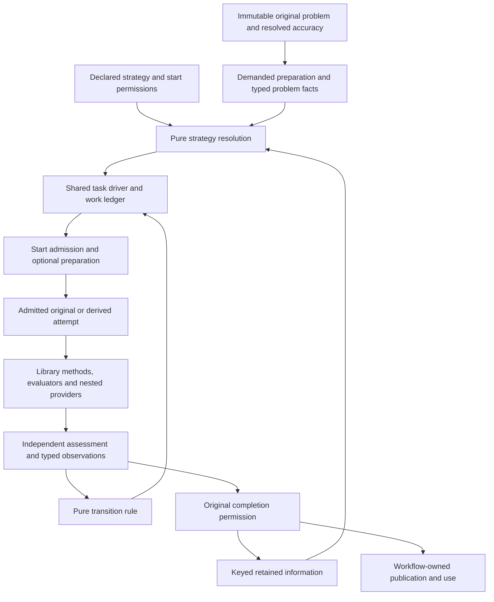

# Integrated solve pipeline

**Retain the integrated target; revise its contracts and the current implementation.**
The target in the preceding
[solver acceleration and globalization review](design_review_solver-acceleration-and-globalization_2026-10-03.md)
remains the basis: deploy all applicable established methods through one library-first
pipeline, with deliberate applicability, starts, derived systems, retained information,
observations and transitions. The methods' established mathematical foundations are
accepted under their stated assumptions. Neither benchmarking nor exhaustive testing of
their combinations is an admission prerequisite.

The current pipeline has useful foundations: typed contextual routing, immutable prepared
problems, original-coordinate qualification, worker-owned native state and explicit
derivative demand. Since the earlier baseline, complete nonlinear selection evidence and
shared absolute deadlines have become substantial additional strengths. They do not yet
deliver the integrated strategy, and they expose distinctions the target must represent.

The important corrections are these:

- Eligibility and failure of one numerical trajectory are different facts. Mixing them
  would disable the same-backend profile changes the proposed ladder requires.
- Native termination, original result permission, auxiliary progress and retention
  permission are separate products. A shared driver must consume their actual owners.
- A regime can contain several nonlinear root sheets. Retaining its regime ID does not
  establish continuity of the selected root.
- Intermediate accuracy must account for error amplification through nested roots and
  derivatives; a fixed tighter inner tolerance is not a sufficient general contract.
- A shared numerical strategy must preserve statistical, control, integration and durable
  workflow policy. Those policies are not duplicated numerical orchestration.
- Reuse must reach verified roots, proof obligations, jets and actual factorization objects,
  rather than merely retaining applications or certificate metadata.

**Architectural fitness:** the current pipeline fails G9 against this integrated target.
**Behavioral adequacy:** narrow current defects and a newly identified branch-retention gap
require correction; no new false original-solution publication was established.
**Overall: Revise.** This is not rejection of the target or of any method family. The
corrected design below is **Proposed**; implementation qualification remains subsequent work.

## Scope, evidence and review method

This is a subsystem design-tier, target-purpose review under
[Core 3.3](../design_principles/core/design-principles.md), its
[template](../design_principles/core/design-review-template.md),
[ProcessSimulator 1.3](../design_principles/profiles/process-simulator/principles.md) and
the [pse-arrow binding](../design_principles/binding/pse-arrow.md). It follows the
`design-review` and `design-review-process-simulator` skills.

The boundary includes full-case demand/preparation, structural and numerical facts,
start preparation, class-specific execution, nested evaluation, strategy composition,
retention and original-result qualification. Adjacent consumers include studies, fitting
and profile likelihood, horizons, recycles, initialization, shooting, dynamics and direct
Python strategy surfaces. Discrete/global routes retain their original guarantees; their
internal algorithms and integrator internals are outside the deep investigation.

The baseline is HEAD `f0b902589723a86bc6755ce1c76b45a2ef90224b` plus the current
uncommitted tree observed on 2026-10-03. The earlier review read a smaller concurrent tree;
its observations remain historical evidence rather than an exact description of today's
source. Source references below use files and symbols; architecture citations use stable
section identifiers. Relevant owners are blueprint §§7, 14–18 and the workflow contracts
in §§13 and 19. The existing Plan 25k remains the owner of its qualification state.

The colleague's [functional targets A–H](../evidence/solver-acceleration-2026-10-03/colleague-input.md)
and the previous review's T1–T10/M1–M18 coverage were reused. Two fresh read-only
independent assessments examined composition and numerical contracts. The coordinator
inspected decisive source, reconciled their findings and refreshed material library
interfaces through the native/math skills, Context7 and primary source. The bounded
[library refresh](../evidence/integrated-solve-pipeline-2026-10-03/library-contract-refresh.md)
records the versions, interfaces and changed PETSc conclusion.

No new product tests, probes, solver builds, native executions or benchmarks were run for
this review. Existing operational observations informed investigation, with their original
scope retained. Reading existing Arrow campaign reports is not a new solve campaign.
Unmeasured benefits remain **Proposed**. This review does not require an experiment to
re-establish known numerical theory, or qualify the whole simulator before specifying its
target architecture.

## What changed since the preceding review

| Area | Current source evidence | Effect on the previous assessment |
|---|---|---|
| Nonlinear selection | `implicit_regimes.rs::evaluate_certified`, `implicit_isolation.rs::SelectionChart::validate`, native `root_isolation` | A verified numerical winner is now paired with a regular chart and complete competitive-root exclusion. Failed numerical rivals retain their search domains. F17 must incorporate this capability, while distinguishing local certification from sheet continuity. |
| Derivative demand | Compiler `executable/implicit.rs::provider_demands`; runtime `math/modeling.rs::modeling_inner_providers` | Required orders propagate through providers and selected outputs. Stronger preparation is explicit rather than inferred from a solver name. Preserve this owner when introducing method profiles. |
| Execution scope | `pse-kernels::ExecutionScope`; `MathService::execute` scoped outcome; conditional units and final assessments | Nested work consumes the original cancellation/deadline, with checks after calls and before evidence retention. The old universal fresh-deadline diagnosis no longer applies. F13 still needs accounting across strategy work and intermediate accuracy. |
| Structural incidence | Compiler conditional/executable paths and runtime map admission | Original dependencies remain separate from Value numerical coordinates. A missing Jacobian is not an empty structural dependency set. Preserve this for BTF, reduction and derived systems. |
| Initial PR derivative diagnostic | `workflow/modeling/pr_jacobian_tests.rs::original_pr_case_jacobian_matches_stable_value_differences` | Existing initial-point checks found no stable material Jacobian or exercised weighted-Hessian disagreement. They do not establish all individual Hessians, all trial points or good solver convergence. |
| Whole original PR case | Existing focused Ipopt and explicit POUNCE reports | Both retained unsuccessful/inconclusive execution. The POUNCE report has one selected inconclusive fixture and `runtime.resource_limit`. Changing the profile or increasing allowance has not qualified the original case. |

Existing traces show roughly 82,000 interval boxes per cold selection proof, with repeated
proof work during native trials. Their debugger-assisted timings are diagnostic observations,
not a fresh K4 performance campaign. Outer progress is also poor. Consequently, reducing
proof/evaluation work and improving initialization/globalization are complementary
implementation obligations. The evidence does not establish that either one alone fixes
the original case, nor that its equations are infeasible.

## Corrected integrated pipeline and responsibility boundaries

The objective remains minimum total expensive work while preserving the original answer
contract. Methods can operate before an attempt, within a library-owned attempt, between
attempts or across related cases. An escalation list alone does not capture that composition.

Every edge retains problem, attempt, coordinate and accuracy meaning. A driver must be able
to stop with a partial trace. A library-owned composition may be one admitted mechanism,
but its inner work, failure and budget semantics must remain visible at the level the
strategy consumes.

| Responsibility | Owner and consumed contract | What adjacent consumers stop deciding |
|---|---|---|
| Vocabulary and declared permissions | `pse-model`: strategy policy, method/mechanism kinds, start origins, branch policy and budget declaration | Consumers do not invent meanings from settings strings or native statuses. |
| Prepared and derived mathematics | `pse-compiler` / `pse-math`: demand, incidence, evaluators, coordinate maps, derivation and terminal guarantees | Workflows do not reconstruct derivatives, manufacture structural facts or maintain second models. |
| Native integration | `pse-backend-native`: capability eligibility, profiles, foreign state, truthful termination and observations | Workflows do not depend on native handles or reinterpret callback failure. |
| Numerical strategy | `pse-runtime::math`: pure planning/transition, start admission, keyed retention, executor seam and ledger | Workflows do not independently choose numerical retries, start transport or setup reuse. |
| Scientific task policy | Existing workflow owners: statistical targets, sample/control policy, integration targets, study dependencies/effects | These owners retain genuine scientific and lifecycle decisions. |
| Result permission | One shared original-completion authority, consumed through an assessment operation | Driver, retention, publication and workflows do not create competing acceptance predicates. |

No new orchestration crate is required. New foreign bindings follow the decision route if
they introduce a crate. Ordinary types and functions can supply these contracts; a new
registry or universal instruction language is not required merely because a capability
has a name. Existing generated boundaries must derive from their Rust declarations.

### T1/T2/T7: plan, transition and effectful execution

The pure planner consumes original/derived problem facts, available capabilities,
effective start permissions, retained-information inventory, workload context and declared
policy. It produces admitted mechanisms, dependency/order constraints, method profiles,
budget shares, accuracy demands and typed reasons. One direct attempt with no preparation
is a valid plan.

Preserve the previous ladder's method families and declared triggers. Refine its literal
ordering: prediction, valid retained setup, structural preparation and in-attempt method
choice can be selected before a failed direct attempt. Reduced space and nonlinear
preconditioning can be execution forms, not only late rescue rungs. The declaration must
say where a mechanism composes, what facts it consumes and what observations terminate or
change it. No automatic policy is a promise of a universally fastest method.

Transitions consume **attempt history**, not the eligibility refusal map. Each target/rung
has its own admitted route, system, profile and demand. Numerical trajectory failures may
authorize the declared next step. Task time/resource exhaustion, cancellation,
infrastructure failure and invalid required contracts stop the affected task. An optional
mechanism's refusal or local slice exhaustion can leave an already planned direct route
available; that is not exhaustion of the enclosing task. Optional unavailability must not
silently become another backend choice forbidden by explicit policy.

The effectful driver executes through an injected executor and independent assessment
operation. Its observations include preparation/start/prediction refusals, native outcomes,
constant problems, report-less execution failures (`Outcome::Rejected`),
independent-assessment disagreement and auxiliary progress. It consumes
original result permission and artifact-specific retention permission. A `SolveReport`
alone cannot supply all these meanings.

### T3/T5: starts, retained products and branch policy

Resolve start permission before choosing proposals. Specify how `NoPriorStart`, explicit
starts, accepted predecessors, prediction, auxiliary and partial starts compose; a call to
`with_start` must not silently override an authored refusal. A start can violate equations
while remaining finite, within required bounds and evaluable. Admission does not turn it
into a result.

Separate portable semantic proposals from native payloads. Their keys and validity are
different: a semantic prediction may cross backends; an adapter session or exact factor
requires its native and transformation compatibility. Retained products identify original
system/structure, point, parameters, normalization, policy, source/backend/build,
transformation, accuracy, derivative order and branch evidence as required by that product.
Separate symbolic-pattern compatibility from numerical exactness at a point.

Retention inventories cover semantic points, native starts/bases/working sets, fresh root
or KKT factors, parameter response operators, tangents/secant histories, verified nested
roots/jets and selection charts. Account their escaping allocations and eviction together.
Policy invalidation must affect the appropriate products; clearing an adapter session is
not necessarily invalidating an independent factor, and keeping a factor is not permission
to use it for another problem.

`path_connected` names the originating root/path and continuity/orientation evidence.
Endpoint feasibility and a screened start cannot establish connectedness. Multistart cannot
replace a failed tracker under that policy without explicit permission. `any_qualified_root`
can admit broader start variation. Horizon application of a predicted move remains a control
decision distinct from a proposal for another solve.

### T4: derived systems and terminal evidence

A derived family carries its original identity, generation rule, coordinate/role map,
incidence, required evaluator support and preservation guarantee. Its bound step carries
anchor, continuation/pseudo-time values, original values and policy. Rebind values without
recompiling stable family structure, while invalidating changed structure or demanded support.

Generate derivatives through admitted mathematical composition. Symbolica differentiates
representable expressions; opaque fitting, shooting or provider oracles require their
consumed derivative/JVP/HVP contracts. Composing a Symbolica wrapper does not upgrade an
opaque or approximate derivative source to exact.

Distinguish equation identity, reconstruction equivalence, block coverage and approximate
agreement. `H(x,1) = F(x)` can establish a terminal equation identity; a union of block
equations does not establish a simultaneous root. A finite pseudo-time step and a stationary
least-squares point do not establish the original root either.

Terminal evidence admits original assessment; it does not transfer derived statuses,
stationarity, duals or global certificates. A separate original correction is the usual
route. A terminal realization that already satisfies all frozen original obligations may
avoid an unnecessary extra native solve, but original qualification remains mandatory.

### T6/T8: scoped observations, work and accuracy

Build the task ledger over the existing absolute `ExecutionScope`; do not replace it with
fresh rung clocks. Charge preparation, prediction, screening, rejected work, certification,
factorization, execution and final assessment. Distinguish task, occurrence, mechanism slice
and attempt caps. Nested accounting needs one owner per consumed unit so a callback's
inclusive work is not charged again as an independent task cost. An abandoned attempt cannot
release worker permits before native work and destruction finish.

Preserve synchronization for process-global native state, including the current IBEX
binding. Waiting for that state, native workspace and retained proof products belong to
the same scoped resource policy. A conservative native reservation is not a measurement
of actual resident allocation. An indivisible call may not stop immediately; post-call
checks must reject late evidence rather than imply a hard interruption guarantee.

A typed observation carries phase, scope, problem/rung identity, termination, candidate
kind, original residual/domain evidence, progress, rejected trials, setup/reuse and consumed
work. An unavailable optional response differs from unsupported required execution.
Abandoning a numerical trajectory differs from user cancellation or terminal exhaustion.
Raw metrics remain presentation; decisions consume typed observations.

Final `ResolvedAccuracy` stays frozen. Intermediate tiers specify the **accuracy consumed
by the outer operation**, derivative order and normalization. For an implicit root, residual
and linear backward errors can be amplified through `F_y`'s inverse and downstream jets.
Use admitted amplification/conditioning information and error control to derive the inner
accuracy or record that it is unresolved. A fixed tighter residual factor alone is not a
general guarantee. Exact symbolic/IFT source and finite numerical accuracy are distinct.
Promotion to stronger accuracy invalidates weaker numerical products without needlessly
discarding unchanged structural or proof products.

### T9/T10: routing and method profiles

Construct route requests from the prepared original or derived problem, its actual
profile and demand. Preserve complete contextual readiness/refusal evidence. Keep established
capability incompatibilities in `Context.refusals`; keep trajectory history elsewhere.
An observed numerical failure changes capability eligibility only when it establishes an
actual incompatibility.

Typed method profiles expose the native options the strategy owns, their applicability and
their effect. Refuse inert combinations and reserve their raw keys. Record effective native
settings, derivative/accuracy demand, implementation/build and any library-owned internal
composition. A planned quasi-Newton method should not demand expensive unused Second-order
evaluation. Unsupported mandatory demand remains a refusal, never a silent approximation.

## Mechanism completeness and best implementation

All families from the previous review remain in the target. Applicability follows their
known mathematical and implementation contracts. Missing current implementation is stated
explicitly; it is not a reason to remove a family.

| Family | Integrated implementation direction | Essential contract/composition update |
|---|---|---|
| M1 sensitivity prediction | Generalize the retained certified KKT response across studies, fitting, horizons and continuation | Full product compatibility; original target screening; predictor permission is start-only. |
| M1b active-set path following | pounce-sens-core and pounce-qp, with an explicit active-set/slack/release binding | Consumer factor is not the library's IPM layout. Record breakpoints and incomplete segment coverage; NLP prediction needs correction. |
| M2 limited correctors | Compose a bounded library corrector over an intermediate prediction/path point | Intermediate progress cannot become final permission. Preserve the horizon's separate applied-move policy. |
| M3 root tangent/secant | Retain a sparse response operator at the qualified root, using library factors/backsolves | Fresh versus stale factor, branch/orientation and parameter scale are explicit; avoid materializing a dense full response when only actions are consumed. |
| M4 inexact Newton–Krylov | KINSOL forcing/linear methods and qualified block preconditioners | Directional programs should supply JVPs without full Jacobian assembly where supported. Profile selection consumes size/fill/structure facts, not process labels. |
| M5 setup/factor reuse | KINSOL setup/residual monitoring; actual FERAL symbolic state; admitted Ipopt re-optimization binding | A retained application/factory is not proof of retained factors. Distinguish reuse for iteration from a fresh sensitivity factor. |
| M6 Anderson/fixed point | Library acceleration over admitted maps/splittings | Fix FP/Picard callback semantics first. A map's convergence and original-equation qualification remain separate. |
| M7 local bounded models | Native bounded feasibility/restoration and Uno trust-region SQP/SLP | Preserve original bounds and derived class. A stationary non-root is auxiliary. No bespoke trust-region/LM loop duplicating fitting library methods. |
| M8 native globalization | Typed Ipopt profiles and visible POUNCE second-opinion rungs | Profiles own keys; snapshot effective option set-ness; each further attempt consumes the same task ledger. |
| M9 natural/arclength continuation | Predictor/corrector composition using library solves and sparse bordering | Orient tangents continuously; distinguish indicators, localized folds and branch points; record branch policy. |
| M10 constructed homotopies | Enumerated derived families with mathematically composed derivatives | Typed anchors, admissible domains, family/step identities and terminal guarantees; no promise that every path reaches a target. |
| M11 pseudo-transient | Authored dynamics through existing integrators; qualified artificial flows; library-owned PTC where fitting | Explicit row-to-state map, signs/units and freeze/update rule. Matching alone proves neither attraction nor numerical regularity. |
| M12 DAE initialization | Typed IDAS IC options and admitted algebraic/least-deviation preparation | Respect differential/algebraic roles, index and original consistent-state checks; preserve integrator-owned time-step policy. |
| M13 exact block execution | Structural BTF/tear candidates realized as library block solves | Structural witnesses do not prove numeric regularity or independence of objectives/inequalities. Reconstruct and assess the full original system. |
| M14 reduced space | Existing implicit machinery generalized through derived-system preparation | Branch/domain/bound validity, reconstructed inequalities/objective, propagated inner accuracy and available derivatives govern elimination. |
| M15 nonlinear preconditioning | Library composition where fitting, or bounded domain composition over library block solves | Own the preconditioned residual's equivalence and derivative action; failed blocks remain typed trials. No unrelated per-workflow loops. |
| M16 multifidelity/surrogates | Library surrogate construction with declared model management/start production | Explicit correspondence, validity and consistency; construction/update charged to the ledger; high-fidelity original assessment. |
| M17 Schur/batch/multistart | POUNCE Schur/QP and compatible batch capabilities through existing admitted workers | Linking-variable partitions and actual Schur use are visible. Coordinate nested pools and starts; multistart obeys branch permission. |
| M18 evaluation reduction | Verified nested-root/jet retention, proof promotion, useful charts, typed quasi-Newton/FD modes and directional evaluators | Selection meaning and continuity constrain warm roots. Reuse complete unchanged proof obligations; an explicit approximation cannot silently inherit exact-source claims. |

### Numerical refinements that matter to this target

**Root sheets.** The new proof chart validates local global selection, but the worker retains
only a winning regime ID as its derivative branch. That is adequate for a one-root affine
regime, not a general nonlinear regime. For `y² - 1 = 0` with score `p*y`, the minimum jumps
between two roots in the same regime across `p = 0`. Each endpoint can have a valid local
chart. Fresh endpoint certificates do not establish continuity between them. Retain sheet
lineage and establish transport/overlap when a derivative worker or connected-path consumer
requires it; otherwise report a crossing or unresolved continuity. This does not forbid
globally selected minima from changing winners under semantics that permit it.
This finding establishes a missing consumed continuity fence. It demonstrates neither
an incorrect local derivative at either certified endpoint nor a wrong PR-fixture derivative.

**Fold classification.** A determinant sign change is an indicator, not a classification.
For `F(x,λ) = x(x-λ)` on `x = 0`, `F_x = -λ` changes sign, but the augmented derivative
vanishes at the branch point. Use a continuously oriented tangent, bordered/augmented
regularity and simple-fold nondegeneracy before publishing a detected simple fold. A
connected arclength path may cross a fold while ceasing to be single-valued in λ. Neither
a sampled determinant sign nor temporary movement away from the target proves a branch
is unreachable.

**Artificial flows.** A matching-derived positive diagonal does not establish attraction:
`J = [[1,2],[2,1]]` has eigenvalues 3 and -1. With identity mass, the flow `u_dot = -F(u)`
has an unstable mode. Record a bounded heuristic flow when that is what is available.
If a mass map depends on state, derivatives of `V(u)(u-u_c)/δ + F(u)` include derivatives
of V. Freezing V is a valid different construction when explicitly declared.

**Selection work.** `evaluate_certified` solves all numerical alternatives before consulting
the retained chart. First-to-Second promotion can repeat complete exclusion, and the native
adapter uses fixed chart widths. The target needs same-point selected-root/jet promotion,
reuse of unchanged competitive exclusion where its proof contract permits, and adaptive
useful chart construction within one allowance. A larger finite search ceiling alone is
not an implementation of M18. Warm starts must not substitute a different operational
or numerical Value selection; use certified winner evidence where it establishes the
actual selected meaning, and retain canonical selection where it does not.

## Library fit updates

Pinned capabilities in the preceding review remain eligible. Their specific integration
semantics, rather than their reputation or method names, determine the binding. The
[source refresh](../evidence/integrated-solve-pipeline-2026-10-03/library-contract-refresh.md)
supplies decisive references.

| Choice | Updated recommendation and reason |
|---|---|
| Uno | Retain the bounded trust-region SQP/SLP recommendation. The refreshed C API and trial-radius path support it at Interface-checked strength. Add a foreign-exception boundary, typed terminal latch and explicit sparse/sign conventions; pin acquisition/build. |
| PETSc | Replace the blanket exclusion with capability-scoped consideration. Tagged v3.24.0 trust-region trials can reject invalid-domain evaluations and shrink; initial failure and unsupported variable bounds remain distinct. Prefer its established outer mechanisms where the chosen tagged method meets the consumed contract and removes a proposed project controller. |
| Existing KINSOL/IDAS/Diffsol | Preserve their fitting roles; expose usable setup, forcing, IC and profile options through the common contracts. No second project Newton or integrator loop. |
| POUNCE/FERAL | Preserve prediction, Schur and declared second opinions. Make active-set factor binding and actual factor-object retention explicit; record whether requested library mechanisms acted. |
| Ipopt C++ re-optimization | Retain as an admitted optional binding for same-structure sequences; do not advertise C-API `warm_start_same_structure` as equivalent. |
| HiGHS/Clarabel and QP paths | Preserve class-specific admission, hot starts and explicit coordinate transport. A bounded nonlinear problem is not reclassified as an affine problem merely to obtain a cheap first step. |
| Surrogate construction | Retain the previous library-first direction. Sampling/model management and validity belong to the mechanism contract, not a second scientific authority. |

PETSc is not proposed as the owner of process workflows or the shared strategy. Its method
contracts can supply execution mechanisms behind that strategy. A universal PETSc adapter
is unnecessary; fitting scoped integration can remove bespoke pseudo-time or block
composition. Record build/global-state/thread ownership, bounds and failure-phase support.
For a method whose contract does not fit, composition over admitted existing solvers remains
valid with the bounded bespoke reason stated. The earlier line-count estimates are not
evidence for either architecture or adoption cost.

## Findings and relationship to the previous review

These are corrections to current behavior or target contracts, not new method-selection
debates. The earlier F01–F17 remain linkable in their original review. Their current work
disposition belongs in a future owning implementation plan when adopted; this review does
not create a second live status ledger.

| ID | Finding, consequence and correction | Evidence / principles | Closure evidence |
|---|---|---|---|
| IP01 | T6/T7 omit completion and retention permission. The driver could retain or advance from a native outcome that original assessment refuses. Consume one composed permission product, with separate auxiliary and artifact retention decisions. | `Outcome::{Native,Constant,Rejected}`, `candidate_use`; `workflow/numerics::{native_use,complete}`; `Staged::execute` retention flag. AP-03/AP-04, G1. Refines F04/F08/F13. | One assessment/native-permission disagreement and artifact-specific retention case through a scripted executor. |
| IP02 | T9/RR1 place trajectory failures into backend capability refusals. This would exclude same-backend different-profile attempts. Keep capability evidence and numerical history separate. | `routing::Context::refusals`; `BackendExecution::assess`. AP-04/AP-05, G2/G6. Refines F07. | Failed trajectory followed by an admitted same-backend rung; real capability refusal remains effective. |
| IP03 | T6 does not distinguish optional mechanism capacity/refusal from enclosing task exhaustion or cover pre-native outcomes. It could stop valid base work or retry terminal exhaustion. Add phase, demand and scope to observations/accounting. | `ExecutionScope`, `ParametricPreparation`, `with_sensitivity`, `callback_step`, `root_response`. DP-19/DP-20/DP-21, G5. Refines F13. | Optional unavailable response leaves direct solve valid; task exhaustion ends all rungs; inclusive work is charged once. |
| IP04 | Start-policy precedence, retention validity and connected-path permission are incomplete. Automatic start substitution could override authored permission or falsely claim connectedness. Resolve effective permission once, with product-specific keys and path evidence. | `MathService::admit_step`, `PreparedSolve::with_start`, `Retained::{clear,release}`, horizon `control`. AP-04, DP-09, G6. Refines F09/F11. | Explicit/no-prior policies, cross-backend semantic transport, stale factor and disconnected-root refusal. |
| IP05 | T4 conflates terminal equation identity, block coverage and original qualification. Derived success could be transferred incorrectly, or valid terminal work redundantly re-solved. Add precise reconstruction and terminal guarantees, then original assessment. | `engines::original`, completion owner, preparation/request identities and composite oracles. DP-08, PS-07/PS-10, G6. Refines F10. | Auxiliary success failing original checks; equivalent terminal realization still requires original permission. |
| IP06 | T1/T7 risk absorbing scientifically distinct adaptive policy. Profile likelihood, horizon control and study effects must remain with their owners. Share numerical transitions for supplied targets, not every adaptive loop. | `fitting/profile.rs::Chains::run`, `study_policy::transition`, horizon controller. AP-01/AP-03. Refines F06/F08. | An adaptive statistical target and durable occurrence compose the strategy without copied numerical retry policy. |
| IP07 | Profile chains render solve causes into strings and halve steps on broadly classified failures. A resource/contract refusal can cause another pin attempt before deadline. Preserve typed failures and use the shared classifier. | `fitting/profile.rs::Chains::{solve,run}` and `ProfileWorkerFailure`. DP-21, G5. Current defect. | Resource/unsupported required execution ends the chain; lawful numerical failure can subdivide. |
| IP08 | Nonlinear derivative branch retention compares regime IDs, not root sheets. Disjoint winning roots in one regime can evade the consumed branch-crossing fence. Retain chart/sheet lineage and establish transport where continuity is required. | `implicit_regimes.rs::evaluate_certified` branch check and chart replacement; `SelectionChart::validate`. AP-04/AP-05, PS-06/PS-07, G6/PS-G3. Current gap introduced by multiroot admission. | Same regime with two disjoint winning sheets; legitimate moving-root control; crossing or unresolved continuity is explicit. |
| IP09 | T8's fixed tighter inner factor does not establish propagated outer value/jet accuracy. Carry consumed error, conditioning/amplification, order and normalization. | `implicit.rs::{verify,derivatives,check_solve}`; runtime implicit options. PS-07, DP-11, PS-G3. Refines F13/M14/M18. | One ill-conditioned root and nested chain against a tighter reference; stronger accuracy cannot reuse weaker numerical products silently. |
| IP10 | Prior event indicators overclaim fold detection; flow contracts omit enforceable distinctions needed by PTC. Use typed event evidence and explicit mass/sign/freeze semantics. | Mathematical counterexamples above; prior mechanism cards. DP-02/DP-08, PS-05/PS-07, G2. Target-contract correction. | Fold versus branch-point classification; consistently mapped mass operator and state-dependent derivative example. |
| IP11 | Chart/application retention is mistaken for complete evaluation/factor reuse. Repeated proposal, exclusion and factory construction leave M5/M18 incomplete. Own actual reusable products and promote valid obligations without redoing them. | `evaluate_certified`, native chart construction; `pounce::Session::solve`, FERAL state. DP-09/DP-10, PS-11. Refines F12/F17. | Same-point order promotion and valid nearby chart reuse; actual symbolic object survives compatible solves and invalidates on changed pattern. |
| IP12 | Earlier PETSc blanket exclusion and drop-in path-factor assumptions are insufficiently accurate implementation guidance. Scope library claims by method, phase, bounds and coordinate contract. | Tagged PETSc trial path and pinned `SensBacksolver`; library refresh. DP-15, G7/G8. Corrects library decisions/U1/U5. | Source/API binding and narrow callback/coordinate controls for the chosen implementation; no performance gate. |

### Earlier findings retained or refined

- **F01–F03 remain prerequisites.** Current KINSOL `result` returns positive for every
  recoverable trial, FP/Picard do not share Newton's recovery semantics, step tolerance maps
  to `Acceptable`, and typed inert-option admission remains material. Reserve unsupported
  Ipopt same-structure semantics. Independent original qualification prevents those statuses
  from establishing a false scientific solution, but does not make the status record truthful.
- **F04 is narrower than “three independent acceptance rules.”** `commit_block` already
  consumes `native_use` and adds coordinate/finiteness checks. The staged retention flag
  supplied by `AssessedPoint::accepted` still omits composed permission. Correct the actual
  disagreement, not every context-specific check.
- **F05 remains documentation reconciliation**, through the architecture decision route.
- **F06–F10 remain target gaps**, with IP01–IP06 specifying their integration boundaries.
- **F11 remains incomplete prediction compatibility**, but portable semantic reuse and native
  sessions should not be forced to share one overrestrictive key.
- **F12/F14–F16 remain library/mechanism integration work.** Exact capability availability,
  effective profile choice and cheap derivative actions must reach the strategy.
- **F13 is refined by the implemented shared scope.** Do not reimplement deadline propagation;
  extend it with strategy accounting, scoped observations and propagated accuracy.
- **F17 is refined by nonlinear isolation and IP08/IP11.** A regular chart alone is not a
  license to change numerical Value selection, and regime identity alone is not root continuity.

IP01/IP03/IP05 are prerequisites for truthful transitions. IP02 is required before the
existing routing seam can serve an escalation plan. IP04/IP08/IP09 constrain prediction,
reduced-space and warm inner evaluations. IP06/IP07 govern migration of consumers. IP11
is the direct evaluation/setup reuse obligation. These relationships do not imply one
universal cause or one monolithic planner.

## Physical and numerical stage obligations

| Quantity / product | Physical meaning and authority | Enforcement obligation |
|---|---|---|
| Original values/residuals and scales | Authored physical meanings and resolved numerical policy, blueprint §§7/16 | Preserve units, bases, references, bounds, guards and original checks through every reconstruction. |
| Parameter step and radius | Parameter's unit, normalized with its declared scale | Do not compare dimensionful raw steps across unrelated parameters. |
| Path parameter | Authored physical parameter or dimensionless derived fraction | Record which meaning applies and its coordinate map. |
| Pseudo-time/mass map | Authored time and differential roles, or explicitly normalized artificial flow | Row/state pairing, units, signs and derivatives/freeze rule are part of derivation. |
| Approximate value/jet | Declared source/order and consumed error allowance | Accuracy/branch validity survives composition and promotion. |

Original variable roles and incidence remain authoritative before solving. Derived systems
are analyzed from their own exact/declared incidence, including added coupling. Matching
does not establish numeric rank, eliminability, attraction or selected-root smoothness.
Reduced variables' bounds, inequalities and objective contributions must survive reconstruction.

| Stage | Formulation and derivatives | Scaling / capability | Outcome and qualification |
|---|---|---|---|
| Preparation/start admission | Original guards; declared proposal/projection rules | Original semantic coordinates and demanded evaluators | Optional unavailable preparation distinct from invalid required execution. |
| Prediction | Fresh admitted root/KKT operators or explicitly approximate histories | Declared normalized parameter/radius and factor coordinates | Start-only; connected-path and target screening enforced. |
| Derived execution | Owned generation, reconstruction, incidence and available derivative source | Own class/profile/accuracy tier; original scales extended explicitly | Auxiliary progress; terminal evidence permits original assessment only. |
| Nested evaluation | Selected meaning, complete neighborhood obligations and IFT/provider chain | Propagated value/jet accuracy; actual derivative demand | Recoverable trial or terminal cause preserved; no stale certificate/branch permission. |
| Original correction | Unchanged authored specification | Frozen final accuracy and admitted native profile | Native status plus independent original assessment; no limit implies success. |
| Completion/retention | Captured original physical and numerical evidence | Semantic identities rather than native indices | Single result permission and product-specific retention; partial traces stay partial. |

## Foundations, gates and alternatives

Judgments below concern the current implementation against the fixed integrated target.
They do not convert an absent future method into a failure of an unrelated supported mode.

| Foundation | Judgment and concrete basis |
|---|---|
| AP-01 | Violated for numerical-transition ownership across profile/initialization/workflow loops. IP06 preserves genuinely distinct scientific policy. |
| AP-02 | Existing adapter and injected inner-solver seams are strengths; target sequence/assessment contracts remain unresolved. A modeling-specific sequence is insufficient for fit/shooting/direct consumers. |
| AP-03 | Violated by repeated numerical composition and proposed mixing of numerical history with capability refusal, IP02/IP06. |
| AP-04 | Violated by competing retention permission, erased failure kinds and regime-versus-sheet identity, IP01/IP07/IP08. |
| AP-05 | Violated by implicit effective-start precedence, inert settings and incomplete scoped outcome/terminal guarantees. |
| AP-06 | Violated for shared numerical policy that remains coupled to modeling/native session construction; the proposed executor/assessment seam is not yet realized. |

| Gate | Result at the inspected scope | Basis |
|---|---|---|
| G1 | Fail, narrow | Retention permission differs from composed completion; F04/IP01. |
| G2 | Fail, narrow | Status/settings meanings and target event/permission distinctions need correction. |
| G3 | Pass for inspected existing admission; target mechanisms unresolved | Original structural, domain and contextual admission exist; derived/new bindings require their specified boundaries. |
| G4 | Pass for inspected current path | No new hidden retry or effect in pure preparation was established. |
| G5 | Fail, narrow | Profile-chain typed operational failures can be lost; IP07. Shared absolute scope is a positive correction. |
| G6 | Fail | Incomplete predictor compatibility and consumed sheet continuity; IP04/IP08. |
| G7 | Fail, narrow | Inert settings/status assertions remain; the earlier PETSc claim needs correction. |
| G8 | Pass for current inspected numerical ownership; target conditional on fitting library bindings | Library iteration/factorization preserved. Resolve fitting outer-library capability before choosing bespoke controllers. |
| G9 | Fail against target | Applicable violated foundations above; unresolved generic consumed contract is not a pass. |
| PS-G1 | Pass for inspected preserved current boundaries; new derived-system implementation unresolved | No new physical inconsistency established; physical maps, mass signs/units, bounds and reconstruction remain explicit target obligations. |
| PS-G2 | Pass for inspected original structural admission; derived admission unresolved until implemented | Incidence and numeric properties remain distinct. |
| PS-G3 | Fail, narrow | Existing status classification and nonlinear branch-retention gap; propagated intermediate accuracy is a target obligation. |

The inspected conformance/derivative mechanisms remain preservation constraints. No unit or
property definition was changed or newly qualified in this review.

| Alternative | Assessment against the fixed target |
|---|---|
| Current per-workflow numerical policy | Retain direct execution as the minimal strategy, but current composition cannot deliver the integrated target. |
| Corrected T1–T10 | Preferred: shared semantic operations with library methods, scoped transitions and original qualification. It adds contracts needed by actual variation axes rather than one service per method. |
| Library owns everything | A library may own an admitted numerical mechanism, not the scientific targets, durable permissions or result authority across this simulator. |
| Small shared transition/executor first | Useful migration foundation, not a substitute for start, derived-system, retention, accuracy and trace meaning. No requirement to introduce unnecessary framework machinery. |

Representative changes are adding a unit/property using the same facts and original checks,
adding/replacing a method provider, composing a new study consumer, editing/re-solving values
versus structure, and testing policy without native solvers. A method declaration may add
genuinely new numerical implementation; it should not require each workflow to reinterpret
starts, failure, retention or completion.

## Verification, authority routes and follow-up

**Interface-checked:** current contracts and source paths, exact pinned library contracts,
tagged PETSc and refreshed Uno source. **Implemented:** selection certification, scope and
incidence paths exist; the target strategy and most generalized mechanisms do not.
**Proposed:** the corrected pipeline, integrations and expected work reduction.
No new **Tested** or **Measured** claims are made. Mathematical counterexamples establish
the stated insufficiency of a criterion; they are not universal convergence proofs.

Targeted implementation checks should exercise the failure modes named in the findings:
permission disagreement, scoped optional refusal/task exhaustion, same-backend retry,
auxiliary versus original result, disconnected sheets, propagated accuracy, terminal foreign
errors and stale numerical products. Each new mechanism needs its own relevant functional
checks and representative integration consumers. This is not a method-combination matrix.
Direct and Python-facing trace projection must distinguish preflight choices from actual
rung routes, preserve preparation/report-less failures and identify original versus
auxiliary scope. Presentation must consume the strategy trace, not reconstruct its policy.
Established theory is not subject to revalidation, and performance measurements do not gate
the inclusion of these methods. A later quantitative speed claim still needs its own evidence.

| Required enduring change | Decision route |
|---|---|
| Declared escalation preserving explicit selection and terminal failure classes | New ADR superseding the relevant no-fallback clauses of ADR-0083/ADR-0152, plus design review and architecture update. |
| Derived systems, their identities, derivatives and terminal guarantees | ADR/design route for blueprint §§14/17 and adjacent workflow owners; preserve one authored authority. |
| Library-owned inner methods versus admitted outer composition | Resolve PS-09 wording through the governance route. No silent waiver of a profile MUST. |
| Starts, retained information, intermediate accuracy, scoped observations and trace | Update their owning contracts and generated declarations under adopted decisions; no handwritten Python mirror. |
| New Uno/PETSc foreign binding or crate | Appropriate ADR/review and pinned build integration; capability-scoped qualification. |
| Current local defects | Correct within their current owners with focused checks; decision changes remain distinct from ordinary bug repairs. |

Until adopted by an implementation plan, these are proposed work owners and obligations,
not scheduled packets. The preceding review remains unchanged and linked. A subsequent
solver-strategy plan should own adopted finding dispositions, including links to prior F IDs
and this review's IP IDs; Plan 25k remains responsible for its existing qualification work.
This review does not resume, close or broaden that implementation on its own.

Consequence priority is current truthful-outcome, operational-failure, permission and sheet
corrections first. Prerequisite order then establishes the shared information/accuracy/budget
contracts, executor/assessment/transition seam and consumer migration, followed by the
library-owned method integrations. All listed applicable families remain in scope; their
order follows dependencies, not an experimental ranking campaign.

The next action is implementation planning for this corrected integrated target. The design
review is complete at its stated source/interface evidence level. Production implementation
and integrated qualification remain separate work.
