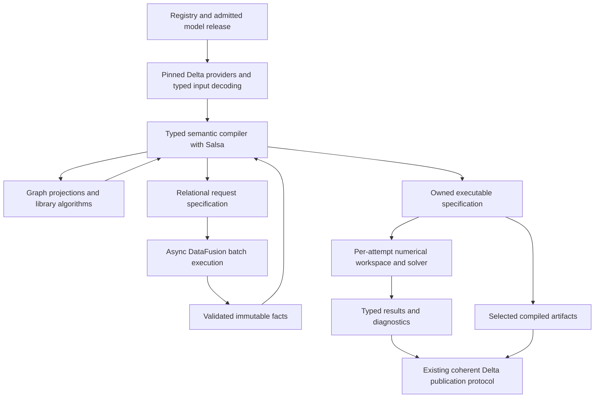

# Design review — a library-backed Rust computation target

**Implementation-status addendum (2026-09-23).** This review retains its original
baseline, findings and scoped verdict. Plan 13 is now active; see the
[W19 repair checkpoint](../../plans/13-w19-repair-checkpoint.md) for implemented
changes, current isolated/static evidence and the incomplete functional campaign.
W20 and final G1–G7 acceptance remain open. This pointer does not convert the
original review or its historical measurements into current product qualification.

Standard: [Data Model–Based Design Charter](../design_principles/DATA_MODEL_DESIGN_CHARTER.md)
and [Rust computation architecture guidelines](../design_principles/rust_computation_architecture_guidelines_graph_extended.md),
cited as **DM-n**, **G1–G7**, and **RCA §n**. Date: 2026-09-23.

## 1. Decision and scope

**Recommendation: retain relational authority, adopt a typed semantic compiler with Salsa
for reusable compilation results, use compact petgraph projections for structural work,
keep substantial relational segments in DataFusion, and retain Delta for coherent releases
and selected durable products.** The main simplification is that each mechanism has one
job. Neither the compiler nor its incremental dependency graph should be implemented as
a succession of small DataFusion executions.

I recommend Salsa for the intended target, rather than leaving the architecture undecided
between several cache systems. Blueprint §14.4 already requires repeated compilation to
reuse unaffected structure. Start with specialization and complete graph-region boundaries;
finer granularity needs evidence. Salsa is not required for one-shot kernels, each row of a
dataset, scenario values, or solver iterations. A clean recomputation mode remains a
verification oracle using the same compiler, not a second production architecture.

**Decision: Revise before adopting the target as repository authority.** This is a concrete
target proposal and an independent review of its integration risks, not permission to
implement it or evidence that it already works. The unresolved gates in §6 concern the
authority transition and unqualified integration contracts, not whether these libraries
exist. The current blueprint and active plan remain the execution authorities until the
decision route in §10 lands.

**Status.** Target contracts are **Proposed**. Library contracts and selected code paths
are **Interface-checked**; existing mechanisms are **Implemented** only where cited.
No new product test, library probe, build benchmark, or numerical experiment was run.
Recorded skill probes are prior bounded evidence, not tests performed in this review.
There is no measured speedup claim.

**Reviewer:** Codex. **Baseline:** working tree at commit
`a46f358bdfc2ca27f9f240ab6c045b63141c3ee9`, blueprint revision 43, including concurrent
uncommitted work. [Plan 11](../../plans/11-integrated-native-performance.md) is active;
its [inventory](../../plans/11-execution-inventory.md) currently marks I00–I17 complete
and I18/I19 open. Those status declarations are not a fresh acceptance audit.

**Supported scope:** semantic compilation, source ingestion and validation, graph
projections, expression preparation, incremental reuse, materialization, publication,
resource ownership, dependency structure, and library selection. Numerical execution and
Python are examined at their contracts, not re-audited internally. New solver capabilities,
new graph analytics products, backward compatibility, and store migration are not proposed.

### 1.1 Method and coverage

The [earlier alignment review](design_review_rust-computation-architecture-alignment_2026-09-23.md)
is a starting point, not a correctness oracle. I read its findings and recommendations,
the charter and RCA, current blueprint D1/D4/D6/D10–D14 and relevant §§3.3, 5.3, 14–15,
20, the dependency policy, and the Plan 11 scope and inventory. Selected executable paths
were read directly: native model composition, P0 ordering, P3 lookup, P5 port walking,
P8 graph reload, P9 closure/order, rule-stratum checks, MathIR/numerics arenas, engine
reuse identity, catalog dependency comparison, and publication preparation/admission.
The publication transaction was not exhaustively audited.

The requested rust-graphs, salsa, datafusion, and deltalake skills supplied exact-release
contracts and recorded probe evidence. Context7 supplied Tokio and faer discovery; Tokio
was checked against installed 1.53.1 source and primary documentation, and faer against
0.24.4 rustdoc. No IDAES implementation was copied or used as implementation material.
The [evidence inventory](../evidence/rust-computation-target-design-2026-09-23.json)
records selected local source digests and external documentation identities.

`just doctor` reported **1 environment failure against baseline zero**: the Python
environment is outdated. Other reported checks passed. `just --list` was inspected.
Environment repair/native rebuilding is unnecessary for this documentation review and
was not performed. Product quality, runtime behavior, cancellation latency, publication
races, performance, and the prospective combined dependency graph remain unverified.

### 1.2 What I retain and change from the earlier review

| Earlier recommendation or claim | Independent judgment and target consequence |
|---|---|
| Move topology and repeated semantic work out of per-entity queries | Agree. Live P9 closure still executes join/anti-join frontiers; P3 still interprets a subset of `Expr` in its own lookup structure. Use typed indexing or one batch join according to the operation. |
| Salsa replaces the compilation caches | Agree for semantic dependency tracking and memoization. Do not delete allocation leases, current capability admission, invariant enforcement, attempt completion, or Delta recovery because they happen to retain state. They establish different properties. |
| `StableGraph` for the instance tree | Prefer immutable, canonically built `Graph` snapshots initially. No deletion occurs within one projection, so stable indices across mutation buy little. Keep `StableGraph` for a demonstrated mutable-index consumer. |
| Write Hopcroft–Karp because no permissive library supplies it | Reject that rationale. The repository explicitly admits all libraries/licences in phases 0–1. `rust-igraph` supplies maximum bipartite matching; its implementation is **push-relabel**, not Hopcroft–Karp. Qualify it before writing a matcher. Do not transfer Hopcroft–Karp's complexity bound to it. |
| CDF is the Salsa ingestion adapter | Use CDF as an optional way to obtain a complete change set between exact releases. Direct authored changes and endpoint comparison remain valid inputs. Missing CDF never means no change. |
| Application transactions give idempotent publication | Insufficient. The Delta skill records sequential duplicate appends with the same marker and errors after a visible commit. Preserve the application publication/reconciliation contract. |
| LRU bounds memo metadata | Incorrect as a global memory claim. Bound payloads, keys, retained graph conversions, input handles, and database lifetime separately. |
| Multiple expression arenas imply competing semantic authority | Not established merely by different interning keys. A lower-level arena can be a legitimate derived layout. Retain one semantic MathIR; permit backend-specific IR with explicit lowering and source mapping. Remove repeated relation round trips, not useful lowering. |
| A cycle can leave the exact ancestor closure of an output | That cannot happen on the same complete directed graph: every vertex on a cycle intersecting the closure can also reach the output. The real risks are incomplete projections, bounded/sharded traversal, or excluding global equations. Test those actual counterexamples. |
| Cold-build/runtime measurements establish the main bottleneck | Treat as inherited observations only. M6, M7, M9 and V8 still contain placeholders in the source review. No numeric runtime or feature-flip result can be inferred from them. Build dependency separation is justified structurally; its speedup remains a hypothesis. |

## 2. Authority and lifecycle map

| Concept | Identity and authority | Revision/update boundary | Derived representations and owner |
|---|---|---|---|
| Schema, quantity, operator, rule, provider contracts | Existing registry declarations; stable contract identifiers | Reviewed source change and generated artifacts | Typed accessors, validation, adapters and documentation derive from one declaration |
| Authored model and case | Semantic entity IDs; admitted authored relations/documents | Validated change set and coherent publication | Compiler inputs and case overlays; never independently editable compiler truth |
| Coherent release | Publication ID plus exact table/member versions | Existing typed control-table publication protocol | Pinned Delta providers and an immutable input view |
| Definition | Template/operator identity plus semantic fields | Tracked definition input changes | Resolved interface and implementation; names remain attributes |
| Specialization | Definition plus structural bindings, shape/type and target semantics | Recompute from observed relevant inputs | Shared compiled component body with formal slots |
| Instance | Scoped entity ID and bindings to specialization slots | Instance membership/binding change | Distinct symbols, ports, source origins and runtime state |
| Graph projection/analysis | Source subset, projection semantics and analysis configuration | Immutable derivation over a complete admitted scope | Local indices plus explicit maps to semantic IDs; no independent edits |
| Compiled artifact | Complete semantic dependency descriptor and implementation identity | Compile/validate, optionally publish | Owned executable specification, MathIR, mappings, diagnostics and metadata |
| Runtime attempt | Attempt ID, compiled artifact, input versions and execution options | Run controller owns mutable workspace and completion | Solver state and temporary buffers; no model mutation |
| Result | Identified attempt and declared numerical/exactness contract | Validate completion, then publish selected results | Arrow relations and Delta members; observations remain observations |

This preserves D1's relational system of record. Typed compiler values are derived execution
representations under DM-03/DM-23; they are not a new authoring model with Arrow appended
as an export. Generated field/enum vocabulary comes from the registry. Handwritten arenas,
algorithms and validated constructors implement contracts without redeclaring them.

**Identity and equality decisions.**

- A rename preserves the entity ID. Name resolution observes the relevant namespace
  membership and name fields, so a name-based lookup still changes when it should.
- Structurally equal definitions can share a specialization body. Distinct instances
  retain different mutable values and occurrence provenance. Formal-slot binding prevents
  accidentally sharing `x` in two identical unit instances.
- Salsa handles, `NodeIndex`, dense numerical slots and dictionary codes are process- or
  artifact-local. Persist semantic IDs and mapping contracts, never these local handles.
- Expression identity includes opcode, quantity/type, ordered operands, literal semantics,
  binding scope and selected execution semantics. Preserve operand position even for
  repeated children. Provenance is a many-to-many mapping outside the computational key.
- Use blueprint §5.3's numerical equality where applicable. The present `ExprGraph` rejects
  nonfinite literals and distinguishes signed zero. Do not substitute IEEE `PartialEq`,
  fuzzy tolerance, `Debug` output, or Arrow `RowConverter` bytes for a semantic contract.
- Implementation identity for durable reuse must identify the actual code/ABI, registry,
  kernel and result-affecting configuration. A crate version or manually maintained
  algorithm constant alone does not identify dirty development code. Unidentified plugin
  implementations remain session-local and conservatively non-reusable across processes.

## 3. Semantic contracts and invariants

| Contract | Representation and enforcement boundary | Failure behavior and verification obligation |
|---|---|---|
| Valid semantic inputs | Registry-driven field decoding plus candidate-wide key/reference/domain validation; validated constructors before compiler operations | Structured findings; invalid input cannot reach an algorithm that assumes validity. Check missing references, duplicate keys, units and conditional constraints. |
| Complete dependencies | Salsa observed field reads for compiler queries; complete immutable inputs for external batch operations | Membership, enumeration, successful and failed lookup dependencies are explicit. Compare incremental and clean outputs after each edit class. |
| Substitutable memo equality | Canonical small values or checked immutable artifact identities; payload inaccessible except through the matching immutable owner | Equal results must be interchangeable downstream. A reused ID must never resolve to newly mutated bytes. |
| Structural/runtime separation | Structural signature and compilation dependencies distinct from values and per-attempt solver options | A parameter affecting shape, method selection, active equations or zero-coefficient incidence invalidates affected structure. Free initial guesses ordinarily do not. |
| Complete graph interpretation | Typed projection and algorithm specs; validate scope, direction, ports, multiplicity, weights, isolates and ID maps | Refuse unsupported graph semantics or incomplete exact scope; never report a truncated graph as a complete analysis. |
| Valid recursive behavior | Separate composition cycles, positive rule fixed points, numerical coupling and runtime feedback | Cycle witness, bounded monotone convergence, solver status, or explicit unsupported recursion; no generic cycle-recovery fallback. |
| Non-mutating inspection | Read existing artifacts or explicitly request a derived view | Inspection does not change model definitions, select a new provider, solve, or persist an intermediate implicitly. |
| Coherent admission and publication | One application update barrier; exact release and attempt tokens; existing typed control-table protocol | A reader sees one admitted release. Stale asynchronous completion cannot become the current model/result. |
| Honest resource and cancellation status | Resource leases, bounded jobs and cooperative checkpoints where the algorithm supports them | Budget exhaustion/cancellation is distinct from invalidity and empty output. A timed-out non-cancellable computation is still accounted for until it exits. |
| Provenance survives sharing | Separate semantic result and instance/source correspondence | CSE and shared specialization retain all contributing sources; diagnostics may refresh when structure stays equal. |

**Absence:** represent unresolved demand, absent definition, unsupported provider, invalid
input, cancelled work, nonconvergence and completed-empty result distinctly. A missing
CDF interval, evicted payload or lost commit response is not an empty semantic result.
Diagnostics required after reopening belong in the artifact bundle, not only Salsa
accumulators: the captured persistence probes do not preserve accumulated values.

**Validation placement:** local typed construction catches local invariants; DataFusion
checks cross-row/cross-relation obligations; graph adapters enforce algorithm preconditions;
backend admission checks capabilities; publication validates bundle completeness and exact
source correspondence. Arrow batch construction alone proves none of the domain checks.
Force-validation remains explicit for correctness tests.

## 4. Derivation and execution design

### 4.1 Overall shape

Arrows describe explicit data handoffs. They do not introduce an automatically recursive
query between Salsa and an asynchronous executor. Publication is a separate effectful
operation. Existing typed operation, attempt and output-bundle contracts should express
these handoffs; a new universal workflow language is unnecessary.

### 4.2 Stage allocation and RCA §9 computation contracts

The two tables below form one contract per stage. Common to every row: source revisions
are immutable and identified; keys are semantic rather than pointer identity; all relevant
implementation/configuration changes invalidate results; source-to-result maps remain
available; incomplete results cannot be admitted as complete. These are proposed contracts.

| Stage | Semantic output and equality | Backend and physical representation | Key/boundary and observed dependencies |
|---|---|---|---|
| S1 — Release admission/decoding | Validated input view; equal semantic fields stay equal despite storage-only changes | Delta-aware provider, fused DataFusion validation, Arrow batches into typed values | External update boundary; exact member versions, schema, rules, namespace/membership and relevant absence |
| S2 — Resolution and specialization | Resolved interface and separately compiled body; canonical structural equality | Ordinary Rust maps/arenas, Salsa inputs/tracked queries | Definition/specialization plus observed interface, candidate-set membership, structural bindings, types/shapes, policies and target capabilities |
| S3 — Topology and ordering | Complete direct-edge projection, SCCs/order/witnesses; canonical IDs and memberships | Immutable petgraph `Graph`; rustworkx-core for semantic-key tie order | Per package/flowsheet/problem region; projection definition, node/edge membership and only used annotations |
| S4 — Set-oriented inference | Complete stratum facts, undecided/conflict evidence and support links; declared set/bag equality | Existing DataFusion rule plans and bounded fixed-point driver | One stratum/region request over immutable facts, rule versions, negative dependencies and interpretation settings |
| S5 — Math compilation | Typed indexed MathIR and specialization bindings; guarded structural equality | Existing `ExprGraph` evolved into owned immutable results; ordinary transformations behind contracts | Per reusable component/law; interface vs implementation reads, quantity rules, method selection and math policy |
| S6 — Structural analysis | Matching/rank, coarse DM partitions and ordered blocks over an exact incidence projection | Library bipartite matching adapter, petgraph SCC/reachability, rustworkx ordering | Complete admitted problem/independent component; active/fixed status, incidence and every value-bound zero-elision assumption |
| S7 — Numerical preparation | Executable program, slot maps, sparse pattern and auxiliary derivative contracts | Specialized Rust lowering; DataFusion physical expressions for genuine batch segments | Compiled body, scalarization/target options, kernel/derivative versions; changing values separately bound unless specialization consumed them |
| S8 — Repeated execution | Attempt result with residuals, convergence/failure status and declared numerical equivalence | Existing solver/native program; Arrow/DataFusion for batch cases and reporting | Outside Salsa; compiled artifact, case values, warm start, tolerances, seed if relevant, effective solver/resource settings |
| S9 — Publication/inspection | Exact member vector and completion outcome; stable attempt identity | Built-in Delta writes plus existing PSE control-table protocol | Explicit effect; expected parent, selected output profile, exact versions, validated completeness and operation identity |

| Stage | Structural vs runtime; cycle/exactness contract | Expected cardinality and cost | Ownership, cancellation, retention and departure rationale |
|---|---|---|---|
| S1 | Storage version is not domain event time or Salsa revision; validation is exact | Proportional to selected rows plus relational obligations; bulk decoding, not one query per ID | Admission owns batches and temporary indexes; release the old view only after users finish. Async I/O outside tracked bodies. |
| S2 | Shape, child bindings and provider choices are structural; runtime values do not select an untracked specialization | Work per distinct specialization plus necessary instance bindings; never promise that unavoidable instance outputs disappear | Database retains small results; external immutable payload owners retain large bodies. Cyclic/unbounded specialization gets a witness or declared finite bound. |
| S3 | Exact facts over complete scope; legitimate connectivity cycles survive; ordering requires a DAG or condensation | Graph storage O(V+E); canonical sorting may add O(V log V + E log E); traversal/SCC O(V+E); no all-pairs closure | One region owner and explicit ID map. Non-interruptible library calls finish under their resource lease; cancellation suppresses admission/publication. |
| S4 | Monotone positive fixed point within a stratum; negative/nonmonotone reads cross settled boundaries | Plan executions scale with necessary strata/rounds, not individual facts; joins can still cause large intermediates | Driver owns frontier/accumulated relations, round limits and cancellation. Whole-stratum reuse initially; no claim that Salsa makes the rule algorithm incrementally maintain itself. |
| S5 | Preserve indexed operations until required expansion; numerical rewrites retain guards and precision policy | Proportional to unique expression nodes plus actual expanded output; no whole-graph Arrow reconstruction between each pass | Immutable graph/body sharing; no cross-query mutable arena. Source correspondence retained separately. |
| S6 | Matching is exact cardinality, not numerical rank; BTD requires the specified matching conditions; SCCs do not solve equations | O(V+E) conversion plus the selected matching implementation and SCC/order costs; matching performance not measured | Bound both graph copies and internal algorithm workspace. Initially whole-problem or proven independent components, not arbitrary partitions. |
| S7 | Pattern depends on structural and recorded value assumptions; instruction evaluation is not a Salsa query | Prepare once per valid artifact; workspace sized by slots/nonzeros, with explicit overflow checks | Owned executable outlives database borrows. Mutable numerical buffers are per attempt. |
| S8 | Explicit numerical convergence, time-transition and warm-start semantics; no memoized solver side effects | Scenario count × actual evaluation/solve work; grouping by compiled specialization can amortize preparation | Run controller owns state and cancellation. Old-revision runs remain explicitly old-revision results. |
| S9 | No recursive computation during commit; exact multi-table membership plus table-scoped transactions | Only selected durable members; account for write, validation, control commit and exceptional reconciliation | Known success uses returned versions; uncertain success reloads evidence. Maintenance preserves admitted readers/replay windows. |

### 4.3 Salsa: narrow semantic reuse with explicit external boundaries

Use **salsa 0.28.4** as the candidate pin. It is absent from the current lockfile.
The struct-kind (`.codex/skills/salsa/content/capabilities/salsa.struct-kind.md`, local reference),
backdating (`.codex/skills/salsa/content/capabilities/salsa.backdating.md`, local reference),
cancellation (`.codex/skills/salsa/content/capabilities/salsa.cancellation.md`, local reference)
and memory (`.codex/skills/salsa/content/capabilities/salsa.memory.md`, local reference) briefs
support this allocation:

| Salsa facility | Concrete role | Required boundary |
|---|---|---|
| `#[salsa::input]` | Definition fields, structural options, scoped membership, immutable fact-artifact references | Ingestion retains `DomainId -> existing input handle`, compares values, and sets changed fields only. Bulk datasets are not one input per cell. |
| `#[salsa::tracked]` function | Resolve interface, specialize body, derive graph/blocks and prepare a reusable component | Every result-affecting input is a key or tracked read. No ambient session registry, latest table, clock or mutable file. |
| Plain comparable results; tracked structs only when needed | Small canonical results; query-owned derived entities where other queries need their identity | One producer for a shared derived entity. A changing tracked-struct field must not accidentally become part of its identity. |
| `#[salsa::interned]` | Immutable structural keys when sharing is useful | Domain IDs remain external; no persistent Salsa handles or lifetime bypass. Interned slots can be reclaimed/reused. |
| Backdating | Stop dependent work when the semantic output is unchanged | Stable value equality; no fresh-allocation equality or arbitrary float tolerance. |
| Durability | Avoid needless validation for rarely changing reference inputs | A performance hint, not a claim that a library package can never change. Updates remain tracked. |
| `lru`, memory reporting, database retirement | Bound useful retained payloads and observe growth | LRU is not a database-wide key/metadata bound. Cap live model databases and scenario/specialization cardinality; retire an inactive database when necessary. |
| Events and cancellation tokens | Re-execution assertions and scoped query cancellation | Catch Salsa cancellation at the Rust compiler boundary; coordinate each participating handle. Do not let unwinds cross FFI. |

**Input transaction.** Prepare and validate the new immutable input set before entering
the compiler update barrier. Cancel/drain readers, retain the writer handle, apply all
changes without allowing readers to start, then admit the new application revision.
Several Salsa setters may advance internal revisions; the application barrier, not an
assumed multi-setter transaction API, provides coherent visibility. Precompute fallible
work before setters; if update application cannot complete, rebuild that database from
the last admitted immutable input set. Never expose a partly installed revision.

**Membership and absence.** A field read cannot discover an entity that was not in the
old input collection. Maintain scoped package/name/provider membership inputs and tombstone
or presence state for removals. Updating a missing provider invalidates the previously
failed lookup. A single global release ID in every query key is sound but discards useful
reuse; keep the full release in provenance and observe relevant fields/collections.

**Synchronous/async handoff.** Tracked compiler functions do synchronous semantic work.
They may describe a bulk relational request using existing typed operation contracts.
The external driver executes that request asynchronously against immutable selected
providers, validates the output, and installs the matching immutable fact reference at
an update barrier. The next compiler phase consumes it. Request identity includes complete
source selections, rules and configuration; a late response for an older request is
discarded or retained only under that old identity. Equal completions do not cause another
input update. Keep the number of handoffs bounded by real phase/stratum boundaries.

Do not hold a Salsa database borrow or snapshot-like clone across an `await`, put a mutable
`SessionContext` behind a tracked handle, use `block_on` inside a tracked query, or use
`specify` as an unrestricted completion-injection API. This design needs no such shortcut.
The external driver is a typed execution boundary, not a second semantic invalidation
graph. Exact immutable batch-result reuse can sit there; it does not independently infer
which source edits invalidate compiler queries.

**Payload lifetime.** A small memo descriptor is useful only if its payload is still
owned or reproducibly loadable. A consumer acquires an immutable payload lease before use;
eviction releases only unleased payloads. A missing payload triggers reconstruction or
loading for that exact artifact, not substitution of the latest bytes under the same ID.
Do not leave a resident memo pointing to an unavailable result with no recovery path.
Input identities themselves remain until the database is dropped, which is why database
retirement is part of the memory policy, beyond LRU eviction.

**Persistence choice.** Persist selected compiled artifacts through the existing catalog;
start without Salsa database persistence. Salsa persistence adds serializable dependency
closure and accumulator/GC concerns without being necessary for coherent durable artifacts.
Cross-process reuse requires a complete artifact validity contract, not serialized handles.
Reconsider Salsa persistence only if measured cold semantic reconstruction dominates after
artifact loading is already available.

### 4.4 Graphs: reusable projections, library algorithms, explicit meaning

Use **petgraph 0.8.3**, already locked, as the default graph representation. Construct a
`Graph` from sorted semantic IDs and canonically ordered edge records; freeze it for the
duration of its source revision. Keep the node/edge maps with the projection. Choose
index width by validated cardinality, including the narrower `u32` boundary of rust-igraph.
Do not silently truncate. `GraphMap` is unsuitable when parallel port arcs matter.

Use **rustworkx-core 0.18.1** for a concrete extension: lexicographical topological order
by stable semantic ID and topological layers over petgraph. Its generic algorithms use
the same graph without a second adjacency copy. It is a candidate dependency, not currently
locked; qualify its feature/dependency cost. Petgraph `toposort`, `kosaraju_scc`/`tarjan_scc`,
visitors, `Reversed` and condensation cover most structural work already. Canonicalize SCC
membership and order explicitly; do not assign persisted block identity from return order.
See the container (`.codex/skills/rust-graphs/content/capabilities/graph.container.md`, local reference)
and DAG (`.codex/skills/rust-graphs/content/capabilities/graph.dag-analysis.md`, local reference) briefs.

| Projection | Preserved semantics | Algorithm/output and completeness boundary |
|---|---|---|
| Package/template dependencies | Prerequisite → dependent, including isolated definitions | Topological order plus cycle witness; recursive specialization requires separate semantics |
| Instance containment | Parent → child, one declared parent where required; instances distinct from definitions | On-demand ancestor/descendant traversal; retain no transitive closure without an actual all-pairs consumer |
| Port connectivity | Directed port-labelled multiedges, arc identity and self-loops | Connectivity/SCC diagnostics on the complete flowsheet; no automatic symmetrization or inference of execution order |
| Expression operands | Ordered operand roles and repeated operands; quantity and binding scope | Keep existing MathIR adjacency; use visitor/adaptor algorithms where suitable, rather than copying every expression into petgraph |
| Rule dependencies | Positive, negative, nonmonotone and conflict-sensitive edges | SCC and condensation derive strata only after all these semantics are represented; reject negative cycles and preserve current settled-stratum obligations |
| Kernel/program dependencies | Prerequisite → dependent; explicit missing-input distinctions | Deterministic topological order; report missing dependency separately from cycle |
| Equation/variable incidence | Active equalities × free variables; every isolate; exact presence and canonical zero-elision assumptions | Matching, coarse Dulmage–Mendelsohn (DM) partitions, then matching-projected SCC/BTD; whole problem or proved independent components |

Projection and analysis specs are typed parts of the owning operation contract, not a
universal graph DSL. They state source scope, direction, ports/multiplicity/isolates,
weight meaning, completeness, algorithm/version/configuration and output interpretation.
Parallel expression occurrences may collapse into one **incidence-presence** edge only
because that projection explicitly asks whether a variable participates at all; this does
not permit collapsing authored arcs or losing their provenance.

**Matching selection.** Prefer the built-in
`rust_igraph::maximum_bipartite_matching(&graph, &types)` in **0.7.0** as the first
bipartite implementation to qualify. The captured
source (`.codex/skills/rust-graphs/content/corpus/rust-igraph/source/algorithms/matching.rs`, local reference)
returns partner indices and matching cardinality, validates the bipartition, and constructs
an internal undirected adjacency. Budget that adjacency in addition to the input conversion.
Its algorithm is push-relabel. No measured performance or Hopcroft–Karp asymptotic guarantee
is claimed. Its GPL-2.0-or-later licence is recorded under R-31 and is not an admission
barrier under the current [dependency policy](../../dev/dependency-policy.md).

This is a pure Rust port with its own implementation; it does not inherit correctness or
performance certification from C igraph. Its selected matching routine needs qualification
even though other routines in the same skill have recorded behavioral probes.

The library skill's matching evidence is not a PSE qualification of this routine. Before
production use, compare cardinality with brute force on tiny bipartite fixtures and an
independent qualified reference on larger ones; validate mutual partners, actual edges,
isolates and unmatched states. Matchings need not be identical when several maxima exist.
Canonical input ordering and repeated-run tests establish the selected implementation's
reproducibility. Sorting returned pairs alone does not canonicalize the choice of matching.

Petgraph's general `maximum_matching` is a useful small-fixture cross-check or bounded
simpler alternative. It is not the same algorithm/cost profile. A PSE Hopcroft–Karp
implementation is justified only after library correctness, conversion or resource evidence
shows a concrete unmet requirement. Amend blueprint §15.3's algorithm mandate explicitly;
do not call push-relabel a drop-in implementation of that unchanged mandate.

The remaining domain code is the incidence reduction, alternating-path projection for
coarse DM classification, typed row/column labels, and the interpretation of matched SCCs.
Use petgraph visitors and SCC routines inside that reduction. Merely calling SCC on the
original bipartite graph does not produce the specified block triangularization. Preserve
all problem equations, including constraints unrelated to a selected output, unless the
requested product is explicitly a partial inspection result.

**Other graph libraries remain eligible.** Leiden-rs is the specialist for an actual
community-analysis consumer; graphops for a needed walk/similarity routine through a
compatible adapter; graphina for a specifically qualified gap. These outputs are diagnostic
or heuristic unless a separate correctness-preserving reduction establishes otherwise.
Do not substitute communities for SCCs or use predicted edges as dependency facts.
The skill records graphops' older petgraph adapter and misleading Leiden name, so neither
is adopted casually. Raphtory's captured 0.17.0 Arrow/DataFusion dependencies conflict with
this workspace's type universe; a compatible release/port or isolated integration would
need qualification. Ordinary Delta versions and time aggregations do not justify that
additional runtime. No specialist is added merely to populate a backend catalog.

### 4.5 DataFusion and Arrow: preserve their strongest role

Keep DataFusion **55.1.0**, Arrow/Parquet **59.3.0**, and object_store **0.13.2** together.
Use native logical plans, optimizer rules, joins, grouping, windows, expressions, recursive
queries and extensions whenever their semantics fit. This proposal removes a universal
placement mandate; it does not restrict the eligible library surface.

| Required operation | Built-in route | PSE responsibility |
|---|---|---|
| Candidate validation, rule joins, provider selection, scenario joins, results | Compose one relational segment and let DataFusion optimize it | Typed source binding, units, ambiguity/conflict policy, provenance and semantic settings |
| Many compiler lookups against a relation | Submit a batch of typed keys and join once; small already-decoded semantic maps for identity lookup | Choose set/bag/null semantics; avoid a generic Rust interpreter for DataFusion `Expr` |
| Known row/column gather, filter, cast or reorder | Arrow selection/filter/cast kernels at existing boundaries | Explicit error/null and metadata policy; preserve duplicate indices and source mapping |
| Known in-memory fact relation | `MemTable` over admitted batches | Expose a read-only source owner to compiler consumers; mutable provider DML must not change a pinned input |
| Reusable relation definition | `ViewTable` or cloned logical plan | A definition is not a result cache or snapshot |
| Expensive repeated result | Deliberate materialization via `DataFrame::cache` or retained Arrow batches | Exact immutable inputs, memory budget, lifetime and invalidation ownership |
| Incremental output consumption | `execute_stream`/partitioned streams | Stream errors and output ordering; account for blocking operators and retained consumers |
| Exact Delta rows | Delta-aware provider with named projection | Exact snapshot selection, mapping/deletion-vector semantics and compatible Delta planner |

The [consumption](https://github.com/paul-heyse/pse-arrow/blob/main/.codex/skills/datafusion/content/capabilities/df.consume.md),
[source reuse](https://github.com/paul-heyse/pse-arrow/blob/main/.codex/skills/datafusion/content/capabilities/df.storage-reuse.md),
[pushdown](https://github.com/paul-heyse/pse-arrow/blob/main/.codex/skills/datafusion/content/capabilities/df.pushdown.md) and
[schema](https://github.com/paul-heyse/pse-arrow/blob/main/.codex/skills/datafusion/content/capabilities/arrow.schema.md) contracts
are the implementation references. Schema metadata, nulls and domain semantics require
checks through the actual operator path; a typed batch is not a domain-validity proof.

A graph analysis should ordinarily finish once over its complete region and expose typed
result batches through existing providers. A custom DataFusion operator is warranted only
when it contributes useful scheduling, laziness or resource behavior. If used, it declares
global input/distribution needs and executes once at the required scope. Output filters
and limits do not automatically push through graph construction. Running whole-graph SCC
or centrality separately for every batch is a different and generally incorrect operation.

Keep the current set-oriented inference engine. Derive rule strata from complete rule
semantics, including existing nonmonotonic/conflict restrictions; SCC plus a check for
negative edges alone is insufficient. Do not assume DataFusion recursive-query support
automatically replaces stratified multi-rule evaluation, support lineage, or undecided
outcomes. A bounded ordinary worklist is appropriate for finite typed semantic demand;
large relation joins remain in DataFusion.

### 4.6 Delta: exact releases, selective persistence, honest recovery

The workspace metadata and lockfile match the skill's delta-rs revision
`58f07cd62bfbce3649a7e1c87c696288068ae184` and buoyant kernel revision
`8ba063f8f84fec222000f66d40d70911d7c79675`. This is a vendored development profile,
not an interchangeable published deltalake version.

1. Open exact table versions named by an admitted publication. Reuse their snapshot-bound
   providers. A fresh head lookup is a separate request; a retained provider does not
   automatically become current.
2. Execute built-in writes/merge/update/delete through the actual Delta-configured
   `SessionState`, preserving functions, planner and resource settings. The skill records
   a default trait-wrapper fallback that loses a UDF; incompatible contexts must fail
   instead of silently changing semantics.
3. Preserve blueprint §20.2's typed control-table publication. Member writes and validation
   precede the transaction that publishes exact versions and advances the expected head.
   A manifest here is the typed member vector, not a second JSON manifest/CAS service.
4. Retain the existing attempt identity and settlement protocol. A transaction marker is
   coordination evidence, not an idempotency implementation. On an ambiguous result,
   inspect the committed attempt, input identity, members and head before retrying.
   `MERGE` by itself does not prove uniqueness under concurrent writers either.
5. Publish authored releases/cases, required compiled/problem artifacts, durable diagnostics
   and result products. Give intermediate relations an explicit inspection/retention
   profile. A requested diagnostic product is not disposable merely because it is derived.
6. Retention accounts for active readers, selected release members, artifact references,
   CDF checkpoints and recovery windows. A retained snapshot handle cannot preserve files
   removed by vacuum. Use built-in maintenance under the application's retention contract.

For N → N+1 ingestion, use direct validated change sets where available. Otherwise compare
the relevant exact endpoints, optionally accelerated by bounded CDF. Consume inserts,
deletes and update images with key semantics; checkpoint only the actual processed interval
after the full application update is admitted. CDF's inclusive bounds, historical
enablement, column-mapping restrictions and retention all matter. At this pin an end beyond
head can clamp; never checkpoint an unobserved future version. The existing catalog already
documents endpoint comparison when CDF is refused—preserve this correctness property.

These choices follow the skill's [read](https://github.com/paul-heyse/pse-arrow/blob/main/.codex/skills/deltalake/content/capabilities/delta.read.md),
[CDF](https://github.com/paul-heyse/pse-arrow/blob/main/.codex/skills/deltalake/content/capabilities/delta.cdf.md),
[session](https://github.com/paul-heyse/pse-arrow/blob/main/.codex/skills/deltalake/content/capabilities/delta.session.md),
[commit](https://github.com/paul-heyse/pse-arrow/blob/main/.codex/skills/deltalake/content/capabilities/delta.commit.md),
[replay](https://github.com/paul-heyse/pse-arrow/blob/main/.codex/skills/deltalake/content/capabilities/delta.replay.md) and
[retention](https://github.com/paul-heyse/pse-arrow/blob/main/.codex/skills/deltalake/content/capabilities/delta.retention.md) contracts.
They do not certify the PSE multi-table protocol; its concurrency/failure tests remain required.

### 4.7 Numerical preparation, resources and crate boundaries

Keep the existing semantic MathIR and lower it directly into the scalar solver program.
DataFusion physical expressions remain useful for batches; the scalar callback should
not rebuild a plan or encode a one-row Arrow batch. Separate instruction topology and
sparse pattern from numerical values and mutable workspace. Canonicalization, guarded
differentiation and provider derivative contracts remain domain responsibilities even
when library kernels implement individual operations.

For a concrete sparse diagnostic consumer, **faer 0.24.4** exposes
[`SymbolicLu::try_new`](https://docs.rs/faer/latest/faer/sparse/linalg/solvers/struct.SymbolicLu.html)
and [`Lu::try_new_with_symbolic`](https://docs.rs/faer/latest/faer/sparse/linalg/solvers/struct.Lu.html)
(both pages rendered 0.24.4 when inspected).
This is an **Interface-checked candidate**, absent from the current lockfile. Retain
symbolic analysis for an unchanged pattern and recompute numeric factors when values
change; validate pattern/slot correspondence and numerical residual/finiteness. Do not
replace the existing solver's linear algebra merely to add a library, or confuse structural
rank with numerical rank. This is a narrowly useful extension, not a prerequisite for the
compiler pivot.

Use the existing Tokio **1.53.1** runtime and bounded concurrency. CPU compiler/graph jobs
can use semaphore-admitted `spawn_blocking` with owned inputs/results. Once started, those
jobs cannot be stopped with `JoinHandle::abort`; cancellation must be cooperative where
supported, and stale outputs must be rejected. A strict interruption deadline for a
non-cancellable library routine requires isolation or a different backend, not a timeout
that pretends the thread disappeared.
([Pinned Tokio documentation](https://docs.rs/tokio/1.53.1/tokio/task/fn.spawn_blocking.html))

Budget the sum of source batches, decoded compiler state, ID maps, each graph/CSR copy,
algorithm workspace, Salsa metadata/payloads, DataFusion operators, retained output and
solver workspace. DataFusion's memory pool/spill applies to participating allocations,
not process RSS or arbitrary graph allocations. Move reservations with allocation owners;
sharing an `Arc` must not double-charge, and dropping a cache entry must not release a
lease while a consumer still owns the buffer. A graph call with unaccounted/unbounded
workspace does not qualify for a hard-memory claim. Coordinate backend parallelism with
the same run-level budget rather than independently maximizing pools.

**Proposed dependency direction:**

| Layer | Existing responsibility to keep or separate | Dependency rule |
|---|---|---|
| Semantic core | IDs, quantity/material semantics, diagnostic vocabulary, MathIR, typed specialization and graph analysis | No DataFusion/Delta runtime dependency; Salsa and selected graph algorithms where used |
| Columnar contracts | Registry-derived Arrow schemas, checked views/builders and boundary adapters | Arrow where needed; no SQL planner required merely to name a relation |
| Relational engine | DataFusion source binding, rule execution, validation, batch evaluation and metrics | Depends on semantic/columnar contracts |
| Durable catalog | Delta providers, writes, selected artifacts and publication | Depends on engine/contracts; semantic algorithms do not depend on storage |
| Application orchestration | Input admission, compile/batch handoffs, execution, Python and publication | Composes the layers; owns effects and lifetime boundaries |

Apply this to real dependency edges, not a new collection of empty crates. For example,
`pse-diagnostics` re-exports `DataFusionError` and `pse-ids::resource` owns a DataFusion
reservation today. Separate the small vocabulary/ID core from those integration owners;
preserve native causes and reservation semantics in the appropriate layer. Splitting or
adding a workspace crate requires an ADR. Internal modules suffice when they actually
remove the dependency edge; a facade alone cannot remove a Cargo dependency.

Keep registry generation but share common checked-batch and adapter implementations.
Generated field markers, schemas and validators still derive from one source. Move
code-generation-only parsing/printing dependencies out of runtime dependency closures
where the actual call sites permit it. Do not replace executable schema assertions with
a fingerprint and call that equivalent validation. Generated line count is not itself
semantic duplication; measure build units, monomorphization and public-API rebuild effects.

## 5. Representative journeys

**Add a unit template.** Add one authored template and bindings through the existing
validation path. Ingestion updates membership and the new definition. Salsa resolves its
interface and specializes its body. Repeated instances share the body but bind distinct
symbol/state slots and retain all origins. New physical semantics still require a kernel
contract, its implementation and conformance tests; a new orchestration branch per unit
is not required. This preserves the current declaration-based extension strength.

**Edit a free initial guess, then a zero-sensitive parameter.** The initial-guess edit
refreshes runtime bindings; structural compilation and sparsity remain reusable. If a
fixed/parameter value changes a recorded exact-zero incidence assumption, S6 and dependent
preparation must change. The rule is based on actual semantic dependency, not whether a
field was casually labelled “numeric.” Equality to a clean compile includes diagnostics,
selected capabilities, quantity metadata and source mappings, not only floating outputs.

**Add the provider a failed lookup wanted.** The scoped provider membership input changes,
so the failed resolution is reconsidered. Interface-only consumers remain reusable when
the interface is unchanged; executable consumers observe the implementation/version.
Changing a display description can refresh inspection provenance without replacing the
executable body. No global release ID is required in every computational key.

**Cancel during an async rule result while a solve uses the old model.** The request is
tagged with the exact source/configuration identity. A late result cannot populate the
new revision's input. Compiler workers finish or cancel and release their handles before
the writer applies a new input set. The existing solve owns an executable independent of
Salsa lifetimes and may finish explicitly against its old release. Publishing it as a
current result requires the matching parent/attempt policy; an old result is never relabelled.

**Lose the response after a Delta control commit.** Recovery reloads the actual control
state and identifies the same attempt and member vector. Known committed success is
reported as such, even if auxiliary work failed. A conflicting parent or different input
for the same attempt is rejected; blindly appending again with the same transaction marker
is not recovery. Candidate members without control publication remain unadmitted.

**Restrict an analysis to an output.** A complete reverse dependency closure is adequate
only for the semantics it actually represents. Global constraints and missing cross-region
edges cannot be omitted from a full problem analysis. A selected view carries a partial
scope label. SCCs are computed on a complete admitted region before any display filter;
an exact closure is not deliberately made larger through a mathematically impossible
“cycle outside its own ancestors” condition.

## 6. Acceptance gates

These verdicts concern adoption of the target in this repository. “Satisfied at proposal
level” identifies an explicit mechanism, not implemented or tested compliance.

| Gate | Result | Evidence or scope rationale | Required action |
|---|---|---|---|
| G1 — Authority | **Unresolved** | Target authority is explicit (§2); blueprint D10/§3.3 and the current incremental mechanism still prescribe a different allocation | Adopt the scoped ADR/blueprint/plan reconciliation in §10; one authority for each dependency decision |
| G2 — Semantic fidelity | **Pass at proposal level** | Projection contracts, identity distinctions, invariant placement and separate semantic/lowered IR are specified (§§2–4) | Implement and run representation/graph conformance tests before claiming behavior |
| G3 — Validity | **Unresolved for integration** | Enforcement sites are proposed, but the relocated typed compiler and bipartite adapter are not qualified | Negative boundary tests and registry-to-typed/Arrow preservation; qualify matching preconditions and output |
| G4 — Hidden behavior | **Pass at proposal level** | Input changes, async execution, solver effects and publication are outside tracked bodies; inspection is explicitly non-mutating | Verify actual tracked dependency reads and effect isolation; syntax lint alone cannot prove this |
| G5 — Consistency and recovery | **Unresolved** | Existing control-table/recovery protocol is retained; the new input-update and async-completion boundary has no behavioral evidence | Concurrent edit/completion/publication and ambiguous-commit tests, including worker resource retirement |
| G6 — Transformation and reuse | **Unresolved** | Keys/equality, negative dependencies and sharing rules are specified; no PSE Salsa integration exists | Incremental-versus-clean tests, backdating/event assertions and persistent artifact validity checks |
| G7 — Truthful capability claims | **Pass for this review's claims** | Pins, built-in routes and limitations are identified; no runtime/performance support is claimed for unqualified composition | Keep production support disabled or explicitly incomplete until selected routine and combined-profile qualification |

The review does not inherit a blanket “current code is safe” finding from the earlier
review. Current consistency, Python behavior and solver correctness were not fully audited.

## 7. Principle findings

| Finding | Principle IDs | Concrete evidence or gap | Consequence | Proposed correction | Verification |
|---|---|---|---|---|---|
| **F01 — Authority, unresolved:** two allocation instructions remain applicable | DM-02, DM-05, DM-23; RCA §§1–2; G1 | Blueprint D10/§3.3.1–§3.3.3 versus RCA; R-01 still defers automatic dependency tracking | Implementers can choose opposite mechanisms and revive the displaced reuse owner | One scoped architectural decision; preserve relational authority and full library eligibility | Authority crosswalk and dependency/owner checks after the transition |
| **F02 — Recovery claim, violated in the predecessor recommendation:** marker metadata is insufficient | DM-14, DM-30, DM-59; RCA §8 | Earlier review §8.1 calls application transactions idempotent; Delta `delta.replay` records duplicate sequential append, `delta.commit` records visible commit after error | Retrying can duplicate data or misreport committed success | Preserve PSE attempt reconciliation and expected-parent protocol; qualify races | Duplicate delivery, post-commit fault and concurrent-parent tests |
| **F03 — Async reuse boundary, unresolved in the predecessor:** “Salsa for P0–P10” leaves batch completion unspecified | DM-28, DM-31, DM-35; RCA §§3–4, 7–8 | Current `native/model.rs:30` is async; the prior stage allocation specifies Salsa without an async completion/admission protocol | A mutable session or late batch result can escape dependency tracking or update the wrong revision | Explicit immutable requests, external async execution and validated update barrier (§4.3) | Delay old completion across an edit; assert it cannot satisfy the new query |
| **F04 — Repeated traversal planning, violated default placement:** local topology work runs as repeated relational executions | DM-26, DM-38; RCA §§2, 5–6 | `passes/p9.rs:234` frontier loop and `:249–255` materialization; `passes/p5/ports/walk.rs:43`; `p0.rs:140` repeated scan | Long chains repeatedly pay planning/materialization and may generate unnecessary closure rows | Build narrow direct adjacency once; library traversal/order; keep real relational joins fused | Chain/diamond fixtures; execution count and intermediate-cardinality instrumentation |
| **F05 — Partial query implementation, unresolved semantic equivalence:** lookup reinterprets DataFusion predicates | DM-24, DM-41; RCA §5 | `passes/p3/config/lookup.rs:25` indexes; `:163` matches `Eq` and `InList` itself | Future coercion/null/expression support can differ from the engine API the caller appears to invoke | Typed domain-key lookup API, or one DataFusion batch query; remove general `Expr` interpretation | Null/duplicate/missing-key and coercion-sensitive fixtures at the selected boundary |
| **F06 — Matching recommendation, unsupported exclusion:** bespoke code selected by an inapplicable licence restriction | DM-43, DM-56, DM-58; RCA §5.2 | Earlier F6/§10; current dependency policy; captured rust-igraph `matching.rs` public function | Maintains a graph algorithm already available in an eligible library, without comparing its real limitations | Qualify built-in bipartite matching; record actual algorithm, conversion and resource contract | Independent tiny exact cardinality oracle, isolate/remap tests, selected workload cost |
| **F07 — Resource promise, unresolved:** LRU and pools are not complete memory/cancellation bounds | DM-30, DM-35, DM-39; RCA §8 | Earlier §4.2 says LRU bounds memo metadata; Salsa memory tuning, DataFusion consume contract, Tokio `spawn_blocking` contract | Retired keys or running cancelled jobs can retain memory beyond the claimed budget | Explicit database/key/payload/job lifetimes; last-owner reservations and honest cancellation status | High-cardinality edits, retained readers, cancelled non-cooperative job, bounded admission |
| **F08 — Compilation dependency cost, implemented coupling:** core vocabulary pulls engine types | DM-36, DM-57, DM-58 | `pse-diagnostics/src/lib.rs:10` re-exports `DataFusionError`; `pse-ids/src/resource.rs:7` imports DataFusion reservation; current manifests | Small domain changes participate in engine-dependent builds; core tests cannot avoid that dependency closure | Move native error/resource integrations above the semantic core without losing their contracts | Cargo normal-dependency closure assertions; controlled build measurement later |
| **F09 — Repeated representation reconstruction, implemented cost mechanism:** typed math is reloaded between passes | DM-21, DM-26, DM-37; RCA §2 | `passes/p8/graph.rs:67` calls `load_untyped`; `pse-mathir/src/graph.rs:59` already owns typed structure | Encoding/decoding repeats even when a direct immutable graph handoff is possible | Retain semantic MathIR across compiler stages; keep legitimate numerical/DF lowering | Canonical relation/typed graph round trip and mapping checks; count full reloads |
| **F10 — Evidence, unresolved:** inherited performance rows are incomplete | DM-39, DM-59 | Earlier review M6/M7/M9/V8 placeholders; no new runtime measurement here | Architecture could be accepted on a speedup or bottleneck conclusion never measured | Separate mechanism evidence from performance hypotheses; fill actual terminal receipts after implementation | Named cold/warm/edit/retention benchmarks with exact profile, hardware and baseline |

Paths in F03–F05/F09 under `passes/` refer to `crates/pse-compiler/src/passes/`;
`p0.rs` is `crates/pse-authoring/src/p0.rs`. These are inspected source observations,
not a claim that every earlier review count or survey was independently reproduced.

**Applicable-principle verdicts for the proposed design.** The same status applies to
each listed ID within a row; verification refers to §9. Unresolved means not accepted.

| Principles | Verdict | Mechanism or remaining decision |
|---|---|---|
| DM-02, DM-23 | Unresolved | Authority transition required; §2 prevents independently edited compiler truth |
| DM-01, DM-03, DM-06, DM-08, DM-09, DM-11–13, DM-15, DM-34, DM-40, DM-42 | Satisfied at proposal level | Typed meanings, identities, projection/equality and loss contracts in §§2–4; V01–V05/V08 |
| DM-07, DM-22, DM-43, DM-44 | Unresolved for relocated boundaries | Concrete contracts exist; selected matching, typed validation and combined dependency profile need qualification |
| DM-04, DM-19, DM-20, DM-28, DM-29, DM-46, DM-47, DM-48 | Satisfied at proposal level | Explicit opaque kernels, provider selection, owned attempts, effects, lineage and retained diagnostics; V06–V09 |
| DM-14, DM-30, DM-31, DM-32, DM-35 | Unresolved for integration | Update/commit/recovery protocol and dependencies require adversarial behavioral evidence |
| DM-05, DM-16–18, DM-21, DM-25–27, DM-33, DM-36–38, DM-49, DM-50, DM-52, DM-55–58 | Satisfied at proposal level | Shared specialization, scoped semantic reuse, batch boundaries, library algorithms and registry-derived adapters; no universal engine requirement |
| DM-39, DM-59 | Satisfied for review claims only | Benefits explicitly hypotheses; inherited placeholders excluded; V10 supplies measurement obligation |
| DM-53, DM-54, DM-60 | Unresolved until implementation checks | §9 specifies falsifiable controls, not completed tests |

**Applicability.** All RCA §§1–9 apply to the target allocation and contracts. RCA §5.3
and §5.4 constrain any future analytical/temporal extension; they do not require one now.
Charter groups 1–10 and 12 materially apply. Group 11 applies to generation and verification;
schema migration design (DM-51) is outside this direct-replacement scope. Existing incompatible
artifacts must be rejected explicitly, not silently reinterpreted. DM-45's external-authority
mechanisms are retained, but a broader security/trust review is outside this assessment.
No numerical maturity score is useful before the open gates close.

## 8. Alternatives and architectural leverage

| Alternative | Semantic duplication and extension locality | Correctness/operational risk | Maintenance cost | Performance evidence | Judgment |
|---|---|---|---|---|---|
| Current native DataFusion-centered compiler and explicit reuse machinery | Shared registry and operation contracts are valuable; topology and reuse require multiple engine-specific paths | Conservative pointer/implementation identity avoids unsupported reuse; complete product acceptance remains open | Large engine coupling and repeated boundary work | Earlier partial measurements only | Preserve the semantic/lifecycle assets; replace universal mechanism placement |
| Proposed typed compiler + Salsa + graph libraries + fused DataFusion + Delta | One semantic model and compiler reuse owner; libraries supply graph/query/storage mechanics | New update/handoff/equality contracts need qualification; recovery and resource owners remain explicit | Adds Salsa and only justified graph algorithms while deleting displaced coordination | Hypotheses with V10 cost accounting | Selected target for repeated compilation and existing reuse requirements |
| Simpler viable alternative: same typed compiler, graph and batch placement, clean recomputation per request | No invalidation graph; best locality for a batch-only product | Fewer stale-cache failure modes; cannot claim the same fine reuse behavior | Lowest framework cost | No head-to-head measurement | Prefer if repeated compilation is removed from supported requirements; also the clean oracle for the selected compiler |
| Put every phase and runtime evaluation inside Salsa | Superficially one reuse owner, but forces batch execution and effects through unsuitable query boundaries | Hidden async/solver effects, giant keys, retained scenario state | High integration cost | No supporting evidence | Reject |
| Add every graph backend and a universal adapter/service | Several representations and algorithm contracts without consumers | Type-universe and semantic conversion risks | High | None | Reject; small typed adapters only where an actual routine is selected |

**Libraries should own:** query optimization/execution, Arrow kernels, graph traversal/SCC/
ordering/matching, memo validation/backdating, Delta table operations, async scheduling and
optional sparse factorizations. **PSE must own:** physical meaning, invariant placement,
specialization/instance binding, graph reductions, numerical guards/derivative contracts,
provenance, coherent multi-table publication and admission policy. These are ordinary typed
code or registry declarations; outsourcing them implicitly would erase the model contract.

**Cache deletion by responsibility:** replace compilation dependency discovery and
semantic-result memo validity with Salsa. Consolidate exact immutable payload retention
without inventing a second dependency graph. Keep DataFusion's physical/source caches,
checked handoff evidence, live authorization/capability admission, allocation leases and
durable attempt settlement where they still establish distinct guarantees. Require an
owner-and-consumer map before removing any existing cache/epoch/obligation module.

## 9. Verification and measurement plan

All new controls below are **Proposed**, not executed. Follow the active plan's unit-first
implementation and final integration/performance sequence; a successor plan must explicitly
carry forward I18/I19 and every existing open acceptance obligation. This review authorizes
neither a new benchmark campaign nor product/environment changes.

| ID | Claim/risk | Check and conditions | Expected result / current gap |
|---|---|---|---|
| V01 | One dependency/type universe and separated core | Locked combined-profile metadata/family check; normal dependency closure checks for the actual split | Existing families stay singular; Salsa/rustworkx/rust-igraph candidate composition not yet qualified |
| V02 | Incremental equals clean | Same compiler with fresh DB vs edited DB: additions, deletions, failed lookup recovery, rename, interface/implementation change, unrelated edits | Equal semantic outputs, selected providers, diagnostics and mappings; harmless physical order excluded by declared equality |
| V03 | Reuse occurs at the intended boundary | Salsa event assertions for shared diamonds, repeated specializations, unchanged interface, numeric-only edit and changed topology | Resident valid shared work executes once; unaffected consumers do not execute; eviction changes cost but not result |
| V04 | Graph fidelity and matching | Directed/parallel/self-loop/isolate fixtures; dense remapping, index limits; brute-force tiny matching oracle; cross-region edges/global constraints | Exact projection semantics; maximum cardinality and valid matching; canonical block identity/order; no heuristic claim substituted |
| V05 | Semantic/Arrow/backend preservation | Round-trip quantity/metadata/IDs; signed zero/nonfinite policy; duplicate operands; two equal definitions with distinct instance state | Typed and published views preserve the same meaning and source correspondence |
| V06 | Async/update/cancellation safety | Delay completion across revisions; apply multi-field update; cancel one/all query handles; keep old solve running; cancel non-cooperative graph call | No mixed revision or stale admission; owned resources remain charged until actual completion; no FFI unwind |
| V07 | Durable recovery | Same-attempt duplicate delivery, different-input replay, creation race, competing parents, failure after member/control commit and lost response | Exactly the supported publication outcome; uncertain remains uncertain until reconciled; no blind retry duplicates |
| V08 | CDF/freshness/retention | Enablement transition, unavailable interval, clamped end, mapping restriction, old provider after new commit, removed historical data | Endpoint fallback or explicit failure; no false no-change result; exact checkpoint and reader retention behavior |
| V09 | Resource bounds | Many revisions/keys, graph conversions plus source batches, multiple result consumers, retired DB, limited spill and concurrent jobs | Limits reject or report explicitly; no premature lease release; cache metrics distinguished from RSS |
| V10 | Actual cost reduction | Controlled cold/warm builds and runtime workloads below, selected candidate architecture only | No acceptance threshold or speedup invented here; report regressions as well as gains |
| V11 | Domain completeness retained | Existing problem-bundle, guarded numerical, Python/Arrow, solver and publication acceptance suites | Existing open failures/unrun gates remain obligations; library success alone does not close them |

**Commands and modes.** Implementing work uses the relevant `just unit-package` filter,
with `pse-relations/force-validate` explicitly enabled by the recipe. Static compilation,
generation and family checks may accompany units. Integrated native/solver/Python workflows
and performance characterization use the named final plan recipes when scheduled. Report
the exact command, conditions and failure count against baseline zero. No new command
recipe or implementation test is created by this review.

**Cost accounting for V10:** hold toolchain, lock, feature set, machine and workload fixed.
Separate Rust cold build/API rebuild from model compilation and repeated solves. Exercise
chains, reconvergent diamonds, shared subcomponents, cyclic equation blocks, repeated
scenarios and unrelated edits. Record input load/validation, decoding, Salsa query/equality
work, projection/conversion, DataFusion planning and execution, kernel preparation, solver
work, publication, retained bytes/key counts and peak RSS. Record execution counts and
intermediate cardinalities alongside time. Fewer query executions or graph copies is an
explanation to test, not a substitute for end-to-end measurement.

**Evidence already available:** the skills' recorded B001/B002/B003/B018 Salsa probes
establish bounded backdating/field/hidden-input/identity behavior; B014/B019–B021/B031–B032
cover selected retention behavior; B024/B037–B040 cover cancellation traps. Graph B001/B004/
B012 cover index movement, multiplicity and ordering. Delta's named
`repeated_transaction_marker_does_not_suppress_sequential_append` and
`competing_marker_writers_conflict_and_cdf_enablement_is_historical` tests plus its
post-commit/read/session fixtures bound the library claims. These do not establish V01–V11
for PSE. Evidence labels remain Interface-checked here because the suite was not rerun.

**Review-document checks performed:** `just docs` exited 0 with one large-search-index
warning; it does not certify unlisted review content. The scoped command
`.venv/bin/typos docs/design_review/reviews/design_review_rust-computation-target-design_2026-09-23.md docs/design_review/evidence/rust-computation-target-design-2026-09-23.json`
reported zero findings. A standalone standard-library check of the new review found
11 required sections, seven gate rows, consistent Markdown tables, resolving local links,
valid evidence JSON and no whitespace/placeholder errors: **0 failures against baseline 0**.
There is no dedicated review-only recipe, so these content checks supplement the book build.

## 10. Exceptions and unresolved decisions

### 10.1 Required authority reconciliation

| Current authority | Required change and route | What must survive |
|---|---|---|
| Blueprint D1/D6, §§3.3 and 14; ADR-0068 | ADR plus design review and `design:` PR clarify typed internal representations and per-operation backend placement | Relational authority, registry single-sourcing, rich indexed MathIR, quantities and source lineage |
| D10 and ADR-0065/0068 allocation | Replace universal execution placement with RCA's independent backend/reuse decision | Any and all Arrow/DataFusion functionality remains eligible; no API-family prohibition |
| D14, §14.4, ADR-0074, R-01/R-22 | Name Salsa as compiler reuse owner; separate durable artifact descriptors and runtime admission; retire displaced validity logic | Complete dependency/absence coverage, conservative recomputation, equality-to-clean and current authorization |
| Blueprint §15.3 | Replace unconditional own Hopcroft–Karp with qualified exact bipartite matching; specify incidence/DM/BTD projection | Structural correctness and deterministic declared output; no transfer of an unverified cost bound |
| Blueprint §20 and ADR-0074 publication/ownership | Retain protocol; clarify selected persistence and new compile handoff scope | Typed control-table commit, expected parent, recovery, exact members and last-reader ownership |
| Crate map, Cargo boundary and generator organization | Architectural ADR for any workspace crate additions/removals or boundary changes | One declared vocabulary and one resolved Arrow/DataFusion/Delta family |
| RCA §5.2 licence wording versus dependency policy/R-31 | Reconcile the guidelines' approval wording with the explicit phase-0/1 admission policy | Licence provenance and the existing publication trigger; no new approval barrier |
| Active Plan 11 and its deletion/acceptance inventory | A maintainer-adopted successor/amendment maps preserved, replaced and withdrawn scope | All unresolved integration/performance evidence and required behavior; no silent reset of acceptance |

The named ADRs have **proposed** front matter in the inspected tree; do not describe this
as amending immutable accepted records. Route eventual status changes through the repository
decision-PR process. This review does not edit the blueprint, ADRs, register or active plan.

### 10.2 Bounded choices and revisit triggers

| Choice / owner | Rationale and control | Revisit trigger |
|---|---|---|
| Whole-region graph recomputation — compiler owner | RCA default; avoids custom dynamic maintenance; reuse projection and results when dependencies stay equal | Measured projection/analysis rebuild dominates representative local edits |
| No Salsa persistence initially — compiler/catalog owners | Selected durable artifacts already provide the required persistent boundary | Cold semantic reconstruction remains material after artifact reuse is measured |
| rust-igraph matching candidate — structural owner | Eligible built-in; explicit adapter and qualification before support | Failed exactness/resource tests, conversion-dominated cost, or R-31's distribution trigger |
| No community/temporal backend now — analysis owner | No necessary compiler semantics supplied; avoid extra representations | A named diagnostic/temporal consumer and its measurable workload exist |
| No strict instantaneous cancellation for non-cooperative library calls — runtime owner | Cooperative cancellation plus bounded admission, stale-result rejection and held resource leases | A product requirement introduces hard cancellation deadlines; then isolate or select another implementation |
| Candidate faer diagnostic only — numerical owner | Reuses sparse factorization capability for a real diagnostic consumer | That consumer is scheduled; pin/features and residual/error behavior must then be qualified |

No MUST-level gap is waived. The cancellation scope is explicit: a cancelled result cannot
become current, while actual computation shutdown latency is not yet guaranteed. Broad
performance and arbitrary distributed exactly-once claims are outside supported scope.

## 11. Decision and implementation changes

**Decision: Revise. Select the architecture described here as the proposed direction.**
It preserves the data-model design and uses library mechanisms at their natural
boundaries. It is not ready to claim repository acceptance until G1/G3/G5/G6 are settled.
The strongest first moves are authority reconciliation, sound input/equality/update
boundaries, graph projection contracts, and preservation of publication/ownership evidence.

| Priority | Change | Principles | Acceptance evidence | Regression protection |
|---|---|---|---|---|
| 1 | Adopt the allocation/authority decision and map active-plan scope | DM-02, DM-23, DM-60 | §10 crosswalk and coherent successor scope | Authority and dependency ownership checks |
| 2 | Specify typed input admission, specialization/instance identity, equality and async completion | DM-07, DM-11–15, DM-28–32, DM-35 | V02/V05/V06 contracts and units | Adversarial edit and stale-completion tests |
| 3 | Replace topology/frontier/order implementations with complete projections and library routines | DM-22, DM-34, DM-38, DM-43 | V04; exact built-in matching qualification | Graph semantics, matching and deterministic-order fixtures |
| 4 | Retain MathIR and batch inventories; remove query-per-entity and redundant relation reloads | DM-21, DM-26, DM-37–38 | V05; measured execution/reload counts | Boundary preservation and shared-component tests |
| 5 | Install Salsa at selected reusable semantic results and remove displaced compilation validity logic | DM-31–33, DM-56–58 | V02/V03; cache responsibility map | Incremental-equals-clean and expected event sets |
| 6 | Separate engine/storage integration from the semantic core and simplify generated mechanics | DM-03, DM-36, DM-52, DM-57 | V01; equivalent generated contracts | Dependency ceilings and generator conformance |
| 7 | Integrate selected persistence, resource accounting and existing settlement with new compile boundary | DM-14, DM-29–30, DM-35, DM-48 | V06–V09 | Concurrency, retention, retry and last-owner tests |
| 8 | Complete carried-forward product acceptance, then characterize the selected architecture | DM-39, DM-53–54, DM-59–60 | V10/V11 plus all inherited open gates | Recorded reproducible terminal receipts |

The intended result is a small semantic compiler using library algorithms, with DataFusion
handling substantial relational computation and Delta publishing coherent durable facts.
The bespoke code that remains expresses process-system meaning and lifecycle guarantees;
it does not recreate graph algorithms, query planning, incremental memo validation or
storage primitives without a demonstrated gap.
