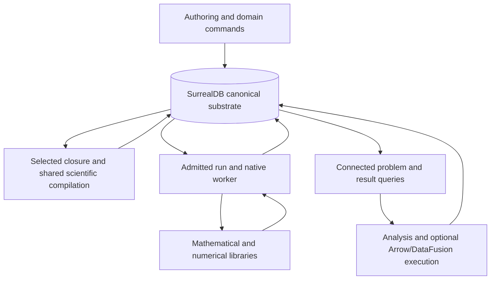

# SurrealDB as a unified simulation substrate

**Follow-up owner:** [Plan 28](../../plans/28-surrealdb-unified-substrate.md) records the
maintainer's accepted RC01–RC10, clean rebuild and native-query/Arrow decisions, execution
sequence and current US/EF dispositions. Those decisions supersede this review's preserving
legacy import and optional SQL transition assumptions. The review below retains its original
scope and evidence.

**Date:** 2026-10-05\
**Tier / purpose:** Comprehensive design review / target\
**Boundary:** Canonical problem definitions, revision and dependency selection, compilation
descriptions, operational execution, scientific results, and connected analysis before and
after simulation. Numerical libraries and language boundaries are included where their
consumed contracts constrain that substrate.\
**Standard:** Core 3.4, Efficient Architecture Heuristics 1.0, Process Simulator 1.5, and the
[pse-arrow binding](../design_principles/binding/pse-arrow.md).\
**Reviewer:** Fresh independent design reviewer, applying the shared worker and
design-reviewer contracts. The reviewer independently inspected relevant owners and decisive
source evidence, then considered supporting investigations supplied by the coordinator and
library researcher. The coordinator inspected decisive evidence and integrated publication.\
**Baseline:** HEAD `6498b013e579ec8039573200c92282eb8715b52e`, with concurrent numerical,
Python and qualification-document work preserved. This is a source/design assessment, not
qualification of the concurrent changes.\
**Decision:** **Accept the specified unified target at Proposed design level.** Adopt
SurrealDB as the canonical durable substrate described below. The current implementation
remains **Revise** against that target and retains the earlier execution-fit defects. No
implementation acceptance, speedup, capacity claim or new scientific qualification follows.

## Assessment and recommendation

A unified SurrealDB architecture is a credible preferred target for this simulator. Its
strongest benefit comes from the complete operation: an authored revision supplies selected
scientific inputs; those inputs produce a versioned compilation description; a run records
the configuration and start actually used; completion attaches truthful scientific results
and diagnostics; subsequent queries follow the same identities back to the model and forward
into further analysis.

That is a more substantial change than storing authored documents in another database. It
can replace the PostgreSQL operational/catalog composition, mandatory Delta result
publication, selected source relation conversions, and the cross-resource recovery protocol
with operations over one canonical system. Those removals compound: fewer representations
need reconciliation, and authoring, simulation and analysis can share revision selection,
provenance and visibility rules.

**Select this full target without requiring EF01–08 to be locally repaired first.** The
earlier review correctly identified concrete avoidable work, but its recommendation to
prioritize those corrections over consolidation answered a narrower question. It did not
adequately evaluate the now-confirmed requirement that normal runs automatically preserve
their problem revision, configuration, results and diagnostic provenance, or the connected
pre/post-simulation operations that make unified storage valuable.

The selected design does not require every operation to execute inside the database.
SurrealDB owns canonical records, relationships, durable selections and supported database
operations. Shared scientific libraries own contextual physical checking and finite
specialization; Symbolica/Numerica, sparse libraries and native solvers retain their
mathematical responsibilities. These operations consume selected immutable database inputs
and produce attributed products recorded in the same canonical system.

This is one durable authority with operation-specific execution. An ephemeral Arrow
projection, a local Salsa memo, a sparse incidence graph or a native evaluator is not another
editable model authority.

Acceptance applies to the concrete contracts in this review. Merely adding SurrealDB beneath
unchanged whole-package loading, repeated admission, whole-study dispatch and explicit
publication would not implement the accepted target.

## Scope, drivers and evidence

The confirmed default is durable execution: retain problem revisions, selected configuration,
scientific results and diagnostic provenance automatically. Checkpoints, trial vectors and
other intermediate material are selective, except where scientific interpretation requires
retained evidence such as staged initialization outcomes or recycle convergence history.

The target serves local interactive authoring and concurrent studies first, with a credible
extension to shared services. It includes square simulation, optimization, dynamics and
fitting through their existing scientific meanings. Relevant variation includes value-only
edits, structural edits, larger or skewed dependency closures, many study occurrences, long
trajectories, concurrent workers and interruption around acceptance or completion.

No fixed capacity SLA or measured database ranking is asserted.

The supporting investigations are:

- [Integration boundaries and replacement opportunities](../evidence/surrealdb-unified-substrate-2026-10-05/integration-and-removal.md).
- [Integrated SurrealDB capabilities](../evidence/surrealdb-unified-substrate-2026-10-05/integrated-capabilities.md).
- The [earlier review](design_review_execution-efficiency-and-surrealdb_2026-10-05.md) and its bounded source/build investigations.

**Interface-checked:** relevant runtime authoring, compiler, operational, publication,
inspection and generation owners; SurrealDB 3.3.0 source and captured contracts; current
official documentation through Context7.

**Tested, historical library scope:** named SB/SX probes recorded by the shared library skill
on 2026-10-05. These establish their small mechanisms on the named engines and transports.
They are not tests of this simulator.

**Not run:** product compilation, numerical tests, integrated qualification, database
migration, crash probes and performance measurements. Existing scientific qualification
retains its original scope and exclusions.

## Selected architecture and ownership

| Responsibility | Owned meaning and consumed contract | State and effects |
|---|---|---|
| Scientific declarations | Physical concepts, definitions, bindings, contributions, function contracts and source attribution | Canonical authored payload versions; one admitted update path |
| Revision and selection | Exact problem revision, membership, lexical scope and interpretation | Database membership/indexes, head transitions and selection functions |
| Scientific compilation | Physical inference, finite specialization, guards, structural analysis and complete dependencies | Pure/shared semantic operations over selected inputs; attributed immutable descriptions |
| Mathematical integration | Library expression preparation, derivatives and operation-shaped numerical products | Immutable reusable products; process/library handles remain outside canonical records |
| Execution policy | Problem class, eligibility, starts, stages, cancellation, usable outcomes and study dependencies | One semantic policy, applied with database fences |
| Native execution | Iteration, globalization, factors and native model management | Attempt-owned mutable state, outside database transactions |
| Completion and results | Candidate assessment, physical values, qualification, partiality and diagnostics | Private result batches followed by one fenced visibility transition |
| Query and analysis | Selected problems/runs, connected explanation and explicitly defined derived analyses | Database-native selection/reduction; optional ephemeral bulk execution; derived results linked back to inputs |

The application composition owns installation, credentials, supervision and resource
coordination. Scientific owners do not acquire database clients or database value types
merely because their data is durable.

The registry remains a viable single source for consumed shapes and vocabularies. Generate
the database structural realization and codecs from that authority, rather than independently
maintaining scientific DDL and Rust/Python declarations. A later decision to move declaration
authority would require its own complete ownership assessment; it is not necessary for this
pivot.

### Revisions and incremental authoring

Select a linear revision sequence per problem with an expected-head compare-and-set.
Mergeable authoring branches are not a present requirement.

Canonical entity payload versions are immutable. Indexed membership intervals bind a logical
entity or scoped name to a payload version over its revision range. An edit closes affected
prior intervals, inserts changed memberships and advances the problem head in one
transaction. A separate indexed active-membership route serves current inventory.

This avoids full model copies per edit and application replay of an ancestral bundle chain.
Concurrent runs pin old revisions and exact selected payloads; separate problems can change
independently.

Historical whole-inventory selection may examine retained membership history. That is an
explicit tradeoff, not an assertion that interval predicates make history free. Selected
entity/name lookup, current inventory and historical inventory have different access paths.
If long retained histories make the latter operationally important, inspect its actual plan
before adding specialized snapshot machinery.

Do not introduce a bespoke persistent manifest tree merely to avoid every possible historical
scan. Native tables and indexes supply a simpler sufficient starting route.

Source bytes and spans remain available where needed for authored fidelity and diagnostics.
File/document import and export are boundary operations; files and database objects are not
independently writable canonical definitions.

### Selected compilation, rather than unchanged whole-package hydration

Compilation receives the semantically complete selected closure and its required context.
Database queries/functions can own indexed name resolution, declared reference expansion,
structural selection, reverse dependencies and affected-product selection.

Shared scientific kernels execute the invalidated contextual checks and finite specialization
that database structural types do not provide. They must report actual consumed dependencies,
including:

- Positive entity and field selections.
- Missing-name or missing-binding dependencies.
- Finite membership and namespace scopes.
- Deletions and changed interpretation.
- Provider, compiler, library and configuration identities.

A scope or name-bucket guard record supplies a concrete conflict/dependency key when a
decision depends on collection membership or absence. All relevant mutators update that
guard. Ordinary graph reachability does not discover these semantic dependencies automatically.

Whole-package checking remains appropriate for genuinely global guarantees. It must not
remain the compulsory preparation unit for every narrow query, edit or run merely because
the previous API expected a complete package.

Store qualified compilation descriptions and reusable derived facts with their exact inputs
and interpretation. These include selected bindings, demand, class, structural decisions,
guards, source mappings and compatible product descriptions. Native pointers, Salsa handles
and mutable solver memory are not portable compilation descriptions.

Salsa may remain a local accelerator where its dependency tracking and backdating are useful.
Persisted products must still identify complete dependencies independently of resident memo
retention. Database views and LIVE notifications are not substitutes for that contract.

### Durable runs and coherent completion

Accepting an ordinary run durably records its selected revision, configuration, interpretation
and run identity before execution effects. Unreachable durable storage is an infrastructure
failure, not a silent switch to ephemeral execution. Explicit store-free use remains
available for tests and appropriate library calls.

Run, attempt, study occurrence and result identities stay distinct. Equal case bindings do
not merge authored occurrences.

Discover a claim candidate using the required ordering, then acquire the named candidate
through a short transaction checking its state and generation. Record-level conflict checks,
cancellation authority and lease generation govern ownership. Retry the complete transaction
after a relevant conflict; do not translate PostgreSQL `SKIP LOCKED` syntax mechanically or
claim globally serializable predicates.

Native preparation and solving occur outside those transactions. Mutable native state belongs
to one attempt. Cancellation keeps resources charged until native work drains.

Small completed outcomes can be committed directly. Larger tables and diagnostic payloads
are written in bounded private batches under an attempt/generation identity. Referenced chunks
become immutable. One terminal transaction verifies the current worker fence and complete
admitted result set, then seals the result selection and terminal outcome together.

A failed, cancelled or partial run is retained with that meaning. Persistence does not grant
solution usability. A successful-looking native termination cannot bypass original-model
assessment.

A crash before sealing leaves unfinished or staged state. A crash after sealing leaves the
same complete outcome. A lost acknowledgement is settled by the immutable run/operation
identity before retrying an effect. This still requires application recovery, but it no longer
requires reconciling canonical result files with a separate operational catalog.

### Scientific tables and connected analysis

Result identity includes revision, run, output and the case/time/component coordinates
relevant to that result. Quantity interpretation, qualification and unavailable reasons
accompany the values.

Choose row records or homogeneous blocks according to the operations. Time-window and
coordinate filtering need indexed keys; dense native consumption may justify contiguous array
payloads. Neither an opaque whole-run blob nor a graph vertex and edge for every scalar is
the default.

Exact scientific payloads use one declared lossless codec. Where canonical floating identity
requires it, retain IEEE-754 bits and expose a derived finite numeric projection for database
predicates and aggregates. Checked full-width integer and identity encodings prevent SDK
range coercion. Missing scientific values remain distinct from `NONE`, `NULL`, deleted fields,
absent records and numeric sentinels.

Representative first-class operations are:

1. Select compatible definitions, property methods and prior qualified states; produce an
   attributed case binding for a new run.
2. Retrieve a selected run's output without reconstructing its package or reopening a
   publication manifest.
3. Compare an output across runs, then traverse to the varied inputs, provider parameters
   and model definitions that each run actually consumed.
4. Persist a derived analysis with its source run/revision selection, method, configuration
   and validity conditions.

A query used to select simulation inputs records its resolved inputs and query/method
interpretation. Reexecuting mutable query text later is not reproduction of the original run.

Defaults are explicit selection policies. A default “latest terminal run” includes failure
and partiality rather than silently substituting an older successful result. “Latest usable
solution” is a different named selector. Ordering uses recorded run identity/order, not
ambiguous wall-clock coincidence.

Structural dependency edges, evaluated sensitivity evidence, flowsheet topology and physical
causal claims remain different relationships. A sensitivity at one numerical state does not
turn a structural dependency into a causal conclusion. SCC or other graph analyses use
declared projections and retain their interpretation.

SurrealDB-native projection, filtering, grouping and connected selection are the primary
route. Retain an explicit ephemeral Arrow/DataFusion route for supported SQL or global
analytical operations that benefit from columnar execution. Those projections consume exact
selected canonical records and cannot edit them. No canonical Delta store is required to
retain that computation or interchange capability.

SurrealQL is not syntax-compatible with arbitrary current DataFusion SQL. Retain or replace
that public capability deliberately.

### Integrated interfaces and extension

The same canonical selections can serve authoring tools, Python analysis, user interfaces
and agents. Versioned database functions can expose complete domain operations instead of
requiring each client to reproduce graph traversal and hydration. Custom APIs, configured
GraphQL and domain MCP tools can share those functions and identities. Generated CRUD is
useful infrastructure, but does not replace scientific admission or define a valid run.

Schema introspection can reduce interface duplication; the inspected tooling does not
establish automatic generation of every required scientific Rust/Python contract. Derive
needed interfaces from the one declaration authority rather than introducing independently
maintained client schemas.

Full-text and vector discovery can connect authored knowledge, examples and stored outcomes.
Exact physical eligibility remains distinct from heuristic relevance. LIVE notifications can
update run observers and authoring clients, with explicit reconnect/cleanup and authoritative
rereads. These integrations can replace separate application plumbing while extending the
same data system; they need not be built as unrelated services or new canonical stores.

The [capability evidence](../evidence/surrealdb-unified-substrate-2026-10-05/integrated-capabilities.md)
records the version-specific API, authorization, streaming and tooling limits. Integration
value comes from composed domain operations, not merely enabling every database feature.

## Scientific preservation constraints

The pivot preserves physical and numerical meaning, rather than the mechanisms currently
carrying it.

| Element | Dimension/unit and basis | Convention and validity | Governing authority |
|---|---|---|---|
| Flow and composition | Declared mass/molar/volumetric basis, dimensions and finite index shape | Component/phase membership and admissible composition | Authored physical definitions and contextual inference |
| Pressure and temperature | Complete quantity type | Gauge/absolute and point/difference distinctions; provider envelope | Quantity and property contracts |
| Energy, entropy and contributions | Declared units and basis | Reference state and signed transfer/conservation roles | Authored contributions and independent closure checks |
| Parameters and observations | Physical type, subject and uncertainty meaning | Versioned data, applicability and fitting assumptions | Selected revision and observation/method declarations |
| Derivatives and sensitivities | Differentiated quantity and coordinate meaning | Order, branch/active-set validity and evidence scope | Model/provider derivative contracts and assessment |
| Results and diagnostics | Semantic coordinates and physical interpretation | Qualification, partiality, unavailable reasons and provenance | Completion's single interpretation |

**Well-posedness:** variable roles remain explicit. Selected formulations undergo
mode-appropriate degree-of-freedom and structural analysis before a solver is admitted.
Structural rejection names authored elements. Topology, incidence and solve order remain
separate. Structural matching is not a numerical-rank or convergence proof.

| Numerical stage | Formulation and derivatives | Scaling/class | Outcome and assessment |
|---|---|---|---|
| Selected specialization | Preserve original guards, branches, finite scope and contribution meaning | Derive structure and capability requirements | Attributed admission or refusal |
| Library preparation | Library-owned algebra and required derivative order; provider limitations retained | Prepare compatible sparse/evaluator layouts | No fallback that changes admitted meaning |
| Native execution | Declared initialization/recycle/dynamic policy | Class-specific solver and explicit effective settings | Typed native status; limits and cancellation retained |
| Completion | Original-model evaluation, bounds, domains and closure | Scaled/unscaled tolerance and accuracy context | Candidate use decided once; partial/failure cannot become solution |
| Durable lowering | Lossless codec and explicit projections | Physical identities and coordinates preserved | Store and query the assessment without reinterpreting it |

No unit or property model is numerically modified by this review. Existing conformance and
IDAES reference evidence remain at their existing qualification owners. No universal parity
claim is introduced.

## Representative journeys

| ID | Stimulus | Required response and locality |
|---|---|---|
| S01 | Value-only edit and re-solve | New immutable binding/revision; compatible structure survives; actual start is recorded |
| S02 | Structural edit, deletion or newly defined name | Relevant closure and absence/membership dependencies invalidate; unrelated products remain usable |
| S03 | Concurrent study with failures, retries and warm starts | Dependency-scoped or coherent batched dispatch; fenced claims; distinct occurrences and usable-predecessor rules |
| S04 | Pre/post-simulation query and derived analysis | One exact canonical selection; retain physical interpretation and method lineage |
| S05 | Add a unit/property declaration or compose another workflow | Existing semantic family gains data/bindings; common admission and assessment are reused |
| S06 | Replace provider, solver, protocol or database version | Integration owner absorbs mechanics; changed consumed capability/interpretation is explicit |
| S07 | Longer trajectories, skewed closures or interrupted completion | Operation-shaped batches, backpressure, honest partiality, short commits and bounded retry scope |
| S08 | Test policy or physical admission locally | Supply required typed inputs/capabilities without starting unrelated storage or solvers |

A new mathematical primitive or physical concept can legitimately require compiler/adapter
work. Unification does not make all scientific extensions database-only schema changes.

## Reassessment of EF01–08

The earlier diagnoses retain their original evidence. This review revises their relationship
to the selected target; it does not declare them implemented.

| Finding | Reassessment and target disposition |
|---|---|
| **EF01: ancestral bundle retention** | **Diagnosis upheld.** `BundleOwner::_parent` retains complete predecessors independently of current consumers. Canonical immutable payloads and direct revision membership can replace that in-memory ownership chain. Durable historical retention is intentional; active compiler memory follows selected dependencies. Do not recreate the defect as ancestry replay or full graph copies. |
| **EF02: admission loses native owner** | **Diagnosis upheld.** `FieldCheckedBatch` retains storage/contract but not the actual validation-context owner, and `validate_context` readmits batches. The target changes the admission unit: immutable selected values and their actual interpretation retain established validity. Cross-process reuse needs reproducible interpretation and a controlled immutable update path; persisting a “validated” flag is insufficient. Imports, changed context and new numerical states still require their corresponding checks. |
| **EF03: whole-study work per dispatch** | **Diagnosis upheld.** `Studies::admit_dispatch` loads the complete study and derives all actions for one occurrence. Native dependency/readiness selection can replace that operation, with one policy authority and exact fences. Moving the same transition algorithm unchanged into a database retains the amplification. |
| **EF04: heavy foundation build closure** | **Diagnosis upheld; remedy broadens.** Deleting migrated PostgreSQL query/COPY and mandatory Delta consumers can remove dependencies and generated machinery rather than merely narrow existing membership. Place the remote client at the actual substrate owner; do not add the embedded core to a broad foundation closure. Remaining feature stabilization must serve actual consumers. |
| **EF05: broad compiled provenance** | **Diagnosis upheld.** `pse-buildinfo` hashes the whole source tree and shared consumers embed those identities; artifact requests include global identities. Store whole-build attestation at the outer run/executable boundary while relevant implementation identities govern product reuse. Complete dirty-source provenance remains required. Persistent compilation descriptions introduce a new reuse opportunity; the previous process-local cache did not already provide cross-build reuse. |
| **EF06: unrelated native setup** | **Diagnosis upheld.** `bench-builds` sources both native environments before target selection. A database pivot does not automatically correct this. Capability-aware setup belongs in the target's remaining tooling; composite/native qualification retains its required environment preparation. No quantitative contribution was established. |
| **EF07: no-op generation writes** | **Diagnosis upheld; some work can disappear.** Retire outputs used only by removed persistence representations. Remaining generators preserve unchanged bytes/mtimes and stale-output deletion. Typed Python boundaries and native ABI bindings do not disappear because database schema exists. |
| **EF08: dense formal setup before narrow demand** | **Earlier uncertainty retained.** Source constructs full-slot parameter/maps or reachability before completing selected demand. Database closure selection can remove irrelevant source hydration and repeated derivation, but cannot by itself remove dense native evaluator setup. Determine the consumed evaluator signature before choosing compaction. This is an adjacent numerical-preparation question, not a reason to withhold the durable substrate pivot. |

The findings remain useful migration acceptance checks: old mechanisms must actually
disappear, and repeated work must not merely move behind a different driver.

The earlier blanket recommendation against wholesale consolidation is **replaced** for the
confirmed target. Correction of the existing stack remains a credible alternative, but is
no longer the selected direction.

### Other preparation and execution opportunities

The earlier evidence also identified whole ephemeral studies preparing their points before
scheduling. Preserve required study-wide admission before effects, but separate it from
expensive preparation of ready attempts. Persisted bindings, shared structural products and
dependency queries can support that separation. Compatible cases can share preparation;
neither persistence nor one bulk API proves that repeated work has disappeared.

Salsa eviction or workspace rotation becomes an accelerator-retention decision rather than
loss of canonical problem/result history. Reopening a persisted product still requires its
complete compatibility contract; persistence is not permission to reuse obsolete native state.

Symbolica compiled, batch or SIMD evaluation remains a separate conditional opportunity for
repeated numerical work. The existing optimized multi-output evaluators already reuse
preparation. A database-owned product description can support compatible reuse, but does
not itself enable JIT or replace dense evaluator setup. Compare cold preparation and warm
execution together before claiming a benefit; the earlier runtime evidence records the
library-version and feature qualifications.

## New findings

These findings identify current target gaps and concrete unsafe integration routes. The
selected architecture supplies their proposed corrections; implementation closure remains
with a subsequent owning plan.

### US01 — Separate canonical persistence lifecycles obstruct the complete connected operation

**AP-01/AP-03/AP-07; G9; S04/S07.**

**Interface-checked:** `workflow/publication.rs` registers a PostgreSQL intent, writes
immutable Delta members and conditionally advances the catalog. Inspection depends on an
engine session and selected result/publication providers.

These mechanisms protect real coherence obligations, but require source, run and result
questions to cross catalog and representation boundaries. The confirmed unified target does
not need that cross-resource composition for canonical database content.

**Proposed correction:** canonical revision, run, result selection and provenance reside in
one database. Stage large payloads privately and seal visibility with the terminal outcome.
Query selected runs directly.

**Verification:** migrated consumers need no Delta member manifest or PostgreSQL publication
ticket to answer the connected operation; interruption cannot expose a terminal success with
incomplete results. External exports retain only their own justified protocol.

### US02 — Ordinary run durability does not satisfy automatic scientific result retention

**AP-04/AP-05; DP-18/21; S01/S04/S07.**

**Interface-checked:** a durable runtime already records attempts, completion/progress,
incumbents and reusable seeds. Durable studies already retain source bundles and automatically
write point results before final publication. Ordinary result tables still require explicit
`prepare_publication` and commit. Python `Runtime.query` consumes optional `RunResult` or
`Publication`, rather than selecting canonical ordinary results directly by run ID.

This is a gap against the new default, not a claim that current durability is absent or
incorrectly implemented.

**Proposed correction:** ordinary accepted runs retain their selected revision/configuration
and seal all promised scientific results/diagnostics automatically. Optional checkpoints
remain distinct.

**Verification:** after process exit, a normal completed, failed or partial run is queryable
by its recorded identity without a caller's publication step or retained in-memory result.

### US03 — Native database value conversion is not the scientific codec

**AP-02/AP-05; G2/G3/G6; S04/S06.**

**Tested, historical library scope:** the value oracle reports signed-zero loss on
HTTP/WebSocket and unsigned binding wrap above signed range; `NONE`, `NULL` and typed record
IDs have distinct behavior. Structural coercion also differs from strict native construction.

Directly replacing existing codecs with default database values can alter canonical identity
or scientific absence meaning.

**Proposed correction:** one lossless scientific codec, checked ranges and typed identity
domains; derived numeric projections remain mechanically tied to exact payloads.

**Verification:** round trips cover declared scalar/compound kinds, signed zero, boundaries,
absence and identity domains on the selected bulk/protocol route. Physical metadata and
qualification survive projected reads.

### US04 — Snapshot transactions alone do not protect semantic decisions

**AP-05; DP-05/09/19; G5/G6; S02/S03/S07.**

**Interface-checked source and historical probes:** native write skew is permitted without
registered decision records. `FOR UPDATE` covers named record keys, including named absent
keys, rather than arbitrary predicate ranges.

A naive claim, edit, invalidation or retention transition can commit after a relevant
decision premise changed.

**Proposed correction:** register exact head, binding/scope guard, run generation and other
relevant decision records; update membership guards on all relevant mutations. Native work
remains outside transactions. Retries reread and recompute the complete protected decision.

**Verification:** competing claims, stale workers, concurrent name insertion/deletion and
completion/cancellation races preserve the semantic invariant. A test of same-record writes
alone is insufficient.

### US05 — Unification requires a different compilation input contract

**AP-03/AP-04/AP-07; G6/G9; S01/S02/S03.**

**Interface-checked:** current authoring/document conversion builds typed package inputs;
the compiler performs contextual checking, specialization and tracked derivation. Database
structural types, views and traversal do not supply those scientific operations automatically.

A replacement that loads all database content into the unchanged whole-package path retains
broad hydration/admission. A replacement that treats graph closure or views as complete
inference loses semantic obligations.

**Proposed correction:** selected complete closure/context, explicit positive and negative
dependencies, invalidated shared scientific kernels, and persisted qualified descriptions.
Native functions own fitting structural/query operations; mathematical libraries retain
their complete capabilities.

**Verification:** unrelated edits leave relevant products substitutable; deletion,
missing-name resolution, finite membership changes and interpretation changes invalidate
correctly. Incremental results agree with clean scientific recomputation under the same
selected inputs. No second scientific interpreter is introduced.

US01/US02 establish the functional reason for consolidation. US03/US04 constrain safe
storage adoption. US05 determines whether the pivot also removes preparation work. None is
closed merely by changing the client library.

## Library fit, deployment and alternatives

The [integrated capability investigation](../evidence/surrealdb-unified-substrate-2026-10-05/integrated-capabilities.md)
establishes a substantive native route: typed nested records, identity-bearing relations,
indexes, functions, bulk writes, record conflict checks, table/graph queries and result
streaming.

Select a supervised local server with a thin Rust SDK client as the initial deployment.
This accommodates multiple worker processes, isolates engine builds and resources, and
extends naturally to a shared service. Use explicit gRPC support for large streamed query
results; it is outside the SDK's default remote feature set.

The independently inspected 3.3 SDK exposes `stream_items`; the gRPC engine forwards
server-produced rows. Default engine routes may replay a completed buffered response. The
selected adapter must handle statement-end failure and provisional rows: an emitted prefix
is not a complete successful query. Derived durable analyses seal only after successful
completion.

External sorting exists through `TEMPFILES` with the storage feature. This does not establish
universal aggregation spill. Group state and broad hydration can remain material. Native
graph bitmap semijoin optimization covers specific indexed shapes, not arbitrary multi-hop
traversal. Preserve predicates/projection and inspect representative plans.

Choose a persistent backend and explicit durability configuration during implementation.
Clean reopen/export probes do not establish power-loss recovery. That is an implementation
qualification obligation, not a missing architectural route.

| Alternative | Complete benefit and retained cost | Judgment |
|---|---|---|
| **Unified SurrealDB target** | One canonical authoring/run/result/provenance space; native connected operations; removes adopted PostgreSQL/Delta composition. Retains scientific kernels, typed codec and domain recovery. | **Selected, Proposed design accepted.** |
| Correct current PostgreSQL/Delta composition | Can repair EF findings and retains mature relational/columnar capabilities. Automatic durability and connected queries still require explicit new composition. | Viable fallback; does not provide the same machinery removal. |
| SurrealDB graph projection beside canonical stores | Adds graph-native inspection while preserving current persistence. | Requires a projection lifecycle and leaves the principal duplication of mechanisms; justified only by a narrower target or rejected authority changes. |
| Canonical SurrealDB with ephemeral Arrow/DataFusion execution | Preserves selected SQL/columnar capabilities without another durable authority. | Included where it serves an actual analytical contract. |
| Fully database-executed scientific compiler | Can move fitting finite structural operations and qualified shared kernels near data. | Eligible, but full inference/WASM/native-library route is not established; not selected as a blanket replacement. |
| Neo4j canonical graph target | Mature Cypher/GDS strengths for graph-dominant operations. Nested scientific documents, table/query and Rust integration require their own complete design. | Technically eligible; less direct fit to this particular unified candidate. |
| Simpler local typed store and native compiler | Lower service machinery for a narrower application. Must supply connected query/interface and concurrency capabilities elsewhere. | Credible simpler alternative if those requirements are reduced. |

No candidate is excluded on license grounds.

### Machinery removed and retained

**Proposed removals, after callers migrate:** PostgreSQL operational/catalog client, pool,
COPY and generated query machinery; mandatory Delta scientific-result members/manifests;
cross-store publication settlement and member-prefix reconciliation; persistence-only
source/row conversions and generated surfaces.

**Retained responsibilities:** semantic identities, immutable interpretation, claim/lease
fences, cancellation/drain, coherent visibility, uncertain acknowledgements, staged cleanup,
schema evolution, backup/restore and explicit retention.

Some reader protection remains useful for paged queries or exports while deletion is
possible. Do not claim that moving storage removes every reader pin or lease. The external
Delta version/protection protocol can disappear; the underlying need to preserve a selected
live read must still be satisfied.

Typed Python configuration/result contracts, native ABI bindings, mathematical libraries,
compatible evaluator/sparse products and operation-shaped Arrow outputs remain. Optional
exports are derived copies, not canonical stores.

Build savings remain unmeasured. A remote client added to the unchanged old dependency graph
would not deliver the stated removals.

## Foundation and gate judgments

These judgments apply to the specified **Proposed target**, not to its unimplemented
realization.

| Foundation | Verdict | Basis |
|---|---|---|
| AP-01 Separation | **Satisfied** | Canonical persistence is cohesive; scientific policy, numerical execution and representation mechanics retain distinct owners |
| AP-02 Contracts | **Satisfied** | Typed selections, codecs, effects and failure semantics define consumed capabilities; database internals remain in the integration owner |
| AP-03 Composition | **Satisfied** | Authoring, studies, runs and derived analysis compose over shared revision/product/result contracts |
| AP-04 Model and authority | **Satisfied** | Authored physical meaning governs checking, formulation and outcome interpretation; projections are attributed and nonauthoritative |
| AP-05 Explicit structure | **Satisfied** | Membership, absence, interpretation, generations, visibility, partiality and retention have enforceable boundaries |
| AP-06 Local reasoning | **Satisfied** | Semantic policy/kernels remain locally testable; store integration tests require their actual substrate without unrelated numerical startup |
| AP-07 Execution fit | **Satisfied at Proposed scope** | Direct selected access, incremental membership, reusable descriptions, native batches and short commits provide a credible route; historical inventory and global analytics retain explicit costs |

| Gate | Judgment and evidence boundary |
|---|---|
| G1 Authority | **Pass at design level:** one canonical authored update path; derived products/projections identify source and interpretation |
| G2 Fidelity | **Pass at design level:** explicit lossless codec, physical metadata and historical contract treatment |
| G3 Validity | **Pass at design level:** structural database enforcement plus scoped scientific admission; imports cannot mint admitted status implicitly |
| G4 Hidden behavior | **Pass at design level:** query, compilation, execution and persistence effects are explicit; function/schema interpretation is versioned |
| G5 Recovery | **Pass at design level:** exact decision fences, private batches and atomic sealing provide a supported route; implementation recovery remains untested |
| G6 Reuse | **Pass at design level:** complete positive/negative/membership and implementation dependencies; no reuse of native pointers as durable products |
| G7 Claims | **Pass:** native route exists; unsupported full compiler/analytics and performance claims are not made |
| G8 Leverage | **Pass:** database operators and established mathematical/numerical libraries own fitting generic machinery |
| G9 Fitness | **Pass for the specified target:** all foundations satisfied at the stated design evidence level |
| PS-G1 Physical consistency | **Pass at design level:** physical types, provider envelopes and original contribution closure remain governing |
| PS-G2 Well-posedness | **Pass at design level:** selected structure and class admission precede solving; graph meanings remain distinct |
| PS-G3 Numerical integrity | **Pass at design level:** original-model assessment and typed outcomes govern durable usability |

The current architecture does not inherit these passes from a proposed correction. Its
retained EF01–07 mechanisms still require revision, and EF08 retains its narrower unresolved
numerical-preparation question.

## Verification and acceptance limits

| Claim or risk | Existing evidence | Implementation settling evidence |
|---|---|---|
| Compounded removal | **Interface-checked** current owners and supported database route; benefits **Proposed** | Migrated complete journeys and deletion of obsolete consumers |
| Revision/negative dependencies | **Interface-checked** interval/index and named-key conflict route | Selected lookup plans; insertion/deletion and incremental-versus-clean cases |
| Scientific fidelity | **Tested, historical** narrow library value behavior; codec **Proposed** | Exact compound/bulk/protocol round trips and scientific metadata checks |
| Concurrent completion | **Interface-checked** transaction/conflict route; protocol **Proposed** | Claim, stale-worker, cancellation and uncertain-commit cases |
| Large table queries | **Interface-checked** gRPC streaming, selected indexes and external sort | Representative connected table plans; late failure and backpressure behavior |
| Numerical preservation | Existing scoped scientific evidence only | Relevant existing conformance/journeys after integration |
| Speed, memory and build savings | **Not measured** | Matched complete-operation measurements where quantitative claims are desired |
| Durable-data migration | **Proposed** preservation route | Inventory, semantic reconciliation, interrupted import and restored reads |

No new scientific test, benchmark or crash probe was performed for this review. Missing
implementation qualification does not defeat acceptance of a concrete Proposed design; it
prevents claiming the implementation is qualified.

## Rule impacts

These are recommendations for subsequent operator confirmation. This review does not change
accepted rules.

| Anchor | Exact current source and rule | Change and dependent recommendation | If retained |
|---|---|---|---|
| RC01 | **D10; blueprint §20/§20.6; ADR-0114:** PostgreSQL owns changing operational/catalog state; Delta owns published members | Replace those canonical owners with SurrealDB for adopted problem/run/result content; US01/US02 and the full pivot depend on it | Retain the split substrate; SurrealDB can only be a justified derived query owner |
| RC02 | **Blueprint §19, §20 and §21.1; `workflow/durable.rs`, `workflow/publication.rs`; `Runtime(..., store=None)`:** durability class and ordinary explicit publication | Make ordinary application runs automatically durable for revisions/configuration/results/diagnostics, with explicit ephemeral opt-in; US02 | Preserve existing caller publication responsibility; cannot claim the confirmed default |
| RC03 | **D1; blueprint §4.1/§4.2 and §22.1–§22.2:** registry-owned relation/document shapes and generated Arrow/PostgreSQL/public surfaces | Retain single declaration authority; change storage lowerings and authoring selection to canonical versions. Retire persistence-only outputs; US01/US03/US05 | Keep current generated shapes at adapters; some conversion/codegen machinery remains, but unification can still proceed |
| RC04 | **D10; blueprint §14.3–§14.4 and §20.4:** Rust finite compilation, Salsa dependency tracking and nonpersisted semantic reuse | Database owns selected structural/query operations and durable descriptions/dependencies; shared kernels perform invalidated scientific work; Salsa is an accelerator. US05 | Durable descriptions may be recipes/inspection only; retain existing finite compiler placement, without claiming database-owned incrementality |
| RC05 | **Blueprint §5.3/§20.4; D14; `pse-buildinfo/build.rs` and `artifact_requests`:** source/build identities in prepared reuse | Separate whole-build attestation from complete relevant implementation/product dependencies; EF05 and durable product reuse | Keep conservative keys, move attestation construction outward; narrower cross-build reuse is not claimed |
| RC06 | **ADR-0122; `.config/hakari.toml`; AGENTS.md “one feature set per dependency”** | Narrow membership to actual post-migration consumers; isolate client/engine closure while preserving one type universe and justified unification; EF04 | Broad cold-build closure remains; consolidation alone does not close EF04 |
| RC07 | **`study_policy.rs` transition contract; `Studies::admit_dispatch`; `queries/jobs.sql` ordered `SKIP LOCKED` claims** | Dependency-scoped/batched policy and named candidate generation/conflict claims; preserve occurrences, cancellation and predecessor/start meaning; EF03/US04 | Retain complete-snapshot policy through coherent batches; no direct queue translation or per-point efficiency claim |
| RC08 | **Blueprint §21.1; Python `Runtime.query(sql, result=, publication=)`; `TableReader::query`** | Add exact problem/revision/run selection and native connected operations; preserve supported SQL through explicit ephemeral projection or revise the API; S04 | Maintain the SQL capability and adapter; SurrealQL is not drop-in SQL |
| RC09 | **Blueprint §20.4–§20.6; ADR-0114:** Delta versions, publication windows, intents, leases and maintenance epochs | Replace cross-store protections with run/result visibility, database retention and necessary read protection; preserve historical data and exports; US01/US04 | Keep existing catalog/Delta recovery, so those removals cannot be counted |
| RC10 | **`justfile::bench-builds`; `xtask::codegen::write_tree`** | Capability-aware setup, retirement of obsolete generation and unchanged-output preservation; EF06/EF07 | Tooling amplification remains independent of the database selection |

D5's complete physical typing, D6's library-owned mathematics, D11's attempt-owned native
state and D13's immutable model/overlay distinction are preservation constraints, not rules
to discard. Native bindings and typed Python contracts retain their actual purposes.

## Durable-data preservation and transition

Do not import the disposable-data lifecycle of another project.

Inventory retained problems/source bundles, publications and exact members, operational
runs, studies, starts, diagnostics and live reader/export obligations. Read each under its
original contract. Preserve original identities, hashes and interpretation; new identity
frames are versioned rather than substituted into historical records.

The migration importer consumes coherent legacy selections and writes canonical database
objects/result sets with recorded mappings. Structural import alone is insufficient:
database imports can bypass ordinary checks or view maintenance. Reconcile referential,
scientific-codec and selected-result meaning before marking migrated content ready.

Freeze legacy writes at cutover, settle outstanding publication/attempt obligations, and
advance the canonical authority once. There is no normal dual-write period with two editable
truths. A read-only legacy archive or bounded migration reader is not a second production
authority.

Retire old production paths after migrated journeys and preservation evidence pass. Preserve
unresolved historical obligations and required backups until reconciled; do not delete legacy
data merely because current runs work.

This transition changes ordinary behavior: completed scientific outcomes become durable
automatically. Optional external exports are produced from the canonical database. They
retain explicit format, interpretation and recovery contracts rather than silently recreating
mandatory Delta publication.

## Decision and follow-up ownership

**Behavioral/semantic adequacy:** the specified target provides explicit, supported design
routes for the applicable core and simulator gates. Implementation qualification is outstanding.

**Architectural fitness:** the specified unified target satisfies AP-01–AP-07 at Proposed
design level. The composed removal is sufficient to recommend it; no database speedup
premise is required.

**Overall decision:** **Accept the specified unified SurrealDB target as the preferred
design direction.** Do not accept an unchanged pipeline with another store beneath it, or
a blanket claim that database types/traversal replace scientific compilation.

The next consequential work is one authorized migration plan that confirms the rule impacts
and owns dispositions for US01–US05 and the retained EF references. No migration is scheduled
or authorized by this review. Preserve the earlier review's observations; the later plan
links their current disposition rather than creating another status ledger here.

Prioritize scientific fidelity and fenced visibility first, the selected compilation/query
contract next, and actual removal of migrated representations and dependencies alongside
integration. These are prerequisite relationships, not a requirement to finish local
housekeeping before selecting the pivot.

The accepted artifact is this principal review. The supporting investigations establish
bounded source/library evidence; they do not supply competing verdicts or product qualification.
