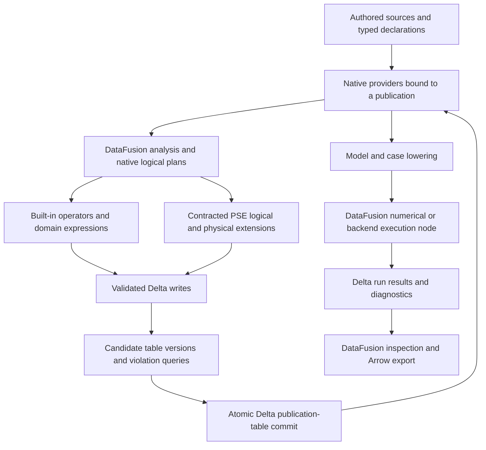

# Design review: a unified DataFusion and Delta Lake architecture

## 1. Decision and scope

**Decision: Revise. Adopt the target below as the basis of a replacement hard-pivot plan.**

The recommended architecture uses **DataFusion for the complete data-operation and
execution framework, and Delta Lake for durable tabular state and transactions**.
Native providers, expressions, plans, configuration, validation and storage operators
should do the work they already support. PSE supplies process-model meaning and the
smallest necessary extensions inside that framework.

This is a larger change than finishing Plan 06. Its custom artifact store, publication
protocol and generic operation wrappers must not become permanent foundations simply
because they are already being implemented. Replace them directly where native
DataFusion/Delta mechanisms meet the target. Delete displaced paths and data objects;
no predecessor-store migration, compatibility engine or old-versus-new qualification
campaign is required.

**Status:** Proposed target; Interface-checked library routes and source findings.
No combined PSE/Delta implementation, behavioral qualification or performance benefit
is established by this review. All seven gates remain independently unresolved for
the complete target, as detailed in §6. This is not acceptance of the current code.

**Reviewer:** Codex, for the sole maintainer. **Review date:** 2026-09-15.

### Functional guideposts

The two controlling objectives are the maintainer's complete unification target and
the ability to produce the intended process-modeling architecture. Existing policy,
API shape, crate boundaries, storage layouts and implementation investment carry no
independent preservation requirement.

The architecture must still be able to:

1. Author packages and cases; distinguish primitive declarations from derived facts;
   apply changes with stable semantic identities and precise diagnostics.
2. Derive topology, valid index domains, physical quantity types, property demands,
   method selections, contributions, equations and provenance.
3. Preserve compact indexed mathematics, ordered operands, implicit systems,
   differentiation requirements and kernel contracts until the appropriate lowering.
4. Construct structural, scaling, initialization and solver inputs; execute native
   numerical work or a generated backend; retain model/case/run separation.
5. Publish complete revisions, reopen them from a cold process, explain their origin,
   and expose typed results through Rust and Python/Arrow.
6. Distinguish invalid models, unavailable capabilities, incomplete computations,
   numerical failure, infrastructure failure and uncertain commit outcomes.

These are functional requirements, not a mandate to retain the existing MathIR
builder, pass objects, store or graph representations. Blueprint D1–D14 and §§7–20
identify the current meanings to preserve or deliberately redesign.

### Method and coverage

- Reviewed the provider capability map, charter, directive, template, Plan 06,
  provider review, relevant blueprint decisions, and live implementation paths for
  sessions, providers, policy, operation execution, storage, source commits,
  normalization, rule execution/provenance, mathematics and Python export.
- Applied the **DataFusion** and **Delta Lake** skills. Used their API indexes,
  feature and function catalogs, foreign-implementation inventory, rustdoc-derived
  references and source navigation. Provider-map guidance was treated as a capability
  map, not an instruction to build another catalog framework.
- Inspected the exact Delta source commit
  `58f07cd62bfbce3649a7e1c87c696288068ae184`, committed
  **2026-09-15 18:28:16 +02:00**, and kernel commit
  `8ba063f8f84fec222000f66d40d70911d7c79675`. This is the skill's development
  `deltalake-core 1.0.0`, not published 0.32.x. It is a fixed research pin, not a
  claim that a moving branch remains at that commit.
- Ran `just metadata` and, because that recipe omits dependencies,
  `rustup run 1.98.1 cargo metadata --locked --offline --format-version 1`.
  Both exited 0. PSE resolves DataFusion **55.1.0**, Arrow/Parquet **59.3.0** and
  object_store **0.13.2**. The Delta skill's acquisition lock resolves the same
  versions. This supports compatibility at the dependency-family level; a combined
  build and feature audit are still required.
- Context7 was initially consulted for discovery. Its Delta answer did not establish
  the development interfaces. Following the maintainer's clarification, Delta claims
  rely on the skill and exact source; no further Delta Context7 lookup was used.
  DataFusion's pinned source/map take precedence over current generic examples.
- Read upstream implementations and selected tests, but did **not execute** Delta
  behavior tests, concurrent publication experiments, numerical qualification or
  performance probes. Reading a test is Interface-checked evidence, not Tested.
- `just doctor` reported **1 environment-freshness failure, baseline 0**. The review
  did not refresh the native extension or alter the development environment.
  Earlier Plan 06 test receipts do not qualify this architecture.
- The working tree is extensively dirty. No implementation was continued for this
  review. The [evidence context](../evidence/unified-datafusion-delta-context-2026-09-15.json)
  records the inspected source hashes, exact pins, resolved features and the Delta
  DataFusion implementor inventory. Source references below describe that working
  tree, not HEAD alone.

Coverage is deliberately deeper at execution, persistence, type conversion and
publication seams than inside numerical algorithms. No audit of every equation,
cloud backend, Unity deployment or numerical kernel is implied. The native backend
is currently a declared stub (`crates/pse-backend-native/src/lib.rs:17`); future solver
capability must not be presented as already delivered functionality.

## 2. Authority and lifecycle map

### The target authority model

**Proposed:** one semantic declaration system, one native planning/execution system,
and one durable table/transaction system. Catalog objects bind those facts for an
invocation; they do not become a second editable semantic registry.

| Fact | Identity and authority | Revision boundary / update path | Native realization |
|---|---|---|---|
| Relation and operation contracts | Versioned PSE declarations; one authoritative definition per meaning | Declaration change, generated projections and explicit semantic version | Arrow/Delta schemas, DataFusion fields, native expressions, invariant queries and extension bindings |
| Authored/reference facts | Stable entity IDs in typed relations | Candidate model revision, then publication | Delta tables and snapshot-bound `DeltaScan` providers |
| Derived facts and symbolic mathematics | Typed relations with explicit support, ordered arguments and domain IDs | Derived from exact input and policy revisions | DataFusion plans; persisted Delta relations where durable value exists |
| Namespace and source binding | Actual provider plus resolved table version and selected revision slice | Immutable invocation binding; explicit refresh creates a new binding | Native catalog list, catalog, schema and table providers |
| Policy | One typed declaration of domain policy; native settings remain owned by native configuration | Effective policy fixed for the invocation | Typed `SessionConfig`/`ConfigOptions`, `TableOptions`, Delta properties, analyzer rules and executable checks |
| Coherent published revision | A publication ID and complete table-version selection vector | Atomic commit to a small Delta publication table | Pinned root version, followed by exact-version providers; no independent JSON ref |
| Attempt and execution state | Attempt/run ID, exact dependencies and explicit outcome | Private attempt, completed output, then publication where requested | DataFusion task/stream state; Delta attempt, diagnostic and result relations |
| Mutable numerical workspace | One execution's derived layout, never authoritative model facts | Allocated, used and released by the physical operator | PSE `ExecutionPlan` extension and kernel/backend adapter |
| Durable lineage, change history and inspection | Semantic source/support identities plus execution observations | Versioned facts or append-only events | Delta relations, CDF where appropriate, native plans/metrics and derived views |

Bootstrap schemas may remain versioned source declarations that generate runtime
relations. Do not make both the source registry and editable Delta contract rows
authoritative for the same contract. If runtime contract editing is introduced,
make that ownership transition explicit rather than synchronizing two masters.

### Identity and persistence

- Semantic identity remains independent of filenames, partitioning, row order,
  dictionary encoding, Delta commit version and SQL name. Rename changes a locator;
  duplication creates an identity; unchanged entities retain theirs.
- A Delta version identifies a table snapshot. A **model publication ID** identifies
  a coherent selection across tables. Neither is automatically a semantic content
  hash. Keep content hashes only for an actual identity, deduplication or reuse need.
- Make Delta the authoritative durable representation of model, case, compiled,
  runtime, provenance, contract and publication facts. Arrow is the execution and
  interchange representation. Ephemeral work tables and numerical buffers need not
  be persisted merely to participate in the framework.
- Store required source bytes as typed binary payloads with source identity and
  encoding. Truly opaque backend artifacts can be binary rows or objects reached
  through a provider/sink with a typed artifact relation. Required model structure
  must not disappear into those payloads.

### Deliberately opaque implementation

Parsing, domain-specific type inference, specialized graph algorithms, differentiation
and solver internals may require implementations beyond built-in relational functions.
Their **invocations remain DataFusion plans** with typed inputs, outputs, effects,
resources and failures. This is an extension mechanism inside the target framework.

There is no evidence that a generic SQL expression can replace an NLP solver or
preserve every indexed symbolic operator. There is strong evidence for expressing
their preparation and invocation through DataFusion. A purported exception must
identify a specific functional obstruction even after representation redesign; none
has yet been established that requires a second product execution framework.

## 3. Semantic contracts and invariants

### Standardization at every conceptual level

The hierarchy is a strong common framework, but it is **not an automatic policy
inheritance or transaction system**. Use the actual native hook that enforces a rule.
Only PSE-specific composition rules need PSE declarations. Do not introduce a custom
setting, registry or capability flag when a native one already owns the meaning.

| Level | Native capability to use | Standardized responsibility | Minimal PSE addition / important boundary |
|---|---|---|---|
| `RuntimeEnv` / object stores | Memory pools, disk/spill, caches, object-store registry and task resources | Shared resource and storage binding | One resource owner; backend-specific commit guarantees; account for memory outside the native pool |
| `SessionState` / configuration | Typed config, function registries, analyzer/optimizer rules, expression/type planners, query planner | Effective engine behavior for all entry points | Freeze the selected domain policy and provider generation; reuse the actual state in Delta builders |
| `CatalogProviderList` | Native root registration and lookup, memory registry when sufficient | Catalog discovery and replacement semantics | Bind a coherent publication before exposing its hierarchy; do not implement failed registration as a successful no-op |
| `CatalogProvider` | Schema discovery and registration | Workspace/model/revision namespaces and defaults | Catalog-level semantic scope; optional remote catalog adapter, not another storage manifest |
| `SchemaProvider` | Table lookup, enumeration, owner/type information and supported mutation | Domain/attempt/result table organization | Correct absent/error distinction and complete versus referenced-subset metadata coverage |
| Async catalog/schema/table resolution | Async resolution followed by synchronous planning bindings | Explicit metadata observation and refresh | Pin backend metadata/version where supported; do not infer a remote atomic snapshot from a resolve call |
| `TableProvider` / `TableSource` | Schema, constraints, defaults, logical view, scan and mutation hooks | Actual table behavior and established facts | Snapshot-bound Delta providers; expose only constraints proved for the selected rows; account for view inlining |
| Table factories / table functions | `TableProviderFactory`, `TableFunctionImpl` | Registration/opening and parameterized relation construction | A table function returns a provider/plan; heavy work belongs in execution. Delta's factory opens an existing location, not a complete PSE table lifecycle |
| Fields / expressions / UDFs | Native expressions, casts, nested and higher-order functions; UDF type/field/coercion/simplification hooks | Local transformations and field semantics | Quantity, identity and domain functions only where built-ins do not express the required meaning |
| Analyzer / optimizer | Native analysis and logical/physical optimizer pipelines | Type resolution, admissibility, lowering and optimization | PSE semantic checks plus explicit dependency/provenance rules; optimizer facts must be true |
| Logical extension / `ExtensionPlanner` | Native custom nodes with children and expressions | First-class specialized operations | Compose Delta and PSE planners; retain real child plans instead of hiding relational work in a captured closure |
| `ExecutionPlan` / streams | Partitioning, ordering, equivalences, metrics, cancellation/backpressure and physical optimization | All execution, including specialized algorithms | Honest properties and complete effect/resource contract; no commits or external mutations inside scalar UDF evaluation |
| Datasource / format / sink | `DataSourceExec`, file scan configuration, Parquet pruning, schema adaptation, `DataSinkExec` | Reading, writing, projection/filter/statistics and format handling | Reuse Delta's scan/write stack; do not reimplement Parquet listing or a second file manifest |
| Delta table / transaction | Protocol features, schema, table properties, constraints, commit builders and OCC | Durable table validity, atomic version changes and writer coordination | Domain cross-table validity and coherent publication selection; application retry reconciliation |
| Metadata / inspection | `information_schema`, native EXPLAIN, metrics and queryable contract/result relations | Human and agent inspection through the same bindings | Domain views add meaning absent from native metadata; inspection is not an execution or validity certificate |
| Interchange | Arrow streams/FFI, native logical codecs and provider reconstruction | Coarse typed language/process boundary | Exact schema/meaning, live runtime owners and supported codec coverage; re-plan when physical serialization is unavailable |

Native configuration controls performance and behavior; it is not sufficient access
control over arbitrary Rust providers. Likewise `SQLOptions` covers SQL admission,
not every programmatic plan or effect. A thin application admission boundary remains
necessary for domain obligations. It must inspect/bind native plans, not translate
them into a restricted parallel operation language.

### Arrow and Delta representations

The kernel's Arrow conversion is useful but not an identity mapping. At the pinned
commit, unsigned types map to signed Delta types; fixed-size binary/list map to
binary/array; dictionaries map to their value type; nanosecond timestamps depend on
a feature and otherwise map to microsecond logical types. Some Arrow layouts have no
direct Delta type. See [kernel conversion source][delta-types].

| Semantic need | Proposed durable representation and check |
|---|---|
| 128-bit IDs / fixed-width hashes | Delta binary with explicit width invariant; restore the Arrow field through a declared projection |
| UInt32/UInt64 ordinals | Prefer a sufficient signed durable type with range checks; use Decimal(20,0) or another explicit lossless encoding if the full UInt64 range is required |
| Dictionary/category values | Persist stable category identity/value; dictionary codes remain a physical optimization |
| Fixed-size lists and indexed shapes | Persist arrays plus declared shape/length rules, or normalized coordinate relations; never infer correspondence from incidental position |
| Quantities | Explicit quantity-type, basis, reference-state and shape identities; Arrow extension metadata is a generated projection of those facts |
| Union/tagged symbolic alternatives | Typed tag/payload relations or typed structs with exclusivity checks; no universal JSON/EAV representation |
| Time | Explicit unit, timezone/NTZ semantics and precision requirement; enable qualified nanosecond support or reject a lossy conversion |
| Nested nulls and unknowns | Parent/child null rules plus explicit domain status; unknown-to-solve is a symbol/state, not a null measurement |

Generate durable schemas, Arrow projections and conversion checks from the same
semantic contract. Schema evolution and Delta column mapping are useful mechanical
tools; they do not decide whether a changed unit, reference convention or default
preserves meaning. Enable evolution deliberately for the named operation.

### Enforcement responsibilities

| Contract | Representation | Enforcement boundary and failure | Verification |
|---|---|---|---|
| Local nullability, range and deterministic row predicates | Native fields, Delta NOT NULL/CHECK, expressions | Validating Delta write route; invalid rows prevent successful publication | V03–V04 |
| Keys, uniqueness, foreign keys, domain combinations | Declared keys plus DataFusion group/join/anti-join violation plans | Complete candidate revision before publication; return structured violations | V03, V06 |
| Quantity, shape and symbolic compatibility | Type/shape relations and native expressions/UDFs/analysis | Before a consuming transform or kernel; no silent coercion | V04, V09 |
| Rewrite and pushdown truth | Actual schemas, exact/inexact classifications and established provider constraints | Native analyzer/provider/optimizer boundary | V05 |
| Published-model coherence | Root publication plus exact table versions and revision selectors | Publish only after all required checks complete; never expose a partial vector as committed | V06–V07 |
| Effect and capability admission | Native plan/node contract and actual implementation binding | All Rust/SQL/Python entry points; unsupported behavior is explicit | V02, V08 |
| Complete dependencies | Input tables, absence domains, policies, function/backend versions and captured observations | Preparation/reuse; unknown dependency means recompute or reject reuse | V10 |
| Numerical equivalence | Ordered symbolic structure and selected numerical policy | Lowering/evaluation/backend boundary; tolerances are declared | V09, V13 |

Delta CHECK does not supply general primary-key, foreign-key or cross-table process
validation. DataFusion optimizer constraints are promises, not validators. Each
declared invariant must have an executable enforcement route.

**Equivalence:** use semantic relation equality with specified multiplicity and
ordering; exact identity/type/provenance where required; explicit numerical tolerances
for floating-point results. Byte equality of Parquet files or optimized plans is
not the general correctness criterion.

## 4. Derivation and execution design

### One connected lifecycle

### Replace procedural relational work with native programs

| Operation | Preferred native implementation | Specialized remainder and deletion target |
|---|---|---|
| Source ingestion / changes | Explicit-schema providers, native projections/joins and Delta merge/write plans | Parser with typed source-span output; delete duplicate source/state reconstruction and separate durable change envelopes |
| Validation | Built-in expressions, joins, grouping, windows, anti-joins and violation relations; Delta checks where expressible | Quantity/semantic predicates and cross-table publication obligation; delete repeated handwritten row validators |
| Normalization / expansion | Joins over declarations, `UNNEST`, range/domain relations, nested/higher-order functions and aggregates | Any remaining domain expansion operation must expose its input plans and output relations |
| Selection / inference | Native predicates, ranking/windows, set operations and finite recursion where semantics fit | Explicit fixed-point node only for semantics not met by native recursion, with termination/support contract; no second rule interpreter |
| Dependency and provenance | Explicit typed support relations, relational joins/grouping, revision changes and CDF | Domain-specific lineage transfer rules; no attempt to recover destroyed information from an optimized plan alone |
| Math construction | Relational node/operand/domain/kernel facts transformed with native plans | Contracted symbolic algorithms and quantity inference, then typed output relations; remove parallel authoritative graph assembly |
| Structural analysis / lowering | Native relational preparation and result assembly | SCC/matching/sparse layout or AD kernel in a physical extension where needed; no independent product scheduler |
| Initialization / solving | Native plans over model/case/step relations; vectorized functions where applicable | Stateful solver/backend node with per-run workspace, cancellation and outcome contract |
| Persistence / maintenance | Delta builders, native scan/write/merge plans, compaction and retention operations | Coherent publication rule and application retry interpretation; delete custom Parquet/IPC manifest-and-ref engine |
| Inspection / export | Native catalog metadata, domain views, EXPLAIN/metrics and Arrow streams | Mechanical Python binding; delete independent inspector/reconstruction semantics |

The existing rule/provenance code already contains useful native programs, for
example `pse-rules/src/strata/native_input/provenance.rs:65` onward constructs the
support join and output projection. Reuse these programs when their semantics match
the target. Their existence does not justify retaining all surrounding machinery.

### UDFs: use them deeply, at the right semantic boundary

Prefer built-in expressions/functions first: joins and aggregations for relationship
work, arrays/structs/maps and higher-order functions for nested values, windows for
ranked selection, and ordinary casts/conditionals for declared conversions. The
pinned DataFusion feature graph already includes nested, string, regex, datetime,
encoding and other standard expression families.

For genuine PSE scalar semantics, use `ScalarUDFImpl` with precise coercion,
`return_field_from_args`, nullability, volatility and applicable simplification,
ordering or bounds hooks. Use aggregate/window UDF contracts for corresponding
operations. Publish one registered implementation consumed by queries, validation
and compilation. A custom UDF can simplify to a built-in expression where possible.

The earlier suggestion about relationship recovery is useful **when all required
input facts are explicit arguments**. A pure function can validate or construct a
typed relationship value or a list subsequently unnested. A parameterized table
function can expose a reusable relation. But a scalar function cannot reconstruct
lineage that was never preserved, establish a whole-table foreign key from a single
row, or safely perform a write whose invocation count the optimizer may change.
Represent support as data and implement its transformation alongside the value plan.

For stateful, multi-output or effectful work, use a logical extension and a physical
operator/command. The distinction is about correct execution semantics, not a
restriction on native function eligibility. No closed UDF allowlist returns.

### Compose the planners and preserve the actual session

**Interface-checked:** Delta's public `DeltaExtensionPlanner` delegates to its private
merge/write/delete/update metric and data-validation planners. Its `DeltaPlanner`
constructs a `DefaultPhysicalPlanner` containing the Delta extension planner.
Use one query planner whose extension-planner list contains both Delta and PSE
extensions, preserving normal physical optimization. Do not replace one with the
other. [Pinned planner implementation][delta-planner].

Pass an actual `Arc<SessionState>` into Delta operation builders, with
`SessionFallbackPolicy::RequireSessionState` where offered. Supplying the policy
without supplying a session is insufficient: the pinned resolver returns defaults
early when no session is supplied. `DeriveFromTrait` cannot transfer catalogs or all
custom planning/optimization state. [Pinned session resolution][delta-session].

Replace the current root-only `OperationNode` dispatch in
`crates/pse-catalog/src/session/preparation.rs:335`. Its physical wrapper has no
children and calls a captured operation body
(`session/operation.rs:245`, `:280`). This is a useful temporary envelope, but native
relational child plans must survive into the physical graph where they do the work.
Reserve opaque leaves for actual opaque algorithms/effects.

### Delta integration: what the supplied implementor list makes possible

The skill inventory includes **56 DataFusion trait implementations** across the
inspected envelope; its nameability column matters more than headline counts. This
is an inventory observation, not a test of all implementations. The complete rows
are retained in the evidence JSON.

| Integration | Application to PSE | Boundary checked at the exact pin |
|---|---|---|
| `DeltaScan`, `DeltaCdfTableProvider` | Normal and change-feed tables inside the same hierarchy | Providers bind snapshots; refresh requires a new binding; CDF is version-range input |
| `DeltaTableFactory` | Native external-table registration | Opens one existing location; does not create PSE contracts or a coherent revision; its session fallback also needs scrutiny |
| `ListingSchemaProvider`, Unity schema/catalog/list | Native discovery and optional remote federation | Unity is an optional deployment integration, not a prerequisite for the local architecture |
| `DeltaPlanner`, `DeltaExtensionPlanner` | Write/merge/validation planning within DataFusion | Public aggregate planner is the supported route to private operation planners |
| `DeltaScanExec`, pruning/statistics implementations | Native Parquet scan, skipping, projection and filtering | Do not duplicate file selection/statistics logic or advertise unproved exactness |
| Private logical nodes: validation, merge barrier/validation, metrics | Evidence that validation and mutation workflows can live inside native plans | Consume through supported Delta builders; do not import/copy private node types as PSE APIs |
| Private execution plans and streams | Column mapping, validation, scan metadata, merge and metrics | Eight execution-plan implementors and nine display implementors in the inventory; public nameability is narrower |
| Private `ZOrderUDF`, `ToJson`, `MakeParquetArray` | Delta uses native UDFs internally for storage operations | These are not three public PSE extension points |
| `DeltaLogicalCodec` | Table-provider serialization | Generic logical-extension encode/decode methods contain `todo!`; table-provider methods are implemented |
| `DeltaPhysicalCodec` | Legacy physical wrapper only | Deprecated; explicitly does not support the current `DeltaScanExec` |
| ObjectStore/readers/kernel reconciliation | Shared IO, checkpoints/log replay, schema conversion and retention machinery | Reuse through public Delta/kernel boundaries; Serde implementation counts do not establish durable semantic round trips |

The codec restrictions are directly visible in
[the pinned codec/factory source][delta-codecs]. Use provider descriptors and
supported logical representations to reconstruct and re-plan in the pinned runtime.
A composed codec must reject unsupported nodes before calling an unimplemented arm.
Do not make serialized physical plans a persistence prerequisite.

### Route writes through the complete native Delta operation

At this pin, `DeltaScan::insert_into` supports append/overwrite and rejects replace.
Its `TableProvider` implementation does not override delete/update/truncate/merge
hooks. Public Delta operation builders supply broader mutation functionality.
[Provider implementation][delta-provider].

More importantly, the native insert sink directly calls `write_streams` and a default
`CommitBuilder`, while the higher-level write path builds validation predicates and
`DataValidationExec` before writing. The sink's writer configuration carries layout
and statistics settings, not the table CHECK predicate set. Thus the source shows
that these routes do not share the same validation construction or caller transaction
properties. A runtime bypass test is still required; do not claim write-path parity.
[Sink][delta-sink], [validated write execution][delta-write-execution].

**Proposed:** use `WriteBuilder::with_input_plan`, the actual shared session and
explicit commit properties for durable PSE writes. Integrate public delete/update/
merge/maintenance builders as native command/extension implementations. Where SQL
provider hooks should expose these operations, implement thin forwarding adapters to
the same route or improve upstream support. Do not build another DML engine or retain
a permissive native-insert back door. Eager convenience APIs that accept batches are
appropriate only when the input is already a batch boundary.

There is a public-API limitation to plan visibility here: Delta's write preparation
module and `PreparedWrite` are private (`operations/write/mod.rs:72`,
`operations/write/plan.rs:80`). Calling the public builder inside a native command
does not automatically expose its entire internal plan as that command's children.
Keep the command's input plan, dependencies and effects explicit, observe the actual
nested native plans through the shared planner, and seek a small upstream public
prepare/execute seam where complete graph composition needs it. Do not copy Delta's
private write planner or replace it with bespoke mutation logic. V02 must distinguish
this supported command boundary from a fully composed physical child graph.

Adding a CHECK constraint **does validate existing data** in the pinned
`ConstraintBuilder`: it executes a validation plan before committing metadata.
This corrects the Delta skill topic's broader statement that checks are not
retroactive. Source, not that topic sentence, governs this recommendation.
[Constraint implementation][delta-constraints].

### Coherent publication using Delta transactions

Delta atomicity is **per table**. Registering tables in one catalog does not make
their commits atomic together. The target requires one small, explicit semantic
publication rule, implemented using Delta rather than the existing store protocol.

**Proposed protocol:**

1. Resolve a base publication once. It identifies exact contract/policy versions and
   the table-version/revision-selector vector that forms the model and case.
2. Give the candidate a new attempt/revision identity. Write candidate rows through
   the validating Delta route. In shared physical tables, include an explicit revision
   slice so another attempt's rows cannot become this candidate's model by accident.
   Unchanged members may reuse their previously published slice and table version.
3. Capture the actual committed table versions and run required relational/domain
   checks over **that exact vector**. Do not subsequently resolve individual `latest`
   tables while publishing or opening it.
4. Atomically record the new publication and advance the named head in **one Delta
   publication table transaction**, conditional on the expected parent/head. A compact
   typed control schema can hold head and publication records. The vector is a typed
   list/struct of relation IDs, locations, versions and selectors, not a model JSON blob.
5. Readers pin the publication-table version, select the publication, then build
   exact-version table providers. Candidate writes without a published root remain
   unpublished; diagnostics can still describe them as attempts.

The head update must use a qualified Delta read set/OCC operation, not blind append
followed by choosing the newest row. Concurrent initial creation, stale-parent update
and retries need explicit negative tests. A public merge/update route and application
transaction records are promising mechanisms, but the exact compare-and-publish
construction remains an implementation proof obligation (V06), not an already
verified multi-table transaction. This does **not** require a new distributed service.

### Retry, retention and change processing

- Application transaction IDs are useful durable witnesses. They are not, by
  themselves, a universally implemented duplicate-write skip. The protocol describes
  reading the stored application version before writing; the pinned conflict checker
  rejects overlapping concurrent app IDs. Reconcile the stored transaction/publication
  outcome before retrying. A matching attempt ID with different inputs must be rejected.
- The post-commit hook can fail **after the Delta version is committed**. Report a
  committed or unresolved outcome with its discoverable identity, not a fictional
  rollback. Cancellation after commit has the same issue. See [transaction source][delta-transactions].
- CDF can feed dependency and semantic-diff queries. Consume commit versions and
  change types correctly; do not count update preimages as new current rows. CDF is
  neither an automatic incremental compiler nor permanent history independent of
  retention. Capture policy, function, provider and absence dependencies as well.
- Use Delta's compaction, pruning, checkpoint and vacuum facilities. Physical
  rewrites must not change semantic entity IDs or model meaning. The pinned
  experimental `VacuumBuilder::with_keep_versions` protects data files for selected
  versions. Log/checkpoint retention and active readers still need coordinated rules;
  that method alone is not a complete model-retention protocol. [Vacuum source][delta-vacuum].
- Derive the retained-version set from publication and active-execution relations.
  Serialize or otherwise coordinate pin acquisition and cleanup so a new reader does
  not race deletion. The smallest initial design can retain all published revisions
  and make maintenance an explicit command while retention semantics are qualified.

## 5. Representative journeys

### Ordinary extension: a new property method

Declare the method's inputs, quantity/shape rules, applicability, derivative needs and
result fields once. Applicability and selection become native filters/joins/ranking
plans. Express the formula with existing functions where possible; otherwise add one
registered, contracted UDF or kernel implementation. Generated contract projections
expose it through the same providers and inspection views. Delta stores declarations,
selection evidence and durable results. No new compiler dispatch list, private store
format or independent Python interpretation is introduced.

The conformance oracle includes an applicable case, wrong basis/reference state,
ambiguous selection, missing derivative support and a result traced to its inputs.

### Meaningful change: topology or numerical policy

A changed connection or policy produces a candidate revision. Native queries identify
changed facts and affected dependency scopes; complete-stage recomputation remains
valid until finer reuse is qualified. Selected policies are pinned with input versions.
Compilation produces explicit output/support relations and validates the candidate.
One root publication makes it visible. An old reader keeps its previous providers.
A physical compaction alone must not appear as a changed physical law.

### Representation boundary: model to solver to Python

Delta rows reconstruct the declared Arrow fields and semantic references. Native plans
select the exact model/case, assemble equations and produce the required numerical
layout. A DataFusion execution node owns the solver workspace and backend invocation.
Its output distinguishes status, values, residuals and diagnostics. Result tables are
published with the run's input vector. Python receives an owned Arrow stream; closing
it releases or cancels the appropriate execution without invalidating another reader.
No conversion may silently narrow an unsigned ID/ordinal, drop a quantity reference
or replace an unsolved symbol with a null value.

### Interruption: failure between table write and root publication

The attempt writes two tables, then a third write or cross-table check fails. The old
publication remains current; the successful candidate versions are not a complete
model. A retry first resolves recorded transaction outcomes, reuses only verified
matching candidate results, and publishes once. If the root commit succeeded but its
acknowledgment or post-commit hook failed, reopening finds that publication and returns
its actual result. A different parent winner produces an explicit conflict. Cleanup
cannot delete versions referenced by a published model or a protected active reader.

## 6. Acceptance gates

These verdicts assess readiness of the **complete proposed target**, independently.
They do not turn missing implementation evidence into a demonstrated defect in every
existing path. An unresolved gate is not a pass.

| Gate | Verdict | Evidence or exact remaining gap | Required action |
|---|---|---|---|
| G1 — Authority | **Unresolved** | Delta is absent from the current PSE graph; source contracts, provider bindings and the custom artifact protocol have not been cut over to the proposed single ownership model | Choose the durable contract/publication schemas and remove old authorities in the same implementation cut; V01, V06 |
| G2 — Semantic fidelity | **Unresolved** | Concrete Arrow/Delta type asymmetries and symbolic/metadata requirements are identified; no PSE round trip through the target exists | Qualify generated loss-aware representations and process-model journeys; V04, V09 |
| G3 — Validity | **Unresolved** | Delta write paths construct different checks; PK/FK/domain obligations need candidate-wide execution | Select one complete write route, close bypasses and test invalid candidates; V03 |
| G4 — Hidden behavior | **Unresolved** | The proposed effect boundary is explicit, but factory resolution, nested extensions, SQL handlers and pure-function behavior have not been jointly qualified | Compose planners and test prepare/explain/execute effect behavior across all entry points; V02, V08 |
| G5 — Consistency and recovery | **Unresolved** | Per-table atomicity does not establish coherent publication; post-commit failure and retry witnesses require application interpretation | Prove conditional root publication, lost-ack recovery and retention safety; V06–V07, V10 |
| G6 — Transformation and reuse | **Unresolved** | Native constraints, pushdown, UDF properties, lineage, CDF and policy dependencies can change required behavior if declared incorrectly | Qualify optimizer-on semantics, dependency completeness and rewrite/maintenance invariance; V05, V09–V10 |
| G7 — Truthful capability claims | **Unresolved** | Public integration routes exist, but codecs have unsupported arms, provider DML is partial, the combined build is absent and the native solver remains a stub | Publish supported routes and reject unsupported ones; complete actual target journeys before claiming the full architecture works; V01, V11–V13 |

## 7. Principle findings

Rows are ordered by correctness/authority impact, then reduction of independent
semantics. **Unresolved** denotes a target decision or proof obligation, not an
assertion that an unexecuted failure was observed. Replacement opportunities are
identified separately from demonstrated correctness failures.

| Finding | Principle IDs / verdict | Concrete evidence or gap | Consequence | Proposed correction | Verification |
|---|---|---|---|---|---|
| **F01 — Table transactions need an explicit model publication boundary** | DM-02, DM-14, DM-29–30 — Unresolved | Delta commits one table; current `store/layout.rs:206` uses JSON refs and manifests; no Delta revision-set protocol exists | Resolving independent latest tables can pair equations with incompatible domains or cases | Replace the custom protocol with one Delta publication-table transaction over validated exact member versions (§4) | V06: partial writes, competing heads, initial creation and cold readers |
| **F02 — Arrow schema conversion does not establish semantic preservation** | DM-06, DM-09, DM-42 — Unresolved | Kernel conversion maps unsigned/fixed/dictionary/time representations as detailed in §3 [source][delta-types] | Successful schema conversion can narrow values or erase width/shape/meaning | Generate explicit lossless durable forms and native reconstruction checks | V04: extreme values, nested nulls, all required PSE types |
| **F03 — Native insertion is not yet the complete validation route** | DM-07, DM-43, DM-54 — Unresolved | `DeltaScan::insert_into` → sink → `write_streams`/default commit differs from write execution's `validation_predicates`/`DataValidationExec` | A caller may enter a route without required CHECK or application commit properties | Unify writes on the validating Delta builder path; provider hooks forward to it; relational checks cover cross-table obligations | V03: inject the same invalid rows through each write entry point |
| **F04 — Commit errors and application transaction records need interpretation** | DM-29–30, DM-35, DM-48 — Unresolved | `PostCommit::into_future` returns hook error after commit; conflict checker handles overlapping app IDs, not a universal replay-skip wrapper | Blind retry can duplicate effects; an error may falsely be reported as rollback | Durable attempt identity, pre-write transaction lookup, post-failure reconciliation and explicit committed/unknown outcome | V07: lost acknowledgment, hook failure, cancellation, changed-input retry |
| **F05 — Root-only operation dispatch prevents full native composition** | DM-04, DM-26, DM-56–57 — Unresolved | `session/preparation.rs:335` recognizes a root extension specially; `operation.rs:245` has no physical children and `:280` invokes a captured body | Optimizable relational work remains outside the physical child graph; nested Delta/PSE extensions need a different route | One composed native planner; real inputs/expressions on extension nodes; replace relational callback bodies | V02: nested extensions and visible executable child graphs |
| **F06 — Provider hierarchy alone cannot enforce all policies** | DM-07, DM-19, DM-45 — Unresolved | Native registration/scan/config APIs have different boundaries; current `session/policy.rs:52` maintains PSE composition; Delta session fallback can discard planning state | Direct builders, programmatic plans or reconstructed sessions can evade the intended policy | Native settings first; one thin semantic admission/compiler layer; actual shared SessionState in all operations | V02, V08: equivalent Rust/SQL/Python requests and intentional bypass attempts |
| **F07 — The earlier pivot retains a bespoke artifact lifecycle** | DM-41, DM-56, DM-58 — Unresolved | `store/layout.rs:24` defines refs/manifests/relations/evidence/stages/changes/contexts; `driver/commit.rs:99` reopens sidecars and inventories before procedural publication | Delta adoption as only another file sink would retain two lifecycles and most bespoke coordination | Delete the custom durable protocol and route source/model/run state through typed Delta tables | V01, V06, V12: no legacy writer/read fallback or old format authority |
| **F08 — Symbolic and numerical meaning needs a native extension design, not scalar-only substitution** | DM-06, DM-24, DM-34, DM-40, DM-44 — Unresolved | `pse-mathir/src/lib.rs:15` names indexed/implicit operators; `pse-backend-native/src/lib.rs:17` is a stub | Treating every symbol as an evaluated SQL scalar can destroy unknowns, free indices, derivatives or solver behavior | Typed relational symbolic contracts; native transforms and contracted physical kernels/backends; retain algorithms only where reused in target | V09, V13: independent engineering and derivative/backend oracles |
| **F09 — Lineage cannot be inferred from the optimized query alone** | DM-31–33, DM-46 — Unresolved | Native support joins exist in `pse-rules/src/strata/native_input/provenance.rs:65`; field metadata and optimized scans alone do not contain all domain support/absence facts | Removed projections/joins or changed negative dependencies can invalidate provenance and reuse | Explicit support/dependency relations, native transformation rules and versioned function/policy bindings | V05, V10: eliminated joins, duplicates, support removal and absence changes |
| **F10 — Codec implementor names overstate serialization coverage** | DM-42–43, DM-48 — Unresolved | `DeltaLogicalCodec` generic extension arms are `todo!`; physical codec is deprecated for the retired wrapper [source][delta-codecs] | Broad codec delegation can panic or fail on valid current plans; decoded provider may lack a writable runtime owner | Supported provider encoding plus exact re-binding and re-planning; reject unimplemented node codecs explicitly | V11: supported round trips and safe unknown/extension refusal |
| **F11 — Shared runtime does not automatically account for every buffer** | DM-35, DM-37, DM-39 — Unresolved | Delta writers use bounded channels and their own writer configuration; numerical/FFI and Arrow export owners allocate beyond ordinary query operators | Nested execution or eager collection can exceed limits despite a configured DataFusion pool | Shared RuntimeEnv, streams and actual allocator/reservation bridges; bounded writer/solver concurrency | V08, V13: low-memory execution, cancellation and retained stream lifetimes |
| **F12 — CDF and vacuum need publication-aware dependencies** | DM-14, DM-31–33, DM-48 — Unresolved | `with_keep_versions` protects data paths; CDF/version history and log cleanup have separate lifecycle requirements | A valid publication or active reader can outlive required files/logs; CDF-only invalidation misses policy changes | Derive retention and dependency queries from published/active identities; explicit maintenance command and pin protocol | V10: compaction, deletion, history truncation and reader/cleanup race |
| **F13 — Development dependency compatibility is not yet a combined build** | DM-43, DM-48, DM-59 — Unresolved | Matching PSE/acquisition lock families; upstream Delta manifest still selects kernel branch `buoyant/main` | Future resolution can change kernel code or features while appearing to use the same Delta revision | Pin Delta SHA, preserve exact kernel resolution and feature envelope in PSE lock; verify one family after integration | V01: locked metadata, family check and shared Arrow/provider types |
| **F14 — Existing policy protects implementation forms the target replaces** | DM-05, DM-52, DM-56, DM-60 — Unresolved | Blueprint §§5.3, 20.1–20.2 and ADR-0045 govern the current artifact protocol; proposed ADR-0067 preserves it; `pse-rules/src/lib.rs:6` still claims a two-crate planning restriction | Implementers may reproduce old hashing/storage/dispatch mechanisms just to satisfy stale governance | Amend/supersede affected decisions and generated checks alongside the replacement implementation (§10); no exception maze | V12: governance and source census recognize only the target paths |

### Applicability and principle disposition

All twelve groups apply because the review changes authority, storage, execution,
language boundaries and scientific-model production. No whole group is excluded.
The following is the per-principle disposition for the complete target; grouped IDs
share a verdict, not an assumption that evidence for one proves all others.

| IDs | Verdict | Basis |
|---|---|---|
| DM-01–04, DM-06–35 | Unresolved | Functional meaning, authority, validation, derivation and lifecycle contracts are specified here but not jointly implemented/qualified; F01–F09 |
| DM-05 | Unresolved | Process intent remains typed; required execution-framework coupling is deliberate, while semantic/backend independence needs V09 |
| DM-36–55 | Unresolved | Proposed layouts, boundary conversions, capabilities, provenance and tests need execution evidence; F02, F08–F13 |
| DM-56, DM-58 | Unresolved; concrete replacement opportunity | The current bespoke artifact protocol remains; retaining it beneath Delta would preserve parallel lifecycle semantics; F07 |
| DM-57 | Unresolved | The smaller core and explicit extension boundary require the deletion cut and planner composition; F05 |
| DM-59 | Satisfied for this review's claims | Pins, inspected paths, uncertainties and unrun tests are explicit; no measured speedup or combined-build claim |
| DM-60 | Unresolved for implementation | §9/§11 identify falsifiable gates and regression controls; those controls have not landed |

No numerical maturity total is assigned. It would obscure unresolved correctness
requirements and give unsupported precision to a target that has not been built.

## 8. Alternatives and architectural leverage

| Alternative | Semantic duplication / extension locality | Correctness and operational risks | Cost and performance evidence | Decision |
|---|---|---|---|---|
| **Current Plan 06 plus Delta as another sink** | Native access around the existing store, operation envelopes, checks and memo protocols | Two persistence/publication systems; relational work can remain hidden in callbacks | Reuses code but preserves most independent decisions; no target performance evidence | Reject: does not realize the requested hard pivot |
| **Full provider platform with bespoke registries, policy engine, scheduler and transaction coordinator** | Broad conceptual coverage but duplicates native registries/configuration/planning and Delta transaction machinery | New policy/coordination semantics at every layer; large surface before one model works | Highest construction and maintenance burden; no demonstrated need for these services | Reject: hierarchy coverage does not require rebuilding the hierarchy |
| **Simpler viable target: native local hierarchy, Delta typed tables, native plans and a small publication relation** | One contract declaration, native mechanisms, focused domain extensions; optional remote adapters later | Must qualify type conversion, compound revision publication and specialized operators | Smallest design that meets both user objectives; expected leverage, no measured speedup | **Select**; this is the proposed architecture in §§2–4 |
| **One physical Delta table for all model facts** | One atomic table boundary could eliminate cross-table publication selection | A universal envelope would erase typed relational structure; a very wide nested model row would concentrate rewrites and complicate queries | Simpler transaction story, uncertain query/write cost | Do not choose as the universal representation; a small typed publication/control table is appropriate |

The selected design is smaller because it removes independent decisions, not because
it minimizes source lines. Native memory catalogs are sufficient for a local pinned
revision; Unity integration remains eligible when there is a real remote catalog
consumer. No server, plugin registry or distributed coordinator is required merely
to demonstrate provider alignment.

**Ordinary code remains:** mechanical adapters, generated projections, parsing and
genuine numerical/domain algorithms inside native extension contracts. A generic
callback shell around a handwritten join or storage protocol is not sufficient
library use. Conversely, forcing every solver iteration through SQL reconstruction
would not add semantic visibility and could impair the functional target.

## 9. Verification and measurement plan

Every target test below is **Proposed / not run**. Source and metadata observations
are **Interface-checked**. Baseline for failures, warnings and lint findings is zero.
Existing tests may contribute useful fixtures and independent engineering assertions;
they must be rewritten where they certify a deleted implementation form.

| ID | Claim / risk | Executable oracle and conditions | Required result |
|---|---|---|---|
| V01 | Dependency and single-framework integration | Locked combined metadata and `just family-check`; compile Delta/PSE providers in one SessionState; inventory reachable product operations | One Arrow/DataFusion/object_store family, exact Delta/kernel SHAs, deliberate features; every product operation has one native execution route |
| V02 | Planner/session composition | A plan containing Delta scan/write nodes and nested PSE extensions; sentinel analyzer/UDF/config/runtime binding; SQL and programmatic forms | All hooks survive; actual child plans execute; no internal fallback session or root-only exception |
| V03 | Validation completeness | Same malformed candidates through public Rust, SQL/provider DML and Python routes: CHECK, nullability, duplicate PK, FK, invalid domain, generated field, schema evolution | Same declared rejection boundary; zero invalid published models; direct native insert cannot bypass required checks |
| V04 | Representation fidelity | Arrow→Delta→cold Arrow round trips with UInt64 extremes, binary widths, dictionaries, fixed lists, nested nulls, quantity metadata, decimal and timestamp boundaries | Required values/meaning preserved or conversion rejected explicitly; no silent narrowing or unknown-as-null |
| V05 | Native transformations | Pushdown supported/unsupported comparison, optimizer-on runs, duplicate-sensitive joins/set operations, metadata-sensitive UDFs, nested views and eliminated support scans | Equal declared values/multiplicity/support; exact pushdown and constraints advertised only when true |
| V06 | Compound publication | Fail after each candidate write; run concurrent stale-parent and first-create publishers; reopen from a separate cold process | A reader sees one complete published vector; one permitted head transition; unpublished candidates never masquerade as a model |
| V07 | Effects and retries | Lost commit acknowledgment, post-commit hook error, cancellation around commit, repeated attempt with same/different inputs | Discover actual outcome; no duplicate logical publication or false rollback; changed-input replay rejected |
| V08 | Resources and observation | Small memory/spill budgets, Delta writer backpressure, nested execution, EXPLAIN, abandoned/closed Python stream and foreign kernel cancellation | Bounded accounted ownership and release; inspection does not execute writes/solves; cancellation reports effects honestly |
| V09 | Process-model semantics | Heater and mixer across FTPx/FcTP from authored sources through normalization/inference/MathIR; indexed/implicit operators, wrong quantities, ordered arguments and support removal | Independent engineering assertions hold; compact meaning and diagnostics survive; no predecessor-graph equivalence oracle |
| V10 | Reuse / CDF / retention | Change a policy, UDF/backend version, absent domain and source row; process CDF update pairs; compact; retain an old publication; race cleanup and reader pinning | Only justified reuse; semantic changes invalidate; physical rewrites preserve meaning; required historical reads remain available |
| V11 | Serialization and extension completeness | Supported provider/logical round trips; missing runtime binding, unknown contract version, custom node, CDF and current physical scan codec attempts | Explicit supported results or structured refusal; no `todo!` panic or invented writable provider; supported descriptors re-plan correctly |
| V12 | Hard deletion and policy alignment | Reachable-call/source inventory plus appropriate governance, generated-code and documentation checks | No legacy durable format, fallback executor, duplicate editable contract or obsolete UDF/crate restriction; only algorithms used by target remain |
| V13 | End-to-end numerical and cost claims | Representative model/case/run including supported solver/backend, cold reopen, diagnostics and Python result; measure planning, IO, validation, solve, cleanup, peak memory and retained bytes | Named functional oracle and declared tolerance met; measured bottlenecks/costs, no inferred speedup from library adoption |

Use existing recipe surfaces for repository verification: `just check`, `just test`
(force-validation), `just clippy`, `just codegen-check`, `just governance`, `just
family-check`, `just py-sync`, `just py-test`, `just quality`, and the appropriate
solver-backed parity recipe when the implemented numerical scope calls for it.
Add focused recipes/tests for the Delta publication and write-path oracles rather
than turning research snippets into a second acceptance harness. Full distribution
builds remain release-time work, not a prerequisite for this design review.

**Cost accounting:** measure model construction and plan analysis as well as query
execution; batch materialization, type restoration, Delta log replay, small-file
growth, checks, publication, cold reopening and inspection can dominate tiny process
models. Prefer ephemeral native intermediates and deliberate durable checkpoints to
committing every internal pass. No existing timeout establishes that the target is
faster, and no microbenchmark substitutes for V09/V13.

### Review artifact verification

**Tested, documentation only:** `just docs` builds the book including this review,
with **0 build failures and 1 search-index-size warning**, baseline 0. The focused
`.venv/bin/typos` invocation over the review and evidence JSON reports **0 findings**,
baseline 0; the repository recipe has no file-selection parameter. Local-link,
reference-definition, section-structure and JSON checks report **0 errors**, and all
39 recorded source hashes and pinned source-link paths/line positions match.
These checks do not establish any target runtime guarantee.

### Evidence index and reproducibility

- [Provider capability map](../../capability-maps/datafusion_provider_contracts.md),
  especially §§12–21 and appendices: native planning/resources, datasource/scan/sink,
  async binding, FFI/serde and cross-level behavior.
- [Exact source/metadata context](../evidence/unified-datafusion-delta-context-2026-09-15.json):
  SHA-256 for 39 inspected files, version/features and full Delta DataFusion trait
  implementation rows. The Delta acquisition lock is research provenance, not an
  upstream committed lock or combined PSE build.
- Delta source links below are immutable commit permalinks. DataFusion claims use
  the version-matched provider map and skill with the resolved 55.1.0 sources.
- Current code references in §§4/7 point to the recorded working-tree files.
  `crates/pse-rules/src/exec/mod.rs:46` shows native precheck/head execution;
  `crates/pse-compiler/src/passes/p3.rs:111` and `p7.rs:286` show remaining assembly
  and derived graph/state work; `crates/pse-py/src/inspection/stream.rs:49` shows the
  current owned Arrow stream boundary. These are implementation observations only.

Two Delta skill prose claims need qualification in this design: CHECK addition
validates existing rows at this pin, and application transaction metadata alone is
not proof of end-to-end replay suppression. The generic logical codec also has
unimplemented arms. The review records these corrections without changing the skill.

## 10. Exceptions and unresolved decisions

### Policy and decision changes to make with the pivot

The review proposes these changes; it does not amend the blueprint or accepted ADRs.
No existing restriction is a reason to retreat from the maintainer's target.

| Existing decision / rule | Required target change | Functional meaning retained |
|---|---|---|
| D10, blueprint §3.3.3, proposed ADR-0067 and Plan 06 | Make native DataFusion plus Delta the required product data/execution/persistence framework; rewrite the implementation plan around replacement | Complete library eligibility; explicitly contracted behavior |
| Blueprint §§5.3, 20.1–20.2; ADR-0045 | Replace mandatory content-addressed object/manifest/ref protocol with typed Delta durability and revision publication; keep hashes only where useful | Stable entity identity, coherent revisions, detectable corruption and explainable results |
| D3/D4/D14, ADR-0041/ADR-0044 and related artifact/reuse rules | Distinguish semantic ID, publication ID, table version and optional content identity; revise reuse dependencies and plan-evidence rules | Correct reuse, exact input selection, diagnostic plans never becoming validity certificates |
| D6/D11, ADR-0009/ADR-0047 | Remove any interpretation that symbolic/numerical work must live outside DataFusion; permit native domain extensions and derived numerical layouts | Indexed mathematics, quantity meaning, precision policy, safe FFI and solver behavior |
| Blueprint §14.2 recursion and fixed-point rules | Native recursion first when it preserves truth, multiplicity and support; otherwise one contracted native fixed-point operator | Correct convergence/termination, stratification and provenance |
| D1 / schema and metadata conventions | Permit generated Delta-compatible representations and explicit typed semantic references; change physical encodings where needed | One authoritative meaning; no opaque replacement of the process model |
| Stale planning-crate boundaries, function rosters and provider restrictions | Remove prohibitions inconsistent with full native use; admit actual implementations with required semantics | One dependency family and explicit supported behavior |
| Tests/generators/docs enforcing deleted store forms | Replace those checks with target publication/type/execution controls; regenerate outputs through generators | Zero-baseline correctness and truthful evidence |

Supersede accepted records through the normal decision process; proposed ADR-0067 can
be rewritten coherently. This review does not require preserving old data or APIs to
satisfy a migration policy. The future format still needs explicit version handling
so genuinely supported new artifacts are not silently reinterpreted.

### Bounded open decisions

| Decision | Proposed resolution / remaining proof | Owner and revisit trigger |
|---|---|---|
| Public Delta provider DML versus builder bridge | Start with the complete validating builder route behind native commands; expand hooks when conformance proves equivalent obligations | Maintainer/implementer; revisit on an upstream implementation that closes validation/session/commit gaps |
| Conditional publication construction | One typed Delta control table, expected-parent comparison and qualified OCC/read-set behavior; V06 determines the exact public operation composition | Maintainer/implementer; resolve before any multi-table publication claim |
| Symbolic/native numerical boundary | Redesign around target relations and native nodes; reuse only useful kernels/algorithms, not predecessor graph authority | Maintainer/implementer; V09/V13 or a concrete unsupported operator |
| Runtime contract editing | Keep a single source declaration authority initially; generated Delta contract views | Maintainer; revisit only when runtime authoring of contract definitions is a required feature |
| Retention policy | Initially retain published revisions; expose explicit maintenance with protected-version inputs after V10 | Maintainer; revisit on material storage growth or required bounded history |
| Remote catalogs / distributed execution | Keep native interfaces and exact-version descriptors; do not require a service to deliver the local target | Maintainer; revisit when an actual consumer requires remote metadata or execution |

There is no accepted exception that permits a parallel product execution engine or
legacy store. PSE-specific algorithms inside DataFusion extensions are part of the
target. The deliberate framework commitment narrows implementation portability under
DM-05; semantic process intent and backend contracts remain typed and inspectable.
This tradeoff follows the user's objective and must not silently narrow scientific
functionality. V09/V13 are its compensating controls.

## 11. Decision and implementation changes

**Decision: Revise.** Select the simpler native DataFusion/Delta target in §8 and
replace the remaining Plan 06 work with a hard-pivot implementation plan. The library
interfaces make this direction credible and offer substantial opportunities to
remove custom machinery. End-to-end correctness and cost remain unqualified.

### Dependency-ordered implementation changes

| Priority | Change | Principle IDs | Acceptance evidence | Regression protection |
|---|---|---|---|---|
| 0 | Rewrite the affected decision/plan contracts; pin Delta/kernel and select deliberate features | DM-02, DM-43, DM-59–60 | V01; explicit replacement/deletion ledger | Locked family/features and governance checks |
| 1 | Establish one shared runtime/session and composed Delta/PSE native planner; remove root-only execution special cases | DM-04, DM-19, DM-26, DM-35 | V02, V08 | Nested-plan, policy/session and effect-timing tests |
| 2 | Generate durable Delta schemas and native Arrow/semantic projections from the single contract authority | DM-06–10, DM-41–42, DM-52 | V04 | Boundary/property/negative tests and regeneration checks |
| 3 | Implement the common validating Delta write/DML route and candidate-wide invariant plans | DM-07, DM-22, DM-43–45 | V03 | Every public write route exercises the same obligation suite |
| 4 | Implement publication-table revision selection, attempt reconciliation and cold opening; delete the old store protocol in this cut | DM-14, DM-29–30, DM-48 | V06–V07 | Failure/concurrency/cold-reader tests; legacy path census |
| 5 | Move authoring/normalization/inference/construction onto native plans, built-ins and necessary domain functions; delete procedural relational duplicates | DM-21, DM-24, DM-26–28, DM-46, DM-56 | V05, V09 | Functional domain assertions and optimizer-on conformance |
| 6 | Integrate symbolic lowering, structural work and supported solver/backend execution as native extensions | DM-34–38, DM-40, DM-44 | V09, V13 | Typed kernel/backend and numerical/derivative oracles |
| 7 | Finish CDF/dependency/reuse, retention, result/inspection/Python and supported codecs | DM-31–33, DM-37, DM-42, DM-47–50 | V08, V10–V11 | Change/retention/reconstruction/ownership tests |
| 8 | Complete deletion and end-to-end qualification; then tune measured bottlenecks | DM-39, DM-53–54, DM-58–60 | V12–V13 and relevant repository recipes, baseline 0 | Reachability inventory, target-only fixtures and named terminal receipt |

These are implementation boundaries and acceptance oracles, not an instruction to
create eight new subsystems. Build one complete source→model→publication→cold-query
slice early, then complete process and execution scope in that architecture.

### Mandatory deletion / reuse ledger

| Current surface | Target treatment |
|---|---|
| `pse-catalog/src/store/{layout,manifest,refs,control,local,publish,sidecar,stage*,verify*,pinned*}` and their protocol callers | Delete the custom artifact/ref/manifest/encoding lifecycle as Delta publication lands. Retain only independently useful semantic checks rewritten against target tables |
| `pse-catalog/src/session/operation*` and special root preparation dispatch | Replace relational callback envelopes with actual native child plans; keep a small extension mechanism for real specialized/effectful operations |
| Private mutation/capture factories and duplicate table lifecycle | Replace durable mutations with the common Delta route. Native ephemeral tables remain only where they serve a real attempt/workspace need |
| Custom catalog/binding/policy scaffolding | Reuse only exact revision binding, semantic identity and domain policy meaning; native registries/configuration/provider behavior own their existing concerns |
| Compiler row loops, repeated collect/decode/rebind and graph assembly paths | Replace relational work with native plans and functions. Reuse genuine domain algorithms only through target native contracts; delete unused predecessor graph objects |
| Closed or duplicate rule/quantity interpreters and repeated field validators | Native expressions/UDF contracts and generated invariant plans; preserve genuinely distinct symbolic semantics, not duplicate executable algebras |
| Custom encoding checksums / artifact hash memo / sidecar evidence | Keep only identities and validity-independent fingerprints required by the target; versioned Delta dependency/provenance/result relations replace the old durable mechanism |
| Diagnostic codecs and Python inspection | Retain useful Arrow ownership/adaptation code; replace store identity and provider reconstruction; explicitly refuse unsupported codecs |
| Old stores, fixtures, receipt formats and governance assumptions | Replace with target-only functional fixtures and checks. No legacy reader, fallback path or automatic migration obligation remains |

**Completion means:** every supported product data operation has one native route;
durable facts and coherent publication use Delta; required process-model outcomes
work under named tests; displaced code and objects are absent; and every remaining
specialized implementation has a specific native contract and consumer. Registration,
an EXPLAIN node, a matching dependency version or a passing static census alone does
not establish that outcome.

[delta-provider]: https://github.com/delta-io/delta-rs/blob/58f07cd62bfbce3649a7e1c87c696288068ae184/crates/core/src/delta_datafusion/table_provider/next/mod.rs#L711
[delta-sink]: https://github.com/delta-io/delta-rs/blob/58f07cd62bfbce3649a7e1c87c696288068ae184/crates/core/src/delta_datafusion/table_provider/data_sink.rs#L104
[delta-write-execution]: https://github.com/delta-io/delta-rs/blob/58f07cd62bfbce3649a7e1c87c696288068ae184/crates/core/src/operations/write/execution.rs#L402
[delta-constraints]: https://github.com/delta-io/delta-rs/blob/58f07cd62bfbce3649a7e1c87c696288068ae184/crates/core/src/operations/constraints.rs#L120
[delta-planner]: https://github.com/delta-io/delta-rs/blob/58f07cd62bfbce3649a7e1c87c696288068ae184/crates/core/src/delta_datafusion/planner.rs#L45
[delta-session]: https://github.com/delta-io/delta-rs/blob/58f07cd62bfbce3649a7e1c87c696288068ae184/crates/core/src/delta_datafusion/session.rs#L150
[delta-codecs]: https://github.com/delta-io/delta-rs/blob/58f07cd62bfbce3649a7e1c87c696288068ae184/crates/core/src/delta_datafusion/mod.rs#L449
[delta-transactions]: https://github.com/delta-io/delta-rs/blob/58f07cd62bfbce3649a7e1c87c696288068ae184/crates/core/src/kernel/transaction/mod.rs#L1201
[delta-vacuum]: https://github.com/delta-io/delta-rs/blob/58f07cd62bfbce3649a7e1c87c696288068ae184/crates/core/src/operations/vacuum.rs#L307
[delta-types]: https://github.com/buoyant-data/delta-kernel-rs/blob/8ba063f8f84fec222000f66d40d70911d7c79675/kernel/src/engine/arrow_conversion/mod.rs#L556
