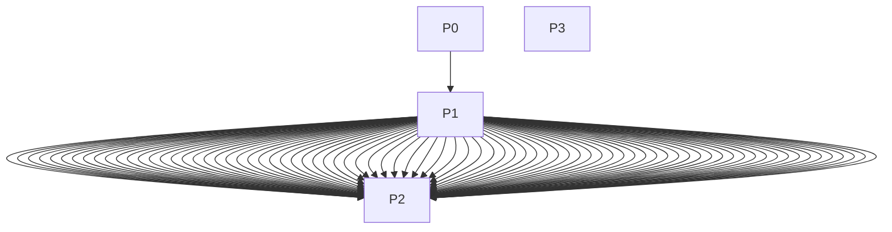

<!-- @generated by pse-schema; do not edit -->

# Executable pass contracts

This is the registered executable surface. The later-pass design inventory remains in blueprint §14.1 (ADR-0056).

## P0

Version: `1`. Determinism: `deterministic`. Executes plans: false.

| Direction | Port | Relation |
|---|---|---|
| input | `schema_relations` | `reference.schema_relations` |
| input | `schema_columns` | `reference.schema_columns` |
| input | `schema_logical_types` | `reference.schema_logical_types` |
| input | `schema_enums` | `reference.schema_enums` |
| input | `schema_invariants` | `reference.schema_invariants` |
| input | `schema_migrations` | `reference.schema_migrations` |
| input | `schema_documents` | `reference.schema_documents` |
| input | `schema_document_sections` | `reference.schema_document_sections` |
| input | `packages` | `authored.packages` |
| output | `package_graph` | `normalized.package_graph` |

## P1

Version: `1`. Determinism: `deterministic`. Executes plans: false.

| Direction | Port | Relation |
|---|---|---|
| input | `packages` | `authored.packages` |
| input | `documents` | `authored.documents` |
| input | `entities` | `authored.entities` |
| input | `model_revisions` | `authored.model_revisions` |
| input | `case_revisions` | `authored.case_revisions` |
| input | `dimensions` | `reference.dimensions` |
| input | `units` | `reference.units` |
| input | `unit_sets` | `reference.unit_sets` |
| input | `quantity_kinds` | `reference.quantity_kinds` |
| input | `bases` | `reference.bases` |
| input | `reference_states` | `reference.reference_states` |
| input | `quantity_types` | `reference.quantity_types` |
| input | `conversion_rules` | `reference.conversion_rules` |
| input | `quantity_operations` | `reference.quantity_operations` |
| input | `constants` | `reference.constants` |
| input | `domains` | `authored.domains` |
| input | `domain_members` | `authored.domain_members` |
| input | `continuous_domains` | `authored.continuous_domains` |
| input | `elements` | `reference.elements` |
| input | `species` | `authored.species` |
| input | `species_elements` | `authored.species_elements` |
| input | `phases` | `authored.phases` |
| input | `phase_species` | `authored.phase_species` |
| input | `henry_declarations` | `authored.henry_declarations` |
| input | `material_systems` | `authored.material_systems` |
| input | `reactions` | `authored.reactions` |
| input | `stoichiometry` | `authored.stoichiometry` |
| input | `reaction_methods` | `authored.reaction_methods` |
| input | `reaction_packages` | `authored.reaction_packages` |
| input | `parameter_values` | `authored.parameter_values` |
| input | `property_kinds` | `reference.property_kinds` |
| input | `method_specs` | `reference.method_specs` |
| input | `property_packages` | `authored.property_packages` |
| input | `state_bounds` | `authored.state_bounds` |
| input | `phase_equilibrium_pairs` | `authored.phase_equilibrium_pairs` |
| input | `method_selections` | `authored.method_selections` |
| input | `default_scaling` | `authored.default_scaling` |
| input | `templates` | `authored.templates` |
| input | `template_params` | `authored.template_params` |
| input | `template_features` | `authored.template_features` |
| input | `template_feature_rules` | `authored.template_feature_rules` |
| input | `template_guards` | `authored.template_guards` |
| input | `template_domains` | `authored.template_domains` |
| input | `template_symbols` | `authored.template_symbols` |
| input | `template_equations` | `authored.template_equations` |
| input | `template_submodels` | `authored.template_submodels` |
| input | `template_ports` | `authored.template_ports` |
| input | `template_contributions` | `authored.template_contributions` |
| input | `template_law_instances` | `authored.template_law_instances` |
| input | `template_requirements` | `authored.template_requirements` |
| input | `template_display` | `authored.template_display` |
| input | `template_property_requirements` | `authored.template_property_requirements` |
| input | `instances` | `authored.instances` |
| input | `instance_domain_bindings` | `authored.instance_domain_bindings` |
| input | `flowsheets` | `authored.flowsheets` |
| input | `scopes` | `authored.scopes` |
| input | `selector_terms` | `authored.selector_terms` |
| input | `connections` | `authored.connections` |
| input | `cases` | `authored.cases` |
| input | `case_specs` | `authored.case_specs` |
| input | `case_spec_targets` | `authored.case_spec_targets` |
| input | `case_activation_targets` | `authored.case_activation_targets` |
| input | `observation_targets` | `authored.observation_targets` |
| input | `case_activations` | `authored.case_activations` |
| input | `case_objectives` | `authored.case_objectives` |
| input | `case_policies` | `authored.case_policies` |
| input | `datasets` | `authored.datasets` |
| input | `observations` | `authored.observations` |
| input | `scenarios` | `authored.scenarios` |
| input | `case_sets` | `authored.case_sets` |
| input | `case_set_samples` | `authored.case_set_samples` |
| input | `discretization_policies` | `authored.discretization_policies` |
| input | `solver_profiles` | `authored.solver_profiles` |
| input | `assertions` | `provenance.assertions` |
| input | `change_sets` | `authored.change_sets` |
| input | `change_ops` | `authored.change_ops` |
| input | `package_unit_sets` | `authored.package_unit_sets` |
| input | `template_symbol_properties` | `authored.template_symbol_properties` |
| input | `package_graph` | `normalized.package_graph` |
| output | `packages` | `authored.packages` |
| output | `documents` | `authored.documents` |
| output | `entities` | `authored.entities` |
| output | `model_revisions` | `authored.model_revisions` |
| output | `case_revisions` | `authored.case_revisions` |
| output | `dimensions` | `reference.dimensions` |
| output | `units` | `reference.units` |
| output | `unit_sets` | `reference.unit_sets` |
| output | `quantity_kinds` | `reference.quantity_kinds` |
| output | `bases` | `reference.bases` |
| output | `reference_states` | `reference.reference_states` |
| output | `quantity_types` | `reference.quantity_types` |
| output | `conversion_rules` | `reference.conversion_rules` |
| output | `quantity_operations` | `reference.quantity_operations` |
| output | `constants` | `reference.constants` |
| output | `domains` | `authored.domains` |
| output | `domain_members` | `authored.domain_members` |
| output | `continuous_domains` | `authored.continuous_domains` |
| output | `elements` | `reference.elements` |
| output | `species` | `authored.species` |
| output | `species_elements` | `authored.species_elements` |
| output | `phases` | `authored.phases` |
| output | `phase_species` | `authored.phase_species` |
| output | `henry_declarations` | `authored.henry_declarations` |
| output | `material_systems` | `authored.material_systems` |
| output | `reactions` | `authored.reactions` |
| output | `stoichiometry` | `authored.stoichiometry` |
| output | `reaction_methods` | `authored.reaction_methods` |
| output | `reaction_packages` | `authored.reaction_packages` |
| output | `parameter_values` | `authored.parameter_values` |
| output | `property_kinds` | `reference.property_kinds` |
| output | `method_specs` | `reference.method_specs` |
| output | `property_packages` | `authored.property_packages` |
| output | `state_bounds` | `authored.state_bounds` |
| output | `phase_equilibrium_pairs` | `authored.phase_equilibrium_pairs` |
| output | `method_selections` | `authored.method_selections` |
| output | `default_scaling` | `authored.default_scaling` |
| output | `templates` | `authored.templates` |
| output | `template_params` | `authored.template_params` |
| output | `template_features` | `authored.template_features` |
| output | `template_feature_rules` | `authored.template_feature_rules` |
| output | `template_guards` | `authored.template_guards` |
| output | `template_domains` | `authored.template_domains` |
| output | `template_symbols` | `authored.template_symbols` |
| output | `template_equations` | `authored.template_equations` |
| output | `template_submodels` | `authored.template_submodels` |
| output | `template_ports` | `authored.template_ports` |
| output | `template_contributions` | `authored.template_contributions` |
| output | `template_law_instances` | `authored.template_law_instances` |
| output | `template_requirements` | `authored.template_requirements` |
| output | `template_display` | `authored.template_display` |
| output | `template_property_requirements` | `authored.template_property_requirements` |
| output | `instances` | `authored.instances` |
| output | `instance_domain_bindings` | `authored.instance_domain_bindings` |
| output | `flowsheets` | `authored.flowsheets` |
| output | `scopes` | `authored.scopes` |
| output | `selector_terms` | `authored.selector_terms` |
| output | `connections` | `authored.connections` |
| output | `cases` | `authored.cases` |
| output | `case_specs` | `authored.case_specs` |
| output | `case_spec_targets` | `authored.case_spec_targets` |
| output | `case_activation_targets` | `authored.case_activation_targets` |
| output | `observation_targets` | `authored.observation_targets` |
| output | `case_activations` | `authored.case_activations` |
| output | `case_objectives` | `authored.case_objectives` |
| output | `case_policies` | `authored.case_policies` |
| output | `datasets` | `authored.datasets` |
| output | `observations` | `authored.observations` |
| output | `scenarios` | `authored.scenarios` |
| output | `case_sets` | `authored.case_sets` |
| output | `case_set_samples` | `authored.case_set_samples` |
| output | `discretization_policies` | `authored.discretization_policies` |
| output | `solver_profiles` | `authored.solver_profiles` |
| output | `assertions` | `provenance.assertions` |
| output | `change_sets` | `authored.change_sets` |
| output | `change_ops` | `authored.change_ops` |
| output | `package_unit_sets` | `authored.package_unit_sets` |
| output | `template_symbol_properties` | `authored.template_symbol_properties` |

## P2

Version: `1`. Determinism: `deterministic`. Executes plans: true.

| Direction | Port | Relation |
|---|---|---|
| input | `schema_relations` | `reference.schema_relations` |
| input | `schema_columns` | `reference.schema_columns` |
| input | `schema_logical_types` | `reference.schema_logical_types` |
| input | `schema_enums` | `reference.schema_enums` |
| input | `schema_invariants` | `reference.schema_invariants` |
| input | `schema_migrations` | `reference.schema_migrations` |
| input | `schema_documents` | `reference.schema_documents` |
| input | `schema_document_sections` | `reference.schema_document_sections` |
| input | `packages` | `authored.packages` |
| input | `documents` | `authored.documents` |
| input | `entities` | `authored.entities` |
| input | `aliases` | `reference.aliases` |
| input | `model_revisions` | `authored.model_revisions` |
| input | `case_revisions` | `authored.case_revisions` |
| input | `dimensions` | `reference.dimensions` |
| input | `units` | `reference.units` |
| input | `unit_sets` | `reference.unit_sets` |
| input | `quantity_kinds` | `reference.quantity_kinds` |
| input | `bases` | `reference.bases` |
| input | `reference_states` | `reference.reference_states` |
| input | `quantity_types` | `reference.quantity_types` |
| input | `conversion_rules` | `reference.conversion_rules` |
| input | `quantity_operations` | `reference.quantity_operations` |
| input | `constants` | `reference.constants` |
| input | `domains` | `authored.domains` |
| input | `domain_members` | `authored.domain_members` |
| input | `continuous_domains` | `authored.continuous_domains` |
| input | `elements` | `reference.elements` |
| input | `species` | `authored.species` |
| input | `species_elements` | `authored.species_elements` |
| input | `phases` | `authored.phases` |
| input | `phase_species` | `authored.phase_species` |
| input | `henry_declarations` | `authored.henry_declarations` |
| input | `material_systems` | `authored.material_systems` |
| input | `reactions` | `authored.reactions` |
| input | `stoichiometry` | `authored.stoichiometry` |
| input | `reaction_methods` | `authored.reaction_methods` |
| input | `reaction_packages` | `authored.reaction_packages` |
| input | `parameter_values` | `authored.parameter_values` |
| input | `property_kinds` | `reference.property_kinds` |
| input | `method_specs` | `reference.method_specs` |
| input | `property_packages` | `authored.property_packages` |
| input | `state_bounds` | `authored.state_bounds` |
| input | `phase_equilibrium_pairs` | `authored.phase_equilibrium_pairs` |
| input | `method_selections` | `authored.method_selections` |
| input | `default_scaling` | `authored.default_scaling` |
| input | `templates` | `authored.templates` |
| input | `template_params` | `authored.template_params` |
| input | `template_features` | `authored.template_features` |
| input | `template_feature_rules` | `authored.template_feature_rules` |
| input | `template_guards` | `authored.template_guards` |
| input | `template_domains` | `authored.template_domains` |
| input | `template_symbols` | `authored.template_symbols` |
| input | `template_equations` | `authored.template_equations` |
| input | `template_submodels` | `authored.template_submodels` |
| input | `template_ports` | `authored.template_ports` |
| input | `template_contributions` | `authored.template_contributions` |
| input | `template_law_instances` | `authored.template_law_instances` |
| input | `template_requirements` | `authored.template_requirements` |
| input | `template_display` | `authored.template_display` |
| input | `template_property_requirements` | `authored.template_property_requirements` |
| input | `instances` | `authored.instances` |
| input | `instance_domain_bindings` | `authored.instance_domain_bindings` |
| input | `flowsheets` | `authored.flowsheets` |
| input | `scopes` | `authored.scopes` |
| input | `selector_terms` | `authored.selector_terms` |
| input | `connections` | `authored.connections` |
| input | `operator_specs` | `reference.operator_specs` |
| input | `cases` | `authored.cases` |
| input | `case_specs` | `authored.case_specs` |
| input | `case_spec_targets` | `authored.case_spec_targets` |
| input | `case_activation_targets` | `authored.case_activation_targets` |
| input | `observation_targets` | `authored.observation_targets` |
| input | `case_activations` | `authored.case_activations` |
| input | `case_objectives` | `authored.case_objectives` |
| input | `case_policies` | `authored.case_policies` |
| input | `datasets` | `authored.datasets` |
| input | `observations` | `authored.observations` |
| input | `scenarios` | `authored.scenarios` |
| input | `case_sets` | `authored.case_sets` |
| input | `case_set_samples` | `authored.case_set_samples` |
| input | `pass_specs` | `reference.pass_specs` |
| input | `pass_input_ports` | `reference.pass_input_ports` |
| input | `pass_output_ports` | `reference.pass_output_ports` |
| input | `rule_specs` | `reference.rule_specs` |
| input | `rule_plan_nodes` | `reference.rule_plan_nodes` |
| input | `rule_expr_nodes` | `reference.rule_expr_nodes` |
| input | `rule_expr_edges` | `reference.rule_expr_edges` |
| input | `rule_aggregates` | `reference.rule_aggregates` |
| input | `rule_group_keys` | `reference.rule_group_keys` |
| input | `rule_unnest` | `reference.rule_unnest` |
| input | `rule_plan_edges` | `reference.rule_plan_edges` |
| input | `rule_dependencies` | `reference.rule_dependencies` |
| input | `engine_profiles` | `reference.engine_profiles` |
| input | `kernel_specs` | `reference.kernel_specs` |
| input | `numerical_policies` | `reference.numerical_policies` |
| input | `discretization_policies` | `authored.discretization_policies` |
| input | `solver_profiles` | `authored.solver_profiles` |
| input | `assertions` | `provenance.assertions` |
| input | `change_sets` | `authored.change_sets` |
| input | `change_ops` | `authored.change_ops` |
| input | `package_unit_sets` | `authored.package_unit_sets` |
| input | `template_symbol_properties` | `authored.template_symbol_properties` |
| output | `findings` | `runtime.diagnostics_findings` |
| output | `undecided` | `inferred.undecided` |

## P3

Version: `1`. Determinism: `deterministic`. Executes plans: false.

| Direction | Port | Relation |
|---|---|---|
| input | `schema_relations` | `reference.schema_relations` |
| input | `schema_columns` | `reference.schema_columns` |
| input | `schema_logical_types` | `reference.schema_logical_types` |
| input | `schema_enums` | `reference.schema_enums` |
| input | `schema_invariants` | `reference.schema_invariants` |
| input | `schema_migrations` | `reference.schema_migrations` |
| input | `schema_documents` | `reference.schema_documents` |
| input | `schema_document_sections` | `reference.schema_document_sections` |
| input | `packages` | `authored.packages` |
| input | `documents` | `authored.documents` |
| input | `entities` | `authored.entities` |
| input | `aliases` | `reference.aliases` |
| input | `dimensions` | `reference.dimensions` |
| input | `units` | `reference.units` |
| input | `unit_sets` | `reference.unit_sets` |
| input | `quantity_kinds` | `reference.quantity_kinds` |
| input | `bases` | `reference.bases` |
| input | `reference_states` | `reference.reference_states` |
| input | `quantity_types` | `reference.quantity_types` |
| input | `conversion_rules` | `reference.conversion_rules` |
| input | `quantity_operations` | `reference.quantity_operations` |
| input | `constants` | `reference.constants` |
| input | `domains` | `authored.domains` |
| input | `domain_members` | `authored.domain_members` |
| input | `continuous_domains` | `authored.continuous_domains` |
| input | `elements` | `reference.elements` |
| input | `species` | `authored.species` |
| input | `species_elements` | `authored.species_elements` |
| input | `phases` | `authored.phases` |
| input | `phase_species` | `authored.phase_species` |
| input | `henry_declarations` | `authored.henry_declarations` |
| input | `material_systems` | `authored.material_systems` |
| input | `reactions` | `authored.reactions` |
| input | `stoichiometry` | `authored.stoichiometry` |
| input | `reaction_methods` | `authored.reaction_methods` |
| input | `reaction_packages` | `authored.reaction_packages` |
| input | `parameter_values` | `authored.parameter_values` |
| input | `property_kinds` | `reference.property_kinds` |
| input | `method_specs` | `reference.method_specs` |
| input | `property_packages` | `authored.property_packages` |
| input | `state_bounds` | `authored.state_bounds` |
| input | `phase_equilibrium_pairs` | `authored.phase_equilibrium_pairs` |
| input | `method_selections` | `authored.method_selections` |
| input | `default_scaling` | `authored.default_scaling` |
| input | `templates` | `authored.templates` |
| input | `template_params` | `authored.template_params` |
| input | `template_features` | `authored.template_features` |
| input | `template_feature_rules` | `authored.template_feature_rules` |
| input | `template_guards` | `authored.template_guards` |
| input | `template_domains` | `authored.template_domains` |
| input | `template_symbols` | `authored.template_symbols` |
| input | `template_equations` | `authored.template_equations` |
| input | `template_submodels` | `authored.template_submodels` |
| input | `template_ports` | `authored.template_ports` |
| input | `template_contributions` | `authored.template_contributions` |
| input | `template_law_instances` | `authored.template_law_instances` |
| input | `template_requirements` | `authored.template_requirements` |
| input | `template_display` | `authored.template_display` |
| input | `template_property_requirements` | `authored.template_property_requirements` |
| input | `instances` | `authored.instances` |
| input | `instance_domain_bindings` | `authored.instance_domain_bindings` |
| input | `flowsheets` | `authored.flowsheets` |
| input | `scopes` | `authored.scopes` |
| input | `selector_terms` | `authored.selector_terms` |
| input | `connections` | `authored.connections` |
| input | `operator_specs` | `reference.operator_specs` |
| input | `cases` | `authored.cases` |
| input | `case_specs` | `authored.case_specs` |
| input | `case_spec_targets` | `authored.case_spec_targets` |
| input | `case_activation_targets` | `authored.case_activation_targets` |
| input | `observation_targets` | `authored.observation_targets` |
| input | `case_activations` | `authored.case_activations` |
| input | `case_objectives` | `authored.case_objectives` |
| input | `case_policies` | `authored.case_policies` |
| input | `datasets` | `authored.datasets` |
| input | `observations` | `authored.observations` |
| input | `scenarios` | `authored.scenarios` |
| input | `case_sets` | `authored.case_sets` |
| input | `case_set_samples` | `authored.case_set_samples` |
| input | `pass_specs` | `reference.pass_specs` |
| input | `pass_input_ports` | `reference.pass_input_ports` |
| input | `pass_output_ports` | `reference.pass_output_ports` |
| input | `rule_specs` | `reference.rule_specs` |
| input | `rule_plan_nodes` | `reference.rule_plan_nodes` |
| input | `rule_expr_nodes` | `reference.rule_expr_nodes` |
| input | `rule_expr_edges` | `reference.rule_expr_edges` |
| input | `rule_aggregates` | `reference.rule_aggregates` |
| input | `rule_group_keys` | `reference.rule_group_keys` |
| input | `rule_unnest` | `reference.rule_unnest` |
| input | `rule_plan_edges` | `reference.rule_plan_edges` |
| input | `rule_dependencies` | `reference.rule_dependencies` |
| input | `engine_profiles` | `reference.engine_profiles` |
| input | `kernel_specs` | `reference.kernel_specs` |
| input | `numerical_policies` | `reference.numerical_policies` |
| input | `discretization_policies` | `authored.discretization_policies` |
| input | `solver_profiles` | `authored.solver_profiles` |
| input | `package_unit_sets` | `authored.package_unit_sets` |
| input | `template_symbol_properties` | `authored.template_symbol_properties` |
| output | `package_graph` | `normalized.package_graph` |
| output | `domain_products` | `normalized.domain_products` |
| output | `property_demand_seeds` | `normalized.property_demand_seeds` |
| output | `expression_sources` | `normalized.expression_sources` |
| output | `predicate_nodes` | `normalized.predicate_nodes` |
| output | `equation_nodes` | `normalized.equation_nodes` |
| output | `expression_index_bindings` | `normalized.expression_index_bindings` |
| output | `units` | `normalized.units` |
| output | `packages` | `normalized.packages` |
| output | `documents` | `normalized.documents` |
| output | `entities` | `normalized.entities` |
| output | `domains` | `normalized.domains` |
| output | `domain_members` | `normalized.domain_members` |
| output | `continuous_domains` | `normalized.continuous_domains` |
| output | `species` | `normalized.species` |
| output | `species_elements` | `normalized.species_elements` |
| output | `phases` | `normalized.phases` |
| output | `phase_species` | `normalized.phase_species` |
| output | `henry_declarations` | `normalized.henry_declarations` |
| output | `material_systems` | `normalized.material_systems` |
| output | `reactions` | `normalized.reactions` |
| output | `stoichiometry` | `normalized.stoichiometry` |
| output | `reaction_methods` | `normalized.reaction_methods` |
| output | `reaction_packages` | `normalized.reaction_packages` |
| output | `parameter_values` | `normalized.parameter_values` |
| output | `property_packages` | `normalized.property_packages` |
| output | `state_bounds` | `normalized.state_bounds` |
| output | `phase_equilibrium_pairs` | `normalized.phase_equilibrium_pairs` |
| output | `method_selections` | `normalized.method_selections` |
| output | `default_scaling` | `normalized.default_scaling` |
| output | `templates` | `normalized.templates` |
| output | `template_params` | `normalized.template_params` |
| output | `template_features` | `normalized.template_features` |
| output | `template_feature_rules` | `normalized.template_feature_rules` |
| output | `template_guards` | `normalized.template_guards` |
| output | `template_domains` | `normalized.template_domains` |
| output | `template_symbols` | `normalized.template_symbols` |
| output | `template_equations` | `normalized.template_equations` |
| output | `template_submodels` | `normalized.template_submodels` |
| output | `template_ports` | `normalized.template_ports` |
| output | `template_contributions` | `normalized.template_contributions` |
| output | `template_law_instances` | `normalized.template_law_instances` |
| output | `template_requirements` | `normalized.template_requirements` |
| output | `template_display` | `normalized.template_display` |
| output | `template_property_requirements` | `normalized.template_property_requirements` |
| output | `instances` | `normalized.instances` |
| output | `instance_domain_bindings` | `normalized.instance_domain_bindings` |
| output | `flowsheets` | `normalized.flowsheets` |
| output | `scopes` | `normalized.scopes` |
| output | `selector_terms` | `normalized.selector_terms` |
| output | `connections` | `normalized.connections` |
| output | `discretization_policies` | `normalized.discretization_policies` |
| output | `solver_profiles` | `normalized.solver_profiles` |
| output | `package_unit_sets` | `normalized.package_unit_sets` |
| output | `template_symbol_properties` | `normalized.template_symbol_properties` |
| output | `template_expr_nodes` | `normalized.template_expr_nodes` |
| output | `template_expr_args` | `normalized.template_expr_args` |
| output | `template_expr_symbol_refs` | `normalized.template_expr_symbol_refs` |
| output | `template_expr_float_constants` | `normalized.template_expr_float_constants` |
| output | `template_expr_int_constants` | `normalized.template_expr_int_constants` |
| output | `template_expr_affine` | `normalized.template_expr_affine` |
| output | `template_expr_weighted_means` | `normalized.template_expr_weighted_means` |
| output | `template_expr_reductions` | `normalized.template_expr_reductions` |
| output | `template_expr_gathers` | `normalized.template_expr_gathers` |
| output | `template_expr_broadcasts` | `normalized.template_expr_broadcasts` |
| output | `template_expr_derivatives` | `normalized.template_expr_derivatives` |
| output | `template_expr_integrals` | `normalized.template_expr_integrals` |
| output | `template_expr_smooth_ops` | `normalized.template_expr_smooth_ops` |
| output | `template_expr_conditionals` | `normalized.template_expr_conditionals` |
| output | `template_expr_kernel_calls` | `normalized.template_expr_kernel_calls` |
| output | `template_expr_implicit_refs` | `normalized.template_expr_implicit_refs` |
| output | `template_expr_unit_converts` | `normalized.template_expr_unit_converts` |
| output | `template_expr_piecewise_linear` | `normalized.template_expr_piecewise_linear` |
| output | `instance_expr_nodes` | `normalized.instance_expr_nodes` |
| output | `instance_expr_args` | `normalized.instance_expr_args` |
| output | `instance_expr_symbol_refs` | `normalized.instance_expr_symbol_refs` |
| output | `instance_expr_float_constants` | `normalized.instance_expr_float_constants` |
| output | `instance_expr_int_constants` | `normalized.instance_expr_int_constants` |
| output | `instance_expr_affine` | `normalized.instance_expr_affine` |
| output | `instance_expr_weighted_means` | `normalized.instance_expr_weighted_means` |
| output | `instance_expr_reductions` | `normalized.instance_expr_reductions` |
| output | `instance_expr_gathers` | `normalized.instance_expr_gathers` |
| output | `instance_expr_broadcasts` | `normalized.instance_expr_broadcasts` |
| output | `instance_expr_derivatives` | `normalized.instance_expr_derivatives` |
| output | `instance_expr_integrals` | `normalized.instance_expr_integrals` |
| output | `instance_expr_smooth_ops` | `normalized.instance_expr_smooth_ops` |
| output | `instance_expr_conditionals` | `normalized.instance_expr_conditionals` |
| output | `instance_expr_kernel_calls` | `normalized.instance_expr_kernel_calls` |
| output | `instance_expr_implicit_refs` | `normalized.instance_expr_implicit_refs` |
| output | `instance_expr_unit_converts` | `normalized.instance_expr_unit_converts` |
| output | `instance_expr_piecewise_linear` | `normalized.instance_expr_piecewise_linear` |
| output | `display_expr_nodes` | `normalized.display_expr_nodes` |
| output | `display_expr_args` | `normalized.display_expr_args` |
| output | `display_expr_symbol_refs` | `normalized.display_expr_symbol_refs` |
| output | `display_expr_float_constants` | `normalized.display_expr_float_constants` |
| output | `display_expr_int_constants` | `normalized.display_expr_int_constants` |
| output | `display_expr_affine` | `normalized.display_expr_affine` |
| output | `display_expr_weighted_means` | `normalized.display_expr_weighted_means` |
| output | `display_expr_reductions` | `normalized.display_expr_reductions` |
| output | `display_expr_gathers` | `normalized.display_expr_gathers` |
| output | `display_expr_broadcasts` | `normalized.display_expr_broadcasts` |
| output | `display_expr_derivatives` | `normalized.display_expr_derivatives` |
| output | `display_expr_integrals` | `normalized.display_expr_integrals` |
| output | `display_expr_smooth_ops` | `normalized.display_expr_smooth_ops` |
| output | `display_expr_conditionals` | `normalized.display_expr_conditionals` |
| output | `display_expr_kernel_calls` | `normalized.display_expr_kernel_calls` |
| output | `display_expr_implicit_refs` | `normalized.display_expr_implicit_refs` |
| output | `display_expr_unit_converts` | `normalized.display_expr_unit_converts` |
| output | `display_expr_piecewise_linear` | `normalized.display_expr_piecewise_linear` |
| output | `contribution_expr_nodes` | `normalized.contribution_expr_nodes` |
| output | `contribution_expr_args` | `normalized.contribution_expr_args` |
| output | `contribution_expr_symbol_refs` | `normalized.contribution_expr_symbol_refs` |
| output | `contribution_expr_float_constants` | `normalized.contribution_expr_float_constants` |
| output | `contribution_expr_int_constants` | `normalized.contribution_expr_int_constants` |
| output | `contribution_expr_affine` | `normalized.contribution_expr_affine` |
| output | `contribution_expr_weighted_means` | `normalized.contribution_expr_weighted_means` |
| output | `contribution_expr_reductions` | `normalized.contribution_expr_reductions` |
| output | `contribution_expr_gathers` | `normalized.contribution_expr_gathers` |
| output | `contribution_expr_broadcasts` | `normalized.contribution_expr_broadcasts` |
| output | `contribution_expr_derivatives` | `normalized.contribution_expr_derivatives` |
| output | `contribution_expr_integrals` | `normalized.contribution_expr_integrals` |
| output | `contribution_expr_smooth_ops` | `normalized.contribution_expr_smooth_ops` |
| output | `contribution_expr_conditionals` | `normalized.contribution_expr_conditionals` |
| output | `contribution_expr_kernel_calls` | `normalized.contribution_expr_kernel_calls` |
| output | `contribution_expr_implicit_refs` | `normalized.contribution_expr_implicit_refs` |
| output | `contribution_expr_unit_converts` | `normalized.contribution_expr_unit_converts` |
| output | `contribution_expr_piecewise_linear` | `normalized.contribution_expr_piecewise_linear` |
| output | `guard_expr_nodes` | `normalized.guard_expr_nodes` |
| output | `guard_expr_args` | `normalized.guard_expr_args` |
| output | `guard_expr_symbol_refs` | `normalized.guard_expr_symbol_refs` |
| output | `guard_expr_float_constants` | `normalized.guard_expr_float_constants` |
| output | `guard_expr_int_constants` | `normalized.guard_expr_int_constants` |
| output | `guard_expr_affine` | `normalized.guard_expr_affine` |
| output | `guard_expr_weighted_means` | `normalized.guard_expr_weighted_means` |
| output | `guard_expr_reductions` | `normalized.guard_expr_reductions` |
| output | `guard_expr_gathers` | `normalized.guard_expr_gathers` |
| output | `guard_expr_broadcasts` | `normalized.guard_expr_broadcasts` |
| output | `guard_expr_derivatives` | `normalized.guard_expr_derivatives` |
| output | `guard_expr_integrals` | `normalized.guard_expr_integrals` |
| output | `guard_expr_smooth_ops` | `normalized.guard_expr_smooth_ops` |
| output | `guard_expr_conditionals` | `normalized.guard_expr_conditionals` |
| output | `guard_expr_kernel_calls` | `normalized.guard_expr_kernel_calls` |
| output | `guard_expr_implicit_refs` | `normalized.guard_expr_implicit_refs` |
| output | `guard_expr_unit_converts` | `normalized.guard_expr_unit_converts` |
| output | `guard_expr_piecewise_linear` | `normalized.guard_expr_piecewise_linear` |
