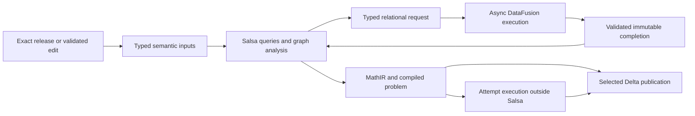

# Rust computation architecture and carried acceptance

**Execution scope superseded on 2026-09-24 by
[Plan 14](14-library-owned-process-simulator.md).** This document records the former
target, implementation and original exit criteria; it is no longer a resume plan.
W19 remains historically incomplete and W20 unrun. No unfinished package, campaign
or acceptance obligation is inherited automatically. Plan 14 selects any useful
graph, Salsa or other mechanism through evidence of its role in the new target.

## Context

This plan combines the [architecture-alignment review](../design_review/reviews/design_review_rust-computation-architecture-alignment_2026-09-23.md)
and the [target-design review](../design_review/reviews/design_review_rust-computation-target-design_2026-09-23.md).
It replaces universal DataFusion execution placement with typed semantic compilation,
library graph algorithms and Salsa reuse, while retaining Arrow/DataFusion for columnar
and relational work and Delta for authoritative releases and selected durable artifacts.
The standard is the [Data Model Design Charter](../design_review/design_principles/DATA_MODEL_DESIGN_CHARTER.md)
and the [Rust computation architecture guidelines](../design_review/design_principles/rust_computation_architecture_guidelines_graph_extended.md),
cited as DM and RCA. The blueprint and ADRs remain the architecture authority.

**Historical checkpoint: implementation complete; functional acceptance incomplete.** W00–W17
and L01–L16 are implemented. The first W19 campaign failed and was interrupted; its
shared repairs now have isolated/static evidence. W20 has not run. The
[W19 repair checkpoint](13-w19-repair-checkpoint.md) records exact results, current
source-seal status and the dependency-ordered remaining work. The
[W15–W20 packet](13-w15-w20-execution.md) and [inventory](13-execution-inventory.md)
retain the execution history. ADR-0076–ADR-0081 remain proposed pending the formal
decision/design process. Plan 12 concerns agent tooling and is unaffected.

At plan creation, the inspected [Plan 11 inventory](11-execution-inventory.md) records I00–I17 implemented
and I18/I19 open. Its [case manifest](11-acceptance-cases.toml) contains 75 implemented
case groups, 179 carried Plan 10 case mappings, 18 carried deletion mappings and 16
`implemented-unqualified` acceptance entries. These are source-inventory counts, not
passing-test counts. The [I16–I19 checkpoint](11-i16-i19-execution.md) retains later
repairs, interrupted engineering runs and incomplete qualification. Their historical outcomes are preserved; current source mappings and receipts belong
to Plan 13, not retroactive edits of those outcomes.

### Scope and completion boundary

In scope are P0–P10 semantic compilation and its authoring/admission boundaries;
package, template, instance, expression, rule, unit, kernel and incidence graphs;
structural analysis; numerical preparation; compile reuse; selected publication;
resource ownership; generated contracts; crate dependencies; and all carried product
acceptance. Python and solver adapters change where necessary to consume the new
compiler, while their existing supported behavior remains required.

This is a direct replacement programme. Each package moves its callers and removes
the displaced production mechanism. Do not retain compatibility APIs, dual production
compilers, legacy evaluators, generic tuple transport or a migration mode. A fresh
Salsa database is the clean-compilation oracle for the same compiler, not a second
production implementation. Existing bounded independent numerical and graph oracles
remain test-only.

The programme is complete only when W00–W18 implementation and deletion are closed,
W19 has current functional evidence for every required obligation, and W20 records
measurements and independent G1–G7 verdicts. A source barrier, library probe, passing
unit group or reduced query count cannot substitute for that completion boundary.

Out of scope are a solver rewrite, a new Pyomo/Python architecture, IDAES parity
expansion, a generic graph DSL, an analytics backend catalogue, Salsa database
persistence, and a distributed exactly-once protocol. Existing local-campaign
exclusions are retained explicitly in Verification; they do not withdraw existing
modeling behavior or independent oracle requirements.

## Decisions

### Reconciled direction

The two reviews are complementary, but their prescriptions are not an unqualified
union. The following dispositions are part of the proposed plan and must be captured
by W00's architecture decision.

| Topic | Selected direction and consequence | Owner / package |
|---|---|---|
| Backend placement | Choose mechanism and reuse separately for each operation. Relational authority does not require every intermediate calculation to execute as a DataFusion plan. Full library eligibility remains in force. | Architecture / W00 |
| Salsa versus batch-only compilation | Select Salsa for the existing repeated-compilation/value-edit reuse requirement. Alignment C7′ is an unselected alternative, not an additional production mode. Reconsider only if that requirement is explicitly withdrawn. | Compiler / W04–W09 |
| Reuse responsibility | Salsa owns semantic dependency validation. Preserve local validation evidence, physical preparation/reset contracts, current authorization, buffer leases and attempt/publication settlement under their existing owners. | Compiler, engine, catalog / W03–W05, W12–W14 |
| Persistent reuse | Persist selected compiled artifacts with complete validity descriptors. Do not serialize Salsa handles or enable Salsa persistence initially. An artifact digest is not permission to reuse incomplete inputs. | Compiler and catalog / W03, W12 |
| Graph representation | Default to immutable, canonically built petgraph `Graph` projections. Use `StableGraph` only for a demonstrated removal-sensitive consumer; preserve multiedges instead of using `GraphMap` where port multiplicity matters. | Structural and compiler / W06 |
| Matching | Qualify rust-igraph's exact bipartite push-relabel routine first. Do not implement Hopcroft–Karp merely because of a licence preference, and do not assign its complexity bound to a different algorithm. A bespoke kernel requires a demonstrated library gap and recorded decision. | Structural / W01, W10 |
| Structural scope | Analyze the complete admitted problem or proved independent components. Replace the earlier review's impossible “cycle outside an exact ancestor closure” example with incomplete-projection, omitted-global-constraint and cross-region-edge controls. | Structural / W10 |
| CDF | Validated direct edits and exact endpoint comparison are sufficient input routes. CDF is an optional qualified accelerator with fallback or explicit failure, never the only correctness path. | Catalog and compiler / W13 |
| MathIR | One semantic MathIR and canonical identity; lower it to backend instructions or batch physical expressions under preservation contracts. Several backend representations are legitimate when none becomes an independent semantic authority. | MathIR and numerics / W09, W11 |
| Generated code | Share mechanics and deduplicate payload shapes. A fingerprint can detect a generated-declaration mismatch; it cannot replace executable schema/value/relational validation. Keep Arrow where a boundary or bulk operation needs it. | Schema and relations / W02, W16 |
| Publication | Authoritative release, complete selected compiled bundle, diagnostics and requested runtime results are durable products. Other intermediates are explicit inspection products, not automatically written members. Preserve typed control-table publication. | Catalog and runtime / W12, W15 |
| Resource bounds | Bound inputs, graph copies/workspaces, payloads and database/key lifetimes together. LRU is not a bound on all Salsa metadata; a cancelled blocking job remains charged until it actually stops. | Runtime and engine / W04, W14 |
| Features | Enable features for actual consumers and measured needs. Retain SQL for the existing rule catalogue. TLS/kernel changes belong to a qualified pin/feature change, not an ad hoc vendor patch. | Dependency owners / W01, W16 |

### Target ownership and stage contracts

Prefer the existing crates. The proposed placement is a semantic `pse-compiler` with
its effectful compiler driver and Arrow/DataFusion/Delta adapters moved to
`pse-runtime` and the existing engine/catalog owners. `pse-rules` retains relational
rule execution. W01 resolves the actual dependency graph before moves begin. Add a
workspace crate only when an existing crate cannot express a necessary acyclic
boundary; W00's ADR must cover that addition. A new facade with the old transitive
dependencies does not satisfy the target.

| Layer | Responsibilities | Required dependency boundary |
|---|---|---|
| Semantic core | IDs, diagnostic vocabulary, quantity/material semantics, templates, MathIR, structural analysis and typed compiler queries | No normal Arrow, DataFusion, Delta or Tokio dependency for these semantic owners; graph/Salsa dependencies only where used |
| Columnar contracts | Registry-derived schemas, checked batches, builders and boundary adapters | Arrow allowed; naming or validating a local relation does not pull in a SQL planner |
| Relational engine | Source binding, fused relational validation, rule evaluation, batch expressions, native caches and metrics | Depends on semantic/columnar contracts; no storage dependency in semantic routines |
| Durable catalog | Exact Delta providers, selected artifacts, writes, settlement and retention | Owns storage integration and exact member versions |
| Application orchestration | Admission, sync/async handoffs, execution, cancellation, Python and publication | Composes lower layers; effects and live attempt state remain here |

Remove the DataFusion error re-export dependency from the diagnostic vocabulary and
move native reservation ownership out of `pse-ids::resource` into the engine/resource
integration layer without losing typed causes or last-reader accounting. Keep
generator-only parsing/printing dependencies out of product normal dependencies.
W01 records explicit package names for each ceiling and checks the resolved closure,
including default-feature edges; merely making a direct dependency optional is insufficient.

For each S1–S9 operation, W03 records the complete RCA §9 contract: input/output and
equality, dependencies including absence, cycles/fixed points, projection completeness,
cost/cardinality, owners and budgets, failure/cancellation, and effect/persistence boundary.
The adopted [stage contracts](13-stage-contracts.md) identify the owning declarations and failure/ownership boundaries; the following table assigns work.

| Stage from target review | Target operation | Implementation owners |
|---|---|---|
| S1 | Admit exact release/edits; validate and decode selected Arrow data into typed inputs | W02, W03, W13 |
| S2 | Resolve references and compile distinct specializations; separate interface, body and instance state | W04, W07, W09 |
| S3 | Build direct-edge projections and derive order, SCCs, witnesses and traversal results | W06, W07 |
| S4 | Evaluate complete relational rule strata with bounded fixed points and support evidence | W05, W08 |
| S5 | Preserve an owned typed MathIR through semantic passes | W09 |
| S6 | Derive matching, coarse DM partitions and matching-projected block order | W10 |
| S7 | Lower reusable numerical programs and patterns; bind changing values separately | W11 |
| S8 | Run attempts and scenarios outside Salsa with mutable solver/workspace state | W11, W14, W15 |
| S9 | Publish selected complete products and materialize requested inspection views | W12, W15 |

The loop is an explicit phase/stratum handoff, not async work inside a tracked query
or a second dependency engine. Only a complete, validated input update makes a new
revision observable. Neither mutable providers nor Salsa database borrows cross an
`await` in a tracked computation.

### Authority changes required before implementation

| Authority | Required reconciliation in W00 | Preservation requirement |
|---|---|---|
| Blueprint D1/D6/D10/D14, §§1.3, 3.3.1–3.3.3, 14.3–14.4; ADR-0065/0068/0074 | State per-operation placement, typed internal semantics, Salsa ownership and persistent artifact validity; remove obsolete `stage_hint`/`pass_records` claims where no longer true | Registry single-sourcing, relational publication, complete dependencies and sound reuse |
| Blueprint §15.3 | Replace unconditional own Hopcroft–Karp mandate with the qualified matching contract; specify incidence, DM and BTD meaning | Exact structural results, full scope, deterministic declared outputs and truthful algorithm bounds |
| Blueprint §20 and ADR-0074 | State selected persistence and compiler handoff while retaining the publication/ownership protocol | Expected parent, exact members, validation evidence, last reader and uncertain-outcome reconciliation |
| Crate map, dependency boundaries and generation | Record actual moved responsibilities and any workspace crate additions/removals | Acyclic normal dependencies, one vocabulary and one Arrow/DataFusion/object_store type universe |
| R-01/R-22 and ADR-0066/R-31 | Replace obsolete deferred Salsa assumptions; distinguish eligibility from enablement; reconcile RCA licence-approval wording with phase-0/1 policy | No new dependency admission barrier; retain provenance and distribution-triggered review |
| ADR-0075/R-32 and other adjacent decisions | Recheck current status and keep the compiler pivot separate from Pyomo tear-selection decisions | No accidental reintroduction or withdrawal of unrelated backend behavior |
| Plan 11 and agent execution pointers | Record the successor/carry-forward boundary and unit-first W18 barrier in active instructions and existing tooling | I18/I19 and all unresolved inherited obligations remain open until requalified |

Re-read front matter when execution begins. The reviews inspected proposed ADRs;
neither “existing” nor “implemented” means “accepted.” Use the ADR/review/design-PR
process for the actual status. Do not edit an accepted record in place. This planning
change does not modify protected architecture documents.

## Plan

### Execution discipline

All packages below start **open**. The owner is the responsible subsystem, not a
claim that a particular contributor has been assigned. Dependencies in this table
are exit dependencies: a consumer cannot close before its prerequisite contract is
ready. W00–W17 use narrowly selected isolated units, static checks, compile checks
and pure generation. Author integration cases with the owning change but defer their
execution until W18 closes. Storage reopen, full compiler journeys, real Python
consumers, solver runs and performance probes remain integration/performance work
even if they reside in a library test module.

Use `just unit-package <package> '<nextest filter>'` with concrete case identities
recorded in the execution manifest; the recipe explicitly enables
`pse-relations/force-validate`. Add a narrowly scoped recipe only when no existing
one fits. Preserve `just --list` as the command surface. There is no requirement to
rerun an unchanged whole suite after every package. A failed unit causes an actual
repair, not a new baseline or a weaker oracle.

| Package | Deliverable | Depends on | Responsible owner | Status |
|---|---|---|---|---|
| W00 | Authority, successor scope and acceptance inheritance | — | Architecture and assurance | complete |
| W01 | Qualified dependency profile and real crate boundary map | W00 | Workspace and subsystem owners | complete |
| W02 | Shared generated mechanics and separated boundary types | W01 | Schema, relations, diagnostics, IDs | complete |
| W03 | Typed admission, identities, equality and stage contracts | W02 | Compiler, authoring, catalog | complete |
| W04 | Salsa database, input transaction and lifetime controls | W03 | Compiler and runtime | complete |
| W05 | Synchronous derivation and asynchronous relational handoff | W04 | Runtime, engine, rules | complete |
| W06 | Complete typed graph projections and library adapters | W03 | Compiler, MathIR, structural | complete |
| W07 | Authoring/resolution/topology compiler replacement | W05, W06 | Authoring, templates, compiler | complete |
| W08 | Derived rule strata and bounded relational inference | W05, W06, W07 | Rules and schema | complete |
| W09 | Shared semantic MathIR and specialization compilation | W07, W08 | Compiler and MathIR | complete |
| W10 | Exact incidence, matching, DM and block analysis | W06, W09 | Structural | complete |
| W11 | Direct numerical lowering and reusable preparation | W09, W10 | Numerics, kernels, backends | complete |
| W12 | Selected durable artifacts and preserved publication | W05, W09, W10, W11 | Catalog and runtime | complete |
| W13 | Exact release updates and optional CDF acceleration | W03, W04, W12 | Catalog and runtime | complete |
| W14 | Aggregate budgets, cancellation and last-reader ownership | W04, W05, W06, W11, W12, W13 | Runtime and engine | complete |
| W15 | Public consumers, inspection and end-to-end wiring | W07, W08, W11, W12, W13, W14 | Runtime, Python, compiler adapters | complete |
| W16 | Final dependency/features and generated-code reduction | W02, W15 | Workspace and schema | complete |
| W17 | Complete executable case and evidence reconciliation | W15, W16 | Testkit and assurance | open |
| W18 | Full implementation, deletion and authority barrier | W00–W17 | All package owners | open |
| W19 | Complete local functional acceptance and repairs | W18 | Product and assurance | open |
| W20 | Measurements, independent gates and final outcome | W19 | Product and performance | open |

### W00 — Adopt scope without resetting acceptance

**Change.** Prepare the decision/review/design changes in the authority table. Record
the selected direction, resolve the two reviews' differences, and populate this
plan's ADR list. At adoption, update the active-plan pointers in `AGENTS.md`, the
plan index and existing implementation-phase tooling together. Preserve previous
receipts and describe exactly which Plan 11 mechanisms remain, move or are replaced.

Create `13-execution-inventory.md` and `13-acceptance-cases.toml` by extending the
existing manifest format/tooling rather than adding another campaign framework.
Keep namespaced `plan10:` and `plan11:` identities and provenance. The new manifest
owns executable identities/modes/oracles; this document owns package scope and
acceptance intent. Distinguish preserved behavior, replaced test mechanism and a
formally withdrawn requirement. Moving or renaming a test is not withdrawing its
requirement. No supported behavior is withdrawn by this plan.

**Delete/move.** Replace stale active-scope rules only on adoption; retain historical
plans and failed/unrun receipts. Do not treat Plan 11's old implementation seal as
permission to execute integration against the half-converted target.

**Exit.** Authority status is explicit, source/lock/dirty overlay is captured, all
inherited manifest IDs resolve to an owner, and the existing guard recognizes the
new W18 barrier. Isolated assurance units reject missing, duplicate, stale and
silently dropped mappings. `adr-lint` and relevant documentation/static checks
validate the changed authority documents; acceptance is still unqualified.

### W01 — Qualify libraries and the actual dependency graph

**Change.** Reconcile `Cargo.toml`/`Cargo.lock` with the reviewed pins and local skill
contracts. The reviewed existing profile is DataFusion 55.1.0, Arrow/Parquet 59.3.0,
object_store 0.13.2, petgraph 0.8.3 and Tokio 1.53.1, with the repository's exact
Delta/kernel revisions. The candidates are Salsa 0.28.4, rustworkx-core 0.18.1 and
rust-igraph 0.7.0. These are reviewed candidates, not permission to assume combined
compatibility. Pin admitted dependencies centrally; record exact features, source
identity, licences, MSRV and type-universe consequences. Do not upgrade unrelated
families to make a candidate fit.

Compile the combined profile and the small used API/macro surface under the pinned
toolchain. In particular qualify the matching adapter's return shape/index limits,
rustworkx's petgraph traits and Salsa's current macro/owned-return surface. Prefer
the local skills and pinned source; use Context7 for a newly selected unskilled
library, with bounded probes only for unresolved contracts. No timing or integrated
library campaign runs here.

Specify normal-dependency ceilings for the real semantic packages, columnar
contracts, generator tools and effectful driver. Route the existing compiler driver
to `pse-runtime`; make any necessary crate addition explicit in the architecture
decision before adding it. Move native error/reservation adapters to their engine
owners. Preserve diagnostic codes/causes and public boundary behavior through moves.

**Exit.** `family-check`, locked combined-profile compilation and isolated governance
checks agree. An actual move plan names each dependency edge to remove. A candidate
API incompatibility is resolved before a dependent package proceeds; eligibility
or a skill catalogue entry is not a qualification receipt.

### W02 — Separate generated declarations from shared mechanics

**Change.** Modify generators in `pse-schema` and supporting tooling, then run
`just codegen-rust-contracts` (pure generation; broad fixture generation remains behind W18). Keep relation names, fields, metadata, constraints and wire schemas
single-sourced. Share checked-batch/build/view behavior through a generic relation
contract such as `TypedBatch<R>`; emit relation-specific markers and validators.
Deduplicate identical expression-node payload shapes where the declarations prove
equivalence. Limit serde derives to actual serialization consumers, including
document DTOs, instead of relying on the earlier review's approximate count.

Separate Arrow schema/adapter generation from semantic IDs/diagnostics and typed
compiler values. Move code-generation-only dependencies out of runtime closures.
Reduce the frozen generated registry mirror where redundant, but retain executable
checks of fields, nullability, types, metadata and constraints. Fingerprints detect
version mismatch; they do not certify input values or relation completeness.

**Delete.** Repeated per-relation mechanics and duplicate payload implementations,
not independent semantic declarations or untrusted-input validation.

**Exit.** Isolated generator/contract tests compare old declared meanings with new
generated shapes and reject forged metadata/types. `codegen-check` reports exact
regeneration, and semantic-core dependency ceilings hold for the completed moves.
Remaining compiler edges have named W07–W11 owners rather than a waived ceiling.

### W03 — Define complete typed inputs, identity and validity

**Change.** Add typed admission results and immutable selected-release descriptors.
Separate definition identity, specialization identity, instance identity, runtime
state and artifact identity. A reusable body has formal slots; two instances may
share it while retaining distinct bindings, variables, bounds and warm starts.
Keep semantic IDs at public/durable boundaries; Salsa IDs and graph indices stay
local. A rename changes the tracked name, not an unrelated entity identity.

Define canonical structural equality over every observable semantic input: ordered
and repeated operands, opcode/literal/type/shape/quantity, binding context, provider
choice, policy and relevant negative lookup/candidate-set membership. State set,
bag and sequence equality explicitly for each output. Preserve signed-zero rules
and reject nonfinite expression data where required. Keep source provenance as a
many-to-many mapping when equal expressions share a node. Diagnostic/source mapping
is observable even when a numerical body remains equal.

Specify a stable implementation identity covering actual source/build inputs,
registry, algorithm/kernel/ABI/configuration contracts and dirty-source identity.
Crate version alone, a random per-assembly UUID, pointer equality, `Debug` text or
Arrow `RowConverter` bytes are not portable semantic identity. Keep genuinely
attempt-local nonces for attempts, not persistent reuse eligibility.

Place validation at named boundaries: local typed/Arrow admission, relational
keys/references/completeness, graph projection admission, backend capability
admission and publication completeness. State which exact checks a certificate
permits a consumer to skip and which transforms preserve it. Changed/foreign data
must be re-admitted. Use built-in Arrow take/filter/cast kernels and DataFusion
validation joins where their contracts fit, carrying or re-establishing evidence
according to the actual transformation. Implement the S1–S9 RCA §9 contracts with explicit cycle/failure
and ownership behavior.

**Exit.** Isolated units reject forged/colliding identities, malformed bindings,
missing candidates and invalid metadata; preserve operand order, quantities,
source spans and instance separation; and distinguish storage-only changes from
observable semantic changes. Stable artifact identity is reproducible from the
same declared inputs and changes for relevant implementation edits.

### W04 — Install Salsa with atomic observable input updates

**Change.** Add Salsa inputs for stable domain entities, immutable input descriptors,
scope membership and relevant configuration. Maintain one domain-ID-to-input-handle
map per database; update only changed fields. Represent deletions/tombstones and
negative lookup dependencies explicitly. Do not create an input for every Arrow
cell or hide configuration in an ordinary database field read by a tracked query.
Keep the complete release identity in provenance without putting a global changing
release key into every query. Relevant fields and membership drive invalidation.
Tracked bodies do not read ambient clocks, random state, environment, mutable files,
latest table state or session registries outside the declared inputs.

Tracked results cover selected semantic boundaries, not every runtime value.
Separate interface/body, topology/annotation and structure/numeric dependencies.
Create tracked entities from one canonical producer; mutable observable fields are
tracked fields, not accidental identity fields. Intern only appropriate immutable
keys. Use current 0.28.4 contracts rather than old jars/query-group APIs or unsafe
lifetime workarounds. Default to correctness before optional durability/LRU tuning.

The external update coordinator validates/precomputes an entire update before an
exclusive barrier, cancels/drains active query handles as required, then applies
setters with no concurrent readers. Salsa setters are not assumed to form a native
multi-field transaction. If application fails, discard/rebuild the database from
the last complete admitted immutable input set before making it readable. A
read-only view is not asserted to be a pinned historical snapshot without proof.

Own database generations explicitly. Input handles, interned keys and query
metadata need separate limits/metrics from cached value bytes. Retire complete
databases at bounded lifecycle points; LRU alone does not reclaim every category.
Large payloads use an exact leased or reconstructible descriptor whose equality
reflects meaning rather than residency.

**Exit.** In-memory units compare incremental with fresh-database results for add,
remove, rename, failed-lookup-then-add, unrelated edit and multi-field update.
Salsa event controls demonstrate backdating and expected executions, including
negative controls for untracked configuration and wrongly identified fields.
Eviction and database retirement affect cost/lifetime, never result validity.

### W05 — Make the sync/async compile boundary explicit

**Change.** Tracked synchronous derivation emits a typed relational request keyed by
the exact inputs, operation and revision-qualified context. The external driver
executes it asynchronously in DataFusion against immutable selected providers,
validates the complete output, and installs an immutable completion input through
W04's barrier. The next phase/stratum consumes that completion. Equal completions
do not cause needless input revisions.

Never hold a Salsa borrow or active query handle across async I/O, call `block_on`
inside tracked code, mutate a provider behind an unchanged input, or use arbitrary
`specify` injection as an async completion channel. Reject late results for a new
current revision, or retain them only as explicitly old-revision products. Request
deduplication does not become another semantic invalidation graph.

Retain native DataFusion composition for genuinely relational segments. Preserve
the existing cache-factory integration, prepared SQL/functions and session extensions;
cloning a session is not proof of immutable inputs. A `MemTable` selected view must
not be mutated through DML under an unchanged revision. A view definition or cached
plan is not a cached execution result. Custom relational operators need a concrete
contract and advantage, including truthful distribution, ordering and pushdown.

**Delete.** Unused compiler stage wrappers. Mechanically move still-used wrappers to the
runtime driver now; their consumer conversions and deletion remain W07–W11, with final
reconciliation at W15. Retain useful native relational operators and
their physical preparation/reset and attempt-completion controls.

**Exit.** Isolated fake-driver tests delay completion over an update, race duplicate
completions, inject failure/cancellation and prove no mixed revision or stale
admission. Compile the real async wiring; run its actual compiler/storage journeys
only after W18.

### W06 — Build typed, complete graph projections

**Change.** Put small projection/analysis contracts beside their owning domain
operations. Each names source region, nodes/edges, direction, ports, multiplicity,
isolates, weights, completeness, index mapping, algorithm/configuration and output
meaning. Build immutable petgraph graphs from sorted semantic IDs and canonically
ordered edges. Validate index cardinality, including rust-igraph's narrower boundary.
Do not persist `NodeIndex`/edge indices or infer semantic order from insertion order.

| Projection family | Required semantics and library work |
|---|---|
| Package dependencies | Prerequisite → dependent; include isolated packages; topological order and a useful cycle witness |
| Template dependencies/specialization | Distinct definition and specialization edges; finite expansion/cycle contract and missing-reference diagnostics |
| Instance containment | Parent → child with parent-cardinality checks; on-demand traversal and explicit requested-region completeness |
| Port connectivity | Directed port-labelled parallel arcs and self-loops; connectivity/SCC meaning is not inferred execution order |
| Expression operands | Preserve operand roles/order/repetition in MathIR; use its adjacency/visitors rather than duplicating every expression graph |
| Rule dependencies | Positive, negative, nonmonotone and conflict-sensitive edges; stratification consumes all relevant edge classes |
| Kernel/program dependencies | Missing input distinct from cycle; deterministic prerequisite ordering |
| Unit dependencies | Declared domain/unit relationship direction, disconnected units and cycle policy; no accidental undirected conversion |
| Equation/variable incidence | Active equalities, free variables, all isolates and precisely declared incidence/zero-elision assumptions |

Use petgraph traversal, SCC, reversal and condensation; rustworkx lexicographical
topological ordering/layers may operate on the same compatible graph. Canonicalize
SCC membership and block identity explicitly. Reuse region projections/results but
recompute a changed region initially; do not implement dynamic graph maintenance
without its deferred measurement trigger. Transitive closure is materialized only
for a named all-pairs consumer. A graph-per-RecordBatch adapter cannot claim a
whole-problem result without collecting/admitting the complete region.

**Exit.** Pure graph units cover asymmetric direction, parallel arcs, repeated
operands, loops, isolates, missing vertices, cycles/witnesses, index overflow and
semantic tie order. If a mutable/index-hole adapter is retained, test its holes;
otherwise its absence is a recorded disposition, not a reason to add `StableGraph`.

### W07 — Replace per-entity compiler traversal and lookup

**Change.** Move P0–P3 resolution/configuration and the relevant P4–P6 topology work
onto W03 typed inputs, W04 queries and W06 projections. Decode needed inventories
once per admitted region, then use typed maps/arenas for finite semantic lookups.
Use one batch join when the operation is genuinely relational. Remove the partial
DataFusion-expression evaluator in `passes/p3/config/lookup.rs` instead of extending
its imitation of equality/`IN` semantics.

Replace repeated ancestor/descendant frontier joins, O(V²) topological loops,
root-to-leaf rescans and query-per-step construction with library traversal or
precomputed region indexes. Preserve complete validation/provenance dependencies,
qualified-name/namespace resolution and cross-region edges. A failed lookup must
depend on the scope membership that can make it succeed. Keep physical output work
proportional to necessary instance outputs even when a definition compiles once.

Move semantic passes off engine/catalog normal dependencies and route their public
callers through the runtime driver. Audit `inferred.instance_reachability` and other
closure consumers; replace membership/ancestor queries and remove the relation only
if no supported all-pairs product needs it.

**Exit.** Isolated compilation units cover repeated definitions, reconvergent
diamonds, renames, unrelated edits, missing references and malformed cycles.
Instrument request counts so increased instance count cannot introduce per-entity
DataFusion executions for an operation whose contract is a bulk inventory lookup.
Integrated engineering counts remain a W19/W20 obligation.

### W08 — Derive rule strata and retain set-oriented inference

**Change.** Derive the rule-dependency graph from registry declarations and checked
rule reads/writes. Include negative, nonmonotone, conflict and support semantics;
SCC/condensation alone over positive reads is insufficient. Reject prohibited
negative cycles with a witness and enforce settled-boundary semantics. Preserve
declared set/bag behavior, signed-zero representatives, exact supports, conflict
evidence and undecided outcomes.

Keep existing DataFusion rule plans and bounded fixed-point/semi-naive machinery
where justified. Admit a complete region/stratum request and return one complete
result through W05. Salsa invalidates the semantic result; it does not replace the
algorithm's explicit iteration or automatically maintain relation deltas. Preserve
qualified affected-key/index reuse as local derived acceleration with complete
epoch/negative-input invalidation, not a competing correctness cache.

Remove manually maintained strata as an independent authority. Keep registry
constraints that define rule meaning. Use a declared bound/termination failure
instead of an unbounded retry loop, and retire temporary iteration relations after
their dependents finish.

**Exit.** Pure rule-contract and prepared-fixture units prove strata, prohibited
cycles, representative/support changes, duplicate inputs and empty/negative inputs.
Author full cold-versus-reused rule cases for W19, including changes crossing strata.

### W09 — Carry one semantic MathIR through compilation

**Change.** Evolve `ExprGraph` into the owned immutable semantic result carried across
P7–P10. Separate topology, annotations/provenance, structural specialization and
value binding according to observed dependencies. Reuse one compiled body per
specialization with explicit formal slots; instance binding remains distinct.
Canonicalization includes quantity/type/shape and ordered operand meaning.

Perform quantity/binder/canonical work once per relevant result. Preserve source
correspondence and the canonical publication/hash contract. Emit relations at
publication or requested inspection, not as a mandatory encode/decode transport
between every pass. Introduce typed adapters for downstream structural/numeric
consumers and migrate all callers before removing old paths.

**Delete.** P8–P10 whole-graph relation reloads, repeated generated family dispatch
that duplicates the same shape, and a second backend hash-consing authority whose
identity can diverge from semantic MathIR. Keep backend-specific interning only
when its input mapping/preservation contract makes its derived status explicit.

**Exit.** Units compare semantic outputs and published math relations under their
declared equality, including exact canonical bytes where contracted. Cover repeated
operands, guards, quantity errors, metadata-only edits, shared bodies with separate
instance state, and stable source maps. Count full-graph encodes/decodes at explicit
boundaries so a later pass cannot silently reintroduce them.

### W10 — Implement exact structural analysis with library matching

**Change.** Replace the `pse-structural` stub with incidence admission, maximum
bipartite matching, coarse Dulmage–Mendelsohn partitions and ordered block analysis.
Include every active equality and free variable, including isolates. Canonical
linear-zero elision must name its value assumptions; a value change that alters
incidence invalidates the structural result. Structural rank is not numerical rank.

Qualify `rust_igraph::maximum_bipartite_matching` on canonically ordered dense
conversion maps. Validate both bipartitions, reciprocal partners, actual matched
edges, cardinality and unmatched states. Account for source graph, conversion and
the routine's internal undirected adjacency. Do not claim C igraph qualification
or Hopcroft–Karp bounds for the Rust port's push-relabel implementation.

Compare tiny fixtures exhaustively with a brute-force oracle and a separately
qualified larger reference in W19. Multiple maximum matchings may differ: compare
validity/cardinality first, then separately establish deterministic output for the
selected ordered inputs. Sorting pairs after the fact is not proof that the chosen
matching is canonical. Use petgraph reachability for alternating-path DM reduction,
and SCC/condensation on the matching-projected dependency graph for BTD, with
declared handling of under/over/well-determined regions. SCC of the original
bipartite graph is not the BTD reduction. Apply the square matched-block
interpretation only where its matching/completeness preconditions hold; a singular
or rectangular problem must not be reported as a perfectly matched square system.

**Exit.** Isolated exhaustive/tiny graph units cover empty and rectangular problems,
isolates, duplicate incidence, multiple maxima, disconnected components, cycles,
global constraints and omitted cross-region edges. A failed library qualification
has a documented unmet requirement and a bounded replacement decision before this
package closes; no silent approximate or general-matching substitution.

### W11 — Lower directly to numerical programs and keep attempts live

**Change.** Lower semantic MathIR directly into existing guarded scalar instruction
programs and derivative contracts. Reuse instruction topology and sparse patterns;
bind parameters, initial values and mutable workspace at the correct runtime
boundary. DataFusion `PhysicalExpr` remains available for genuine batch segments.
Do not rebuild plans or encode a one-row Arrow batch in scalar callbacks.

Preserve inactive-branch safety, quantity/scalarization semantics, derivative
capability checks, current kernel versions, selective output masks and independent
instance state. Solver invocations, attempts, warm starts, live cancellation and
current resource settings are outside Salsa. When a compile-time simplification
consumes a value, record that dependency instead of treating every value edit as
structurally irrelevant.

Keep existing backend integration for native, NL and Pyomo where supported; no
solver-internals rewrite or unqualified new Hessian claim. A sparse faer diagnostic
is deferred unless its actual consumer is scheduled, as recorded in Open items.

**Exit.** Isolated program/oracle units compare scalar and batch values, derivatives,
failure codes, guards, parameter refresh and slot mappings. Author full solver and
two-instance tests for W19. Preserve existing capability coverage or fail admission
explicitly; a previously supported required operation cannot silently disappear.

### W12 — Select durable products and preserve commit semantics

**Change.** Add a registry-owned publication profile naming the authored release,
compiled problem bundle, diagnostics and requested runtime results needed by actual
consumers. Required bundle members and completeness checks remain mandatory.
Intermediate normalized/inferred/compiled views are materialized only for an
explicit inspection/durable-product request. Reading or publishing a selected
output still includes its validation, dependency and provenance closure.

Persist exact artifact descriptors with release member vector, semantic/implementation
identity, schema/algorithm/target contracts and any value assumptions. Large local
payloads are either leased or loadable/reconstructible for the same descriptor.
Eviction does not make a descriptor silently refer to the latest release. No Salsa
or graph-local handles appear in durable metadata. Reject incompatible prior
artifacts explicitly; do not reinterpret their bytes or add a migration fallback.

Use Delta's built-in reads/writes with the existing typed PSE control-table protocol:
stable attempt identity, expected parent, exact member versions, completeness and
operation identity. Retain native validation/write evidence and known-success
versions without redundant readback. On ambiguous post-commit failures/lost
responses, reconcile durable evidence before retrying. A transaction marker does
not by itself suppress a second append; do not introduce a JSON CAS file or claim
atomicity across independent Delta tables without the control-row protocol.

Keep the composed Delta-aware session/functions and projection-by-name safeguards
for the inspected partition-order behavior. Exact Delta scans are not replaceable
by raw Parquet. Document orphan/partial-member handling and retention in terms of
publication visibility rather than assuming every failed call made no durable change.

**Exit.** Isolated profile/descriptor/settlement-state units prove required members,
identity mismatch rejection, known versus uncertain outcomes and recovery decisions.
Author actual duplicate-delivery, parent-race, lost-response and reopen tests for
W19. Remove unconditional intermediate member generation and its callers.

### W13 — Admit exact updates with an optional CDF accelerator

**Change.** Feed W04 from validated authoring edits or a complete semantic difference
between exact admitted endpoint releases. Compare semantic fields before setters;
a storage-only rewrite need not invalidate the compiler. Keep latest-head resolution
separate from historical exact-version reads and from current authorization.

CDF may accelerate this process only for qualified table features/history/ranges.
Check enablement transitions, update pre/post images, inclusive bounds and clamped
end behavior, column-mapping restrictions, deletes, schema changes and checkpoint
identity. A missing/unsupported/retained-away interval is not proof of no change.
Fall back to an exact endpoint comparison when possible, otherwise report the
specific inability to reconstruct the requested input. Publish a checkpoint only
after the complete input update is admitted; no partial cross-table epoch.

Preserve exact provider identity/load capability, root/store generation and
maintenance invalidation. New commits do not mutate previously admitted providers.
Retention/vacuum must respect active exact readers and replay requirements; a
removed historical file still fails honestly. Database revisions, Delta versions,
domain event times and runtime attempt IDs remain separate concepts.

**Exit.** Pure change-normalization units cover direct/endpoint/CDF-equivalent edits,
image pairing, range rejection, no-op semantic updates and safe checkpoint state.
Real history, mapping, maintenance and old-reader/new-commit cases run in W19.

### W14 — Bound total retained work and make cancellation truthful

**Change.** Carry one run-level CPU/I/O/memory budget through admission, graph/Salsa
work, DataFusion, solver preparation and output. Account for source batches, decoded
state, IDs/maps, graph/conversion/internal adjacency, algorithm workspace, Salsa
payloads/metadata, DataFusion operators, output and solver buffers. Record measured
or conservative estimates and explicit refusal where an algorithm cannot meet a
claimed hard bound. DataFusion spill/pool limits are not a process-RSS guarantee.

Use semaphore-admitted owned CPU jobs, including existing Tokio `spawn_blocking`
where appropriate. Avoid nested pool oversubscription and permit deadlocks. Support
cooperative cancellation at available boundaries; started non-cooperative jobs are
not killed by aborting a handle or timing out. Hold their budget until completion,
discard stale outputs, and keep old-revision solve results labelled as such.

Move reservations with actual allocation owners. Shared `Arc`s do not double-charge;
cache eviction does not release a lease while arrays, slices, dictionary storage
or FFI streams retain the allocation. Account for backing capacity rather than
visible slice length. Bound keys, generations and metadata in addition to LRU values;
retire databases and unleased payloads through one owned lifecycle.

**Exit.** Isolated scheduler/owner tests cover saturation, all/one-waiter cancellation,
delayed non-cooperative completion, partial fill, many revisions, eviction and
escaping readers. Real concurrency/RSS/spill/FFI stress remains W19/W20 evidence,
and no hard cancellation deadline is claimed without an implementation that enforces it.

### W15 — Move all consumers and expose deliberate inspection

**Change.** Wire runtime compile/execute/publish entry points, authoring, backend
adapters, Python and reporting to the new typed compiler and selected output profile.
Preserve immutable old/new result handles and typed diagnostics with source causes.
Make inspection a requested product with explicit scope/capacity, not mandatory
capture of every stage. Preserve Python columnar streaming, metadata, import-time
governance separation and last-reader behavior.

Remove remaining calls to displaced extension stages, partial lookup helpers,
closure materialization and compilation memo tables. Retain engine native caches,
physical execution contracts and catalog settlement where actual relational work
still uses them. Validate the responsibility map entry by entry; avoid deleting a
whole module solely because it contains the word “cache.”

**Exit.** Static caller inventory reaches zero for each displaced API; affected
public contracts and generated stubs agree. Targeted Rust/Python units remain
isolated. Author full source-to-P3, full heater/mixer, compile-edit-solve, inspection,
publish-reopen and stream-consumer journeys for W19; do not execute them early.

### W16 — Finish dependency and build-cost simplification

**Change.** Recompute all target normal dependency closures after actual callers move.
Remove residual SQL/storage/runtime edges from semantic crates and runtime generator
dependencies; finalize shared generated mechanics. Audit enabled versus consumed
DataFusion/Arrow/Parquet/Delta features, including SQL's real rule consumers.
Keep all API families eligible. Remove unused dependencies only after checking macro,
feature and generated uses; do not optimize by breaking supported operations.

Record the kernel/TLS opportunity for the next qualified Delta pin/feature update if
it cannot be changed through supported current configuration. Its earlier cold-build
CPU contribution is not proof it lies on the wall-clock critical path. No ad hoc
vendor patch or unplanned dependency-family upgrade belongs here.

**Exit.** Exact feature graph, dependency ceilings, codegen equivalence, both relevant
Clippy modes and isolated governance/contract tests agree. A generator line-count
reduction is recorded as an implementation fact; build-time improvement waits for W20.

### W17 — Finish the executable acceptance inventory

**Change.** Reconcile the W00 manifest with every completed package and deletion.
Register actual test/binary/module identities, exact command/feature/profile modes,
positive and negative controls, and each inherited obligation. Complete all authored
integration, recovery, solver, Python, graph-reference and performance fixtures.
Use existing testkit, assessment and architecture-acceptance tooling; extend their
plan support where necessary instead of introducing a new orchestration service.

Keep typed diagnostic assertions, full cause traversal, no-fail-fast result capture,
explicit unsupported/advisory outcomes, and truthful audit/tool failures. Carry the
historical Plan 10/11 failures, timeouts, interruptions and not-run cases independently;
do not add overlapping campaign counts or relabel them using a current unit run.
No new “zero findings” receipt may mask an unexecuted or refusing tool.

**Exit.** Every review/plan obligation maps to an executable check or an explicit
in-scope deferred decision with its owner/trigger. Isolated manifest/runner units
detect gaps, stale source, duplicate identities and missing negative controls.
Integration/performance fixture compilation and listing are allowed; execution is
still deferred. All required terminal checks have a supported recipe and mode.

### W18 — Close the complete replacement barrier

**Change.** Reconcile W00–W17 exits, the deletion ledger below, dependency ceilings,
authority wording, all caller moves and the executable manifest against the current
source/lock/overlay. Remove test-only references that accidentally kept the old
production compiler alive. Keep independent oracles and historical receipts.

**Exit.** Every implementation/deletion item is closed; targeted units/static checks
have current receipts; all final fixtures exist; no excluded test family was used
as a shortcut around the sequencing rule. Issue the source-qualified barrier using
the existing tooling after its W00/W17 Plan 13 support lands. Current recipes must
not be assumed to understand `--plan 13` before that support exists. The barrier
permits W19 execution and establishes no product acceptance by itself.

### W19 — Complete functional acceptance on the selected target

**Change.** Refresh the editable extension and run the full selected Linux inventory
from Verification, including all inherited open gates and new Q01–Q11 controls.
Run independent graph/matching references and complete product journeys, not just
library examples. Keep each gate's failure count, baseline zero, command/mode/source,
timeout and interruption status. Finish every selected check with no-fail-fast
capture; an interrupted assessment remains incomplete.

Group failures by actual cause, repair shared causes, add focused regressions and
rerun the affected checks. Changed source invalidates the receipts it affects;
repeat the required complete current-source gate before closure. If a repair changes
architecture or reintroduces a deleted mechanism, reopen W18 and the governing
decision. Do not weaken force-validation, budgets or semantic oracles to obtain green.

**Exit.** All required functional gates have zero failures against zero; no required
unrun, timed-out or unresolved case remains. Advisory/deferred/excluded results have
their existing authority and honest labels. This closes inherited I18 behavior only
for the final target and retains the old campaign history.

### W20 — Measure the target and close the independent gates

**Change.** Run the complete measurement matrix below after W19. Separate build,
semantic compile, relational work, numerical preparation/execution, publication and
retained-resource costs. Report regressions alongside gains and explain them with
counts/cardinalities. Historical review timings are context, not a source-equivalent
baseline; unresolved placeholders in that review are not measurements.

Set any stable performance thresholds only from recorded comparable evidence and
the supported workload. Deterministic work-count/retention bounds may be enforced
independently of wall time. Tune within contracts, then rerun affected correctness
and measurement checks; a changed architecture reopens the relevant packages.

**Exit.** Complete I19's carried matrix plus the new build/incremental/graph cases,
record individual G1–G7 verdicts with evidence, disposition measured regressions and
fill the Outcome. Mark the plan done only if no required gate is unresolved.
Explicitly distinguish measured improvement from a remaining hypothesis; there is
no promised multiplier or universal speedup.

### Mandatory deletion and preservation ledger

This ledger owns deletion intent; W00's executable inventory names exact current
paths/symbols and W18 verifies callers, tests, docs and generators together.

| ID | Displaced mechanism | Replacement / owner | What must remain |
|---|---|---|---|
| L01 | Universal DataFusion execution placement and stale compiler authority text | RCA operation allocation / W00 | Relational authority, registry declarations, full library eligibility |
| L02 | DataFusion error and reservation dependencies in vocabulary/ID cores | Typed vocabulary plus engine adapters / W01–W02 | Error codes/causes and adequate resource ownership |
| L03 | Repeated generated batch mechanics, duplicate payload shapes and runtime generator-only dependencies | Shared checked mechanics and generated declarations / W02, W16 | Executable schema/value validation and exact wire contracts |
| L04 | Compile memo invalidation keyed by pointer/assembly UUID and duplicated dependency predicates | Salsa plus explicit artifact validity / W04, W07–W09, W15 | Validation certificates, physical cache/reset contracts and attempt settlement |
| L05 | Per-entity/per-step DataFusion lookups and partial `Expr` interpreter | Typed inventory lookup or batch relational join / W07 | Null/type/equality/namespace meaning and failed-lookup dependencies |
| L06 | Hand-written topology/frontier/order loops and unsupported all-pairs closure | Library projections and requested traversal / W06–W07 | Complete regions, isolates, multiedges and required all-pairs products |
| L07 | Manually authoritative rule strata and incomplete dependency graphs | Registry-derived complete strata / W08 | Fixed-point bounds, negative/conflict support and justified affected-key acceleration |
| L08 | Full MathIR relation round-trip at each semantic pass and divergent semantic consing | Owned semantic `ExprGraph` and contracted lowerings / W09 | Quantity, canonical hashes, operand order and provenance |
| L09 | Structural stub and unconditional bespoke matching mandate | Qualified matching plus DM/BTD reduction / W10 | Exactness, full problem scope and truthful complexity |
| L10 | Residual one-row callback planning/encoding or solve-state capture in reusable programs | Direct scalar lowering and attempt-owned workspace / W11 | Guarded numerical behavior, derivatives and live cancellation |
| L11 | Unconditional durable publication/capture of every intermediate | Selected complete profile and requested inspection / W12, W15 | Required bundle members, validation and typed control-row protocol |
| L12 | Unconditional CDF dependency or “missing history means unchanged” behavior | Qualified CDF with endpoint/direct routes / W13 | Exact history semantics, failure and retained-reader obligations |
| L13 | Cache-entry-only leases and value-LRU-only resource claims | Allocation-owner leases and full lifetime budgets / W04, W14 | Escaping readers and running/cancelled-job reservations |
| L14 | Semantic algorithms hidden inside now-unneeded native stage wrappers | Typed compiler plus explicit async driver / W05, W15 | Useful relational plans/operators, source binding and session extensions |
| L15 | Unused enabled features and obsolete direct/transitive dependency edges | Consumer-audited profile / W16 | Supported APIs and one family universe; deferred TLS trigger if required |
| L16 | Stale tests, callers, active pointers or acceptance seals for replaced mechanisms | Complete successor reconciliation / W00, W17–W18 | Independent semantic oracles and all historical failed/unrun receipts |

Plan 11 L01–L18 remain preservation obligations as well: no invalid binding scope,
duplicate admission, repeated factory rebuild, generic tuple/UNNEST transport,
unrequested capture, global pointer ledger, latest-head coupling on exact reads,
success-path reconciliation scans, unbounded nested concurrency, or import-time
governance work may be reintroduced. The executable mapping records the new owner
of each preserved contract even where the old implementation disappears.

### Traceability to both reviews

`A` denotes the alignment review; `B` denotes the target-design review. Bare Q IDs
below belong to this plan. Source F/V/D/C identifiers remain namespaced so similarly
numbered items cannot be mistaken for each other.

| Alignment review scope | Target-review refinement | Packages | Verification |
|---|---|---|---|
| A:F1, C1, D2 | B:F01, §10.1; coherent authority and successor scope | W00, W18 | Q01, Q11; G1 |
| A:F2, C7, D1/D3 | B:F03/F07; semantic Salsa, explicit async bridge, preserved nonsemantic controls | W03–W05, W07–W09, W12, W14 | Q02, Q03, Q06, Q09 |
| A:C7′ | Unselected batch-only alternative; fresh DB is an oracle, no second production mode | W00, W04 | Q02, Q11 |
| A:F3, C5 | B:F04/F05; bulk inventories and typed lookup | W05, W07 | Q02, Q05, Q10 |
| A:F4, C2, D4 | B:F04 and §4.4; typed complete projections, no needless closure | W06–W08 | Q04, Q10 |
| A:F5, C4 | B:F08; real dependency edges and executable generated validation | W01–W03, W16 | Q01, Q05, Q10 |
| A:F6, C3 | B:F06; qualify built-in matching, correct projection/cycle oracle | W01, W06, W10 | Q04, Q09 |
| A:F7, C6 | B:F09; one semantic MathIR, legitimate derived backend IRs | W09, W11 | Q02, Q03, Q05, Q10 |
| A:F8, C8, D5 | B:F02 and §§4.3/4.6; selected publication with preserved settlement | W12, W13, W15 | Q07, Q08, Q11 |
| A:F9, C9 | B:§§4.4/4.7/10; consumer-based features and conditional specialist backends | W01, W16; Open items | Q01, Q10 |
| A:V1, V2, M1–M8 | B:V01/V10, F08/F10; qualify profile, remeasure cost honestly | W16, W20 | Q01, Q10 |
| A:V3, V4, V5 | B:V02/V03/V06; behavioral hidden-input controls supplement lint | W03–W05, W07–W09, W19 | Q02, Q03, Q06 |
| A:V6, V7, V8, M9 | B:V04/V05/V10; counts plus full output and timing evidence | W06–W11, W19–W20 | Q04, Q05, Q10 |
| A:§§3–6, B:S1–S9 and representative journeys | Complete validity/effect/equality/cycle/resource contracts | W03–W15 | Q01–Q11; G1–G7 |
| B:F02, V07/V08 | Commit ambiguity, exact snapshots, CDF/retention | W12–W13, W19 | Q07, Q08 |
| B:F07, V09 | Aggregate budgets, metadata lifetime, cancellation and last reader | W04, W14, W19–W20 | Q06, Q09 |
| B:F10, V11 | Preserve domain completeness and all carried acceptance | W00, W17–W20 | Q11; G7 |

### Plan 11 acceptance inheritance

The meanings below reference [Plan 11 Verification](11-integrated-native-performance.md#verification),
its T01–T14 map and executable manifest; they do not rewrite their source assertions.
W00/W17 map every concrete case, including all 179 existing `plan10:` mappings and
18 carried deletions. Counts are refreshed for concurrent changes. The many-to-many
mapping preserves behavior when a mechanism-specific test is replaced.

| Inherited obligations | Target responsibility / packages | Terminal evidence |
|---|---|---|
| plan11:T03/T09, V01 | Binding, metadata, quantities and retained extent / W02–W03, W14 | Q05, Q09, Q11 |
| plan11:T01, V02 | Registry/schema preparation and scoped validation evidence / W02–W03, W12 | Q05, Q07, Q11 |
| plan11:T02/T13, V03 | Relevant provider/function/policy invalidation, live state and prepared context / W04–W05, W13–W14 | Q02, Q03, Q06, Q08 |
| plan11:T03, V04 | Shared DAG facts, lexical scope and qualified physical reuse / W05–W07 | Q02–Q04, Q11 |
| plan11:T04/T09, V05 | Typed output completion, dependency visibility and last-reader ownership / W05, W12, W14–W15 | Q05–Q07, Q09 |
| plan11:T05, V06 | Demanded validation/effect/provenance closure and absence dependencies / W03–W05, W12, W15 | Q02, Q06–Q08 |
| plan11:T06/T07, V07 | Bulk construction, rule representatives/conflicts/support and clean equivalence / W07–W09 | Q02, Q03, Q05, Q10 |
| plan11:T08, V08 | Scalar/batch/independent numerics, derivatives and linked solver behavior / W09–W11, W19 | Q05, Q11 |
| plan11:T10, V09 | Exact snapshot reuse, maintenance, capabilities, checksum/CDF controls / W12–W13 | Q07, Q08, Q09 |
| plan11:T10, V10 | Write evidence, exact DML counts and exceptional reconciliation / W12 | Q07, Q11 |
| plan11:T11, V11 | Quantity/binder/canonical context, malformed/forged-input rejection / W03, W07, W09 | Q02, Q05 |
| plan11:T12, V12 | Python contracts, metadata, actual streams and attachment/lifetimes / W15, W19 | Q05, Q09, Q11 |
| plan11:T13, V13 | Nested budgets, independent work, cancellation, fan-out and eviction / W04, W14 | Q06, Q09 |
| plan11:T14, V14 | Typed diagnostics, complete outcome capture and honest tools / W15, W17 | Q11 |
| plan11:V15 / I18 | Complete functional campaign and current-source requalification / W18–W19 | Q01–Q09, Q11 |
| plan11:V16 / I19 | Mechanisms/deletions/policy reconciliation, measurements and independent gates / W18, W20 | Q10, Q11; G1–G7 |

## Verification

**Evidence status: scoped controls Tested; complete acceptance open.** The
[repair checkpoint](13-w19-repair-checkpoint.md) records current isolated tests,
static/generation checks and the unsuccessful W19 campaign. The Q checks and terminal
inventories below remain completion requirements. Library probes and passing unit
controls do not qualify the combined product. W20 measurements and independent
G1–G7 verdicts remain outstanding. Chronological execution entries below preserve
the evidence and limitations of their original checkpoints.

### Required new controls

The Q numbering follows the target review's V01–V11 for a direct one-to-one mapping.
Each owning package adds isolated controls immediately and authors the integrated
case for W19. Static “no hidden input” searches are supporting checks, not sufficient
proof of dependency completeness.

| ID | Claim and required controls | Owner / execution boundary |
|---|---|---|
| Q01 | One resolved family universe; combined library profile; actual semantic-core normal dependency ceilings; no runtime generator dependency leakage | W01/W02/W16 units/static; W19 final source |
| Q02 | Incremental equals clean for value/binding/topology/interface/body edits, add/remove/rename, failed lookup recovery and unrelated changes; include diagnostics, provider choice, mappings and all declared outputs | W04/W07–W09 isolated units; W19 full compiler |
| Q03 | Expected Salsa events for diamonds, shared specializations, unchanged interfaces and numeric-only edits; relevant edits execute, unrelated ones do not; eviction changes cost only | W04/W07–W09 units; W19 full editing journey |
| Q04 | Graph fidelity and exact matching/DM/BTD; direction, multiplicity, loops, isolates, region completeness, dense mapping, index limits and deterministic semantics; brute-force tiny oracle plus independent reference | W06/W10 pure units; W19 full problem/reference |
| Q05 | Semantic ↔ Arrow ↔ backend preservation for quantities, metadata, nulls/order/multiplicity, IDs, canonical hashes, signed zero/nonfinite policy, repeated operands and distinct instance state | W02/W03/W09/W11 units; W19 round trips/numerical consumers |
| Q06 | No mixed input revision, hidden setting read or stale async completion; cancel one/all handles and keep old solve alive; no FFI unwind; non-cooperative jobs remain owned until finished | W04/W05/W14 simulated units; W19 real runtime/FFI |
| Q07 | Same-attempt duplicate delivery, different-input replay, table-creation race, competing parents, partial member writes, post-commit error and lost response; preserve exact supported outcome without blind retry | W12 state-machine units; W19 actual Delta recovery |
| Q08 | Direct/endpoint/CDF update equivalence; enablement transitions, unavailable/clamped ranges, mapping, exact provider after new commit and removed history; checkpoint only complete admission | W13 normalization units; W19 storage/history/retention |
| Q09 | Combined retained bytes/key counts/workspace and job limits; many revisions, database retirement, conversion peaks, spill limits, exported readers and shared-owner accounting | W04/W14 isolated controls; W19 stress; W20 measurement |
| Q10 | Build/runtime work reduction with complete cost attribution; bounded query counts, no per-pass MathIR round-trip, representative region rebuild and preparation costs | W07–W11 deterministic counts; W20 controlled measurements |
| Q11 | Full required domain and inherited Plan 10/11 coverage, typed failure behavior, source-qualified receipts and independent gates; no lost unsupported/unrun status | W00/W17 inventory units; W19/W20 terminal acceptance |

### Terminal functional command inventory

W17 reconciled `just assessment-list` with the executable manifest and this table.
Recipes own feature/profile/tool details; Plan 13 filters and source guards are
registered. W19 must still execute and qualify their complete required scope.
Run all required modes with exact commands and zero-failure baseline recorded.

| Family | Required terminal coverage |
|---|---|
| Rust correctness | `just test`, `just test-release`, `just doctest`, `just doctest-release`; default/no-default and declared feature combinations; explicit force-validation for correctness runs |
| Static/governance/generation | `just governance`, `just family-check`, `just engine-boundary-check`, `just codegen-check`, both Clippy modes, core dependency ceilings and real pin/feature graph |
| Python/native | `just py-sync`, `just quality`, selected Python unit/component/integration recipes; real Arrow streams, schema/metadata and last-reader consumers |
| Solver and engineering | `just native-solver-test`, current independent numerical checks, all required source-to-P3/full compiler cases, `heater-ftpx`, `heater-fctp`, `mixer-ftpx`, `mixer-fctp`, two-instance and edit/solve journeys |
| Storage/recovery | Rust/Python publish/reopen, known/uncertain commits, concurrency, exact versions, CDF fallback, maintenance and reader retention |
| Graph references | Brute-force matching controls plus the existing blueprint §15.3 independent scipy/Pyomo reference route where applicable; separate that oracle from IDAES parity |
| Inspection/tool completeness | `just coverage`, current feature checks and fresh selected inspections; every required audit/gate has an honest supported outcome and complete receipt |

Carry the Plan 11 historical failure table and outstanding-check table in full:
typed diagnostics/causes, fixture metadata and enum generation, binding/witness
scope, retained extent, native lambda, deferred DDL, physical observation,
engineering timeout/interruption, environment/type follow-ups and unrun checks.
Retain the property-regression reproducer/licence annotation obligation and the
unsafe-audit tool-refusal evidence. Refresh dependency advisories and actual
macro/generated uses before any remediation; retain ADR-0066's advisory policy.
`doc-lint` remains governed by R-20's explicit deferral unless its real implementation
is separately scheduled. A stub exit or advisory disposition is not a passing test.

The inherited local scope excludes Windows/macOS/other Python versions, wheel/sdist
qualification, remote GitHub configuration, alternative toolchains, rebuilt solver
images and unbounded mutation campaigns. IDAES parity uses a separate environment
and remains excluded from this local campaign; native solver success does not prove
IDAES numerical parity. None of these exclusions excuses a required local failure.

### Measurement matrix

All rows are **Proposed measurements**, run in W20 after functional acceptance.
Use the selected architecture and existing fixtures; do not resurrect the old
production pipeline to manufacture a baseline. A source-identifiable existing
receipt is a comparator only when its conditions support the comparison.

| Measurement family | Required workload and observations | Source obligations |
|---|---|---|
| Cold build and critical path | Isolated target, locked test build; wall/CPU, units, critical path and largest units; distinguish native C build cost from actual critical path | A:M1–M3, V2; B:V10 |
| Incremental and feature builds | Controlled private edit and public API edit, feature flip, full workspace test build; exact source change/feature graph, build time and rebuild fan-out | A:M4–M7; their missing values remain unmeasured until these runs |
| Dependency/generation cost | Actual normal closures, generated shapes/mechanics, build units and monomorphization impact where observable | A:M8, F5; B:V01/V10 |
| Admission and cold compilation | Exact release load, relational validation, decode, compiler queries, MathIR and graph projection/conversion separately | A:M9, V6/V8; plan11 registry/model preparation |
| Reuse and editing | Unchanged repeat, relevant/unrelated edits, negative lookup recovery, interface/body change, repeated specializations, eviction and fresh-database reconstruction | B:V02/V03/V10; plan11 model preparation |
| Graph shape/structural work | Chains, reconvergent diamonds, shared subcomponents, dense incidence, cyclic equation blocks and many isolates; projection sort/copy, matching and DM/BTD workspace/time | A:V7; B:V04/V09/V10 |
| Relational inference | Cold indices, small/large deltas, changed representatives and negative inputs; planning/execution counts, rounds, groups and support cardinality | plan11 rule fixpoint; W08 |
| Engineering and numerics | Source-to-P3/full heaters/mixers, scalar callback preparation/evaluation/derivatives, batch scenarios and actual supported solves | A:M9; plan11 engineering/scalar/batch matrix |
| Publication and exact reads | Selected member count/bytes, known success versus exceptional reconciliation, exact read before/after unrelated append, head/log/file/list counts, retention/CDF fallback | A:F8/C8; B:V07/V08/V10; plan11 Delta matrix |
| Ownership and concurrency | Shared consumers, tiny slices pinning large backing, FFI exports, eviction, retired databases, non-cooperative cancellation, nested CPU/I/O limits and contended workloads | B:V06/V09; plan11 ownership/concurrency |
| Python and observation | Cold import, repeated handles, streams/requested rows, two-reader progress, Contract versus requested Diagnostic overhead and complete evidence | plan11 Python/observation; W15 |

Record source/lock/dirty overlay, toolchain/profile, feature graph, hardware/CPU,
dataset shape, validation mode, cache state, threads/partitions/solver configuration,
memory/spill budgets, observation mode, repetitions and dispersion. Attribute time
to load/validate/decode, Salsa query/equality, projection/conversion, DataFusion
planning/execution, numerical preparation/solve, and publication. Record execution
counts, intermediate cardinalities, retained bytes/keys, allocation ownership and
peak RSS separately. Streams or bounded library caches do not alone prove bounded RSS.

Correctness runs always retain explicit force-validation. A production-equivalent
measurement may omit it only through an authorized named recipe after verifying
the actual unified feature graph. Report absolute values and only justified relative
comparisons. A:M6/M7/M9 and A:V8 contained unresolved placeholders in the source
review; this plan neither fills them by inference nor treats them as a baseline.

### Independent acceptance gates

| Gate | Required terminal evidence |
|---|---|
| G1 — Authority | W00/W18 authority reconciliation; registry remains single source; semantic/graph/backend/Salsa artifacts are derived; selected Delta control row owns publication |
| G2 — Semantic fidelity | Q04/Q05/Q11: IDs, quantities, nulls/order/multiplicity, source maps, guarded numerics, distinct instances and published contracts agree |
| G3 — Validity | Q02/Q04/Q05/Q07: moved checks have exact producer/preservation/completion evidence; malformed, missing, new and foreign inputs still reject |
| G4 — Hidden behavior | Q02/Q03/Q06: configuration/absence are tracked; effects, current permission, cancellation, quotas and runtime state retain live boundaries |
| G5 — Consistency and recovery | Q06–Q09: atomic observable inputs, coherent members, uncertain commits, history/maintenance, last readers and truthful cancellation |
| G6 — Transformation and reuse | Q02–Q05/Q08: complete dependencies, clean equivalence, meaningful equality, canonical identity, exact region scope and safe artifact reuse |
| G7 — Truthful claims | Q10/Q11: all required outcomes, source conditions, actual measurements, limitations and independent verdicts; no acceptance from catalogue coverage or a source seal |

Assess each gate separately as pass, fail, unresolved or genuinely not applicable
with a reason. No MUST gap is waived and no successful benchmark offsets a required
unresolved gate. Record documentation-only validation separately from these gates.

## Open items

These are bounded choices and deferred triggers, not unscheduled mandatory scope.
W00 records them in the existing decision register with actual owners and review
dates. Do not add optional libraries merely to complete a catalogue.

| Choice | Default and resolution point | Observable trigger / failure behavior |
|---|---|---|
| Exact crate split | Semantic compiler in existing `pse-compiler`, effectful driver in existing runtime/engine/catalog; W01 validates actual acyclic edges | Add a crate only if necessary to remove a real normal-dependency edge, under W00's ADR |
| Matching candidate | rust-igraph built-in first; exact/resource qualification in W10 | Incorrect result, unsupported contract or unacceptable conversion/workspace cost requires a documented alternative before structural support closes |
| Dynamic graph maintenance | Rebuild changed complete regions; reuse unchanged results | Representative measured local-edit cost is dominated by projection/analysis rebuilding |
| Salsa persistence | Disabled; selected durable compiled artifacts instead | Measured cold semantic reconstruction remains material after artifact reuse |
| Cross-attempt in-flight coalescing | Preserve Plan 11's disabled default; completed reuse remains supported | A measured consumer benefit plus independent cancellation/resource proof justifies enabling it |
| Community/walk/temporal libraries | None required; Leiden-rs, graphops, graphina and Raphtory remain eligible candidates for actual consumers | Named diagnostic/decomposition/temporal product and workload; qualify adapters and type universe, never substitute heuristics for exact dependencies |
| Sparse faer diagnostic | Deferred, outside the pivot's completion scope | A scheduled diagnostic consumer justifies pin/features and symbolic-pattern/numeric-factor/residual qualification; no solver KKT replacement by implication |
| Hard cancellation deadline | No instantaneous-stop claim for non-cooperative calls; stale results rejected and leases retained | Product requirement for a strict deadline requires isolation or another qualified backend |
| Delta kernel/TLS features | Supported current feature changes only; otherwise next qualified pin move | Upstream configuration/pin enables removal without breaking required storage consumers; measure the actual cost |
| Licence distribution review | Full phase-0/1 eligibility, provenance retained | Existing R-31 distribution trigger; no new implementation approval barrier |
| Performance thresholds/capacities | Sound finite defaults, no invented timing target | W20 representative evidence supports tuning and stable regression criteria |

At each implementation checkpoint, update the execution inventory with the next
package, completed/deleted boundary, exact commands/modes/results, source identity,
manifest coverage and unresolved gates. Preserve task-relevant concurrent work and
all interrupted receipts. Resume that checkpoint rather than restarting discovery
or claiming historical tests qualify changed source.

## Outcome (recorded after implementation)

### What was built

**Proposed:** this implementation plan only. No W package is marked implemented by
its creation. Record delivered code, deletions and current qualification after W20.

### A mistake made and corrected

Implementation has not started under this plan. Record a concrete implementation
mistake, correction and verification here during execution; do not invent one now.

### Deviations from the plan, deliberate

No implementation deviation recorded. The review differences resolved in Decisions
are part of the initial proposal, not retroactive implementation exceptions.

### W07–W11 implementation checkpoint — 2026-09-23

**Implemented and Tested:** [execution packet](13-w07-w11-execution.md) and
[inventory](13-execution-inventory.md) close W07–W11/L05–L10 with 32 isolated computation
units, one linked callback unit and seven phase-guard units; explicit force-validation
applies to Rust tests. Locked all-target compilation, affected Clippy, family ceilings,
pure regeneration and editable-extension refresh pass. Baseline zero; exact commands,
conditions, corrections, retained boundaries and source/log digests are in the packet.

The checkpoint includes typed P0/P3/P5 inventories and paths, derived rule schedules,
four endpoints over a shared typed P7–P10 region, exact library matching/DM/blocks,
and direct numerical topology with independent attempt state. Existing durable providers
remain intact. ADR-0077/0078/0079/0080 and blueprint revisions 45–47 describe the changed
contracts; formal decision/design acceptance remains pending. W12–W20 and shared
L04/L14 consumer reconciliation remain open; no W18 seal or W19/W20 execution is claimed.

### W12–W14 implementation checkpoint — 2026-09-23

**Implemented and Tested:** [execution packet](13-w12-w14-execution.md) and
[inventory](13-execution-inventory.md) close W12–W14 with generated durable product
profiles/descriptors, exact endpoint comparison and qualified CDF fallback, post-admission
checkpoint publication/retention, shared CPU/I/O admission, bounded metadata/generation
lifetimes, retained typed payload owners and immutable solver result labels. Scoped units
and static checks retain the zero-failure baseline and explicit Rust force-validation.
The packet records all commands, counts, conditions and corrected intermediate failures.

CDF candidates are checked against complete endpoints; no acceleration measurement is
claimed. Two native acceptance journeys are authored and compiled only. W15 public
orchestration and L11 caller reconciliation remain open, together with W16–W20 and formal
ADR-0081/design acceptance. No W18 seal, W19 acceptance or W20 measurement is claimed.

**Tested, W17 implementation checkpoint:** W00-W17 and L01-L16 now close at their
implementation boundary. The execution inventory and W15-W20 packet record the final
isolated sweep, current executable mappings and complete measurement-fixture owners.
All 149 required development cases have actual passing identities; no integrated
compiler, Delta, solver, component or performance campaign was run to obtain this
checkpoint. W18 sealing and W19/W20 terminal qualification remain outstanding.

**Tested, W18 barrier:** `just architecture-seal --plan 13` succeeds with zero failures
against baseline zero after W00-W17/L01-L16 closure. The source-qualified seal permits
W19 functional execution and proves no product behavior by itself. W19 and W20 remain
open until their complete current-source receipts and independent verdicts exist.
