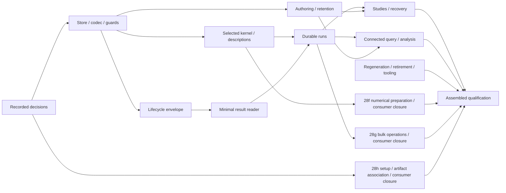

# 28: SurrealDB unified simulation substrate

## Purpose, decisions and evidence boundary

Build one canonical SurrealDB substrate for authored problems and revisions, semantic
dependencies and portable compilation descriptions, run/study state, scientific results and
analysis lineage. Ordinary application runs retain their scientific outcomes automatically.
Native connected queries and Arrow export make those outcomes available by exact
problem/revision/run/output selection after restart. Selected compilation uses database-native
structural operations and shared scientific kernels instead of lowering an entire source
bundle at every request.

The [unified-substrate review](../design_review/reviews/design_review_surrealdb-unified-simulation-substrate_2026-10-05.md)
accepted this direction at **Proposed** design strength. Its findings and the
[earlier efficiency review](../design_review/reviews/design_review_execution-efficiency-and-surrealdb_2026-10-05.md)
supply the basis. This coordinator owns the combined target, shared decisions, sequence and
US01–US05/EF01–EF08/F01–F05/PE01–PE06 dispositions. Companions own package progress/local evidence; E owns
assembled qualification. Architecture sections and ADRs retain their authority roles.

The maintainer explicitly accepted RC01–RC10 on **2026-10-05**, then selected a **clean rebuild
and hard pivot** and **native queries plus Arrow**, retiring DataFusion SQL convenience.
These decisions supersede the review's preserving-import assumption and optional SQL
projection route. Regenerate controlled scientific artifacts; introduce no legacy importer,
compatibility reader or dual-write period. Target history and ongoing recovery remain required.
Plan authoring implements these documents; production execution begins with R0 when that
scope is authorized.

Inspected baseline: main at `6498b013e579ec8039573200c92282eb8715b52e`, including concurrent
uncommitted Plan 27 accuracy work and review/evidence documents. Preserve concurrent edits.
The [Plan 27 checkpoint](27-contextual-engineering-accuracy.md#current-checkpoint) records
functional handoff; [25k](25k-integrated-qualification-and-closure.md#current-execution-checkpoint)
retains original scientific finding dispositions and incomplete campaign evidence. Applicable
scientific obligations transfer to E's target campaign without a requirement to finish the
obsolete PG/Delta campaign first. Previous focused passes and this design acceptance do not
qualify the new store, codec, compiler boundary or durable lifecycle.

## Reading route and shared contract owners

| Document | Responsibility and contract ownership |
|---|---|
| [28a — Canonical substrate and revisions](28a-canonical-substrate-and-revisions.md) | Deployment/acknowledgment profile; one schema/codec declaration route; immutable versions, membership/head/name guards; retention and protected reads. |
| [28b — Selected compilation and reuse](28b-selected-compilation-and-reuse.md) | Selected kernel inputs; scientific admission; portable products and complete dependencies; relevant implementation identity and native preparation. |
| [28c — Durable execution and studies](28c-durable-execution-and-studies.md) | Run/attempt/study meaning, claims/generations/cancellation, bounded staging and terminal admission. C1 supplies the early execution/result envelope. |
| [28d — Connected results and analysis](28d-connected-results-and-analysis.md) | Result physical layout, exact selectors, native Rust/Python queries, Arrow streams and graph-analysis lineage. |
| [28e — Rebuild, retirement and qualification](28e-rebuild-retirement-and-qualification.md) | Regenerated adoption corpus; continuing deletion/dependency/build integration; sole assembled target campaign and closure. |
| [28f — Shared numerical projections and preparation](28f-shared-numerical-preparation.md) | Ordered identity projections, immutable checked preparation and compatible library/native owners across scientific workflows. |
| [28g — Bulk data operations](28g-bulk-data-operations.md) | Shared physical admission, sufficient acknowledgments, composed protected acquisition and comparable source/analysis/authoring migrations. |
| [28h — Native setup and artifact identity](28h-native-setup-and-artifact-identity.md) | Operation-scoped verified installations, actual capability setup and separated artifact/outer-provenance association. |

The document division expresses responsibilities, not sequential phases. Conceptual
products do not require a new crate/type/service for each concept. Root coordinates shared
declarations, generated outputs, manifests and integration.

## Combined target and foundation decisions

Repurpose `pse-operations` as the concrete substrate boundary with the remote client there.
Retire `pse-operations-queries` and `pse-catalog` after their consumers move. Select a supervised
authenticated loopback server using RocksDB, synchronous transaction acknowledgment and
explicit gRPC streaming. [28a](28a-canonical-substrate-and-revisions.md#server-profile-and-acknowledgment-contract)
owns the exact profile and qualification limits. This isolates engine builds/resources from
semantic crates and serves multiple workers without a second storage abstraction.

Existing semantic declarations, scientific kernels, solver routing, native attempt ownership
and typed Python/Arrow boundaries remain useful foundations. Change their consumed input and
lifecycle contracts where whole-package hydration, lost admission context or whole-study
dispatch obstruct the target. Database queries/functions supply structural resolution and
dependency operations. Shared Rust kernels retain physical inference and scientific admission;
Symbolica/Numerica and class-specific native libraries retain mathematical execution.

Native tables and bounded homogeneous result blocks serve scientific selections alongside
canonical graph relationships. Do not store every dense scalar as a graph node or retain a
complete in-memory bundle beside results. Exact scientific bit/domain codecs are authoritative;
finite numeric projections are derived. Topology, semantic dependencies, incidence, execution
order and numerical sensitivity remain distinct meanings. Their connection supports new
analyses without conflating them.

Linear per-problem revisions and changed membership intervals make edits local. Named guards
cover head, absence and set-membership premises; complete semantic dependencies govern reuse.
Retry the whole decision after conflict. Snapshot transactions do not imply predicate
serializability. Native work and large ingestion stay outside short claim/admission
transactions. Protected source/interpretation selections become retained product roots before
compilation releases protection. Closed private staging followed by atomic admission of its
exact descriptor supplies coherent visibility without a giant completion transaction or late
batch leakage.

Portable descriptions survive restart; native evaluators, Salsa handles and mutable solver
state do not become persisted data. Retain dirty-build attestation at the outer run while
keying products by complete relevant dependencies. Validation reuse carries actual
interpretation; new states, changed context and imports receive their scientific checks.
Correctness testing continues to force validation explicitly.

Remove canonical PG/Delta composition, generated SQL/COPY machinery, mandatory publication,
cross-store settlement and displaced source conversions/caches. Retain exactness,
interpretation, fences, cancellation/drain, recovery, retention, protected long reads, schema
evolution and backup. Retire SQL convenience APIs, including modeling-knowledge SQL; preserve
Arrow export. E2 may retain DataFusion for a necessary remaining capability with an actual
consumer, without a SQL compatibility service or bespoke optimizer replacement.

The benefit is a unified operation route and less repeated/induced machinery. Calling a new
database beneath the unchanged full pipeline would not supply it. Structural removal is
required without a database timing premise. Build/preparation/dispatch/read gains remain
**Proposed** until E4 measures comparable operations.

## Rule changes confirmed by the maintainer

Every item below is **Accept, 2026-10-05**. These are operator decisions, not accepted ADR
status. R0 schedules their decision/design route before dependent production changes.
Exact source rules remain in the review's [rule impacts](../design_review/reviews/design_review_surrealdb-unified-simulation-substrate_2026-10-05.md#rule-impacts).

| Item | Accepted consequence | Route and dependent work |
|---|---|---|
| [RC01](../design_review/reviews/design_review_surrealdb-unified-simulation-substrate_2026-10-05.md#rc01) | Replace D10 canonical PG/Delta owners with SurrealDB. | Superseding ADR for ADR-0114/D10; design amendment to blueprint §20/§20.6 before A/C/D. |
| [RC02](../design_review/reviews/design_review_surrealdb-unified-simulation-substrate_2026-10-05.md#rc02) | Normal runs automatically retain scientific outcomes; explicit ephemeral opt-in. | Durability ADR/design route; blueprint §19/§20/§21.1 and runtime/public contracts before C2. |
| [RC03](../design_review/reviews/design_review_surrealdb-unified-simulation-substrate_2026-10-05.md#rc03) | Preserve D1 declaration authority; replace storage lowerings and retire persistence-only generation. | Metadata/boundary ADR; blueprint §4.1–§4.2/§22.1–§22.2 before A2/D1/E2. |
| [RC04](../design_review/reviews/design_review_surrealdb-unified-simulation-substrate_2026-10-05.md#rc04) | Native structural operations, durable descriptions and shared kernels; Salsa as accelerator. | Compilation/D10 ADR; blueprint §14.3–§14.4/§20.4 before B1/B2. |
| [RC05](../design_review/reviews/design_review_surrealdb-unified-simulation-substrate_2026-10-05.md#rc05) | Complete outer attestation separated from dependency-complete product identity. | Hashing/D14 ADR; blueprint §5.3/§20.4 before B3. |
| [RC06](../design_review/reviews/design_review_surrealdb-unified-simulation-substrate_2026-10-05.md#rc06) | Narrow feature stabilization to actual consumers, preserve family coherence. | Supersede affected ADR-0122 scope if changed; hakari/agent guidance updates through R0/E2. |
| [RC07](../design_review/reviews/design_review_surrealdb-unified-simulation-substrate_2026-10-05.md#rc07) | Scoped/batched study policy and guarded claims preserve occurrence/start/cancel meaning. | Durable claim/commit ADR/design route before C1/C3; policy remains one semantic owner. |
| [RC08](../design_review/reviews/design_review_surrealdb-unified-simulation-substrate_2026-10-05.md#rc08) | Native connected queries and Arrow; retire Runtime/knowledge/TableReader SQL convenience. | Python-boundary ADR and blueprint §21.1 before D2. |
| [RC09](../design_review/reviews/design_review_surrealdb-unified-simulation-substrate_2026-10-05.md#rc09) | Canonical visibility/retention/read protection replaces Delta protocol; clean rebuild supersedes import. | ADR-0114 supersession; blueprint §20.4–§20.6 before A3/C4/E1. |
| [RC10](../design_review/reviews/design_review_surrealdb-unified-simulation-substrate_2026-10-05.md#rc10) | Scoped build setup, obsolete generation retirement and unchanged-output preservation. | Ordinary tooling/generator edits in E2; no separate ADR solely for these fixes. |

D5 physical typing, D6 library mathematics, D11 attempt-owned native state and D13 immutable
model/overlay meaning are preserved. D14 dependency completeness is refined, not weakened.
Adding a dependency needs no ADR by itself; crate removal and the decisions above do.

The maintainer also explicitly confirmed **Accept, 2026-10-07** for the production efficiency
review's [RC01](../design_review/reviews/design_review_production-execution-efficiency_2026-10-07.md#rc01):
separate artifact-specific linked identity and actual observed deployment association from
complete dirty outer source/build observation at deployment/run admission. This is a different
item from the 2026-10-05 review's RC01 above. [28h L0/L3](28h-native-setup-and-artifact-identity.md)
routes the hashing/deployment ADR and architecture amendment before dependent implementation.
The existing ADR-0164 is proposed and can be amended through that route; an accepted record
at execution time must instead be superseded. Actual artifact association, complete consumed
inputs and outer provenance are preserved. Operator confirmation does not accept the ADR or
implement the new capture contract.

The maintainer explicitly confirmed **Accept, 2026-10-07** for the remaining-design
enhancement review's [RC01](../design_review/reviews/design_review_plan-28-remaining-design-enhancements_2026-10-07.md#rc01):
allow ordinary persisted preparation replay under independently established exact
deployment-local compatibility, keeping broader producer qualification optional. This is
distinct from both earlier RC01 decisions. [28h L5](28h-native-setup-and-artifact-identity.md#deployment-local-replay-and-build-output-derivation)
supplies the compatibility premises and decision/design amendment; [28b B5](28b-selected-compilation-and-reuse.md#ordinary-deployment-local-replay)
owns reconstruction. Amend proposed ADR-0164 and the governed deployment/replay explanation
with a blueprint revision before dependent implementation; supersede the ADR if its status
has become accepted. Operator acceptance is not ADR acceptance or implemented eligibility.
Missing compatibility refuses preparation reuse, not historical results or ordinary execution.
No strict source/compiler campaign, environment copy, forced rebuild or general change-impact
classifier becomes an ordinary restart prerequisite.

## Completion-audit reconciliation and capability decisions

The [completion audit](../design_review/reviews/design_review_plan-28-completion_2026-10-06.md)
assessed commit `06302af7748923100f17a7c8fda9c57b6a536690` with concurrent work and returned
**Revise**. The 2026-10-06 reconciliation below schedules its remaining obligations on the
current tree. The dated review and earlier Outcomes keep their original evidence conditions;
new source controls do not retrospectively turn failed or interrupted runs into passes.

Current source restricts generic retention to deliberate history and requires complete
initialization responses followed by interpretation verification. Native lifecycle,
initialization, selected cursor/staging, lost-ack and protected result-retirement controls pass.
Selected namespace pages and grouped payloads reserve resources before acquisition, complete
membership observations before dependency admission, and settle concurrent identical product
publication without a local shared token. Scalar replay and the modeling suite exercise the
current closure behavior. Scientific fixture and wire premises are corrected without changing
production accuracy defaults or original assertion thresholds. Current installed producer
association, the new long result/analysis control, E3 qualification, E4 measurements and final
E5 acceptance remain at E's owner. The dated audit retains its original failed/interrupted
scope. Preserve concurrent edits and integrate their actual owners.

The repo now selects the shared `neo4j-surrealdb` skill. The
[capability investigation](../design_review/evidence/plan-28-surrealdb-capabilities-2026-10-06/README.md)
compares exact 3.3.0 source/probes with current Context7, official documentation and GitHub.
Use bounded direct-ID/bulk acquisition, explicit namespace/database selection, native
versioned structural functions and named transaction guards within the existing owners.
`FOR UPDATE` supplies optimistic conflict registration for named records, including absent
IDs; it does not protect arbitrary predicate ranges. Every writer that can invalidate a
namespace/set premise must touch its stable named guard. Definite conflicts retry the whole
decision; uncertain acknowledgments require identity readback before another transition.

Regular typed relations remain suitable for metadata-bearing lineage. Evaluate INLINE edge
fields only for an actual selected traversal predicate; LIGHTWEIGHT edges cannot carry the
metadata or occurrence identity required by those relations. E4 measures any claimed benefit.
Awaited bounded SDK queries remain valid; no mandatory streaming rewrite is introduced.
Live queries/changefeeds and Surrealist may support a concrete observer or diagnosis, but do
not become lifecycle or qualification authorities. SurrealKit is not introduced: independently
authored desired-state schema would compete with registry generation and the clean rebuild.
Logical export/import is not a crash-backup substitute; A/E retain quiesced offline backup and
selected-profile restore validation. No dependency upgrade, Neo4j adoption or new migration,
scheduler, planner or telemetry framework is required by this investigation.

**Rule impacts:** None for this corrective scope, matching the completion audit. The original
accepted RC01–RC10 and their R0 adoption route remain in force. New evidence that requires a
material rule change returns to that route before dependent work; this revision does not
accept ADR-0164.

The next executable order is A's lifecycle/completion controls and E's valid inputs/producer
prerequisites; A/B grouped guarded acquisition; C/D composed recovery and stream/read controls;
then E3, E4 and E5. Independent targeted slices may proceed together with explicit ownership.
Only 28e owns assembled execution state; this coordinator owns all US/EF/F/PE dispositions.

## Repository-wide efficiency extension

The maintainer expanded the 2026-10-07 review follow-up to all comparable defect instances
throughout current functionality. Address causal patterns, not only the original tests or
example consumers: repeated identity joins, unchanged preparation/admission, mismatched physical
units, excessive crossings/materialization, repeated native assurance and broad invalidation.
Unrelated feature development, arbitrary solver replacement and a general optimizer/cache/
telemetry framework are not implied. Production contextual accuracy, test scheduling/timeouts,
server profile, exact codec/replay and independent scientific assessment remain unchanged.

The product baseline is `5260a3e9a3cecd69b6358ab86d4e917ae2508b29`, preserving the dirty review
and plan documents. Focused source assessment covered the owners below, reusing the review's
exact-release evidence. PE01–PE06 retain their original diagnosis/evidence limits. Additional
preflight and trajectory lookup amplification is source-established; other matches remain
specific investigation candidates. Neither the interrupted timings nor a textual search proves
their speed contribution or absence elsewhere.

### Capability coverage and migration ownership

| Current capability / inspected owners | Relevant pattern and assessment | Implementation route |
|---|---|---|
| Numerical policy/engineering accuracy; `pse-math` and native quality | PE01; per-goal target resolution adds the same kind/ID join. Preserve global/contextual defaults, exact precedence and frozen scales. | N0/N1 in 28f |
| Mathematical assembly/composite reconstruction; math/compiler modeling | Existing typed row/column maps and request deduplication are reusable. Repeated supplier correspondence and prior-instance searches need exact key/lifetime decisions. | N0/N1/N3 |
| Structural preflight/solver routing; `pse-structural`, native structural/runner | Preflight scans assessment rows per contract row after inventory-set checks. Small finite capability dispatch is justified work. Preserve contribution provenance and independent original-space checks. | N1; applicable N3 native consumers |
| Unit/property/thermodynamic mathematics; physical operations, compiler specialization, runtime math | Shared admitted bodies/artifacts are foundations; state/composition-dependent property values remain fresh. No production FeOS-provider migration. Check extension callers for repeated preparation, not presumed identical property results. | N0/N2/N4 |
| Dynamics/events/trajectory/shooting/recycle; runtime and native backends | Sample×output trajectory metadata lookup is established; dynamic goal/control/node mapping and compatible factor/session storage are candidates. Time/event/schedule changes retain their own work. | N0/N1/N3/N4; T1 publication |
| Fitting/sensitivity/uncertainty; runtime fitting and response owners | Existing sparse contribution/Gram plans are strengths. Covariance parameter joins, repeated pinned fits and fresh native owners need bounded applicability decisions. | N0/N1/N3/N4 |
| Ordinary solves, initialization, continuation/studies/workers; modeling and staged runtime | PE04 repeats selected hydration/generic admission for ready occurrences; physical cache and scoped native sessions already retain useful work. Distinct starts/claims/attempts remain distinct. | N2/N3/N4; C3 integration |
| Authored document edits and physical source publication/reopen; authoring driver and workflow worker | Edited bundle copies unchanged bytes; source chunks cause serial revisions and singleton reopen chains. Parser-owner reuse/grouped selected acquisition are existing alternatives. | T0/T3/T4/T5 |
| Relations/columnar/engine | Checked buffers, prepared validation owners, multiplicity-aware gathers and selective streaming are foundations. Assess actual unnecessary collection; shallow clones and required owner-change validation remain justified. | T0/T5; N2 where admission is genuinely repeated |
| Progress/results/query/analysis/retention/export; operations/runtime | PE02/PE03; analysis node/edge loops and recovery metadata are candidate groups. Preserve page completeness, renewable protection, endpoint ordering and activation. | T0–T5; A/C/D integration |
| Rust/Python interfaces and worker processes | Typed ingress and Arrow C streams are strengths. Mechanisms migrate at Rust owners; wrappers preserve actual completion, schema, role and allocation lifetimes. | N4/T5/L4; D integration |
| Native providers, build/generation, producer/deployment/validation tooling; scripts/buildinfo/xtask | PE05/PE06, nested HiGHS discovery and related installation/capture consumers. No-op generated output handling already exists and must be retained. | L0–L4; B3/E2 integration |

This table defines functional coverage and work routing, not a source-proof manifest or another
finding-status ledger. At each N0/T0/L0 investigation, follow actual callers and first-party
generator/registry sources beyond the starting pointers. Classify matches as confirmed,
candidate or justified necessary work; finish unexamined variants that can change the design.
Do not stop at the illustrative consumers or demand an exhaustive graph of every function.
Every newly confirmed comparable instance joins the owning migration package in this series.
A distinct material defect receives a coordinator finding/decision route rather than being
silently included in a local rewrite. No supported confirmed variant is deferred without an
explicit disposition and observable trigger at the existing owner.

### Common target and foundation decisions

Use one authoritative set of mechanics per causal family, customized through its actual domain
owner: ordered projections, checked immutable preparation, byte/extent admission, sufficient
effect acknowledgments/protected grouped reads, verified installation lifetime and artifact
association. Different identity spaces, scientific policies and effect/recovery obligations
remain explicit. Share operation-shaped products and existing library capabilities, not copied
end-to-end workflows or a universal new abstraction.

28f owns numerical projection/reuse details; B owns selected scientific closure and portable
eligibility. 28g owns physical admission/crossing corrections; A/C/D retain revision, attempt,
visibility and lineage meaning. 28h owns setup/provenance corrections; B3/E2 integrate their
actual producer and deployment consumers. Each package moves producers, consumers and generated
declarations together, then deletes displaced mechanisms/callers/tests/fixtures when its focused
controls pass. A second production path is not a temporary completion strategy.

Conditional Taylor-zero, numeric factor/scratch, Salsa/native-session and query/provider choices
are bounded N0/T0 decisions with specified evidence and dependent work. Inspect source/contracts
first; perform a small observation only when it chooses between consequential alternatives.
Unused library features do not mandate integration, and necessary assurance is not removed
because a search resembles repetition. Configurable policies have one declared default and
explicit consumed override; neither tests nor individual workflows invent new defaults.

### Execution and completion of the extension

L0 records the accepted identity route and installation contract before L1/L3. N0/T0 resolve
their relevant maps/physical units; established N1 projections, T2 acknowledgments and T3 result
reads need not wait for speculative library/index choices. N2 immutable admission, T1 ingestion
and L1 scoped setup can proceed independently with explicit shared-file ownership. N3/T4/L2/L3
consume their actual prerequisite slices. N4/T5/L4 reconcile every functional row and actual
caller; they cannot postpone migration/deletion needed by an earlier package.

E3 starts after all adopted functional extension work and existing A–E obligations are complete.
E4 measures the appropriate preparation/build/numerical/persistence operations; E5 assesses the
assembled supported target and resolves findings with evidence. Keep all current open scientific
obligations transferred to E and their original disposition owners. This authoring work neither
resumes the interrupted campaign nor claims a speedup or scientific acceptance.

## Remaining-design enhancement integration

The [2026-10-07 enhancement review](../design_review/reviews/design_review_plan-28-remaining-design-enhancements_2026-10-07.md)
assesses implemented supporting design and remaining target independently, then reconciles
them. Its four supporting corrections and accepted replay target fit B/C/E/N/T/L; no new
companion is needed. Its review-qualified F01–F05 are different from the completion audit's
F01–F05. This coordinator owns their dispositions, including the opportunities below.

The current foundation at `dacc9c33225990984ddbd1d356e797389f02fef3` has checked selected
admission, bounded operations, retained native owners and immutable installations. Stored-study
creation still rebuilds declared admission per point; dynamic workers rebuild program-fixed
layouts; IDAS jump elimination repeats factorization of the same sample matrix; sealed receipt
permissions leak into Cargo outputs. Default restart preparation replay still needs a qualified
producer. Document adoption changes none of those implementation facts.

Retain different valid lifetimes: C5's study-scoped declared basis, B5's protected deployment
reconstruction, N5's program-fixed layout and N6's sample-local factor. Mutable values,
providers, guards, candidate permission, seeds and attempt fences remain independently owned.
These remedies must not grow a second cache, reconstruction checker or numerical algorithm.

| Prerequisite slice | Delivered contract and dependent work |
|---|---|
| 28h L6 | Exact sealed receipt bytes become writable Cargo-owned output, including repeated/read-only destinations; restores the affected native validation route without a provider rebuild. |
| 28c C5 with N2/N4 | Stored-definition admission shares a compatible basis but validates every binding/seed role; caller cancellation reaches creation and settles ambiguous activation. Actual default durable/Python study routes are required consumers. |
| 28h L5 then 28b B5 | Record RC01's decision route, establish independently observed deployment compatibility and implement ordinary reconstruction through the existing protected scientific checker. Closure uncertainty blocks only B5, not ordinary fresh execution or other corrections. |
| 28f N5/N6 | Retain immutable dynamic layouts and sample-local factors; instantiate/refactor current numerical state under existing limits. N4 reconciles dynamics, fitting and shooting consumers. |
| 28f N7; 28g T6 | Settle fitting demand/cache upgrade and selected query access paths. Each ends in an adopted correction or reasoned retained design with owner, applicability and observable reopen trigger. Required corrections join N4/T5; speculative evaluator/history/streaming replacements do not. |
| E1/E2 then E3/E4/E5 | Obtain affected failure diagnostics, complete functional corrections and migrated consumers, compose local correctness/recovery, measure applicable operations and assess closure. Previous positive evidence keeps its original scope. |

Library conclusions from the review are reusable evidence, not transferred performance proof.
Source establishes layout/factor repetition and a direct combined fitting capability; it does
not establish the unfinished run's dominant phase. Symbolica interpreter cloning, compiled
evaluator trust/ABI, native checkpoint continuation and storage streaming remain different
questions. Additional Context7/exact-release research or bounded observations are needed only
for an unsettled consequential contract, not a feature census or another full design review.

## Execution sequence and readiness

**R0 — Record the approved target through the decision/design route.** Allocate proposal(s)
with the ADR skill, covering canonical authority, schema/metadata, identity, commit and Python
contracts plus crate retirement. Do not preassign IDs or edit accepted records in place.
Link the accepted source review and obtain the binding's focused review of material
rebuild/API/identity departures where required before ADR acceptance. Amend affected
architecture owners with a blueprint revision row through the decision/design change.
R0 records governing contracts, not implementation acceptance.

Then implement actual slices of the target:

| Useful order | Required working capability | Work unblocked |
|---|---|---|
| A1 then A2 early slice | Supervised store, exact codec, immutable identities, named guards and preparation protection/root admission. | B1, C1, D1 declarations and E1 regeneration. B1 need not wait for complete A3 authoring. |
| B1 then B2; C1 then D1 | Shared kernel, persisted descriptions with working ordinary-solve reconstruction; terminal envelope and actual minimal reader. | C2 durable execution. Agreement on types alone is not this prerequisite. |
| A3, B3, C2, D2 | Runnable revision edits, protected reads, numerical products, sealed runs and native/Arrow consumers. | C3 studies and D3 analysis; A3/C4/D2 jointly complete retention/read lifecycle. |
| C3/C4, D3 and B4 decision | Full study/recovery/analysis consumers and decided evaluator-layout obligation. | E3 after E1/E2 retirement completes. |
| E3 then E4 then E5 | Required correctness/recovery/static evidence, measurements and assembled assessment. | Closure at enduring architecture and finding owners. |

B4's library-signature investigation and E2's build/codegen fixes can proceed independently
of server readiness. EF08 does not block A/C/D. E2 joins migration continuously, rather than
delaying all deletion. Discovery is not claim authority, description design is not a working
compiler, and schemas are not automatically durable runs.

Root owns design and integration. Delegate independent consumers/research with explicit file
ownership when useful. Coordinate shared editing surfaces separately from logical dependencies;
preserve concurrent work. Package checks prove new mechanisms and trigger immediate legacy
deletion; static hygiene and assembled integration wait for all functional scope.

## Finding dispositions

This is the only current disposition table for the adopted unified-substrate and efficiency
findings, the completion audit and the [2026-10-07 production efficiency review](../design_review/reviews/design_review_production-execution-efficiency_2026-10-07.md).
It also owns the [remaining-design enhancement review](../design_review/reviews/design_review_plan-28-remaining-design-enhancements_2026-10-07.md).
A scheduled package or accepted rule is not resolution. Links identify local evidence owners;
resolve only when correction and relevant acceptance actually exist. US/EF/F scenario IDs
refer to their originating reviews; PE scenario IDs refer to the new review. The PE entries
now schedule the documented repository-wide extension; authoring is not implementation or
correction evidence and does not change scientific acceptance criteria.

| Finding | Review scenarios | Disposition | Work owner | Required evidence or question |
|---|---|---|---|---|
| [US01](../design_review/reviews/design_review_surrealdb-unified-simulation-substrate_2026-10-05.md#us01) | S01/S03/S04/S07 | Scheduled | A/C/D; E2/E3 | Canonical connected operations, old-store retirement and coherent visibility after restart. |
| [US02](../design_review/reviews/design_review_surrealdb-unified-simulation-substrate_2026-10-05.md#us02) | S03/S04/S07 | Scheduled | C2/C4; D1/D2 | Ordinary success/failure/partial scientific retention, beyond completion records. |
| [US03](../design_review/reviews/design_review_surrealdb-unified-simulation-substrate_2026-10-05.md#us03) | S04/S06/S07 | Scheduled | A2; D1; E3 | Independently specified exact codec/protocol/Arrow controls. |
| [US04](../design_review/reviews/design_review_surrealdb-unified-simulation-substrate_2026-10-05.md#us04) | S02/S03/S07 | Scheduled | A2/A3; C1/C3/C4 | Named absent/set premises, whole-decision retry, generations and retention races. |
| [US05](../design_review/reviews/design_review_surrealdb-unified-simulation-substrate_2026-10-05.md#us05) | S01/S02/S05/S08 | Scheduled | B1/B2/B3 | Selected sufficient scientific inputs and complete portable dependencies. |
| [EF01](../design_review/reviews/design_review_execution-efficiency-and-surrealdb_2026-10-05.md#ef01) | S01/S02/S07 | Scheduled | A3/B1; E3 | Active owner releases complete superseded bundles; deliberate durable history remains. |
| [EF02](../design_review/reviews/design_review_execution-efficiency-and-surrealdb_2026-10-05.md#ef02) | S01/S02/S08 | Resolved | B1/B2 | [B Outcome](28b-selected-compilation-and-reuse.md#outcome-recorded-after-implementation): actual native-owner retention, same-owner reuse and changed-context/value controls; force-validated relation/engine/document selections passed 22/26/6 controls. |
| [EF03](../design_review/reviews/design_review_execution-efficiency-and-surrealdb_2026-10-05.md#ef03) | S03/S07 | Scheduled | C3; E4 | Scoped/batched dispatch and ready-attempt preparation. |
| [EF04](../design_review/reviews/design_review_execution-efficiency-and-surrealdb_2026-10-05.md#ef04) | S06/S08 | Scheduled | E2 | Dependency removal, narrowed unification and isolated client closure. |
| [EF05](../design_review/reviews/design_review_execution-efficiency-and-surrealdb_2026-10-05.md#ef05) | S01/S02/S06 | Scheduled | B3; 28h L0/L3 | Relevant complete keys, actual role/artifact association and full dirty outer observation under confirmed production RC01. |
| [EF06](../design_review/reviews/design_review_execution-efficiency-and-surrealdb_2026-10-05.md#ef06) | S06/S08 | Scheduled | E2/E4; 28h L1/L2 | Actual target capability closure before native setup, scoped verified installations and comparable build/setup observations. |
| [EF07](../design_review/reviews/design_review_execution-efficiency-and-surrealdb_2026-10-05.md#ef07) | S05/S06 | Scheduled | A2/E2 | Obsolete outputs retired; unchanged output mtimes stable; stale outputs deleted. |
| [EF08](../design_review/reviews/design_review_execution-efficiency-and-surrealdb_2026-10-05.md#ef08) | S01/S07 | Resolved | B4 | [B Outcome](28b-selected-compilation-and-reuse.md#outcome-recorded-after-implementation): actual evaluator accepts selected compact formals; migrated consumers and 26 native implicit controls preserve guards, providers and ordered derivative axes. No measured speedup is inferred. |
| [F01](../design_review/reviews/design_review_plan-28-completion_2026-10-06.md#f01) | S01/S03/S07 | Resolved | A3; C2/C4 | [A Outcome](28a-canonical-substrate-and-revisions.md#outcome-recorded-after-implementation): native generic lifecycle-root refusal, history mutation and protected reclamation controls pass; enclosing E3 remains separate. |
| [F02](../design_review/reviews/design_review_plan-28-completion_2026-10-06.md#f02) | S01/S02/S08 | Scheduled | A2; B1; E4 | Exact pinned namespace cursors, pre-RPC reservations, grouped manifests/payloads and concurrent acknowledgment settlement have positive targeted controls at [E Outcome](28e-rebuild-retirement-and-qualification.md#outcome-recorded-after-implementation). Complete-operation measurements remain E4. |
| [F03](../design_review/reviews/design_review_plan-28-completion_2026-10-06.md#f03) | S03/S07 | Resolved | A1 | [A Outcome](28a-canonical-substrate-and-revisions.md#outcome-recorded-after-implementation): zero-result, lost-ack, cancellation, normal/repeated creation and marker refusal controls pass. They do not establish the cause of historical missing-table failures. |
| [F04](../design_review/reviews/design_review_plan-28-completion_2026-10-06.md#f04) | S01/S03/S04/S07 | Scheduled | E1/E2; B3; C/D; E3 | Validate corrected fixture/wire premises, producer mechanism controls, progress and intended-point scientific controls, then complete the stable assembled development campaign against zero under [E's evidence policy](28e-rebuild-retirement-and-qualification.md#development-phase-evidence-and-optional-artifact-requalification). |
| [F05](../design_review/reviews/design_review_plan-28-completion_2026-10-06.md#f05) | S06/S08 | Scheduled | B3; E3/E4/E5 | Development functional campaign, all applicable prepared measurements, accepted assembled review and enduring-owner retirement route; actual installed strict deployment qualification is explicit optional scope under [E's evidence policy](28e-rebuild-retirement-and-qualification.md#development-phase-evidence-and-optional-artifact-requalification). |
| [PE01](../design_review/reviews/design_review_production-execution-efficiency_2026-10-07.md#pe01) | S02 | In progress | 28f N1/N4; numerical policy/quality consumers | Shared ordered kind/ID projection and confirmed related maps; frozen scales, allowances, attribution and refusal controls. No tolerance changes. |
| [PE02](../design_review/reviews/design_review_production-execution-efficiency_2026-10-07.md#pe02) | S03/S05 | In progress | 28g T0/T1/T5; C/D | Payload/index/resource admission and generated finite replay bounds replace scalar-count-driven framing. Exact rows/indexes, coverage, atomic visibility and complete-route E4 observations remain. |
| [PE03](../design_review/reviews/design_review_production-execution-efficiency_2026-10-07.md#pe03) | S03/S05/S10 | In progress | 28g T2/T3/T5; C/D | Compact sufficient append acknowledgment and composed protected acquisition; distinct replay/read completion, expiry and cancellation controls. |
| [PE04](../design_review/reviews/design_review_production-execution-efficiency_2026-10-07.md#pe04) | S01/S04/S10 | In progress | 28f N0/N2/N4; B/C3 | Bounded immutable checked selected preparation, complete invalidation and fresh protection; all confirmed repeat consumers migrate without merging occurrences or attempt state. |
| [PE05](../design_review/reviews/design_review_production-execution-efficiency_2026-10-07.md#pe05) | S06 | In progress | 28h L0/L1/L2/L4; E2 | Operation-scoped verified generation and actual capability setup; corruption/provider/input and concurrent-use/drain controls. Refines EF06 without claiming a measured bottleneck. |
| [PE06](../design_review/reviews/design_review_production-execution-efficiency_2026-10-07.md#pe06) | S07 | In progress | 28h L0/L3/L4; B3/E2 | RC01 confirmed 2026-10-07; actual artifact-specific association plus complete outer observation, relevant/unrelated edit and genuine installed-role controls. |

The efficiency review's conditional query-plan, Taylor-zero, numeric-scratch and related
library options have bounded N0/T0 decision routes; applicability precedes dependent changes.
Its RC01 is explicitly confirmed above. Scheduling documents is not correction evidence or
production execution. Prior US/EF/F dispositions and historical scientific evidence remain
at their existing owners; none is resolved by the extension or substituted for E3/E4/E5.

### Enhancement-review dispositions

The labels below qualify the originating review; they do not rename its finding IDs or the
earlier completion audit. All corrections are scheduled, not resolved by document adoption.

| Finding or obligation | Review scenario | Disposition | Work owner | Required evidence or settling decision |
|---|---|---|---|---|
| [Enhancement F01](../design_review/reviews/design_review_plan-28-remaining-design-enhancements_2026-10-07.md#f01) | S01/S06 | Scheduled | C5; N2/N4; E3 | Actual stored/default study basis reuse, every binding/seed role checked, distinct occurrences, changed premises and creation cancellation. |
| [Enhancement F02](../design_review/reviews/design_review_plan-28-remaining-design-enhancements_2026-10-07.md#f02) | S02 | Scheduled | L5; B5; E3 | Accepted RC01 route, independently established effective deployment context and actual default worker/Python restart reconstruction; absent/changed premises refuse reuse only. |
| [Enhancement F03](../design_review/reviews/design_review_plan-28-remaining-design-enhancements_2026-10-07.md#f03) | S03 | Scheduled | L6; E2 | Repeated exact receipt materialization, changed bytes and existing read-only destination; sealed generation stays unchanged; affected native route executes. |
| [Enhancement F04](../design_review/reviews/design_review_plan-28-remaining-design-enhancements_2026-10-07.md#f04) | S04 | Scheduled | N6; N4; E3 | One current sample factor for distinct directions, current-value refactorization, first/second-order production-basis checks and failed-factor recovery. |
| [Enhancement F05](../design_review/reviews/design_review_plan-28-remaining-design-enhancements_2026-10-07.md#f05) | S05 | Scheduled | N5; N4; E3 | Shared admitted layout, private concurrent scratch, changed coordinate/support premises and extent/refusal controls across actual consumers. |
| [Transient fitting demand](../design_review/reviews/design_review_plan-28-remaining-design-enhancements_2026-10-07.md#library-fit-and-remaining-investigations) | S05 | Scheduled | N7; N4 | Gradient-first combined report/derivative, cheap objective-only route, coherent value-first cache upgrade; no assumed checkpoint continuation. |
| [Selected storage access paths](../design_review/reviews/design_review_plan-28-remaining-design-enhancements_2026-10-07.md#library-fit-and-remaining-investigations) | S07 | Scheduled | T6; T5; D1/D2 | Current bound source/result/analysis queries under selective/empty/skewed inputs; adopted correction or supported retained design, preserving protected byte-bounded completion. |

Other preparation work is included in B3/C3: ready-attempt preparation/product sharing,
bounded Salsa diversity and native lifetimes. General SIMD/JIT/WASM, distributed deployment
and optional generic tools are outside required scope unless a concrete consumer need changes
the contract. Material new decisions return to their owner through existing governance.

## Verification

**Proposed acceptance:** companions specify targeted controls and deletions. E3 runs the sole
assembled target campaign after functional work; E4 measures applicable operations and E5
performs the binding's assembled assessment. [28e](28e-rebuild-retirement-and-qualification.md#verification-and-assembled-acceptance)
owns command selection and prior scientific campaign transfer. Correctness testing retains
force-validation and memory-capped native execution. Failure baseline is zero.

Completion requires working authoring/reuse/run/query journeys, automatic durable outcomes,
exact scientific values/interpretation, correct concurrency/restart recovery, migrated
Rust/Python consumers and deletion of replaced mechanisms. Execute and report the selected
campaigns/measurements; no invented speedup threshold is inferred from architectural
acceptance. Unsupported scientific/provider scope remains explicit. Document checks of this
series do not establish those product claims. The expanded completion boundary includes
N4/T5/L4 caller/coverage reconciliation: no confirmed comparable variant remains on a displaced
mechanism, and justified distinct contracts and conditional retained-design decisions are explicit.

## Current checkpoint

The enhancement review is integrated on the `dacc9c33225990984ddbd1d356e797389f02fef3`
foundation. RC01 is accepted; L5/B5's decision route and implementation remain pending.
C5, N5–N7, T6 and L6 are new scheduled scope, not already qualified extensions of earlier
package passes. E owns the interrupted stable assessment and affected diagnostic route.
Next restore receipt derivation and obtain actual Python failures; perform C5/N5/N6 and
decision-ready N7/T6 work; settle and implement L5/B5 before ordinary restart acceptance.
The corresponding functional scope precedes E3, applicable E4 and E5. Earlier checkpoint
notes below retain their original evidence and are superseded as current execution directions.

The earlier correction baseline was `5260a3e9a`, recording the continuation from
`219338742` without changing its reviewed product bytes. At the maintainer's request, the current qualification runner was
stopped to conduct the [production execution efficiency review](../design_review/reviews/design_review_production-execution-efficiency_2026-10-07.md).
[28e's current handoff](28e-rebuild-retirement-and-qualification.md#efficiency-review-handoff-2026-10-07)
owns the interrupted campaign, retained evidence and resumption boundary. Review publication
does not implement its proposed corrections or establish E3/E4/E5 acceptance. The current
review's dispositions belong here. The 2026-10-07 plan-creation extension above and 28f/28g/28h
now supply detailed corrective scope, repository-wide investigation and migration packages.
RC01 is explicitly accepted; its decision route remains an implementation prerequisite.
The next route is N0/T0/L0 and their ready corrective slices, followed by consumer closure
and E3/E4/E5. Production and the preserved interrupted evidence are unchanged by authoring.
D3 retains regular indexed edges.

Remaining-scope execution on 2026-10-06 has completed grouped exact namespace,
supplier, record, document and physical acquisitions, including complete-inventory
premises and precharged hydration. Deployment qualification now checks the actual
selected Cargo root against the receiving executable target. Study claim/summary
uncertainty uses exact existing operation receipts; native start uncertainty uses a
fresh invocation receipt, preventing another call from recovering an earlier start.
The server also admits only one start per actual attempt, while an authored retry
retains prior failure history and starts a distinct attempt. Multipage result protection
hands off to an admitted analysis before retirement. Focused controls and bounded
implementation review are positive; scope-end checks and fresh installed deployment
association precede E3. The selected supervised profile has positive abrupt
restart and quiesced offline restore evidence. Build review now expresses the
retired vendor directory's absence explicitly; stale or reappearing inputs refuse
qualification. The result-chain measurement exercises actual retained trajectory,
selected-output and paged analysis reads, with global engineering accuracy and
exact original transport checks. Its functional smoke exposed a quadratic checked
row-selection memory reservation; the correction preserves repeated/nested-value
accounting and its targeted controls and the complete smoke now pass. The smoke
also corrected a scalar-only validation assertion to exercise actual trajectory
endpoint, feasibility and full authored sample-check obligations.
Sensitivity qualification controls now use the production default policy, actual
returned candidate, frozen parameter/output coordinate scales and admitted engineering
allowances. Base error, derivative response and perturbed endpoint agreement are
separate empirical checks; a factor backsolve diagnostic adds no tighter solve
requirement. Native Ipopt/POUNCE perturbation coverage and exact matrix/transport
mechanics remain. The shared restart fixture also resolves production accuracy rather
than substituting a verification budget. Parity and the affected native/runtime controls
now pass. The restart comparison uses its original objective as the decision quantity
and retains exact transport and iteration-reduction controls; physical feasibility
budgets imply no coordinate-error guarantee. Current worker/Python producer captures
are eligible and share the actual source/build attestation. The installed Python
artifact matches the captured producer binary after Maturin's exact editable RPATH
transformation; its public solve/reopen control independently observes that same
attestation and reopens the original revision. The assembled gate remains next.
The genuine cross-role control uses the independently observed imported Python
run-header attestation rather than each receipt's own claimed pair. Current
exclusive source/deployment ownership is retained for the assembled campaign.
Measurement admission now recognizes both exact standalone and assembled native
gate declarations, including the latter's producer-fixture prerequisite, while
arbitrary selections/dependency edits still refuse. E4 measurements and E5 acceptance
remain open at 28e.

On 2026-10-06 the maintainer authorized implementation of all functional scope across
28a–28e using the capability-informed execution approach. Functional work and targeted
tests come first. The interrupted A/B integration selections join E3 after A/B/C/D and
E1/E2 functional scope is implemented; they are not prerequisites for continuation.
A/B functional implementation is present; their owning checkpoints and Outcomes retain
the original evidence and its limits. Ordinary deployment producer qualification remains
required for actual persisted replay rather than only the finite qualification fixture.
ADR-0164 is proposed under implementation authorization and has a recorded architecture
revision route; formal ADR acceptance remains separate from implementation evidence.

Canonical revisions, selected compilation, strict portable reconstruction and compact
formal preparation are implemented. Managed source/worker and native recovery controls
have positive focused evidence. Full generation and the final local native-owner controls
are complete. Source review now closes the selected executable-I/O/configuration/native
input gaps. Fresh current runtime, worker and Python captures and their deployed-artifact
association remain under qualification; a finite actual tool fixture establishes only
scoped qualification and persisted replay behavior.

The earlier **2026-10-06** closeout produced committed HEAD `0b4abf7c6`. A/B acceptance
remains open: the applicable scientific assertions from the selected Python campaign and
assembled Rust selection transfer to E3 on the fully migrated target.
The earlier reference-only Python run passed its process case; its unfinished 1,000-point
study was interrupted when switching to the final extension and is not a passed control.
The original workload, numerical assertions and resource settings remain unchanged.
The unfinished feature matrix was stopped at 236/316 completed selections, with selection
237 interrupted. It is partial evidence for that older source state, not qualification
of the full target. No old integrated campaign is resumed during functional implementation.

C/D's canonical run/result/query migration is implemented. Registry-owned run/attempt
identities, bounded ingestion, frozen descriptors and exact protected readers replace the
old publication route. Versioned native functions and bulk statements perform structural
transitions; scientific decisions retain their shared Rust owners. Dense observations use
self-contained uncompressed Arrow IPC blocks, with indexed metadata and preflighted decoder
extents. Narrow gRPC streams require successful statement completion; result reads associate
their selected run/attempt with A's protection lifecycle. Scoped study discovery carries actual
selected fields; full scientific descriptors are fetched by exact keys. Bounded exact physical
admission and IPC receipt reuse avoids repeated ingress during ready-occurrence preparation.
Fresh storage protection remains required on hits and through run/analysis root admission;
cache clear fences pending loads. Native lifecycle, retention, continuation, analysis and
escaped decoded-buffer controls have focused positive evidence.

E1/E2's schema/fixture regeneration, displaced crate and mechanism retirement, native build
locality and unchanged-output preservation are implemented. Native worker journeys, Python
boundaries and process benchmarks compile. The focused linked scientific and generated-contract
consumers have scoped positive evidence. Earlier runtime/worker qualification retains its
reviewed conditions; replaced build outputs require fresh current artifact association.
Installed Python capture, import association and eligible deployment admission also remain
before the functional handoff. The E3 attempt and bounded completion audit exposed
corrections; neither establishes acceptance. E4 measurements and final E5 review/closure
remain pending at 28e. Current finding dispositions stay
in this coordinator; focused companion evidence does not establish assembled acceptance.

## Outcome (recorded after implementation)

### What was built

**Implemented:** A/B's canonical revision, protected source/product storage, selected
compilation, portable reconstruction, relevant producer identity and compact preparation
mechanisms, including the authorized minimum adjacent consumers. Their
[A](28a-canonical-substrate-and-revisions.md#outcome-recorded-after-implementation) and
[B](28b-selected-compilation-and-reuse.md#outcome-recorded-after-implementation) Outcomes
own focused **Tested** evidence and the remaining acceptance. This is an implementation
checkpoint, not completed Plan 28 qualification. The subsequent full-series authorization
has implemented C/D and E1/E2's functional replacements, with focused evidence in their
companion Outcomes. Current Python deployment association and E3–E5 acceptance remain.

### A mistake made and corrected

The final obligation check exposed discarded native validation ownership despite selected
source hydration already being implemented. B's local admission and receiving boundaries
now retain that actual owner and recheck changed contexts. Earlier integration also
exposed product descriptions larger than a single RPC; A/B now use bounded immutable
blocks while retaining finite logical and process limits.

### Deviations from the plan, deliberate

The first execution was limited to A/B and the adjacent changes needed to run them, then
closed at the maintainer's request. The later full-series authorization supersedes that
boundary. Unsupported production producer inputs continue to refuse cross-build reuse;
focused receipts retain their actual scope, and no measured performance improvement or
full-series qualification is inferred.
