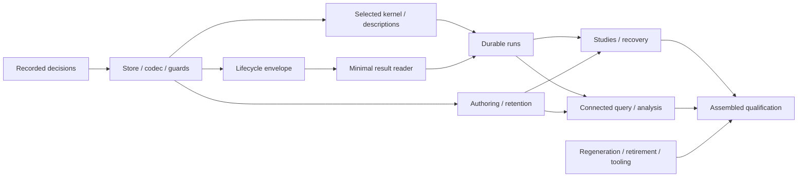

# 28: SurrealDB unified simulation substrate

## Purpose, decisions and evidence boundary

Build one canonical SurrealDB substrate for authored problems and revisions, semantic
dependencies and portable compilation descriptions, run/study state, scientific results and
analysis lineage. Ordinary application runs retain their scientific outcomes automatically.
Native connected queries and Arrow export make those outcomes available by exact
problem/revision/run/output selection after restart. Selected compilation uses database-native
structural operations and shared scientific kernels instead of lowering an entire source
bundle at every request.

The [unified-substrate review](../design_review/reviews/design_review_surrealdb-unified-simulation-substrate_2026-10-05.md)
accepted this direction at **Proposed** design strength. Its findings and the
[earlier efficiency review](../design_review/reviews/design_review_execution-efficiency-and-surrealdb_2026-10-05.md)
supply the basis. This coordinator owns the combined target, shared decisions, sequence and
US01–US05/EF01–EF08 dispositions. Companions own package progress/local evidence; E owns
assembled qualification. Architecture sections and ADRs retain their authority roles.

The maintainer explicitly accepted RC01–RC10 on **2026-10-05**, then selected a **clean rebuild
and hard pivot** and **native queries plus Arrow**, retiring DataFusion SQL convenience.
These decisions supersede the review's preserving-import assumption and optional SQL
projection route. Regenerate controlled scientific artifacts; introduce no legacy importer,
compatibility reader or dual-write period. Target history and ongoing recovery remain required.
Plan authoring implements these documents; production execution begins with R0 when that
scope is authorized.

Inspected baseline: main at `6498b013e579ec8039573200c92282eb8715b52e`, including concurrent
uncommitted Plan 27 accuracy work and review/evidence documents. Preserve concurrent edits.
The [Plan 27 checkpoint](27-contextual-engineering-accuracy.md#current-checkpoint) records
functional handoff; [25k](25k-integrated-qualification-and-closure.md#current-execution-checkpoint)
retains original scientific finding dispositions and incomplete campaign evidence. Applicable
scientific obligations transfer to E's target campaign without a requirement to finish the
obsolete PG/Delta campaign first. Previous focused passes and this design acceptance do not
qualify the new store, codec, compiler boundary or durable lifecycle.

## Reading route and shared contract owners

| Document | Responsibility and contract ownership |
|---|---|
| [28a — Canonical substrate and revisions](28a-canonical-substrate-and-revisions.md) | Deployment/acknowledgment profile; one schema/codec declaration route; immutable versions, membership/head/name guards; retention and protected reads. |
| [28b — Selected compilation and reuse](28b-selected-compilation-and-reuse.md) | Selected kernel inputs; scientific admission; portable products and complete dependencies; relevant implementation identity and native preparation. |
| [28c — Durable execution and studies](28c-durable-execution-and-studies.md) | Run/attempt/study meaning, claims/generations/cancellation, bounded staging and terminal admission. C1 supplies the early execution/result envelope. |
| [28d — Connected results and analysis](28d-connected-results-and-analysis.md) | Result physical layout, exact selectors, native Rust/Python queries, Arrow streams and graph-analysis lineage. |
| [28e — Rebuild, retirement and qualification](28e-rebuild-retirement-and-qualification.md) | Regenerated adoption corpus; continuing deletion/dependency/build integration; sole assembled target campaign and closure. |

The document division expresses responsibilities, not five sequential phases. Conceptual
products do not require a new crate/type/service for each concept. Root coordinates shared
declarations, generated outputs, manifests and integration.

## Combined target and foundation decisions

Repurpose `pse-operations` as the concrete substrate boundary with the remote client there.
Retire `pse-operations-queries` and `pse-catalog` after their consumers move. Select a supervised
authenticated loopback server using RocksDB, synchronous transaction acknowledgment and
explicit gRPC streaming. [28a](28a-canonical-substrate-and-revisions.md#server-profile-and-acknowledgment-contract)
owns the exact profile and qualification limits. This isolates engine builds/resources from
semantic crates and serves multiple workers without a second storage abstraction.

Existing semantic declarations, scientific kernels, solver routing, native attempt ownership
and typed Python/Arrow boundaries remain useful foundations. Change their consumed input and
lifecycle contracts where whole-package hydration, lost admission context or whole-study
dispatch obstruct the target. Database queries/functions supply structural resolution and
dependency operations. Shared Rust kernels retain physical inference and scientific admission;
Symbolica/Numerica and class-specific native libraries retain mathematical execution.

Native tables and bounded homogeneous result blocks serve scientific selections alongside
canonical graph relationships. Do not store every dense scalar as a graph node or retain a
complete in-memory bundle beside results. Exact scientific bit/domain codecs are authoritative;
finite numeric projections are derived. Topology, semantic dependencies, incidence, execution
order and numerical sensitivity remain distinct meanings. Their connection supports new
analyses without conflating them.

Linear per-problem revisions and changed membership intervals make edits local. Named guards
cover head, absence and set-membership premises; complete semantic dependencies govern reuse.
Retry the whole decision after conflict. Snapshot transactions do not imply predicate
serializability. Native work and large ingestion stay outside short claim/admission
transactions. Protected source/interpretation selections become retained product roots before
compilation releases protection. Closed private staging followed by atomic admission of its
exact descriptor supplies coherent visibility without a giant completion transaction or late
batch leakage.

Portable descriptions survive restart; native evaluators, Salsa handles and mutable solver
state do not become persisted data. Retain dirty-build attestation at the outer run while
keying products by complete relevant dependencies. Validation reuse carries actual
interpretation; new states, changed context and imports receive their scientific checks.
Correctness testing continues to force validation explicitly.

Remove canonical PG/Delta composition, generated SQL/COPY machinery, mandatory publication,
cross-store settlement and displaced source conversions/caches. Retain exactness,
interpretation, fences, cancellation/drain, recovery, retention, protected long reads, schema
evolution and backup. Retire SQL convenience APIs, including modeling-knowledge SQL; preserve
Arrow export. E2 may retain DataFusion for a necessary remaining capability with an actual
consumer, without a SQL compatibility service or bespoke optimizer replacement.

The benefit is a unified operation route and less repeated/induced machinery. Calling a new
database beneath the unchanged full pipeline would not supply it. Structural removal is
required without a database timing premise. Build/preparation/dispatch/read gains remain
**Proposed** until E4 measures comparable operations.

## Rule changes confirmed by the maintainer

Every item below is **Accept, 2026-10-05**. These are operator decisions, not accepted ADR
status. R0 schedules their decision/design route before dependent production changes.
Exact source rules remain in the review's [rule impacts](../design_review/reviews/design_review_surrealdb-unified-simulation-substrate_2026-10-05.md#rule-impacts).

| Item | Accepted consequence | Route and dependent work |
|---|---|---|
| [RC01](../design_review/reviews/design_review_surrealdb-unified-simulation-substrate_2026-10-05.md#rc01) | Replace D10 canonical PG/Delta owners with SurrealDB. | Superseding ADR for ADR-0114/D10; design amendment to blueprint §20/§20.6 before A/C/D. |
| [RC02](../design_review/reviews/design_review_surrealdb-unified-simulation-substrate_2026-10-05.md#rc02) | Normal runs automatically retain scientific outcomes; explicit ephemeral opt-in. | Durability ADR/design route; blueprint §19/§20/§21.1 and runtime/public contracts before C2. |
| [RC03](../design_review/reviews/design_review_surrealdb-unified-simulation-substrate_2026-10-05.md#rc03) | Preserve D1 declaration authority; replace storage lowerings and retire persistence-only generation. | Metadata/boundary ADR; blueprint §4.1–§4.2/§22.1–§22.2 before A2/D1/E2. |
| [RC04](../design_review/reviews/design_review_surrealdb-unified-simulation-substrate_2026-10-05.md#rc04) | Native structural operations, durable descriptions and shared kernels; Salsa as accelerator. | Compilation/D10 ADR; blueprint §14.3–§14.4/§20.4 before B1/B2. |
| [RC05](../design_review/reviews/design_review_surrealdb-unified-simulation-substrate_2026-10-05.md#rc05) | Complete outer attestation separated from dependency-complete product identity. | Hashing/D14 ADR; blueprint §5.3/§20.4 before B3. |
| [RC06](../design_review/reviews/design_review_surrealdb-unified-simulation-substrate_2026-10-05.md#rc06) | Narrow feature stabilization to actual consumers, preserve family coherence. | Supersede affected ADR-0122 scope if changed; hakari/agent guidance updates through R0/E2. |
| [RC07](../design_review/reviews/design_review_surrealdb-unified-simulation-substrate_2026-10-05.md#rc07) | Scoped/batched study policy and guarded claims preserve occurrence/start/cancel meaning. | Durable claim/commit ADR/design route before C1/C3; policy remains one semantic owner. |
| [RC08](../design_review/reviews/design_review_surrealdb-unified-simulation-substrate_2026-10-05.md#rc08) | Native connected queries and Arrow; retire Runtime/knowledge/TableReader SQL convenience. | Python-boundary ADR and blueprint §21.1 before D2. |
| [RC09](../design_review/reviews/design_review_surrealdb-unified-simulation-substrate_2026-10-05.md#rc09) | Canonical visibility/retention/read protection replaces Delta protocol; clean rebuild supersedes import. | ADR-0114 supersession; blueprint §20.4–§20.6 before A3/C4/E1. |
| [RC10](../design_review/reviews/design_review_surrealdb-unified-simulation-substrate_2026-10-05.md#rc10) | Scoped build setup, obsolete generation retirement and unchanged-output preservation. | Ordinary tooling/generator edits in E2; no separate ADR solely for these fixes. |

D5 physical typing, D6 library mathematics, D11 attempt-owned native state and D13 immutable
model/overlay meaning are preserved. D14 dependency completeness is refined, not weakened.
Adding a dependency needs no ADR by itself; crate removal and the decisions above do.

## Execution sequence and readiness

**R0 — Record the approved target through the decision/design route.** Allocate proposal(s)
with the ADR skill, covering canonical authority, schema/metadata, identity, commit and Python
contracts plus crate retirement. Do not preassign IDs or edit accepted records in place.
Link the accepted source review and obtain the binding's focused review of material
rebuild/API/identity departures where required before ADR acceptance. Amend affected
architecture owners with a blueprint revision row through the decision/design change.
R0 records governing contracts, not implementation acceptance.

Then implement actual slices of the target:

| Useful order | Required working capability | Work unblocked |
|---|---|---|
| A1 then A2 early slice | Supervised store, exact codec, immutable identities, named guards and preparation protection/root admission. | B1, C1, D1 declarations and E1 regeneration. B1 need not wait for complete A3 authoring. |
| B1 then B2; C1 then D1 | Shared kernel, persisted descriptions with working ordinary-solve reconstruction; terminal envelope and actual minimal reader. | C2 durable execution. Agreement on types alone is not this prerequisite. |
| A3, B3, C2, D2 | Runnable revision edits, protected reads, numerical products, sealed runs and native/Arrow consumers. | C3 studies and D3 analysis; A3/C4/D2 jointly complete retention/read lifecycle. |
| C3/C4, D3 and B4 decision | Full study/recovery/analysis consumers and decided evaluator-layout obligation. | E3 after E1/E2 retirement completes. |
| E3 then E4 then E5 | Required correctness/recovery/static evidence, measurements and assembled assessment. | Closure at enduring architecture and finding owners. |

B4's library-signature investigation and E2's build/codegen fixes can proceed independently
of server readiness. EF08 does not block A/C/D. E2 joins migration continuously, rather than
delaying all deletion. Discovery is not claim authority, description design is not a working
compiler, and schemas are not automatically durable runs.

Root owns design and integration. Delegate independent consumers/research with explicit file
ownership when useful. Coordinate shared editing surfaces separately from logical dependencies;
preserve concurrent work. Package checks prove new mechanisms and trigger immediate legacy
deletion; static hygiene and assembled integration wait for all functional scope.

## Finding dispositions

This is the only current disposition table for the adopted unified-substrate and efficiency
findings. A scheduled package or accepted rule is not resolution. Links identify local
evidence owners; resolve only when correction and relevant acceptance actually exist.

| Finding | Unified review scenarios | Disposition | Work owner | Required evidence or question |
|---|---|---|---|---|
| [US01](../design_review/reviews/design_review_surrealdb-unified-simulation-substrate_2026-10-05.md#us01) | S01/S03/S04/S07 | Scheduled | A/C/D; E2/E3 | Canonical connected operations, old-store retirement and coherent visibility after restart. |
| [US02](../design_review/reviews/design_review_surrealdb-unified-simulation-substrate_2026-10-05.md#us02) | S03/S04/S07 | Scheduled | C2/C4; D1/D2 | Ordinary success/failure/partial scientific retention, beyond completion records. |
| [US03](../design_review/reviews/design_review_surrealdb-unified-simulation-substrate_2026-10-05.md#us03) | S04/S06/S07 | Scheduled | A2; D1; E3 | Independently specified exact codec/protocol/Arrow controls. |
| [US04](../design_review/reviews/design_review_surrealdb-unified-simulation-substrate_2026-10-05.md#us04) | S02/S03/S07 | Scheduled | A2/A3; C1/C3/C4 | Named absent/set premises, whole-decision retry, generations and retention races. |
| [US05](../design_review/reviews/design_review_surrealdb-unified-simulation-substrate_2026-10-05.md#us05) | S01/S02/S05/S08 | Scheduled | B1/B2/B3 | Selected sufficient scientific inputs and complete portable dependencies. |
| [EF01](../design_review/reviews/design_review_execution-efficiency-and-surrealdb_2026-10-05.md#ef01) | S01/S02/S07 | Scheduled | A3/B1; E3 | Active owner releases complete superseded bundles; deliberate durable history remains. |
| [EF02](../design_review/reviews/design_review_execution-efficiency-and-surrealdb_2026-10-05.md#ef02) | S01/S02/S08 | Resolved | B1/B2 | [B Outcome](28b-selected-compilation-and-reuse.md#outcome-recorded-after-implementation): actual native-owner retention, same-owner reuse and changed-context/value controls; force-validated relation/engine/document selections passed 22/26/6 controls. |
| [EF03](../design_review/reviews/design_review_execution-efficiency-and-surrealdb_2026-10-05.md#ef03) | S03/S07 | Scheduled | C3; E4 | Scoped/batched dispatch and ready-attempt preparation. |
| [EF04](../design_review/reviews/design_review_execution-efficiency-and-surrealdb_2026-10-05.md#ef04) | S06/S08 | Scheduled | E2 | Dependency removal, narrowed unification and isolated client closure. |
| [EF05](../design_review/reviews/design_review_execution-efficiency-and-surrealdb_2026-10-05.md#ef05) | S01/S02/S06 | Scheduled | B3 | Relevant complete keys and full outer dirty-build attestation. |
| [EF06](../design_review/reviews/design_review_execution-efficiency-and-surrealdb_2026-10-05.md#ef06) | S06/S08 | Scheduled | E2/E4 | Target selection before native setup; comparable cache/toolchain measurements. |
| [EF07](../design_review/reviews/design_review_execution-efficiency-and-surrealdb_2026-10-05.md#ef07) | S05/S06 | Scheduled | A2/E2 | Obsolete outputs retired; unchanged output mtimes stable; stale outputs deleted. |
| [EF08](../design_review/reviews/design_review_execution-efficiency-and-surrealdb_2026-10-05.md#ef08) | S01/S07 | Resolved | B4 | [B Outcome](28b-selected-compilation-and-reuse.md#outcome-recorded-after-implementation): actual evaluator accepts selected compact formals; migrated consumers and 26 native implicit controls preserve guards, providers and ordered derivative axes. No measured speedup is inferred. |

Other preparation work is included in B3/C3: ready-attempt preparation/product sharing,
bounded Salsa diversity and native lifetimes. General SIMD/JIT/WASM, distributed deployment
and optional generic tools are outside required scope unless a concrete consumer need changes
the contract. Material new decisions return to their owner through existing governance.

## Verification

**Proposed acceptance:** companions specify targeted controls and deletions. E3 runs the sole
assembled target campaign after functional work; E4 measures applicable operations and E5
performs the binding's assembled assessment. [28e](28e-rebuild-retirement-and-qualification.md#verification-and-assembled-acceptance)
owns command selection and prior scientific campaign transfer. Correctness testing retains
force-validation and memory-capped native execution. Failure baseline is zero.

Completion requires working authoring/reuse/run/query journeys, automatic durable outcomes,
exact scientific values/interpretation, correct concurrency/restart recovery, migrated
Rust/Python consumers and deletion of replaced mechanisms. Execute and report the selected
campaigns/measurements; no invented speedup threshold is inferred from architectural
acceptance. Unsupported scientific/provider scope remains explicit. Document checks of this
series do not establish those product claims.

## Current checkpoint

The maintainer authorized all of 28a/28b plus the minimum adjacent C/D/E changes needed
to deliver them. A/B functional implementation is present; their owning checkpoints and
Outcomes record mechanisms, focused evidence and remaining scope-end verification.
ADR-0164 is proposed under implementation authorization and has a recorded architecture
revision route; formal ADR acceptance remains separate from implementation evidence.

Canonical revisions, selected compilation, strict portable reconstruction and compact
formal preparation are implemented. Managed source/worker and native recovery controls
have positive focused evidence. Full generation and the final local native-owner controls
are complete. The actual inspected production producer remains ineligible
until concrete executable-I/O/configuration/native closure gaps are reviewed; a finite actual
tool fixture establishes only scoped qualification and persisted replay behavior.

On **2026-10-06** the maintainer requested orderly closeout, documentation, commit and
cessation of work. Finish the already-running checks and preserve this implementation
checkpoint. A/B acceptance remains open: the final 84-case selected Python campaign and
106-case assembled Rust selection must run on the final product/validation-owner code.
The earlier reference-only Python run passed its process case; its unfinished 1,000-point
study was interrupted when switching to the final extension and is not a passed control.
The original workload, numerical assertions and resource settings remain unchanged.
Resume with A/B's owning checkpoints, then continue the later companion scope only when
authorized. No new qualification campaign is started during this closeout.

C/D/E's full run/result/query migration, adoption/crate retirement, assembled series campaign
and quantitative comparisons are not complete. Old execution/result publication consumers
remain only where those later operations have not moved. Current finding dispositions stay
in this coordinator; A/B evidence does not resolve a finding's still-unimplemented C/D/E scope.

## Outcome (recorded after implementation)

### What was built

**Implemented:** A/B's canonical revision, protected source/product storage, selected
compilation, portable reconstruction, relevant producer identity and compact preparation
mechanisms, including the authorized minimum adjacent consumers. Their
[A](28a-canonical-substrate-and-revisions.md#outcome-recorded-after-implementation) and
[B](28b-selected-compilation-and-reuse.md#outcome-recorded-after-implementation) Outcomes
own focused **Tested** evidence and the remaining acceptance. This is an implementation
checkpoint, not completed Plan 28 qualification. Full C/D/E scope remains pending.

### A mistake made and corrected

The final obligation check exposed discarded native validation ownership despite selected
source hydration already being implemented. B's local admission and receiving boundaries
now retain that actual owner and recheck changed contexts. Earlier integration also
exposed product descriptions larger than a single RPC; A/B now use bounded immutable
blocks while retaining finite logical and process limits.

### Deviations from the plan, deliberate

The maintainer limited this execution to A/B and the adjacent changes needed to run them,
then requested this closeout before final integrated acceptance. Unsupported production
producer inputs continue to refuse cross-build reuse; no eligible receipt, measured
performance improvement or full-series completion is invented.
